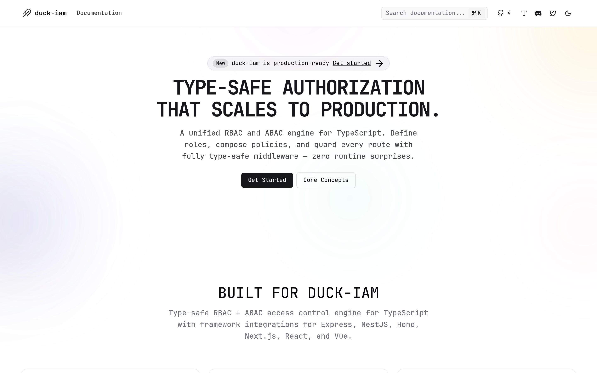

<p align="center">
  
</p>

# gentleduck/iam

A Bun-based monorepo for the duck-iam access control engine, docs, and related tooling.

## Documentation
- Docs app: `apps/duck-iam-docs`
- GitHub: https://github.com/gentleeduck/duck-iam

## Workspace Matrix

### Apps

| Path | Package | Role | Status |
| --- | --- | --- | --- |
| `apps/duck-iam-docs` | `@gentleduck/iam-docs` | Public docs site for duck-iam | Active |

### Published Packages

| Path | Package | Role | Status |
| --- | --- | --- | --- |
| `packages/duck-iam` | `@gentleduck/iam` | Type-safe RBAC + ABAC access control engine for TypeScript | Active |

### Private / Internal Packages

| Path | Package | Role | Status |
| --- | --- | --- | --- |
| `packages/ui` | `@gentleduck/ui` | React UI components built on Gentleduck primitives | Private, active |

### Tooling Packages

| Path | Package | Role | Status |
| --- | --- | --- | --- |
| `tooling/biome` | `@gentleduck/biome-config` | Shared Biome config | Internal |
| `tooling/github` | `@gentleduck/github` | GitHub/project automation support | Internal |
| `tooling/tailwind` | `@gentleduck/tailwind-config` | Shared Tailwind config | Internal |
| `tooling/tsdown` | `@gentleduck/tsdown-config` | Shared `tsdown` config | Internal |
| `tooling/typescript` | `@gentleduck/typescript-config` | Shared TypeScript config | Internal |
| `tooling/vitest` | `@gentleduck/vitest-config` | Shared Vitest config | Internal |
| `tooling/bash` | `bash` | Shell utilities and misc scripts | Internal |

### Examples

| Path | Role | Status |
| --- | --- | --- |
| `examples/blogduck` | Example app using duck-iam | Active |

## Workspace Policy

- Root quality scripts target the active workspace graph only.
- Published packages are released to npm via changesets.

## Getting Started

> Requires **Node >= 22** and **Bun >= 1.3**.

```bash
git clone https://github.com/gentleeduck/duck-iam.git
cd duck-iam
bun install
```

## Run a Single App
```bash
bun --filter @gentleduck/iam-docs dev
```

## Common Workspace Commands
```bash
bun run dev          # run all workspace dev tasks
bun run build        # build all packages/apps
bun run test         # run tests across workspaces
bun run check        # biome checks
bun run check-types  # TypeScript type checks
bun run ci           # non-mutating repo verification (check, workspace lint, types, tests, build)
```

## Contributing
See [`CONTRIBUTING.md`](./CONTRIBUTING.md) and [`CODE_OF_CONDUCT.md`](./CODE_OF_CONDUCT.md).

## License
MIT. See [`LICENSE`](./LICENSE) for more information.
