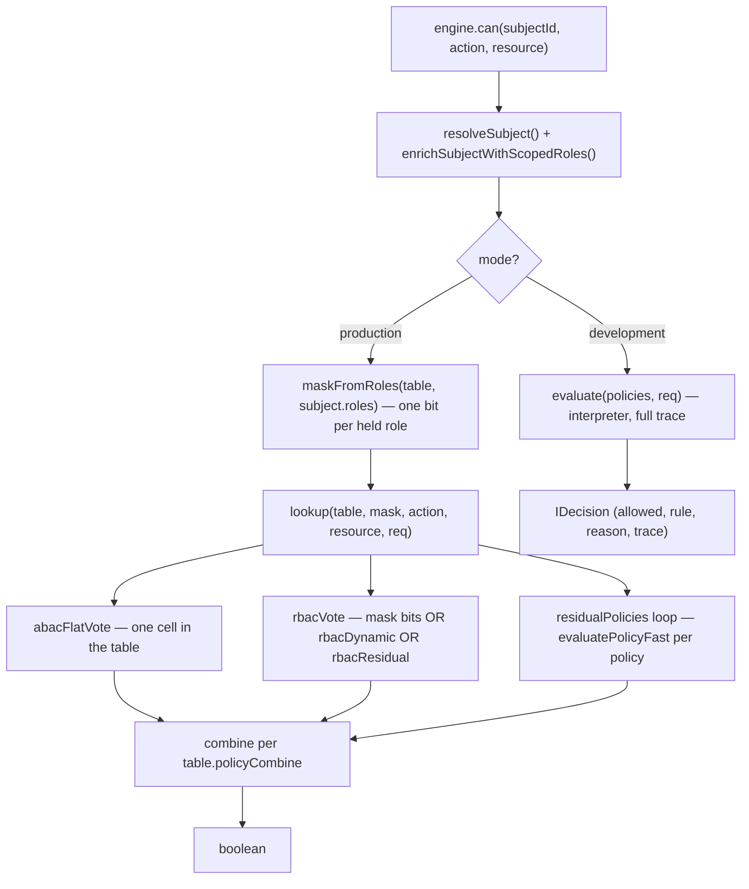
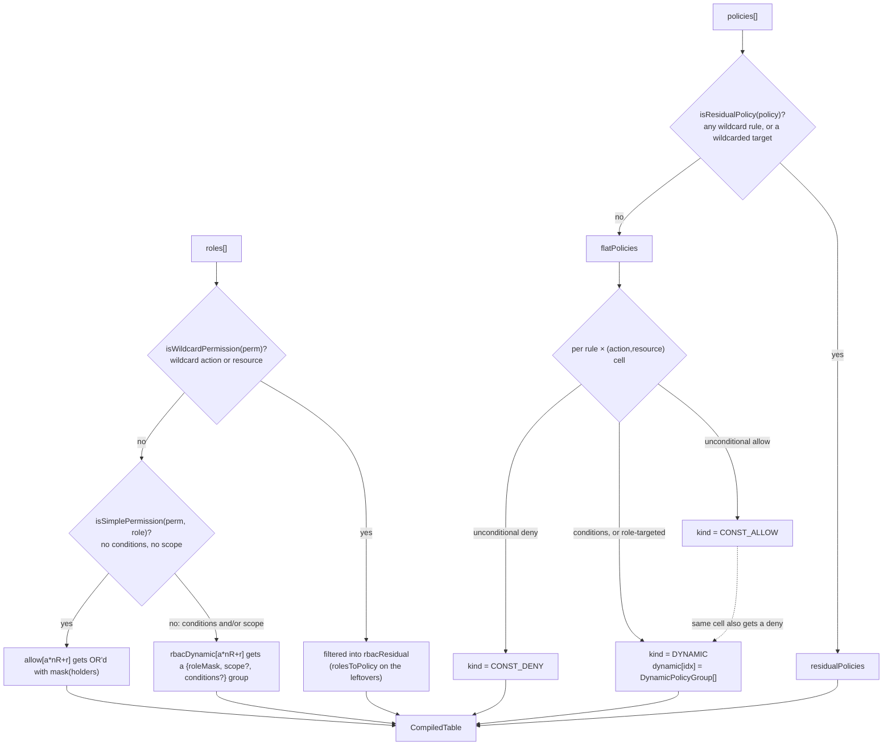
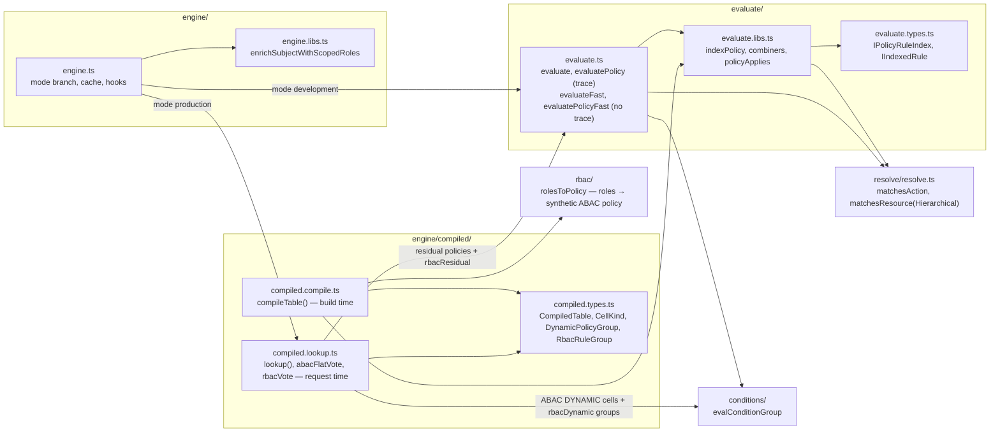
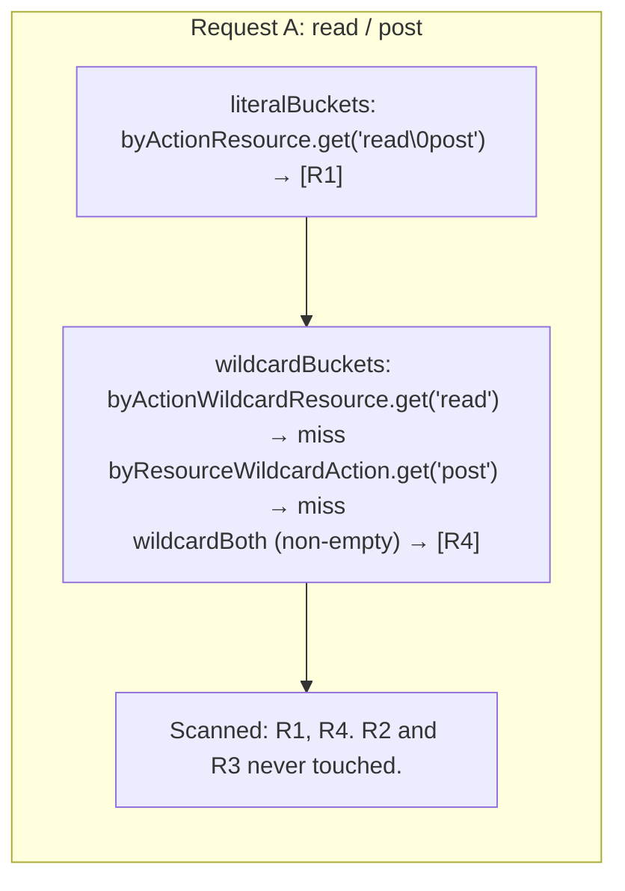
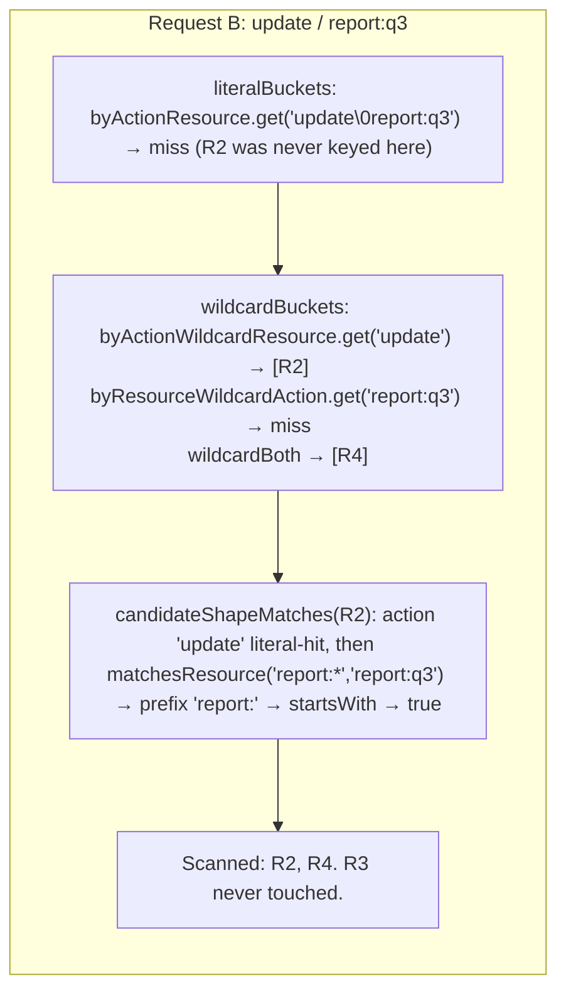
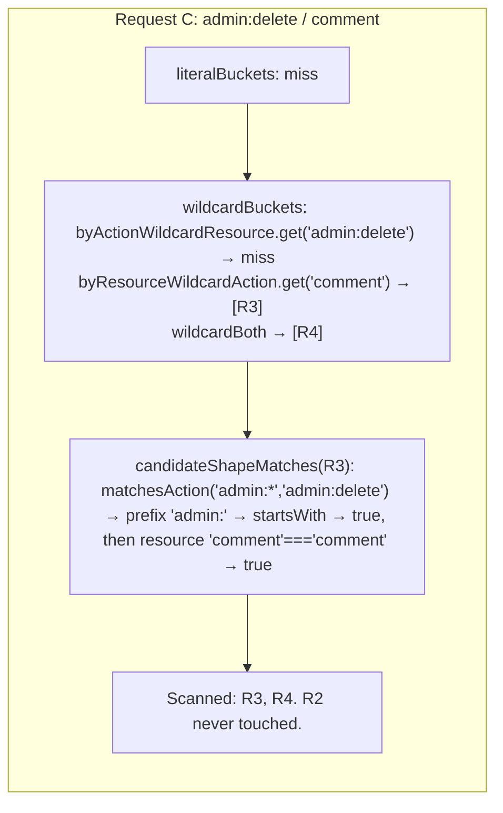

# Compiled engine, explained

Three things covered in full (wildcard buckets, role bitmasks, the
`CompiledTable` shape) with real code and real worked examples, then a
tight recap of everything else from this thread. Diagrams are Mermaid -
render in GitHub or any Mermaid-aware markdown viewer.

Companion docs, not duplicated here: [`engine-rewrite.md`](./engine-rewrite.md)
(design history, the 32-role cap, the two scope mechanisms, benchmark
log) and the package [`README.md`](../README.md) (perf tables vs other
libraries).

---

## 1. The whole system, request time



Production never calls the interpreter for policies that compiled in.
`evaluate()` only runs for `mode: 'development'` — a full, separate
codepath the compiled engine doesn't touch. Everything under `lookup()`
is array indexing and Map lookups; the only place real per-request
*matching* work happens is inside the residual-policy loop and the
`rbacResidual` fallback, both of which reuse `evaluatePolicyFast` — the
same function development mode's `evaluate()` also calls internally
(see §7, this is why the wildcard-bucket rewrite sped up development
mode too, not just production).

## 2. The whole system, compile time



`kind`/`touched`/`allow`/`dynamic`/`rbacDynamic` are 5 parallel arrays,
all indexed by the same `idx = actionId(a) * nResources + resourceId(r)`
— ABAC owns `kind`+`dynamic`, RBAC owns `allow`+`rbacDynamic`, `touched`
is shared bookkeeping (ABAC-only, RBAC-only cells stay `touched=0`).
Real code, [`compiled.compile.ts`](../src/core/engine/compiled/compiled.compile.ts).

## 3. File map



Both `lookup()` (production, residual policies only) and `evaluate()`
(development, every policy) end up calling `evaluatePolicyFast`, which
is why the two share `indexPolicy` and both benefit from the wildcard-
bucket rewrite in §4.

---

## 4. Deep dive: wildcard buckets

**The problem this replaced.** Before this rewrite, every rule with a
wildcard action or resource (`'*'`, `'foo:*'`, `'foo.*'`) landed in one
flat array, `wildcardAny`, scanned in full on *every* request regardless
of whether any of those rules could possibly match. Cost: `O(W)` where
`W` = every wildcard rule in the policy, paid unconditionally.

**The fix.** `indexPolicy` (`evaluate.libs.ts`) splits wildcard rules
into 3 buckets by *which side is still literal*:

```ts
// evaluate.libs.ts — indexPolicy's routing loop
if (hasWildcardAction && hasWildcardResource) {
  // Neither side is literal - nothing to key on, stays a linear scan.
  wildcardBoth.push(entry)
} else if (hasWildcardResource) {
  // Action is guaranteed all-literal - key on every literal action so a
  // request only finds this entry via its own exact action.
  for (const a of actions) addToBucket(byActionWildcardResource, a, entry)
} else if (hasWildcardAction) {
  // Mirror of the above: resource is guaranteed all-literal here.
  for (const r of resources) addToBucket(byResourceWildcardAction, r, entry)
} else {
  for (const a of actions) {
    for (const r of resources) addToBucket(byActionResource, `${a}\0${r}`, entry)
  }
}
```

At request time (`evaluate.ts`, `evaluatePolicyFast`):

```ts
const wildcardBuckets: Evaluate.IIndexedRule[][] = []
const byAction = idx.byActionWildcardResource.get(action)
if (byAction) wildcardBuckets.push(byAction)
const byResource = idx.byResourceWildcardAction.get(resType)
if (byResource) wildcardBuckets.push(byResource)
if (idx.wildcardBoth.length > 0) wildcardBuckets.push(idx.wildcardBoth)
```

New cost: `O(A + R + B)` — `A`/`R` are the sizes of the two targeted
bucket lookups (0 or small, almost always), `B` = `wildcardBoth` (always
paid, since neither side is literal enough to key on). Worst case (every
rule is `wildcardBoth`) degrades back to the old `O(W)` — never worse,
usually far better.

**A literal exact hit never skips `wildcardBoth`.** Combining algorithms
need every rule that could apply — a wildcard rule can independently
match and its effect can outrank a literal match's. Only the two
*targeted* buckets get skipped when their specific key misses; `wildcardBoth`
is always scanned if non-empty.

### Worked example

One policy, 4 rules:

```ts
R1: { actions: ['read'],     resources: ['post'] }        // pure literal
R2: { actions: ['update'],   resources: ['report:*'] }    // resource wildcard
R3: { actions: ['admin:*'],  resources: ['comment'] }      // action wildcard
R4: { actions: ['*'],        resources: ['*'] }            // both wildcard
```

`indexPolicy` produces:

| Structure | Contents |
|---|---|
| `byActionResource` | `"read\0post" → [R1]` |
| `byActionWildcardResource` | `"update" → [R2]` |
| `byResourceWildcardAction` | `"comment" → [R3]` |
| `wildcardBoth` | `[R4]` |

Three requests, three different bucket paths:







Old behavior for all 3 requests: scan `[R2, R3, R4]` every time (every
wildcard rule, unconditionally). New behavior: exactly the bucket(s)
whose literal side matches, plus `wildcardBoth`. Request A goes from
scanning 3 wildcard rules to 1 (`R4`); requests B and C each go from 3
to 2.

`matchesAction`/`matchesResource` themselves (`resolve.ts`) are plain
prefix checks — `pattern.endsWith(':*')` (actions), or `':*'`/`'.*'`
(resources, matching either separator style):

```ts
export function matchesAction(pattern: string, action: string): boolean {
  if (pattern === '*') return true
  if (pattern === action) return true
  if (pattern.endsWith(':*')) {
    const prefix = pattern.slice(0, -1)
    return action.startsWith(prefix)
  }
  return false
}
```

## 5. Deep dive: role bitmasks

**Goal.** Check "does this subject's role set grant this permission" in
one `&`, with role inheritance already resolved — no walking a
role-inherits-role graph on every request.

**Compile time** (`compiled.compile.ts:134-168`), 3 steps:

```ts
// 1. roleId: name -> bit position
const roleId = new Map(roles.map((r, i) => [r.id, i]))

// 2. effective[i] = role i's own index + every ancestor's, via inherits
const effective: number[][] = roles.map((r) => {
  const out: number[] = []
  const walk = (id: string, depth: number): void => {
    const idx = roleId.get(id)
    if (idx !== undefined) out.push(idx)
    for (const parent of byId.get(id)?.inherits ?? []) walk(parent, depth + 1)
  }
  walk(r.id, 0)
  return out
})

// 3. holders[i] = every role that (directly or by inheritance) has role i's grants
const holders: number[][] = roles.map(() => [])
for (let i = 0; i < effective.length; i++) {
  for (const a of effective[i]!) holders[a]!.push(i)
}

// Baking: for each simple permission owned by role i, OR in every holder's bit
for (let i = 0; i < roles.length; i++) {
  for (const perm of roles[i]!.permissions) {
    const idx = actionId.get(perm.action)! * nR + resourceId.get(perm.resource)!
    let mask = 0
    for (const holder of holders[i]!) mask |= 1 << holder
    allow[idx]! |= mask
  }
}
```

**Request time** (`engine.ts`):

```ts
function maskFromRoles(table: CompiledTable, roles: readonly string[]): number {
  let mask = 0
  for (const roleName of roles) {
    const idx = table.roleId.get(roleName)
    if (idx !== undefined) mask |= 1 << idx
  }
  return mask
}
// then: (mask & table.allow[idx]) !== 0
```

### Worked example

```
viewer (bit 0)
editor (bit 1) inherits viewer
admin  (bit 2) inherits editor
```

Compile time:

| Role | `effective[i]` (self + ancestors) |
|---|---|
| viewer (0) | `[0]` |
| editor (1) | `[1, 0]` |
| admin (2) | `[2, 1, 0]` |

`holders[i]` is the reverse: "who ends up with role *i*'s grants."

| Role bit `i` | `holders[i]` | meaning |
|---|---|---|
| 0 (viewer) | `[0, 1, 2]` | viewer, editor, and admin all get viewer's grants |
| 1 (editor) | `[1, 2]` | editor and admin get editor's grants |
| 2 (admin) | `[2]` | only admin gets admin's grants |

`viewer` owns permission `read`/`post`. Baking: `mask = 1<<0 | 1<<1 | 1<<2 = 0b111 = 7`.
So `allow[idx(read,post)] = 7` — any of the 3 roles can read a post,
because editor and admin inherit viewer.

Request: subject has `roles: ['editor']`. `maskFromRoles` → `mask = 1<<1 = 0b010 = 2`.
Check: `mask & allow[idx] = 0b010 & 0b111 = 0b010 ≠ 0` → **allowed**, in
one AND, with zero inheritance walking at request time — it was already
folded into `7` when the table was built.

**The 32-role cap** falls straight out of this: `allow` is a
`Uint32Array`, and JS bitwise ops wrap shift amounts mod 32 —
`1 << 32 === 1 << 0`. A 33rd role would silently alias role 0's bit.
`compileTable` throws past `MAX_ROLES = 32` rather than risk that. Full
rationale, alternatives, and the two separate scope mechanisms (subject-
scoped-role enrichment vs permission-level scope) are in
[`engine-rewrite.md` § Known limits](./engine-rewrite.md#known-limits-role-cap-and-scope) -
not repeated here.

### Scoped/conditioned grants: `rbacDynamic`

A permission with a literal action+resource but a scope and/or
conditions restriction (`{ role: 'org-admin', action: 'update', resource:
'org', scope: 'org-1' }`) can't take the plain bitmask path — the answer
depends on the *request's* scope/attributes, not just which roles the
subject holds. It still gets a cell though, same `roleMask` math as the
bitmask bake:

```ts
// Baking, extended: non-simple-but-literal permissions get a group instead of a mask bit
const group: RbacRuleGroup = {
  roleMask: mask,                          // same holders-expanded mask as BAKE above
  scope: effectiveScopeOf(perm, role),      // undefined unless a literal, non-'*' scope
  conditions: perm.conditions,
  policy: rbacDynamicSourcePolicy,          // for onPolicyError attribution only
}
```

Request time, inside `rbacVote()`, after the plain mask misses:

```ts
for (const g of groups) {
  if ((mask & g.roleMask) === 0) continue
  if (g.scope !== undefined && g.scope !== req.scope) continue
  if (g.conditions && !evalConditionGroup(req, g.conditions, 0, caches)) continue
  return true // role permissions are allow-only - first match wins
}
```

Two `org-admin`-style roles granting the same `update`/`org` cell under
different scopes end up as two small groups at one cell:

| group | `roleMask` | `scope` |
|---|---|---|
| org1-admin's grant | bit 0 | `'org-1'` |
| org2-admin's grant | bit 1 | `'org-2'` |

A request from a subject holding `org1-admin` with `req.scope === 'org-1'`
matches the first group and returns `true` before ever reaching the
second. This is `O(groups at that cell)`, not a re-interpretation of
every scoped/conditioned permission in the system — the interpreter path
(`rbacResidual`) is now reserved for the one case that's genuinely
irreducible: a wildcarded action or resource. All three sources still OR
into one RBAC vote (see §7).

## 6. Deep dive: `CompiledTable`, field by field

```ts
export interface CompiledTable {
  readonly nResources: number
  readonly actionId: ReadonlyMap<string, number>
  readonly resourceId: ReadonlyMap<string, number>
  readonly roleId: ReadonlyMap<string, number>
  readonly policyCombine: AccessControl.PolicyCombine
  readonly kind: Uint8Array           // CellKind per cell
  readonly touched: Uint8Array        // 1 if any flat policy has a rule shaped for this cell
  readonly allow: Uint32Array         // RBAC grant bitmask per cell
  readonly dynamic: (readonly DynamicPolicyGroup[] | undefined)[]
  readonly rbacDynamic: (readonly RbacRuleGroup[] | undefined)[]  // scoped/conditioned role permissions per cell
  readonly hasFlatSource: boolean     // any flat ABAC policy at all?
  readonly hasRbacSource: boolean     // any role grants at all (simple, dynamic, or residual)?
  readonly rbacResidual: AccessControl.IPolicy | null   // RBAC's wildcard-only leftovers
  readonly residualPolicies: readonly AccessControl.IPolicy[]  // ABAC's wildcard/targeted policies
}
```

`kind`/`touched`/`allow`/`dynamic`/`rbacDynamic` are 5 parallel arrays,
all keyed by `idx = actionId.get(action)! * nResources + resourceId.get(resource)!`.

This is real, captured output — one role (`editor`, permission
`update`/`post`), one ABAC policy (`ownership`: allow `read`/`post` when
`subject.id === resource.attributes.ownerId`):

```
{
  nResources: 1,
  actionId: Map(2) { 'update' => 0, 'read' => 1 },
  resourceId: Map(1) { 'post' => 0 },
  roleId: Map(1) { 'editor' => 0 },
  policyCombine: 'and',
  kind: Uint8Array(2) [ 0, 2 ],
  touched: Uint8Array(2) [ 0, 1 ],
  allow: Uint32Array(2) [ 1, 0 ],
  dynamic: [ <1 empty item>, [ { policyId: 'ownership', algorithm: 'deny-overrides', ... } ] ],
  rbacDynamic: [ <2 empty items> ],
  hasFlatSource: true,
  hasRbacSource: true,
  rbacResidual: null,
  residualPolicies: []
}
```

Reading it cell by cell — `nResources = 1`, so `idx = action * 1 + 0 = action`:

| `idx` | action, resource | `touched` | `kind` | `allow` | `dynamic` | why |
|---|---|---|---|---|---|---|
| 0 | update, post | 0 | 0 (`CONST_DENY`) | **1** (`0b1`, bit 0 = editor) | `<empty>` | No ABAC policy touches `update`/`post` at all → `touched=0`. `kind=0` is only the array's zero-default; `abacFlatVote` checks `touched[idx]===0` **before** ever reading `kind`, so this "looks like CONST_DENY" value is never actually consulted. The real answer for this cell comes from `allow=1`: editor (bit 0) is directly granted. |
| 1 | read, post | **1** | **2** (`DYNAMIC`) | 0 | `[{ ownership, deny-overrides, rules: [...] }]` | `ownership`'s rule has a condition (`subject.id === resource.attributes.ownerId`), so this cell can't be a fixed constant — it's `DYNAMIC`, and `dynamic[1]` holds the policy group `evaluateDynamicCell` runs per request. No role grants `read`/`post` directly, so `allow=0` — RBAC has nothing to say here; the vote is 100% ABAC. |

`hasFlatSource: true` (the `ownership` policy exists), `hasRbacSource: true`
(editor's permission exists), `rbacResidual: null` (editor's permission
is fully "simple" — literal, unconditional, no scope/conditions —
nothing left over for either non-bitmask source), `rbacDynamic` is all
empty (no scoped/conditioned role permissions in this example — see §5's
`rbacDynamic` subsection for one that populates it), `residualPolicies: []`
(no wildcard/target policies in this example).

`CellKind` itself, for reference (`compiled.types.ts`):

```ts
export enum CellKind {
  CONST_DENY = 0,
  CONST_ALLOW = 1,
  DYNAMIC = 2,
}
```

---

## 7. Everything else, recap

**Residual vs. flat.** A policy is *residual* (evaluated per-request via
`evaluatePolicyFast`, never compiled to fixed cells) only if it has a
wildcard rule, or a *wildcarded* `targets.actions`/`targets.resources`
value (`isResidualPolicy`, `compiled.compile.ts:40-47`). A **literal**
target restriction compiles in instead — resolved once at compile time
via `policyTargetsActionResource(policy, action, resource)`
(`evaluate.libs.ts`), since it depends only on the (action, resource)
pair, which is already the cell's own key. A role-only target
(`targets.roles`) also compiles in — it can't be resolved at compile
time (depends on the request's subject), so it rides along as
`targetRoles` on `DynamicPolicyGroup` instead, gating the vote the same
way `policyApplies()` does in the interpreter: missing the role means
"not a voter," not "deny."

**Conflict resolution is entirely the combining algorithms.** Nothing
else picks a winner between competing rules. `deny-overrides`/
`allow-overrides`/`first-match`/`highest-priority` decide *within* one
policy (`combiners`, `evaluate.libs.ts`); `table.policyCombine`
(`'and'` / `'allow-overrides'` / `'first-applicable'`) decides *across*
policies, in `lookup()`'s final `applicable.some/every(Boolean)`.

**RBAC is one vote, not three.** `rbacVote` (`compiled.lookup.ts`) checks
the mask bit first; on a miss it scans `rbacDynamic` (scoped/conditioned
permissions, literal action+resource); only when neither has an answer
does it fall through to `rbacResidual` (wildcarded action/resource
permissions only, now the narrowest of the three). None of the three are
ever counted as separate voters — each later source's vote only runs,
and only matters, when the earlier ones didn't already decide it. A
`null` result (abstain) happens when none of the three has anything
shaped for this action/resource — not "no", just "not applicable," same
distinction `evaluatePolicy`'s NotApplicable makes in the interpreter.

**Speed, honestly.** `engine.can()` in `mode: 'production'` measures
~1.15M ops/sec full-stack (adapter + hooks + compiled table), ~14x
behind CASL's ~17M — CASL is a narrower tool (one flat rule set, sync,
no persistence layer); duck-iam runs a policy engine, RBAC inheritance,
an adapter/cache layer, and hooks inside that same call, and it's
`async`. Neither number is the bottleneck in a real deployment (~0.87µs
per check vs. the network/DB/serialization around it), and throughput
doesn't degrade with catalog size — `lookup()` is O(1) array indexing
regardless of role/policy count. What actually constrains scale is
catalog *shape*: the 32-role cap, very wide action×resource grids, and
deeply nested hierarchical resource types. Full numbers: [`README.md` § Performance](../README.md#performance).
