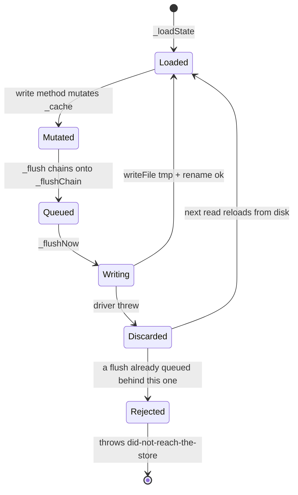
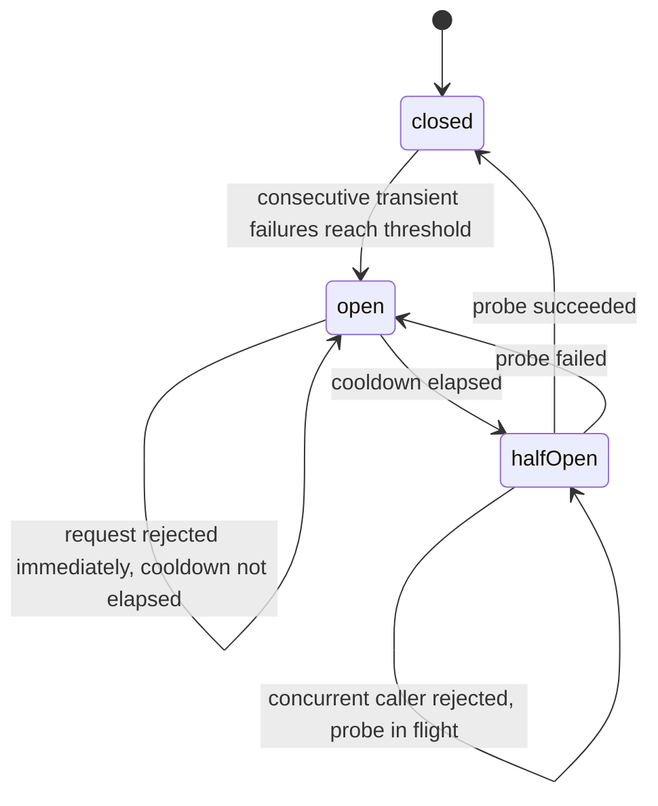

# Runtime adapters and the adapter contract

Four adapters ship for storage that is not a SQL database: memory, file, HTTP
and Redis. They are held to one contract, and that contract is not a doc — it
is `src/adapters/__compliance__/`, a shared vitest suite every adapter is run
against, so "what an adapter must do" is a thing that fails CI rather than a
thing that is written down. This page documents the contract method by method,
the optional-method matrix, then each of the four adapters: construction,
storage layout, and the specific ways each one can bite.

The SQL adapters (drizzle, prisma) are in [`adapters-sql.md`](./adapters-sql.md)
and appear here only in the support matrix. The Redis *invalidator* is a
different module and lives in [`operations.md`](./operations.md) — it is not the
Redis adapter and shares no code with it.

---

## 1. The contract

`IamAdapter.IAdapter` (`src/core/types/adapter.ts:293`) is three interfaces
merged, plus one optional method:

```ts
export interface IAdapter<TAction, TResource, TRole, TScope>
  extends IPolicyStore<TAction, TResource, TRole>,
    IRoleStore<TAction, TResource, TRole, TScope>,
    ISubjectStore<TRole, TScope> {
  withClient?(client: unknown): IAdapter<TAction, TResource, TRole, TScope>
}
```

Every method is `async`. Every read takes an optional
`IReadOptions { signal?: AbortSignal }` (`src/core/types/adapter.ts:28`); only
`IamHttpAdapter` does anything with it — the rest accept it for interface
compatibility and name the parameter `_opts` to say so.

### 1.1 Every method

| Method | Signature | Required | Contract |
| --- | --- | --- | --- |
| `listPolicies` | `(opts?) => Promise<IPolicy[]>` | yes | Every stored policy. `[]` on an empty store, never `null`. |
| `getPolicy` | `(id, opts?) => Promise<IPolicy \| null>` | yes | `null` on a miss — a miss is not an error. |
| `savePolicy` | `(policy, opts?: IActorOptions) => Promise<void>` | yes | Upsert by `id`. Validates before writing; refuses an unknown field. |
| `deletePolicy` | `(id) => Promise<void>` | yes | No-op when absent. |
| `listRoles` | `(opts?) => Promise<IRole[]>` | yes | Every stored role. |
| `getRole` | `(id, opts?) => Promise<IRole \| null>` | yes | `null` on a miss. |
| `saveRole` | `(role, opts?: IActorOptions) => Promise<void>` | yes | Upsert by `id`. Validates before writing. |
| `deleteRole` | `(id) => Promise<void>` | yes | Deletes the role **and every grant that named it**. |
| `getSubjectRoles` | `(subjectId, opts?) => Promise<TRole[]>` | yes | **Global (unscoped) grants only.** Deduplicated. |
| `getSubjectScopedRoles` | `(subjectId, opts?) => Promise<IScopedRole[]>` | optional | **Scoped grants only** — the complement of the above, never overlapping it. |
| `assignRole` | `(subjectId, roleId, scope?, opts?: IAssignOptions) => Promise<void>` | yes | Idempotent per `(subject, role, scope)`. Refuses an unstored role. Refuses `opts` it cannot store. |
| `revokeRole` | `(subjectId, roleId, scope?, opts?: IRevokeOptions) => Promise<void>` | yes | With a scope: that row only. **Without a scope: every row for that role, scoped ones included.** |
| `updateAssignmentScope` | `(subjectId, roleId, fromScope, toScope, actor?) => Promise<boolean>` | optional | Moves one grant in place. `false` when there is no such grant — and `false` must mean *nothing was written*. |
| `assignRoleMany` | `(rows: readonly IAssignRow[]) => Promise<readonly number[] \| null>` | optional | Set-based assign. Returns indices into `rows` of the grants actually written, or `null` when the driver cannot say. |
| `revokeRoleMany` | `(rows: readonly IRevokeRow[]) => Promise<readonly number[] \| null>` | optional | Set-based revoke, same reporting rule. |
| `getSubjectGrantBoundary` | `(subjectId, opts?) => Promise<number \| null>` | optional | Earliest **future** `startsAt`/`expiresAt` across the subject's grants, epoch ms, so the engine can cap its cache entry there. `null` when nothing is time-boxed. |
| `getSubjectAttributes` | `(subjectId, opts?) => Promise<Attributes>` | yes | `{}` when nothing is recorded — but a *corrupt* row throws, it does not answer `{}`. |
| `setSubjectAttributes` | `(subjectId, attrs, opts?: IActorOptions) => Promise<void>` | yes | Shallow **merge**, per key. Keys absent from `attrs` survive. |
| `withClient` | `(client: unknown) => IAdapter` | optional | Re-binds to a driver handle, typically a transaction. Absent means `IamEngine.withTransaction` throws rather than silently writing outside the caller's transaction. |

Indices rather than rows from `assignRoleMany` so two rows asking for the same
write stay distinguishable; `core/batch`'s `creditWrites` credits a write to the
first row that accounts for it, so a write that happened once is never reported
twice (`src/core/types/adapter.ts:244`).

### 1.2 Who implements what

`src/adapters/__compliance__/optional-support.ts:35` is the authoritative
matrix. It is *declared*, not derived from the instances:

| Optional method | memory | file | http | redis | drizzle | prisma |
| --- | :-: | :-: | :-: | :-: | :-: | :-: |
| `getSubjectScopedRoles` | yes | yes | yes | yes | yes | yes |
| `updateAssignmentScope` | yes | yes | — | — | yes | yes |
| `getSubjectGrantBoundary` | — | — | — | — | yes | — |
| `assignRoleMany` | — | — | — | — | yes | — |
| `revokeRoleMany` | — | — | — | — | yes | — |
| `withClient` | — | — | — | — | yes | yes |

Three of the six exist on drizzle alone, because only its schema carries
`starts_at` / `expires_at` and only it has a transaction to join.

Omitting an optional method costs correctness nowhere. `updateAssignmentScope`,
`assignRoleMany` and `revokeRoleMany` are optimisations the engine falls back
for — revoke-then-assign, and a per-row loop — so the behaviour behind them is
pinned on all six adapters by `runEngineCapabilityCompliance` (§2.2) regardless
of what this table says.

### 1.3 Rules that hold across every method

**Honour or refuse, never accept-and-drop.** This is the spine of the whole
contract. Five adapters used to accept `assignRole(..., { expiresAt })` and
throw it away, so a break-glass grant issued with a one-hour expiry was
permanent and the batch API still reported `applied: 1`. Now an adapter that
cannot store an option throws and names it
(`src/shared/assign-options.ts:33`):

```
[@gentleduck/iam:memory] assignRole options (expiresAt) are not supported by this adapter,
and were previously discarded silently. Use the drizzle adapter for time-boxed or attributed
grants, or revoke the role explicitly when it should end.
```

The same rule governs ids: an adapter either round-trips an id or rejects the
write by name. A store that accepts `a/b` and then cannot find it is the failure
mode the clause exists to catch, and a refusal must not be followed by a read
that answers something.

**A grant naming a role that is not stored is refused.** Drizzle and prisma get
this from `fk_iam_assignments_role`; memory, file and redis check before
writing; http delegates to the operator's server. The message is identical
everywhere and deliberately does not echo the id back, because it reaches
operator logs (`iamUnknownRoleError`, `src/shared/assignment-target.ts:45`; the
adapters reach it through `iamAssertRoleExists` at `:31`):

```
[@gentleduck/iam:<adapter>] cannot assign a role that is not stored; save the role before granting it
```

**`deleteRole` cascades.** The SQL schemas take the grants with the role, so
every other adapter must too, or one call gives two answers. Keeping the orphan
is not the harmless option: it still reads as a grant, and a role later
recreated under the reused id hands it back to everyone who once held it with
nobody granting anything.

**Scope spelling** (`src/shared/scope.ts:60`). `undefined` is a global grant.
The empty string is refused everywhere, on assign and on revoke — the encodings
spell "no scope" as an empty tail, so an empty scope would decode as global,
which is strictly more power than was granted. `'*'` is refused on a *grant* and
accepted on a *lookup*: a scoped assignment is matched literally, so a grant
stored at `'*'` would answer only a request whose own scope is the two-character
string `"*"`.

**Reads fail closed for policies, open for roles.** A stored policy row that
will not parse throws `iamUnreadablePolicy` and the engine denies — the dropped
policy could be the one that denies. A malformed *role* row is dropped, reported
through `onPolicyError`, and the rest of the catalog is returned. A corrupt
attribute bag throws rather than answering `{}`, for the same reason: `{}`
silently retires every deny rule that tests an attribute.

**Policies come back in one shape on every backend.** `savePolicy` runs the row
through `iamNormalizePolicy` (`src/shared/rows.ts`), which defaults
`version: 1`; the compliance suite asserts the round-tripped keys sort to
`['algorithm', 'id', 'name', 'rules', 'version']` on all six, and that saving a
round-tripped policy back into a fresh adapter reproduces it exactly.

---

## 2. The compliance suite

### 2.1 `runAdapterCompliance`

```ts
export function runAdapterCompliance(
  adapterName: string,
  factory: () => AnyAdapter | Promise<AnyAdapter>,
  opts: IComplianceOptions,
): void
```

`src/adapters/__compliance__/compliance.ts:116`. The factory must return a
**fresh, empty** adapter on every call — its sixty cases each construct one. Clause groups: `IPolicyStore`, `IRoleStore`, cross-adapter edge cases,
`ISubjectStore`.

```ts
export interface IComplianceOptions {
  readonly supports: OptionalSupport
  readonly delegatesRoleExistence?: boolean
}
```

`supports` decides which clauses are *registered*. `delegatesRoleExistence` is
set by `IamHttpAdapter` alone: the operator's server owns the role catalog, so
the adapter cannot phrase the unknown-role refusal itself. Only the *wording* of
that refusal is waived — the refusal itself is still asserted.

**Declared, not probed.** Before commit `70a90b4c`, nineteen clauses opened with
`if (!a.someMethod) return` and reported PASSED on any adapter lacking the
method — 84 green ticks asserting nothing across both tiers. The direction of
failure was the bad half: deleting `assignRoleMany` from the drizzle adapter
would have turned five asserting tests into five silent ones and made the run
*greener*. That commit converted the early-outs to `ctx.skip()` and added
`src/adapters/__tests__/optional-method-matrix.test.ts`. The suite has since
moved one step further: there is no `ctx.skip()` left in `compliance.ts` at all,
and no probe either. Clauses for an unsupported method are never registered, so
they do not appear in the run as passes *or* as skips, and drift is caught
entirely by the matrix test, which reads the six adapter prototypes and asserts
them against `OPTIONAL_SUPPORT`.

Registration is gated on `updateAssignmentScope`, `assignRoleMany` and
`revokeRoleMany` only. `supports.getSubjectScopedRoles` gates read-backs *inside*
clauses that run either way, so declaring it `false` drops those assertions
rather than the clause — all six shipped adapters declare it `true`. Where a
read-back does run, `requireScoped(a)` throws loudly if a declared
`getSubjectScopedRoles` is absent, rather than letting the assertion evaporate —
the same drift, one level down.

`getSubjectGrantBoundary` and `withClient` are in `OPTIONAL_METHODS` but gated
by no clause in either suite; the matrix test asserts that exclusion explicitly.
They are covered elsewhere — `grant-expiry-vs-cache` and the drizzle suites for
the boundary, `drizzle/__tests__/with-client` and
`prisma/__tests__/prisma-with-client` for the client re-bind.

### 2.2 `runEngineCapabilityCompliance`

```ts
export function runEngineCapabilityCompliance(
  adapterName: string,
  factory: () => AnyAdapter | Promise<AnyAdapter>,
): void
```

`src/adapters/__compliance__/engine-capability.ts:90`. One rung up: it wraps the
adapter in an `IamEngine` with an `onMutation` hook and asserts
`engine.admin.updateAssignmentScope`, `moveRoleScopes`, `assignRoles` and
`revokeRoles`. Because the engine falls back for the three optional writes,
every clause runs on every adapter — nothing is conditional. It requires
`getSubjectScopedRoles`; all six shipped adapters have it.

That layer is also where a bug lived that no adapter-level clause could see:
`moveOne` conflated "this adapter has no in-place update" with "there is no such
grant", so moving a grant the subject did not hold **created** it at the
destination — on an adapter whose own `updateAssignmentScope` passed the clause
forbidding exactly that. `creates nothing when the subject holds no such grant`
is that regression.

### 2.3 Running it against your own adapter

The suite is not in the package's `exports` map — `package.json` publishes
`./adapters/memory`, `./adapters/file`, `./adapters/http`, `./adapters/redis`
and the SQL entry points, but nothing under `__compliance__`. In-repo adapters
import it by relative path; an out-of-tree adapter has to vendor the two files
or add the export first.

```ts
import { runAdapterCompliance } from '../__compliance__/compliance'
import { runEngineCapabilityCompliance } from '../__compliance__/engine-capability'

runAdapterCompliance('MyAdapter', () => new MyAdapter({ /* fresh store */ }), {
  supports: {
    getSubjectScopedRoles: true,
    updateAssignmentScope: false,
    getSubjectGrantBoundary: false,
    assignRoleMany: false,
    revokeRoleMany: false,
    withClient: false,
  },
})

runEngineCapabilityCompliance('MyAdapter', () => new MyAdapter({ /* fresh store */ }))
```

A third-party adapter passes its own object literal rather than a key from
`OPTIONAL_SUPPORT`. Declaring `true` for a method you do not implement fails
loudly at the first clause; declaring `false` for one you do implement leaves it
untested.

---

## 3. `IamMemoryAdapter`

`@gentleduck/iam/adapters/memory` — `src/adapters/memory/index.ts`.

Four `Map`s: policies, roles, assignments (`Array<{ role, scope? }>` per
subject), attributes. No persistence, no serialisation, no I/O. The class
docblock says "tests + prototypes only" and means it.

```ts
import { IamMemoryAdapter } from '@gentleduck/iam/adapters/memory'

const adapter = new IamMemoryAdapter({
  policies: [ownershipPolicy],
  roles: [{ id: 'editor', name: 'Editor', permissions: [{ action: 'read', resource: 'post' }] }],
  assignments: { 'user-1': ['editor'] },
  attributes: { 'user-1': { tier: 'gold' } },
})
```

`IamMemory.IInit` (`src/adapters/memory/index.ts:20`) is the whole surface:
`policies`, `roles`, `assignments` (subject id to **unscoped** role ids only —
the seed has no way to express a scope), `attributes`. `iamMemoryAdapter(init)`
is the same thing without `new`.

### The seed obeys the write path

Commit `e5775c6a` closed three ways the constructor could reach a state the
adapter's own methods forbid:

- **Policies** go through `iamNormalizePolicy`, the same normaliser
  `savePolicy` uses. Before, one adapter answered `getPolicy` two different ways
  for the same policy depending on whether it arrived by constructor or by
  write, and `export()` on a seeded store produced a snapshot `import()` then
  stored in a different shape.
- **Assignments** go through `iamAssertRoleExists`, the same refusal
  `assignRole` applies. Seeding `{ u1: ['ghost'] }` with no roles at all used to
  produce a live grant: `getSubjectRoles` returned `ghost`, `resolveEffectiveRoles`
  kept it (a directly-assigned role, not a dangling `inherits` id), and a
  hand-written ABAC rule testing `subject.roles contains 'ghost'` fired. Measured:
  an ALLOW. Roles are seeded before assignments, so an init naming its own roles
  is unaffected — but an init naming a role it does not also define now throws
  from the constructor.
- **Attributes** are copied (`{ ...attrs }`) rather than stored by reference,
  matching `setSubjectAttributes`, which builds a fresh object on every write.

`getSubjectAttributes` returns a copy for the same reason
(`src/adapters/memory/index.ts:313`), built by `iamCopyAttributes`
(`src/shared/attributes.ts:132`). The copy goes one level into each value: the
bag is rebuilt, an array value is rebuilt with `[...value]`, and a record value
with `{ ...value }`. That is exactly as deep as `IamPrimitives.AttributeValue`
goes — a scalar, an array of scalars, or a flat record of scalars — so the
returned bag shares no mutable object with the store. Measured: reading
`{ tier: 'gold', groups: ['a'], meta: { k: 'v' } }`, then pushing to `groups`,
writing `meta.k` and reassigning `tier` on what was returned, leaves the stored
bag unchanged.

### Limits

Everything is per-process and lost on exit. `updateAssignmentScope` is
implemented and merges rather than duplicating when the destination scope is
already held. There is no `withClient`, so `IamEngine.withTransaction` throws.

Copying runs in **both** directions. The constructor seed (`index.ts:97`),
`getSubjectAttributes` (`:326`) and `setSubjectAttributes` (`:343`) all route
through `iamCopyAttributes`, so neither the object you pass in nor the one you
read back stays connected to stored state. Mutating a caller-side array after
the write returns leaves the store unchanged.

---

## 4. `IamFileAdapter`

`@gentleduck/iam/adapters/file` — `src/adapters/file/index.ts`.

One JSON file, loaded once into a cache and rewritten in full on every write.
Single-process only: nothing coordinates with another process holding the same
path.

```ts
import * as fs from 'node:fs/promises'
import { IamFileAdapter } from '@gentleduck/iam/adapters/file'

const adapter = new IamFileAdapter({
  path: '/var/lib/app/iam.json',
  rootDir: '/var/lib/app',
  fs,
  onPolicyError: (err, ctx) => log.error({ adapter: ctx.adapter, rowId: ctx.rowId }, err.message),
})
```

`IamFile.IInit` (`src/adapters/file/index.ts:78`):

| Option | Required | Notes |
| --- | --- | --- |
| `path` | yes | Must be **absolute as supplied**, and must not contain a `..` segment. Both are checked before `path.resolve`, which would silently collapse a `..` and silently join `cwd` to a relative path. |
| `fs` | yes | Any `IamFile.IFS`. `await import('node:fs/promises')` satisfies it. |
| `rootDir` | no | Containment root. `path` must resolve inside it, and — when the driver has `realpath` — must still be inside it after symlink resolution. Omitting it emits a one-shot `console.warn` per process and accepts any absolute path. |
| `onPolicyError` | no | `(err, { adapter: 'file', rowId }) => void`. Without it, dropped rows go to `console.warn`. |

`IamFile.IFS` (`src/adapters/file/index.ts:25`) needs `readFile`, `writeFile`
and `mkdir`; `realpath` and `rename` are optional and each disables a protection
when absent. `mkdir` is always called **without options**, so only the immediate
parent is created — a typo in `path` cannot silently build a deep tree, and a
missing grandparent throws `parent directory ... is not accessible`.

### On-disk format

```json
{
  "policies":   { "<policyId>": { "id": "...", "name": "...", "version": 1, "algorithm": "...", "rules": [] } },
  "roles":      { "<roleId>":   { "id": "...", "name": "...", "permissions": [] } },
  "assignments":{ "<subjectId>": [ { "role": "editor" }, { "role": "editor", "scope": "org-1" } ] },
  "attributes": { "<subjectId>": { "tier": "gold" } }
}
```

Written with `JSON.stringify(state, null, 2)`. An assignment with no `scope` key
is a global grant; `scope` must be a non-empty string when present.

### Load-time behaviour

`_loadState` (`src/adapters/file/index.ts:343`) dedupes concurrent loads through
`_loadInFlight` and clears that latch on **any** throw, so a symlink-escape or a
read error cannot pin the adapter in permanent failure until restart.

| On disk | Result |
| --- | --- |
| File absent (`ENOENT`) | Empty null-prototype state, cached. |
| Any other read error | Throws `load failed (<code>)`. |
| Not JSON | Throws `store at "..." is corrupt (JSON parse failed) - refusing to load; restore from backup before retrying`. The cache is never set to `{}` — a later flush would erase a recoverable file. |
| Root is an array/null/scalar | Throws `... (root is <got>, not an object)`. |
| `policies` or `roles` field is not an object | Throws. Treating a corrupt `policies` field as `{}` would report zero policies, which reads as "no denies exist". |
| One malformed policy row | Reported, then throws `iamUnreadablePolicy`. |
| One malformed role row | Reported and dropped; the rest of the catalog loads. |
| One malformed assignment **entry** | That entry is dropped and reported with its index; the subject's other grants survive. An earlier `break` here dropped every assignment the subject had, because a sibling entry was bad. |
| One malformed attributes row | Moved into `corruptAttributes`, keyed by subject. |

Every dict is `Object.create(null)`, so a subject id of `__proto__` cannot read
`Object.prototype` back or pollute it through a setter assignment.

A subject in `corruptAttributes` makes `getSubjectAttributes` **throw** until an
admin `setSubjectAttributes` repairs the row. The raw corrupt value is written
back out verbatim on every flush (`_serializableState`,
`src/adapters/file/index.ts:474`) and the marker itself never reaches the file —
otherwise an unrelated write would quietly repair a store the adapter had
refused to read, and the `Map` would serialise as `{}` (it has no enumerable own
properties).

### Attribute reads are copied

`getSubjectAttributes` (`src/adapters/file/index.ts:793`) returns
`iamCopyAttributes(s.attributes[id])`, not the cached object itself. That
matters more here than on any other adapter: `_loadState` caches parsed state
for the process's lifetime, so the bag in `_cache` *is* the store, and every
flush serialises the whole cache — an edit to a returned bag would have reached
disk on the next write of any kind, for any subject. The copy is the same
one-level-into-each-value rebuild described in §3, so nothing mutable is shared.
Measured: pushing to a returned `groups` array and reassigning a returned scalar
both leave the stored bag intact.

`setSubjectAttributes` copies the other direction too (`index.ts:823`): the
patch goes through `iamCopyAttributes` before it is merged onto the stored bag,
so an array you pass in and then mutate does not follow into the store.

### Write durability



With `rename` available, `_writeState` (`src/adapters/file/index.ts:526`) writes
`${path}.${base36-time}-${random}.tmp` and renames it over the store. A crash
mid-write leaves the previous file intact instead of a truncated one that would
load as zero policies — that is, as if every deny had been deleted. Without
`rename` the adapter writes in place, which a crash can truncate; this is
documented on `IamFile.IFS.rename` and is the reason to pass the real
`node:fs/promises`.

A **failed** flush discards `_cache` (`_flushNow`,
`src/adapters/file/index.ts:501`). Before that, a rejected write left its
mutation in memory: the caller was told the write failed, with the driver's
`ENOSPC` on the rejection, and the adapter then answered every later read as
though it had succeeded. Worse, the next successful write of any kind
serialises the whole cache, so an unrelated `assignRole` for another subject
committed the refused grant to disk permanently. Measured: after a failed
`assignRole('u2')` and a later successful `assignRole('u3')`, the file held u1,
u2 and u3.

The cost of that fix is one behaviour worth knowing. A write already **queued**
behind a failing one mutated the cache that was discarded, so it is neither on
disk nor replayable — it rejects with:

```
[@gentleduck/iam:file] IamFileAdapter discarded its in-memory state after an earlier write failed,
so this write did not reach the store. Reload and retry it.
```

Reporting success there would be the lie. A write *issued* after the failure
reloads from disk and succeeds normally.

### Concurrency

`_flushChain` serialises flushes so one write/rename pair completes before the
next begins, and at most one `.tmp` file exists at a time. It does **not** make
two concurrent writes independent: `_flushNow` serialises the live `_cache` at
flush time, not at issue time, so both concurrent writers' mutations are in both
payloads. Asserting on final file contents cannot detect a deleted flush chain;
what serialisation buys is that a reader never observes the store mid-swap.

Across processes there is no coordination at all. Two `IamFileAdapter`s on one
path will each rewrite the whole file from their own cache.

---

## 5. `IamHttpAdapter`

`@gentleduck/iam/adapters/http` — `src/adapters/http/index.ts`.

Delegates storage to an HTTP service the operator runs. The adapter owns
transport concerns — timeout, retry, circuit breaker, SSRF defence, body caps,
row narrowing — and owns no data.

```ts
import { IamHttpAdapter } from '@gentleduck/iam/adapters/http'

const adapter = new IamHttpAdapter({
  baseUrl: 'https://iam.example.com/access',
  allowedHosts: ['iam.example.com'],
  headers: async () => ({ Authorization: `Bearer ${await token()}` }),
  timeoutMs: 5_000,
  retries: 2,
})
```

### 5.1 The wire protocol

Paths are appended to `baseUrl` verbatim, so a mount prefix in `baseUrl`
(`/access` above) carries through. Ids are `encodeURIComponent`-escaped path
segments. Every request carries `Content-Type: application/json` plus whatever
`headers` supplies; `redirect: 'error'` is always set.

| Call | Request | Expected response |
| --- | --- | --- |
| `listPolicies` | `GET /policies` | JSON array of policy rows |
| `getPolicy` | `GET /policies/{id}` | policy row; **404 means `null`**, not an error |
| `savePolicy` | `PUT /policies`, body = the full policy JSON | any 2xx |
| `deletePolicy` | `DELETE /policies/{id}` | any 2xx |
| `listRoles` | `GET /roles` | JSON array of role rows |
| `getRole` | `GET /roles/{id}` | role row; 404 means `null` |
| `saveRole` | `PUT /roles`, body = the full role JSON | any 2xx |
| `deleteRole` | `DELETE /roles/{id}` | any 2xx — **and the server must cascade the grants** |
| `getSubjectRoles` | `GET /subjects/{id}/roles` | JSON array of **unscoped** role id strings |
| `getSubjectScopedRoles` | `GET /subjects/{id}/scoped-roles` | JSON array of `{ role, scope }` |
| `assignRole` | `POST /subjects/{id}/roles`, body `{"roleId":"...","scope":"..."}` | 2xx — **and a 4xx when the role is not stored** |
| `revokeRole` | `DELETE /subjects/{id}/roles/{roleId}` plus `?scope=<encoded>` when scoped | 2xx. No `scope` param means remove the role in every scope. |
| `getSubjectAttributes` | `GET /subjects/{id}/attributes` | flat JSON object of scalar values |
| `setSubjectAttributes` | `PATCH /subjects/{id}/attributes`, body = the partial bag | 2xx — the server **merges**, it does not replace |

`src/adapters/http/__tests__/http-compliance.test.ts` contains
`makeReferenceServer()`, a complete implementation of the above that the full
compliance matrix is run against. It is the specification of the two obligations
this adapter cannot enforce itself: `DELETE /roles/{id}` strips the deleted role
from every subject's assignments, and `POST /subjects/{id}/roles` answers 422
when `roleId` names no stored role. Both are part of the contract; the adapter
surfaces the non-2xx as a throw.

**Auth** is `headers` and nothing else: a `Record<string, string>` or a
(possibly async) function returning one, merged over `Content-Type` on every
request. The internal request type deliberately carries no per-call `headers`
field — the wide `HeadersInit` type had three shapes and the merge handled one
of them by spreading, so a `Headers` instance carrying `Authorization` spread to
`{}` and the write went out unauthenticated with nothing to see.

**Response handling.** A `>= 500` is thrown as *transient* (retryable); any
other non-2xx throws `HTTP <status>: <body>` after reading at most 4 KB of the
body and truncating the message to 200 characters
(`readBodyCapped`, `src/adapters/http/index.ts:949`). Success bodies are read
through `readJsonCapped` (`:1006`) with a 4 MiB cap; `204`, `205` and an empty
body yield `undefined`. A list endpoint that answers a non-array is reported
once and treated as empty; a subject endpoint that answers the wrong shape
throws, naming the subject and what it got.

### 5.2 Numeric options, validated at construction

Commit `ebc38e8a` moved these from `config.x ?? default` to a checked read
(`_number`, `src/adapters/http/index.ts:437`), because the silent failures were
severe. `retries: NaN` made `while (attempt <= this._retries)` false
immediately, so `_fetchWithRetry` issued **no request at all** and then threw
the `lastError` it never assigned — `undefined`, cast to `Error` on the way out.
A read that never happened, reported as a thrown `undefined`. `NaN` arrives the
ordinary way: `Number(process.env.IAM_HTTP_RETRIES)` on an unset variable.
`timeoutMs: NaN` is the same shape one layer down — `setTimeout(fn, NaN)` fires
next tick, so every request aborts before it can answer — and
`circuitBreakerThreshold: 0` opens the breaker on a request that has not failed.

| Option | Default | Bound | Integer |
| --- | --- | --- | --- |
| `timeoutMs` | `5_000` | `>= 0` (`0` disables the adapter timeout) | no |
| `retries` | `2` | `>= 0` | yes |
| `backoffMs` | `100` | `>= 0` | no |
| `circuitBreakerThreshold` | `5` | `>= 1` | yes |
| `circuitBreakerCooldownMs` | `30_000` | `>= 0` | no |

`undefined` takes the default; anything else must be a number the adapter can
act on. The throw is at construction, beside the base-URL validation, because
that is where an operator can still see it:

```
[@gentleduck/iam:http] `retries` must be a finite integer >= 0, got null
```

One entry in that table deserves spelling out: **the breaker has no disable
switch.** `circuitBreakerThreshold` is read through
`_number(..., { integer: true, min: 1 })` (`src/adapters/http/index.ts:400`), so
`circuitBreakerThreshold: 0` throws
`` `circuitBreakerThreshold` must be a finite integer >= 1, got 0 ``. There are
`_cbThreshold <= 0` branches inside `_circuitState` (`:524`) and the trip check
(`:537`), but no accepted config value reaches them; they are a total function
over the field, not a supported off switch. To make the breaker effectively
inert, set a high threshold.

### 5.3 SSRF and path-segment defences

`_validateBaseUrl` (`src/adapters/http/index.ts:464`) requires `http:` or
`https:`, refuses a `baseUrl` carrying a query string or fragment, strips one
trailing slash, refuses a hostname in a
private/loopback range (`127.0.0.0/8`, `10.0.0.0/8`, `172.16.0.0/12`,
`192.168.0.0/16`, `169.254.0.0/16`, `::1`, `fc00::/7`, `fe80::/10`) unless
`allowPrivateHosts: true`, and — when `allowedHosts` is set — requires a match.
Allow-list matching normalises both sides — lower-cased, FQDN trailing dot
removed, IDN punycoded; a bare host entry matches any port, a `host:port` entry
matches only that port. Omitting `allowedHosts` warns once per
process. DNS names are not resolved (that would need sync I/O at init), so a
name pointing at a private address is constrained only by `allowedHosts`.

`segment()` (`src/adapters/http/index.ts:295`) refuses an empty id, a `/` or
`\`, an all-dots segment, and anything over `MAX_ID_LENGTH = 1024` before
encoding. Encoding alone is not enough: `encodeURIComponent` leaves `.` alone,
and servers differ on whether they decode `%2F` before routing. The length cap
lives in `segment` rather than on the five read methods because the sibling
writes had no cap at all — an over-long id wrote fine and every later read of it
answered `null`, `[]` or `{}` with nothing logged. The `{}` was the sharp end: a
rule denying on `attributes.suspended === true` evaluated as though the
attribute were absent, so a guard meant to bound a URL was quietly retiring deny
rules. `assertReadableId` extends the same checks to `savePolicy`/`saveRole`,
which PUT to a collection URL and so never reach `segment` themselves.

### 5.4 Retry and the circuit breaker

Retries apply to *transient* failures only: `>= 500`, network errors, and the
`AbortError` from a per-request timeout. 4xx is never retried. The sleep before
retry N is `min(backoffMs * 2^N, 60_000)` plus jitter of up to
`min(backoffMs, 5000)`, where N counts from **zero** (`index.ts:685`) — so the
first retry waits `backoffMs` itself, 100 ms by default, not double it; the
cap keeps a misconfigured retry count from driving the delay past `setTimeout`'s
range.



In half-open, exactly one probe is allowed through; concurrent callers reject
with `circuit half-open probe in flight`. A success resets the failure count and
clears the open timestamp.

`IReadOptions.signal` is honoured here and nowhere else: it is combined with the
timeout signal, so whichever aborts first wins.

---

## 6. `IamRedisAdapter`

`@gentleduck/iam/adapters/redis` — `src/adapters/redis/index.ts`.

Hashes for the catalog, one set per subject for grants, one string per subject
for attributes.

```ts
import Redis from 'ioredis'
import { IamRedisAdapter } from '@gentleduck/iam/adapters/redis'

const adapter = new IamRedisAdapter({
  client: new Redis(process.env.REDIS_URL),
  keyPrefix: 'iam:',
  onPolicyError: (err, ctx) => log.error({ rowId: ctx.rowId }, err.message),
})
```

`IamRedis.IConfig` (`src/adapters/redis/index.ts:50`): `client` (required),
`keyPrefix`, `onPolicyError`, `migrateLegacyAssignments`. `IamRedis.ILike`
(`:23`) is the minimal client surface — `get set del hset hget hdel hkeys hvals
hgetall sadd srem smembers`, plus optional `eval` and optional `keys`. Both
ioredis and node-redis v4+ satisfy it, so the package takes no hard dependency
on either.

### 6.1 Key layout

With `p` = `keyPrefix ?? ''`:

| Key | Type | Contents |
| --- | --- | --- |
| `${p}policies` | hash | field = policy id, value = JSON policy |
| `${p}roles` | hash | field = role id, value = JSON role |
| `${p}assignments:${subjectId}` | set | members are `roleId` + `NUL` + `scope` |
| `${p}attrs:${subjectId}` | string | JSON attribute bag |

**No key is ever given a TTL.** The adapter issues no `EXPIRE`, `PEXPIRE` or
`SETEX`; everything it writes is permanent until revoked or deleted. Cache
expiry in this package belongs to the engine's own `cacheTTL` and to the Redis
*invalidator* — a separate module, documented in
[`operations.md`](./operations.md).

**Member encoding.** `_encodeAssignment` (`:252`) joins role and scope with
`\0`. A NUL in either half is refused outright, because it is the separator: a
space-separated encoding once let `'admin user'` round-trip as
`('admin', 'user ')`. An empty scope is refused at the encoder as well as at the
shared boundary, since the empty string is exactly how this encoding spells "no
scope" — a literal empty scope would decode as a global grant. `_decodeAssignment`
(`:266`) splits on the first NUL; an empty tail (`role\0`) and no separator at
all both decode as global. Role ids validate against control characters
(`src/core/validate/validate.ts:407`), so `saveRole` refuses a NUL id rather
than storing a role that `assignRole` would then refuse to grant.

**Prefix rules.** The prefix is free text and appears literally in every key.
The one place it meets a *pattern* is the `deleteRole` sweep, and there it is
escaped: `globLiteral` (`:698`) backslash-escapes `\ * ? [ ]`, the metacharacters
Redis's `KEYS` matcher understands.

```ts
function globLiteral(text: string): string {
  return text.replace(/[\\*?[\]]/g, (ch) => `\\${ch}`)
}
```

Commit `11f6057a` is why. A prefix of `app[1]:` interpolated raw turns `[1]`
into a character class: the sweep then misses every key it owns — cascading
nothing, silently — and matches `app1:assignments:*`, a **different tenant's
namespace**, where it removes that tenant's grants of the same role id. Two
failures at once, neither of which raises anything. The one prefix pair still worth avoiding is one
whose keys land under another's sweep pattern: with `keyPrefix: 'iam:'` the
sweep is `iam:assignments:*`, whose trailing `*` matches any suffix, so a second
adapter configured with `keyPrefix: 'iam:assignments:'` has all of its keys
inside the first adapter's sweep. Escaping does not help there — the overlap is
literal.

### 6.2 `deleteRole` and the sweep

```ts
async deleteRole(id: string): Promise<void> {
  await this._client.hdel(this._rolesKey(), id)
  await this._revokeEverywhere(id)
}
```

`_revokeEverywhere` (`:497`) runs `KEYS ${globLiteral(prefix)}assignments:*` and,
for each key, reads the members, filters those whose decoded role matches, and
`SREM`s them — each key's rewrite going through `_runSerialised` so a concurrent
`assignRole` on that subject cannot land between the read and the removal. It is
a whole-keyspace sweep, which is acceptable because deleting a role is an
admin-rate operation and never on a request path. A reverse index was rejected
as the alternative: it would cascade only for grants written after the index
existed and silently miss every older one.

`keys` is optional on `ILike`. When the client does not expose it the role is
deleted and the grants are **not**, and the adapter says so through
`onPolicyError` with `rowId: 'roles:<id>'` rather than leaving orphans
unmentioned:

```
the role was deleted but its grants were not: this client exposes no `keys`, so the assignment
sets cannot be enumerated. Revoke them explicitly, or pass a client (ioredis, node-redis v4+)
that implements it.
```

`SCAN` is not used because its cursor and options differ between ioredis and
node-redis, while `keys(pattern)` is spelled identically on both.

### 6.3 Serialisation and the legacy migration

`_runSerialised` (`:291`) chains async tasks per assignments key, so
read-modify-write sequences against one subject cannot interleave in-process.
The lock is deleted only when the stored promise is still the one that settled —
inverting that identity check drops a *concurrent* writer's lock and lets a
later write run straight into an in-flight one, which 33 tests did not notice.
Cross-process races remain: operators running multiple writer processes should
prefer a client exposing `eval`, which the migration path uses for an atomic
rewrite.

`migrateLegacyAssignments` defaults to **off**, and should usually stay off. The
legacy shape (exactly one space, no NUL) is a heuristic, not a format: a global
grant of a role whose id contains a space is indistinguishable from a scoped
grant of the prefix before that space. With migration on, `admin org1` is
rewritten to `admin\0org1` — the original destroyed, a role the subject never
held now granted in a scope that never existed. Turn it on only when every
member of every assignments set was written by an older version of this adapter.
With it on, the migration touches only members that look legacy, re-checks under
the lock (so a concurrent writer that already migrated the set means no write at
all), and never issues a zero-member `SADD`/`SREM`, which real Redis answers with
an error rather than a no-op.

### 6.4 Reads and corruption

Connection failures surface on every read and on every write: they reject with
the driver's error rather than degrading to `[]`, `null` or a reported success.

A corrupt attribute blob throws, and the two failure modes are named separately:
`corrupted attributes for "<id>" (JSON parse failed)` versus
`... (not a JSON object)`. `null`, `[]`, `42` and `true` are all corruption, not
emptiness — `{}` would silently strip every ABAC condition that reads an
attribute. Both throws are a tagged `IamRedisCorruptAttributesError`
(`src/adapters/redis/index.ts:104`), matched by `err.name` rather than by
`instanceof` so a duplicated copy of the package still answers correctly.

`setSubjectAttributes` reads the existing bag so it can shallow-merge onto it,
and it distinguishes the two ways that read can fail:

| The `GET` | `setSubjectAttributes` |
| --- | --- |
| answers a readable bag | merges the patch onto it |
| answers bytes that will not parse, or parse to a non-bag | reports through `onPolicyError`, merges onto `{}`, and the `SET` proceeds |
| fails (driver error, dropped connection) | **rethrows**; nothing is written |

Corruption is tolerated on purpose: an operator must be able to overwrite a
poisoned blob rather than be locked out by it. A read that did not *happen* is
not tolerated, because merging onto `{}` with no bag in hand is a full replace —
every key the patch does not name would be destroyed. Measured on the current
code: with `{suspended: true, tier: 'gold'}` stored and `GET` throwing,
`setSubjectAttributes('u1', {tier: 'silver'})` rejects with the driver's error
and the stored bag is still `{suspended: true, tier: 'gold'}`. The guard is
`isCorruptAttributes` (`:116`) in the `catch`; anything else is rethrown.

A `__proto__` key inside a stored bag is refused rather than read past, and
`listRoles`/`listPolicies` (both `HGETALL`) return a row stored under the id
`__proto__` rather than dropping it — verified against a real server, because
that is where a client's own `out[field] = value` materialisation would invoke
the inherited setter.

---

## 7. Writing your own adapter

The minimum viable implementation is the thirteen required methods from §1.1.
Skeleton, with the guards that are not optional:

The type namespaces come from `@gentleduck/iam/core`. The `iamAssert*` guards
below live in `src/shared/` and are **not** in the exports map, so the paths
shown are the in-repo ones; an adapter outside this repo has to reimplement
them, matching the wording in §1.3 exactly, because the suite asserts several
messages by regex.

```ts
import type { AccessControl, IamAdapter, IamPrimitives } from '@gentleduck/iam/core'
import { iamAssertNoAssignOptions } from '../../shared/assign-options'
import { iamAssertRoleExists } from '../../shared/assignment-target'
import { iamAssertAttributesParam } from '../../shared/attributes'
import { iamAssertSavablePolicy, iamAssertSavableRole, iamNormalizePolicy } from '../../shared/rows'
import { iamAssertAssignableScope } from '../../shared/scope'

class MyAdapter implements IamAdapter.IAdapter {
  async savePolicy(p: AccessControl.IPolicy): Promise<void> {
    iamAssertSavablePolicy('mine', p)
    await this.store.put('policies', p.id, iamNormalizePolicy(p))
  }

  async saveRole(r: AccessControl.IRole): Promise<void> {
    iamAssertSavableRole('mine', r)
    await this.store.put('roles', r.id, r)
  }

  async deleteRole(id: string): Promise<void> {
    await this.store.delete('roles', id)
    await this.store.deleteGrantsNaming(id) // the cascade is contract, not garnish
  }

  async assignRole(subjectId: string, roleId: string, scope?: string, opts?: IamAdapter.IAssignOptions) {
    iamAssertAssignableScope('mine', scope)          // '' and '*' refused on a grant
    iamAssertNoAssignOptions('mine', opts)           // refuse what you cannot store
    iamAssertRoleExists('mine', await this.store.has('roles', roleId))
    await this.store.addGrant(subjectId, roleId, scope)
  }

  async revokeRole(subjectId: string, roleId: string, scope?: string) {
    iamAssertAssignableScope('mine', scope, 'lookup') // '*' is legal on a lookup
    await this.store.removeGrants(subjectId, roleId, scope) // no scope: every scope
  }

  async setSubjectAttributes(subjectId: string, attrs: IamPrimitives.Attributes) {
    iamAssertAttributesParam('mine', subjectId, attrs)
    await this.store.mergeAttributes(subjectId, attrs)
  }

  // listPolicies, getPolicy, deletePolicy, listRoles, getRole,
  // getSubjectRoles, getSubjectAttributes — reads, no guards beyond
  // "a miss is null/[]/{} and corruption is a throw".
}
```

Reusing the `iamAssert*` helpers is the practical way to pass §1.3, because the
compliance suite asserts the exact wording of several refusals and those
functions are where the wording lives.

Then wire both suites, as in §2.3, and run them. The four things most likely to
fail first:

1. `getSubjectRoles` returning scoped grants as well as global ones. They are
   two disjoint readers, not a superset and a filter.
2. `revokeRole` without a scope removing only the unscoped row. It removes every
   row for that role.
3. `deleteRole` leaving grants behind.
4. `assignRole` accepting `{ expiresAt }` and dropping it. Throw, naming the
   option.

If a clause cannot be met for a structural reason, `IComplianceOptions` is not a
general escape hatch — `delegatesRoleExistence` is the only flag, it names a
property of the backend that no implementation choice can change, and it waives
the *wording* of a refusal, never the refusal.

---

## See also

- [`adapters-sql.md`](./adapters-sql.md) — the drizzle and prisma adapters, the
  only ones with `starts_at`/`expires_at`, batch writes and `withClient`.
- [`operations.md`](./operations.md) — the Redis **invalidator**, `src/shared`,
  observability. Not the Redis adapter.
- [`core-engine.md`](./core-engine.md) — the caching and fallback layer that sits
  over every adapter, including the revoke-then-assign fallback for
  `updateAssignmentScope`.
- [`core-schema.md`](./core-schema.md) — `parsePolicyRow`, `parseRoleRow`,
  `validatePolicy`, `validateRole`, the narrowing every adapter's read path uses.
