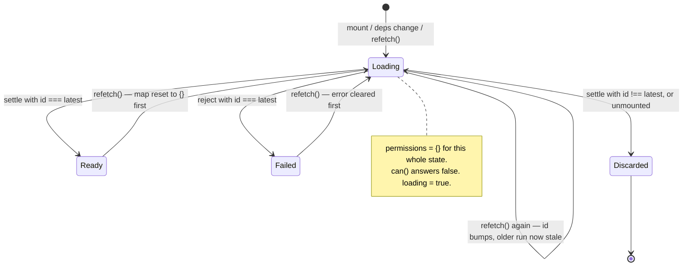

# Client integrations

`src/client/` ships three ways to read a permission map in a browser: React
(`@gentleduck/iam/client/react`), a framework-agnostic class
(`@gentleduck/iam/client/vanilla`), and Vue 3 (`@gentleduck/iam/client/vue`).
None of them contains an evaluator. All three are lookups into a flat
`Record<string, boolean>` that a server produced, and this document covers what
that lookup does, when the map is replaced, and who owns the object it reads
from.

## The client decides nothing

A client-side permission check hides UI. It is not authorization.

The map is a snapshot of decisions a server already made, serialised over the
wire, held in a browser the user controls. Every value in it can be edited from
a devtools console. `can()` is a hint about what to render; the request the
button fires must be authorized again on the server, by the engine, against the
live policy set. See [`server.md`](./server.md) for the middleware that does
that.

Three consequences that follow directly from the source and are worth stating
before the API:

- **Nothing validates the map.** It arrives as `JSON.parse` output typed as
  `IamClient.PartialPermissionMap`, and the type is erased. `iamPermissionGranted`
  (`src/shared/permission-map.ts:15`) therefore tests `=== true`, never
  truthiness — `{"read:post": "false"}` is a plausible thing for a server to
  emit and is truthy. Every reader agrees on this: `can()`, `allowedActions()`
  and `hasAnyOn()` all require the literal boolean. `src/client/__tests__/client-parity.test.ts:187`
  drives the same hostile map through all three clients.
- **A missing key is a deny, everywhere.** There is no widening: a map holding
  `@org-1:read:post` does not answer `can('read', 'post')`. The shape of the
  call must match the shape of the key the server generated.
- **The map is stale by construction.** It was computed once. A role revoked
  after the map was built stays visible in the UI until something reloads it.
  The reload paths are the subject of the last third of this document.
- **A key names an instance; the verdict may not know it.** Each check is
  evaluated against `{ type, id, attributes }` and `attributes` defaults to
  `{}`, so a rule conditioned on `resource.attributes.*` evaluates as if the
  instance had none. `'update:post:post-42': true` can therefore sit beside a
  server-side `can()` that refuses the loaded row. Pass the row's attributes on
  the check when a policy reads them.

## Where the map comes from

The server calls `engine.permissions(subjectId, checks)`
(`src/core/engine/engine.ts:1138`) with an explicit batch of checks, and gets
back one key per check. Next.js users can call `getIamPermissions(engine, id, checks)`
(`src/server/next/index.ts:291`), which is a thin pass-through to the same method.

```ts
const permissions = await engine.permissions(session.user.id, [
  { action: 'create', resource: 'post' },
  { action: 'delete', resource: 'post' },
  { action: 'update', resource: 'post', resourceId: 'post-42' },
  { action: 'manage', resource: 'billing', scope: 'org-1' },
])
// {
//   'create:post': true,
//   'delete:post': false,
//   'update:post:post-42': true,
//   '@org-1:manage:billing': true,
// }
```

The batch is capped at 1024 checks and `subjectId` at 1024 characters; both
throw rather than fail closed, because an over-long batch is a caller bug rather
than an access decision.

### Key format

Keys are built by `iamBuildPermissionKey` (`src/shared/keys.ts:22`) on both
sides of the wire, and the clients call it on every check. Four shapes:

| Fields | Key |
| --- | --- |
| action, resource | `read:post` |
| action, resource, resourceId | `read:post:42` |
| scope, action, resource | `@org-1:read:post` |
| scope, action, resource, resourceId | `@org-1:read:post:42` |

The leading `@` is not decoration. Without it `('read', 'doc', '42')` and
`('doc', '42', undefined, 'read')` both produce `read:doc:42`, so two different
checks in one batch share a map entry and one answers for the other. Inside a
segment, `:` and `\` are backslash-escaped and a leading `@` is escaped, so a
resource literally named `a:b` keys as `read:a\:b`.

That escaping is why the map must never be introspected with `key.split(':')`.
`iamAllowedActions` and `iamHasAnyOn` (`src/shared/permission-map.ts:38`, `:60`)
route through `iamParsePermissionKey`, which rejects anything not in the image
of the builder — a lone backslash, an unescaped `@`, an unrecognised `\x`
sequence — by re-encoding the parsed tuple and comparing (`src/shared/keys.ts:60`).
Without that round-trip check the parser and `can()` disagreed on the same map:
`can()` builds a canonical key and misses, while `allowedActions()` parses the
raw key and hits. A menu then offers an action the same client's `can()` denies.

`src/client/__tests__/client-parity.test.ts:160` pins the naive-split answers as
explicitly wrong: `allowedActions('42')` and `allowedActions('b')` return `[]`,
because neither `42` nor `b` names a real resource in that map.

`iamBuildPermissionKey` treats `''` as a real segment, so an empty-string action
or scope is distinct from an absent one, and all three readers honour it
(`src/client/vanilla/__tests__/vanilla-fail-closed.test.ts:46`).

## React

```ts
import React from 'react'
import { createIamAccessControl, createIamPermissionChecker } from '@gentleduck/iam/client/react'

export const { AccessContext, AccessProvider, useAccess, usePermissions, Can, Cannot } =
  createIamAccessControl(React)
```

React is injected rather than imported (`src/client/react/index.ts:199`). The
module never bundles its own copy, and the injected object only has to satisfy
`ReactLike` — `createContext`, `useContext`, `useMemo`, `useCallback`,
`createElement`, `useState`, `useEffect`. Call the factory once and export the
result; calling it twice creates two contexts, and a provider from one will not
feed a hook from the other.

The module also re-exports `iamAllowedActions`, `iamBuildPermissionKey` and
`iamHasAnyOn` so a React app never has to import from `@gentleduck/iam/core`
for them.

### `AccessProvider`

```tsx
<AccessProvider permissions={permissions}>
  <App />
</AccessProvider>
```

| Prop | Type | Required |
| --- | --- | --- |
| `permissions` | `IamClient.PartialPermissionMap<TAction, TResource, TScope>` | yes |
| `children` | `ReactNode` | yes |

The provider copies the prop into a snapshot and answers every check from that
snapshot (`src/client/react/index.ts:232`); the context value is memoised on
`[permissions]` by identity (`:245`). Pass a new object when the grants change.
Mutating the object you already passed does nothing: it does not re-render the
tree, and — because the provider is reading its own copy — it does not change
what `can()` answers either
(`src/client/react/__tests__/react-shared-and-stale-closures.test.ts:194`). See
[Map ownership](#the-reload-and-map-ownership-contract) for how the three
clients compare.

### `useAccess()`

Returns `IamReactClient.IContextValue`:

| Member | Type |
| --- | --- |
| `permissions` | `IamClient.PartialPermissionMap` |
| `can` | `(action, resource, resourceId?, scope?) => boolean` |
| `cannot` | `(action, resource, resourceId?, scope?) => boolean` |
| `allowedActions` | `(resource) => string[]` |
| `hasAnyOn` | `(resource) => boolean` |

```tsx
function PostActions({ postId }: { postId: string }) {
  const { can, allowedActions } = useAccess()
  if (allowedActions('post').length === 0) return null
  return (
    <>
      {can('update', 'post', postId) && <button>Edit</button>}
      {can('delete', 'post', postId) && <button>Delete</button>}
    </>
  )
}
```

`allowedActions` returns `string[]`, not `TAction[]`, on every client. The
action union is a claim about what the server *should* have sent; re-asserting
it over parsed keys from unvalidated JSON hides a malformed map instead of
surfacing it. Narrow with your own predicate if you need the union back.

### Calling `useAccess()` outside a provider

The context default is not an empty map with permissive stubs. Every member is
a gate (`src/client/react/index.ts:208`):

| `NODE_ENV` | `can` | `cannot` | `allowedActions` | `hasAnyOn` |
| --- | --- | --- | --- | --- |
| `'development'` | throws | throws | throws | throws |
| anything else, or no `process` | `false` | `true` | `[]` | `false` |

Vue throws unconditionally for the same wiring bug. React's development row is
aligned to it, because a silent deny for a missing provider looks exactly like a
correctly-configured user with no permissions.

The polarity is deliberately the opposite of the devtools guard: only an
explicit `'development'` signal throws. `isDevelopment()`
(`src/client/react/index.ts:163`) walks `process` with checked `Reflect.get`
steps rather than asserting a shape, because `process` in a browser bundle is
whatever the bundler shimmed — possibly an object with no `env` at all. Anything
that is not literally the string `'development'` answers `false`, so a
raw-browser bundle that never shimmed `process` denies instead of throwing out
of a render. `src/client/__tests__/client-parity.test.ts:232` pins all three
rows, including a control that a correctly-wired provider inside the same
development build still answers from its map.

Note that *every* member gates, not just `can`. That is what stops `<Can>` and
`allowedActions()` quietly rendering an empty UI in a build where `useAccess()`
would have thrown.

### `<Can>` and `<Cannot>`

```tsx
<Can action="manage" resource="team" fallback={<UpgradePrompt />}>
  <TeamSettings />
</Can>

<Cannot action="create" resource="post">
  <p>Ask an admin for posting rights.</p>
</Cannot>
```

| Prop | `Can` | `Cannot` |
| --- | --- | --- |
| `action` | required | required |
| `resource` | required | required |
| `resourceId` | optional | optional |
| `scope` | optional | optional |
| `children` | required | required |
| `fallback` | optional, defaults to `null` | **not supported** |

Both read `useAccess()`, so both are subject to the missing-provider table
above. `Can` returns `children` or `fallback` (`src/client/react/index.ts:272`);
`Cannot` returns `children` or `null` (`:290`).

### `usePermissions(fetchFn, deps?)`

Loads a map into React state. Signature at `src/client/react/index.ts:316`.

```tsx
function App({ userId }: { userId: string }) {
  const { can, loading, error, refetch } = usePermissions(
    () => fetch(`/api/permissions?u=${userId}`).then((r) => r.json()),
    [userId],
  )

  if (loading) return <Spinner />
  if (error) return <ErrorMessage error={error} onRetry={refetch} />
  return can('create', 'post') ? <NewPostButton /> : null
}
```

Returns:

| Member | Type | Notes |
| --- | --- | --- |
| `permissions` | `PartialPermissionMap` | a frozen `{}` until the first load lands, and again for the whole of every reload |
| `can` / `cannot` | `(action, resource, resourceId?, scope?) => boolean` | `can` is memoised on `[permissions]`; `cannot` is not memoised |
| `allowedActions` | `(resource) => string[]` | rebuilt each render |
| `hasAnyOn` | `(resource) => boolean` | rebuilt each render |
| `loading` | `boolean` | starts `true` |
| `error` | `Error \| null` | normalised, see below |
| `refetch` | `() => Promise<void>` | resolves when the run settles, whether or not it was superseded |

`deps` defaults to `[]`. It is both the effect dependency list and the
`useCallback` dependency list for the loader, so it decides **when** a reload
happens on its own: with `deps` left at `[]`, a `fetchFn` closing over a subject
id never reloads when that id changes. List whatever the fetcher closes over if
you want the change alone to trigger a load.

`deps` does not decide **what** gets fetched. Every render writes the current
`fetchFn` into the hook's run box (`src/client/react/index.ts:348`) and the
loader calls `run.fn()` (`:363`), so `refetch()` runs the closure the component
holds at the moment it is called, whatever `deps` says — on an account switch,
`refetch()` fetches the new subject
(`src/client/react/__tests__/react-shared-and-stale-closures.test.ts:160`).

`error` is normalised at the rejection site: `err instanceof Error ? err : new Error(String(err))`
(`src/client/react/index.ts:375`). A rejected fetch chain can carry a string or
a `Response`, and the state is declared `Error | null`, so a bare `Promise.reject('gateway said no')`
becomes `new Error('gateway said no')` rather than making the declaration false
(`src/client/react/__tests__/react-use-permissions-stale.test.ts:221`).

#### What renders while permissions are unknown

`permissions` starts as the empty map and `can()` therefore answers `false`. A
gate written as `can(...) && <Button/>` renders nothing during load and after a
failed load — it fails closed, which is what
`src/client/react/__tests__/react.test.ts:268` pins ("denies while the first
fetch is still in flight", "denies after the fetch rejects", plus a control that
the same wiring does grant on success).

Two real UI hazards follow from that, and neither is a bug in the hook:

1. **`<Cannot>` renders during load.** `cannot()` is `!can()`, so a
   `<Cannot action="create" resource="post">You cannot post.</Cannot>` flashes
   its denial message for the whole in-flight window and then disappears. Gate
   on `loading` before rendering any negative-space UI.
2. **`usePermissions` and `<Can>` are not connected.** `Can` reads the context;
   `usePermissions` returns a plain object. Feeding one into the other is the
   consumer's job:

   ```tsx
   const { permissions, loading } = usePermissions(fetchPerms, [userId])
   if (loading) return <Spinner />
   return <AccessProvider permissions={permissions}><App /></AccessProvider>
   ```

   Without the `loading` guard, the provider is briefly populated with `{}` and
   every `<Can>` renders its fallback.

### `createIamPermissionChecker(permissions)`

A React-free checker for event handlers, utilities and tests
(`src/client/react/index.ts:437`). Returns `{ can, cannot, allowedActions, hasAnyOn, permissions }`,
where `permissions` is the caller's own object, by reference
(`src/client/react/__tests__/react.test.ts:247` asserts `.toBe(map)`).

Unlike `AccessProvider`, this function does not copy. Every check reads the live
argument, so writing into that map after building the checker does change what
`can()` answers. Hand it a map nothing else holds, or hand it the same map you
would hand the provider and treat both as immutable.

## Vanilla

```ts
import { IamAccessClient, iamAccessClient } from '@gentleduck/iam/client/vanilla'
```

A class with a subscription. Use it for Web Components, Svelte, Solid, Angular,
or as the store under any framework binding you write yourself.

```ts
const access = new IamAccessClient(permissionsFromServer)

access.can('delete', 'post')                     // boolean
access.can('manage', 'user', undefined, 'admin') // scoped
access.cannot('manage', 'billing')

const unsubscribe = access.subscribe(() => rerender())
access.update(await refreshPermissions())
unsubscribe()
```

| Member | Signature | Notes |
| --- | --- | --- |
| `new IamAccessClient(perms?)` | `(PartialPermissionMap?) => IamAccessClient` | copies the argument; defaults to `{}` |
| `IamAccessClient.fromServer(url, init?)` | `static (string, RequestInit?) => Promise<IamAccessClient>` | see below |
| `can` / `cannot` | `(action, resource, resourceId?, scope?) => boolean` | |
| `allowedActions` | `(resource) => string[]` | |
| `hasAnyOn` | `(resource) => boolean` | |
| `get permissions` | `Readonly<PartialPermissionMap>` | a **fresh copy on every read** |
| `update(perms)` | `(PartialPermissionMap) => void` | replaces, copies in, notifies |
| `merge(perms)` | `(PartialPermissionMap) => void` | shallow-merges over current, notifies |
| `subscribe(fn)` | `(Listener) => () => void` | returns the unsubscribe |
| `iamAccessClient(...)` | factory | same arguments as `new`; returns a non-generic `IamAccessClient` |

There is no `loading`, no `error`, and no `refetch` on this client. It is a
store; the fetching is yours.

### `fromServer`

```ts
const access = await IamAccessClient.fromServer('/api/permissions', {
  headers: { Authorization: `Bearer ${token}` },
})
```

`Content-Type: application/json` is merged in first and the caller's headers
merge over it, so passing `{'Content-Type': 'text/plain'}` wins
(`src/client/vanilla/__tests__/vanilla.test.ts:184`). The rest of `init` passes
through, method included — this is not GET-only. A non-2xx status throws
`Failed to fetch permissions: ${status}` **before** the body is read, so a
non-JSON error page never reaches `res.json()`
(`src/client/vanilla/__tests__/vanilla.test.ts:204`).

### Subscription and teardown

`subscribe` adds to a `Set` and returns a closure that deletes from it
(`src/client/vanilla/index.ts:188`). There is no `unsubscribeAll`, no `destroy`,
and no automatic teardown — a listener that outlives its component keeps the
component's closure alive. Call the returned function.

Notification happens inside `update` (and therefore inside `merge`, which
delegates). Each listener is called in a `try`/`catch`; a throwing listener is
logged as `[@gentleduck/iam:client] listener threw - continuing to notify others`
and the remaining listeners still run
(`src/client/vanilla/__tests__/vanilla.test.ts:134`). Nothing is notified by the
constructor or by the `permissions` getter.

## Vue

```ts
// access.ts — build once, share app-wide
import { ref, computed, inject, provide, defineComponent, h } from 'vue'
import { createIamVueAccess } from '@gentleduck/iam/client/vue'

export const {
  createAccessState, provideAccess, useAccess, usePermissions,
  createAccessPlugin, Can, Cannot, IAM_ACCESS_INJECTION_KEY,
} = createIamVueAccess({ ref, computed, inject, provide, defineComponent, h })
```

Vue is injected the same way React is (`src/client/vue/index.ts:102`), and only
`ref`, `inject`, `provide` and `defineComponent` are actually destructured —
`computed` and `h` are required by the `VueLike` interface but unused by the
current implementation.

`IAM_ACCESS_INJECTION_KEY` is `Symbol.for('@gentleduck/iam:access')`
(`src/client/vue/index.ts:48`), registry-global rather than a plain `Symbol()`.
The package ships ESM and CJS builds; a plain symbol is per-module-instance, so
a mixed load would have `provide` and `inject` using different keys and report
"useAccess() called without provideAccess()" for a correctly wired app.

### `createAccessState` / `provideAccess` / `createAccessPlugin`

`createAccessState(permissions)` returns `{ permissions, can, cannot, update, allowedActions, hasAnyOn }`
where `permissions` is a `Ref`. `provideAccess(permissions)` builds one and
registers it via `provide`, returning it. `createAccessPlugin(permissions)`
returns `{ install(app) }`, which does the same via `app.provide` and also sets
`app.config.globalProperties.$can` and `$cannot` for direct template use:

```html
<button v-if="$can('delete', 'post')">Delete</button>
```

`useAccess()` injects the state and **always throws** when nothing was provided
(`src/client/vue/index.ts:144`), with no environment gate — this is the
behaviour React's development mode was aligned to.

`update(newPerms)` assigns `permissions.value = newPerms`. That is the entire
reload story for the provided state: there is no `merge`, and no fetch.

### Vue's `usePermissions(fetchFn)`

Same intent as React's, different surface (`src/client/vue/index.ts:168`):

| | React | Vue |
| --- | --- | --- |
| dependency list | second argument, defaults to `[]` | none |
| first load | inside `useEffect` | `void refetch()` **synchronously in the composable body** (`:206`) |
| `permissions`, `loading`, `error` | plain values, re-read per render | `Ref`s — use `.value` |
| unmount guard | `run.unmounted`, set by the effect's cleanup | none |
| supersession guard | monotonic `run.latest` | monotonic `latestRun` |

The synchronous first load matters under SSR: creating the composable fires the
fetch immediately, with no lifecycle hook to defer or cancel it. The missing
unmount guard means a late response still writes to the ref of a disposed
component; the ref is garbage after that, so the practical effect is a wasted
write rather than a leak, but it is a real difference from React.

The docblock claims the two are "the same shape". Read that as "answers the same
questions", not "returns the same object" — `state.loading.value` on Vue is
`result.loading` on React.

### `<Can>` / `<Cannot>`

Slot-based, props `action`, `resource`, `resourceId`, `scope`:

```vue
<Can action="read" resource="analytics">
  <template #default><AnalyticsPanel /></template>
  <template #fallback>Upgrade to Pro</template>
</Can>
```

Both call `useAccess()` in `setup`, so both throw outside a provider. `Can`
renders the `default` slot when allowed and the `fallback` slot when denied —
and when denied with no `fallback` slot it returns `undefined`, not `null`
(`src/client/vue/__tests__/vue.test.ts:159`). `Cannot` renders `default` when
denied and `null` otherwise.

Neither component is wired to `usePermissions`; like React, they read the
provided state, whose shape (`update`, no `loading`) is different.

## The reload and map-ownership contract

Two separate mechanisms answer the same question — is this client still holding
a map it should have let go of? — and they are worth reading separately. The
first governs reloads and is uniform across all three clients. The second
governs who owns the object, and there the three still differ.

### Half one: reload always replaces, never mutates

No client anywhere in `src/client/` mutates a permission map in place. Every
reload is an assignment of a different object:

| Client | Reload entry point | What it does |
| --- | --- | --- |
| React | `refetch()` / a `deps` change | `setPermissions(EMPTY_PERMISSIONS)` → later `setPermissions(perms)` |
| Vue (`usePermissions`) | `refetch()` | `permissions.value = empty` → later `permissions.value = perms` |
| Vue (provided state) | `update(perms)` | `permissions.value = perms` |
| Vanilla | `update(perms)` / `merge(perms)` | `this._permissions = { ...perms }` |

The important part is the *first* assignment. Both `usePermissions`
implementations reset to the empty map at the **start** of every load, before
the fetch is awaited (`src/client/react/index.ts:359`, `src/client/vue/index.ts:184`).
`error` is cleared at the same point, because a stale error outlives the failure
that caused it.

A refetch is treated as a different subject until proven otherwise. Holding the
previous map made `can()` answer with the last subject's grants for the whole
in-flight window, and keep answering with them indefinitely if the refetch
failed — the sign-out and account-switch cases, where the stale map is another
user's grants. So:

- **During any reload, everything is denied.** Consumers that want the old UI to
  persist across a refresh must gate on `loading`, not on the permissions.
- **After a failed reload, everything is denied**, and `error` is populated
  (`src/client/react/__tests__/react-use-permissions-stale.test.ts:101`,
  `src/client/__tests__/client-parity.test.ts:323`).
- **A consumer holding a reference to the previous map across a reload keeps
  the previous map.** It is a detached object; nothing writes into it again. In
  React and Vue the re-render/reactivity hands you the new one, so this only
  bites code that stashed `permissions` outside the render — a module-level
  variable, a class field, a closure captured once.

### Why a run id and not a `cancelled` flag

Adding `refetch` made overlapping loads reachable without any deps change, and
therefore without an effect teardown between them. Both hooks carry a monotonic
run id (`run.latest`, `latestRun`), captured per call and compared on settle. A
boolean cannot express this: two loads are in flight, no effect was cleaned up,
and the *earlier* one resolves last. Without the id, the earlier answer lands on
top of the later one and `can()` serves the previous subject's grants
indefinitely.

React's stale check is `run.unmounted || id !== run.latest`
(`src/client/react/index.ts:362`) — the run id covers supersession, the
`unmounted` flag covers teardown, and neither covers the other. The `run` box is
a lazily-initialised `useState` object rather than a `useRef` on purpose:
`ReactLike` is a shim consumers hand-build, and adding `useRef` to it would
break every existing one. The same box carries `fn`, the latest `fetchFn`,
which is how `refetch` escapes the loader's `deps`-pinned closure.



Pinned by `src/client/react/__tests__/react-use-permissions-stale.test.ts:180`
("a superseded slow refetch never overwrites a newer one") and
`src/client/__tests__/client-parity.test.ts:342` (the same scenario on Vue).
Note the React test has to retire the effect's own initial load before gating
the two overlapping refetches — the effect fires one load of its own on mount.

The older React test harness in `react.test.ts` runs each effect at most once
and cannot express a refetch at all, which is precisely why the stale window
went unnoticed until `react-use-permissions-stale.test.ts` was written with a
deps-aware fake. Both of those doubles return the callback handed to
`useCallback` unchanged, which hands the hook a fresh closure every render and
makes a captured-`fetchFn` question unaskable; the third harness,
`react-shared-and-stale-closures.test.ts`, memoises `useCallback` on its deps
and wires a real context value, which is what lets it ask the ownership and
closure questions at all.

### Half two: who owns the map object

This is where the four surfaces still differ, and the difference is not
cosmetic.

**Vanilla copies in both directions.** The constructor does `{ ...permissions }`
and `update` does the same (`src/client/vanilla/index.ts:81`, `:161`). The
`permissions` getter returns `{ ...this._permissions }` — a fresh object on
every read (`src/client/vanilla/__tests__/vanilla-fail-closed.test.ts:86`
asserts `c.permissions !== c.permissions`).

`Readonly<...>` erases at runtime, which is why both directions are guarded
rather than typed. Sharing one map object between a client and the code that
built it is not exotic — it is what "fetch it once and pass it around" looks
like — and an unguarded way in would let a later mutation change what `can()`
answers with no subscriber notified. The pinned behaviour
(`src/client/vanilla/__tests__/vanilla-map-ownership.test.ts`):

```ts
const map = { 'read:post': true }
const access = new IamAccessClient(map)
map['delete:post'] = true
access.can('delete', 'post') // false — the client copied at construction
```

```ts
const access = new IamAccessClient()
const seen = vi.fn()
access.subscribe(seen)
access.update(map)          // seen called once
map['delete:post'] = true
access.can('delete', 'post') // false
expect(seen).toHaveBeenCalledTimes(1) // and never a second time
```

The silent half is the point: the grant would have taken effect with every
subscriber uninformed, so the rendered UI and the client would disagree about
the same map.

**Listeners receive the caller's object, not the client's copy.** `update`
notifies with the argument it was given (`src/client/vanilla/index.ts:164`), and
what a listener does to that object is between the listener and the caller — it
can no longer reach what the client decides from
(`vanilla-map-ownership.test.ts:46`). For `merge`, the notified object is the
freshly built merged literal, which does include the previously stored keys
(`src/client/vanilla/__tests__/vanilla.test.ts:252`).

**React's provider copies in; its standalone checker does not.**
`AccessProvider` builds `{ ...permissions }` inside the memo and every member of
the context value reads that snapshot (`src/client/react/index.ts:232`), so a
mutation of the map you passed simply does not apply — the same answer vanilla
gives. `createIamPermissionChecker` (`:437`) is the other half of the React
surface and still reads the caller's live object, which is also what it hands
back as `permissions`.

```ts
// React — the provider defends itself
const map = await fetchPerms()
render(<AccessProvider permissions={map}><App /></AccessProvider>)
map['delete:post'] = true
// can('delete','post') stays false; nothing re-rendered, and nothing changed.

// React — the standalone checker does not
const checker = createIamPermissionChecker(map)
map['manage:billing'] = true
checker.can('manage', 'billing') // true
```

**Vue does not copy, in either direction.** `createAccessState` puts the
argument straight into a `ref` (`src/client/vue/index.ts:107`), and `update`
assigns the caller's object (`:119`). A write into that object changes what
`can()` answers and triggers no reactivity, because `ref()` sees writes made
through `permissions.value`, not writes to the object you still hold.

The rule that covers every case: treat any map you hand to a client, and any map
a client hands back, as immutable. Replace it, never edit it.

| | React `AccessProvider` | React `createIamPermissionChecker` | Vue | Vanilla |
| --- | --- | --- | --- | --- |
| copies the map on the way in | yes | no | no | yes |
| copies the map on the way out | no — `permissions` is the provider's own snapshot | no — the caller's object, identity and all | no — the `Ref` holds the caller's object | yes, a fresh copy per read |
| mutating the map you passed in changes `can()` | no | yes | yes | no |
| mutating the map you read back changes `can()` | yes | yes | yes | no |
| any in-place mutation notifies anything | no | n/a | no | no |

Only vanilla closes both directions.

## Feature comparison

| Capability | React | Vanilla | Vue |
| --- | --- | --- | --- |
| Entry point | `@gentleduck/iam/client/react` | `.../client/vanilla` | `.../client/vue` |
| Construction | `createIamAccessControl(React)` | `new IamAccessClient(map)` / `iamAccessClient(map)` | `createIamVueAccess(vue)` |
| `can` / `cannot` | yes | yes | yes |
| `allowedActions` / `hasAnyOn` | yes | yes | yes |
| Declarative gate | `<Can>` / `<Cannot>` | — | `<Can>` / `<Cannot>` |
| `fallback` on the positive gate | `fallback` prop, defaults to `null` | — | `#fallback` slot; `undefined` when the slot is absent |
| `fallback` on the negative gate | no (`Cannot` renders `null`) | — | no (`Cannot` renders `null`) |
| Async loader | `usePermissions(fetchFn, deps?)` | — (`fromServer` is a one-shot static) | `usePermissions(fetchFn)` |
| `loading` / `error` state | yes | no | yes, as `Ref`s |
| `refetch` | yes | no | yes |
| In-place map replace | no — re-render the provider | `update` | `update` |
| Shallow merge | no | `merge` | no |
| Change subscription | React state / context | `subscribe(fn) => unsubscribe` | Vue reactivity |
| Fetch helper | in `usePermissions` only | `IamAccessClient.fromServer(url, init?)` | in `usePermissions` only |
| Global template helpers | — | — | `$can` / `$cannot` via the plugin |
| Standalone checker | `createIamPermissionChecker(map)` | the class itself | `createAccessState(map)` |
| Missing provider | throws in `NODE_ENV=development`, denies otherwise | n/a | always throws |
| Re-exports `iamBuildPermissionKey` | yes | **no** | yes |
| Re-exports `iamAllowedActions` / `iamHasAnyOn` | yes | yes | yes |
| Copies the map handed in | yes in `AccessProvider`, no in `createIamPermissionChecker` | yes | no |
| Copies the map handed back | no | yes, per read | no |

Features present in exactly one client: `merge`, `subscribe` and `fromServer`
(vanilla); `$can`/`$cannot` globals, a plugin installer and a shared injection
key (Vue); a `deps` list on the async loader and an unmount guard (React).

## Gotchas

- **`deps` says when to reload, not what to fetch.** `usePermissions` builds its
  loader with `useCallback(load, deps)`, so only a `deps` change re-fires the
  effect. `refetch()` is independent of that: it runs whichever `fetchFn` the
  component is currently rendering with. An inline fetcher over component state
  with `deps: []` will not reload by itself, and will reload correctly the
  moment you call `refetch()`.
- **The empty map is shared and frozen.** `EMPTY_PERMISSIONS`
  (`src/client/react/index.ts:304`) is one object per `createIamAccessControl`
  call, and every `usePermissions` instance from that factory holds it while
  loading. `Object.freeze` makes writing into it a `TypeError` in strict mode —
  which is every ES module, so every bundled React component — and a silent
  no-op in sloppy mode. Either way an optimistic `permissions[key] = true`
  written into a map you received while `loading` is true grants nothing, in
  that hook or any other. Note `Reflect.set` returns `false` rather than
  throwing, so a write routed through it is silent in both modes.
- **Call the factories once.** `createIamAccessControl` and `createIamVueAccess`
  each build a fresh context/injection surface. Two calls means two contexts.
  Vue's injection key is the exception — it is registry-global, so two Vue
  surfaces will collide on the same key and the last `provide` wins.
- **Scope and id are part of the key, not modifiers.** `can('read', 'post')`
  will not find `@org-1:read:post` or `read:post:42`. Match the shape the server
  generated.
- **`allowedActions` is a map summary, not an authorization primitive.** It
  answers "what does this snapshot say about this resource type" and is right
  for building a menu. It filters on the resource alone: `@org-1:delete:post`
  and `read:post:42` both put their action into `allowedActions('post')`, so a
  menu built from it can offer an action the viewer holds only in another scope
  or only on another record. `can()` builds the whole key and answers `false`
  for both. `hasAnyOn` reads the map the same way `allowedActions` does
  (`src/shared/__tests__/permission-map-scope-blindness.test.ts`). Record
  ownership and live attributes are server questions.
- **`fromServer` reads the body only on 2xx.** A rejected call gives you a
  status code and nothing else; if you need the error body, fetch it yourself
  and pass the parsed map to the constructor.

## See also

- [`server.md`](./server.md) — the middleware that must re-check every decision
  a client made.
- [`core-engine.md`](./core-engine.md) — `engine.permissions()`, which produces
  the map.
- [`operations.md`](./operations.md) — `src/shared/keys.ts` and
  `src/shared/permission-map.ts` in full.
- [`../compiled-engine-explained.md`](../compiled-engine-explained.md) — how the
  server reaches the booleans in the first place.
