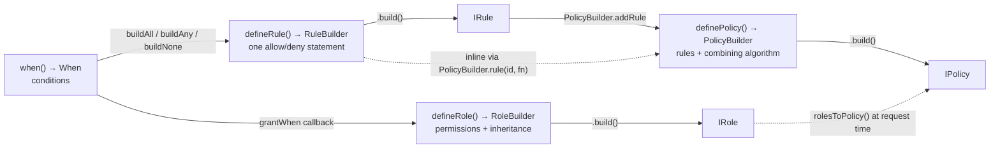

# Builder and explain

`src/core/builder` is the authoring surface: four fluent builders that emit the
plain `IRole`, `IRule` and `IPolicy` objects the engine enforces.
`src/core/explain` is the reading surface: one function that re-runs a request
against every policy and returns the full decision trace instead of a boolean.
Both are published entry points — `@gentleduck/iam/core/builder` and
`@gentleduck/iam/core/explain`, and both are re-exported from the package root.
This document covers every chainable method, the inputs the builder now refuses
outright, and how to read a trace back to the condition that denied a request.

The policy *types* the builder emits are documented in
[`core-schema.md`](./core-schema.md); the semantics of each condition operator
are in [`core-evaluate.md`](./core-evaluate.md). Neither is restated here.

---

## 1. Exports

| Entry point | Value exports | Type exports |
| --- | --- | --- |
| `@gentleduck/iam/core/builder` | `definePolicy`, `PolicyBuilder`, `defineRole`, `RoleBuilder`, `IAM_CRUD_ACTIONS`, `defineRule`, `RuleBuilder`, `when`, `When`, `iamChosenWhen` | `IamCrudAction` |
| `@gentleduck/iam/core/explain` | `explainEvaluation`, `iamEscapeHtml` | `Explain` (namespace) |

`src/core/builder/index.ts` is four `export *` lines over `policy.ts`,
`role.ts`, `rule.ts` and `when.ts`. `src/core/explain/index.ts` is three named
exports; `tracePolicy` in `explain.libs.ts:209` is exported from the module but
not from the entry point, so it is not public API.

`createIam()` (`src/core/config/config.ts:58-64`) returns the same four builders
pre-bound to your action / resource / role / scope unions. Prefer it — see §2.1.

## 2. The four builders



Roles and policies are not two systems. `rolesToPolicy()`
(`src/core/rbac/rbac.ts:102`) turns every role into a synthetic ABAC policy with
the id `__rbac__`, so a `RoleBuilder` grant and a `RuleBuilder` rule are
evaluated by the same code and appear side by side in an explain trace. See
[`core-rbac.md`](./core-rbac.md).

### 2.1 Generic slot order differs per factory

Each factory takes its type parameters in a different order. This is a real
trap — passing them positionally to the wrong factory type-checks and then
makes `.role()` demand a scope literal.

| Factory | Type parameter order |
| --- | --- |
| `definePolicy<TAction, TResource, TRole, TScope, TContext>` | action, resource, **role**, **scope** |
| `defineRole<TRole, TAction, TResource, TScope, TContext>` | **role first**, then action, resource, scope |
| `defineRule<TAction, TResource, TScope, TRole, TContext>` | action, resource, **scope**, **role** |
| `when<TAction, TResource, TRole, TScope, TContext, TActiveResource>` | action, resource, **role**, **scope** |

`when()`'s order was wrong until `ff6f1126` — it declared `TScope` third and
`TRole` fourth but handed them to `When` in the opposite slots, so `.role()`
accepted a scope and `.scope()` accepted a role. Nothing failed at runtime; the
typed surface simply lied, which is the only thing those generics exist for.
Fixed and pinned in `builder-authoring-hazards.test.ts:210-231`. It is a
breaking change only for callers who passed all four explicitly.

The way to not think about any of this:

```ts
import { createIam } from '@gentleduck/iam'

const iam = createIam({
  actions: ['read', 'update', 'delete', 'publish'] as const,
  resources: ['doc'] as const,
  roles: ['viewer', 'editor', 'admin'] as const,
  scopes: ['org-a', 'org-b'] as const,
  context: {} as unknown as AppContext,
})

iam.defineRole('editor')   // RoleBuilder, all four unions bound
iam.definePolicy('drafts') // PolicyBuilder
iam.defineRule('r1')       // RuleBuilder
iam.when()                 // When
```

### 2.2 `RoleBuilder` — `src/core/builder/role.ts`

| Method | Effect | Accumulates? |
| --- | --- | --- |
| `.name(n)` | Display name. Defaults to the role id. | replaces |
| `.desc(d)` | Description. Never consulted during evaluation. | replaces |
| `.inherits(...ids)` | Parent roles, resolved recursively, cycles skipped. | **replaces** |
| `.scope(s)` | Default scope for *every* permission in the role. | replaces |
| `.grant(action, resource, scope?)` | One permission. `'*'` allowed for either. | appends |
| `.grantScoped(scope, action, resource)` | One scoped permission. | appends |
| `.grantWhen(action, resource, fn)` | One conditional permission; `fn` gets a `When`. | appends |
| `.grantAll(resource)` | `grant('*', resource)`. | appends |
| `.grantRead(...resources)` | `grant('read', r)` per resource. | appends |
| `.grantCRUD(resource)` | Four grants: `create`, `read`, `update`, `delete`. | appends |
| `.meta(m)` | Arbitrary attributes. Never consulted during evaluation. | replaces |
| `.build()` | Validates, returns a plain `IRole`. | — |

`.inherits()` is the only `.grant`-adjacent method that replaces rather than
appends. `.inherits('a').inherits('b')` declares `['b']` alone, and a bare
`.inherits()` wipes the list — and because `build()` omits an empty list, the
wipe is indistinguishable from a role that never declared a parent. Dropping an
inheritance edge drops every permission that flowed through it, so the symptom
is a denial, not an error. Pinned in `inherits-replaces.test.ts`.

`.grantRead()` and `.grantCRUD()` are gated on the declared action union:

```ts
grantRead(...resources: ('read' extends TAction ? TResource | '*' : never)[]): this
grantCRUD(resource: IamCrudAction extends TAction ? TResource | '*' : never): this
```

The helpers used to cast straight past `TAction`, so a config declaring
`actions: ['view', 'edit']` still compiled a `read` grant that no request could
ever match — a permission that looks granted and denies. The conditional
parameter type turns that into a compile error at the call site. Export
`IAM_CRUD_ACTIONS` (`role.ts:11`) so a config can spell its action list as
`[...IAM_CRUD_ACTIONS, 'publish']` and keep `grantCRUD` callable.

`.scope(s)` and `.grantScoped(...)` are different tools. `.scope()` puts a scope
condition on every generated rule; under `IConfig.scopeMode: 'hierarchical'` it
also covers everything beneath it, so `'org-1'` fires for `'org-1.team-a'`.
`.grantScoped()` scopes a single permission, which is how you mix global and
scoped grants in one role.

Inherited permissions cannot be selectively removed. To restrict below what a
parent grants, write an ABAC deny policy.

### 2.3 `RuleBuilder` — `src/core/builder/rule.ts`

| Method | Effect | Counts as configuring the grant? |
| --- | --- | --- |
| `.allow()` | Effect `allow`. This is also the default. | yes |
| `.deny()` | Effect `deny`. | yes |
| `.on(...actions)` | Actions this rule covers. Replaces. | yes |
| `.of(...resources)` | Resources this rule covers. Replaces, and narrows `TActiveResource` so `.when(w => w.resourceAttr(...))` autocompletes that resource's attributes. | yes |
| `.forScope(...scopes)` | Prepends a `scope` condition at build time. `'*'` entries are dropped. | yes |
| `.when(fn)` | ANDs an `all` group on. | **only if the callback added a condition** |
| `.whenAny(fn)` | ANDs an `any` group on. | yes, always |
| `.priority(p)` | Ranking for `highest-priority` / `first-match`. Default `10`. | no |
| `.desc(d)` | Description. Surfaced in explain output. | no |
| `.meta(m)` | Arbitrary attributes. | no |
| `.build()` | Merges the scope condition, validates, returns a plain `IRule`. | — |

The rightmost column is the whole safety story — see §4.

`.when()` and `.whenAny()` **AND onto** whatever is already there
(`_addConditions`, `rule.ts:81`). Replacing would let a second call silently
drop the first restriction, turning a narrow rule into a broad one. Two
`.when()` calls nest:

```ts
defineRule('post.update')
  .allow().on('update').of('post')
  .when((w) => w.attr('department', 'eq', 'engineering'))
  .when((w) => w.attr('level', 'gte', 5))
  .build().conditions
// { all: [ { all: [ …department ] }, { all: [ …level ] } ] }
```

A single `.when()` stays flat — no wrapper is added. `.forScope()` composes
order-independently with `.when()`: the scope condition is prepended in
`build()`, not at call time, so `.forScope().when()` and `.when().forScope()`
emit identical objects (`builder.test.ts:463`).

### 2.4 `PolicyBuilder` — `src/core/builder/policy.ts`

| Method | Effect |
| --- | --- |
| `.name(n)` | Display name. Defaults to the policy id. |
| `.desc(d)` | Description. |
| `.version(v)` | Version number. **Omitted entirely when unset** — see §4.6. |
| `.algorithm(a)` | Intra-policy conflict resolution. Default `'deny-overrides'`. |
| `.target(t)` | `{ actions?, resources?, roles? }`. A request that misses any listed target skips the policy — its rules are never evaluated. |
| `.rule(id, fn)` | Inline `RuleBuilder` callback; the built rule is appended. |
| `.addRule(rule)` | Append a pre-built `IRule`. |
| `.build()` | Validates via `validatePolicy`, returns a plain `IPolicy`. |

| Algorithm | Behaviour | Use for |
| --- | --- | --- |
| `deny-overrides` | Any matched deny wins. Default. | restriction policies |
| `allow-overrides` | Any matched allow wins. | permissive / RBAC-shaped rules |
| `first-match` | Highest-priority matched rule wins, source order on a tie. | firewall-style ordered lists |
| `highest-priority` | Highest priority number wins. | emergency overrides |

`.algorithm()` decides conflicts *inside* one policy. Conflicts *across*
policies are the engine's `policyCombine` (`'and'` by default). The two are
independent; see [`core-engine.md`](./core-engine.md).

A deny-only policy is a trap under the default `policyCombine: 'and'`: it is
applicable to the action it names, finds no matching rule, and votes its
`defaultEffect` — which vetoes the very requests it meant to let through. Pair
every guard rule with a catch-all allow at low priority, as the worked catalog
below does.

`.build()` refuses a policy whose target names a pair no allow rule covers:

```
[@gentleduck/iam:builder] PolicyBuilder.build("p") rejected by validator -
UNREACHABLE_TARGET at "targets": Target admits "write" but no allow rule covers
it, so every request matching it is denied by this policy. Add a rule that
allows it, or narrow the target.
```

A policy with no rules at all builds fine: `definePolicy('p').build()` returns
`{id:'p', name:'p', algorithm:'deny-overrides', rules:[]}`.

### 2.5 `When` — `src/core/builder/when.ts`

Every method appends one item and returns `this`. The terminal `buildAll()` /
`buildAny()` / `buildNone()` emit `{all:[…]}` / `{any:[…]}` / `{none:[…]}`.

| Method | Emits |
| --- | --- |
| `.check(field, op, value?)` | `{ field, operator: op, value }` — the raw form, typed against `TContext` |
| `.eq` / `.neq` / `.gt` / `.gte` / `.lt` / `.lte` | the named operator on `field` |
| `.in(field, values)` | `{ operator: 'in', value: values }` |
| `.contains(field, value)` | `{ operator: 'contains' }` |
| `.exists(field)` | `{ operator: 'exists' }` — no `value` key |
| `.matches(field, regex)` | `{ operator: 'matches', value: regex }` |
| `.role(id)` | `{ field: 'subject.roles', operator: 'contains', value: id }` |
| `.roles(...ids)` | `{ field: 'subject.roles', operator: 'in', value: ids }` |
| `.scope(id)` | `{ field: 'scope', operator: 'eq', value: id }` |
| `.scopes(...ids)` | `{ field: 'scope', operator: 'in', value: ids }` |
| `.resourceType(...types)` | `{ field: 'resource.type', operator: 'in', value: types }` |
| `.isOwner(ownerField?)` | `{ field: ownerField ?? 'resource.attributes.ownerId', operator: 'eq', value: '$subject.id' }` |
| `.attr(path, op, value?)` | prefixes `subject.attributes.` |
| `.resourceAttr(path, op, value?)` | prefixes `resource.attributes.` |
| `.env(path, op, value?)` | prefixes `environment.` |
| `.and(fn)` / `.or(fn)` / `.not(fn)` | appends a nested `all` / `any` / `none` group as one item |

`.roles()`, `.scopes()` and `.resourceType()` throw when called with **zero**
arguments — see §4.3. Every value slot also accepts a `$`-prefixed dollar path
(`'$subject.id'`, `'$resource.attributes.ownerId'`), resolved against the
request at evaluation time. The one place that is refused is `matches`; see
§4.7.

`when()` is also usable standalone, to build a group once and hand it to
several rules. That idiom is the reason `iamChosenWhen` exists (§4.2).

---

## 3. A worked catalog

Everything below is the real output of running this code against this version
of the package. Nothing is hand-written.

### 3.1 Roles

```ts
const viewer = iam.defineRole('viewer')
  .name('Viewer')
  .desc('Reads published docs')
  .grant('read', 'doc')
  .build()

const editor = iam.defineRole('editor')
  .name('Editor')
  .inherits('viewer')
  .grantWhen('update', 'doc', (w) => w.attr('department', 'eq', 'engineering'))
  .grantScoped('org-a', 'publish', 'doc')
  .meta({ tier: 'staff' })
  .build()

const admin = iam.defineRole('admin')
  .name('Admin')
  .inherits('editor')
  .grant('delete', 'doc')
  .build()
```

```jsonc
// viewer — note the absent `inherits`, `scope` and `metadata` keys
{ "id": "viewer", "name": "Viewer", "description": "Reads published docs",
  "permissions": [{ "action": "read", "resource": "doc" }] }

// editor
{ "id": "editor", "name": "Editor",
  "permissions": [
    { "action": "update", "resource": "doc",
      "conditions": { "all": [
        { "field": "subject.attributes.department", "operator": "eq", "value": "engineering" }
      ] } },
    { "action": "publish", "resource": "doc", "scope": "org-a" }
  ],
  "inherits": ["viewer"],
  "metadata": { "tier": "staff" } }

// admin
{ "id": "admin", "name": "Admin",
  "permissions": [{ "action": "delete", "resource": "doc" }],
  "inherits": ["editor"] }
```

`editor` carries no `read` permission of its own — inheritance supplies it at
`rolesToPolicy()` time, which is why the trace in §5.5 shows a rule described
`Editor: read on doc (via Viewer)` that exists in no authored object.

### 3.2 A guard policy with a target and a catch-all

```ts
const drafts = iam.definePolicy('drafts')
  .name('Draft visibility')
  .desc('Only the owner may read an unpublished draft')
  .version(3)
  .algorithm('deny-overrides')
  .target({ actions: ['read'], resources: ['doc'] })
  .rule('deny-foreign-drafts', (r) => r
    .deny()
    .desc('A draft is private to its owner')
    .priority(100)
    .on('read')
    .of('doc')
    .when((w) => w.resourceAttr('status', 'eq', 'draft').not((n) => n.isOwner())))
  .rule('otherwise-defer', (r) => r.allow().on('read').of('doc').priority(1))
  .build()
```

```jsonc
{
  "id": "drafts",
  "name": "Draft visibility",
  "description": "Only the owner may read an unpublished draft",
  "version": 3,
  "algorithm": "deny-overrides",
  "rules": [
    {
      "id": "deny-foreign-drafts",
      "effect": "deny",
      "description": "A draft is private to its owner",
      "priority": 100,
      "actions": ["read"],
      "resources": ["doc"],
      "conditions": { "all": [
        { "field": "resource.attributes.status", "operator": "eq", "value": "draft" },
        { "none": [
          { "field": "resource.attributes.ownerId", "operator": "eq", "value": "$subject.id" }
        ] }
      ] }
    },
    {
      "id": "otherwise-defer",
      "effect": "allow",
      "priority": 1,
      "actions": ["read"],
      "resources": ["doc"],
      "conditions": { "all": [] }
    }
  ],
  "targets": { "actions": ["read"], "resources": ["doc"] }
}
```

Three things to read off that pairing. `.not(n => n.isOwner())` becomes a
nested `{none:[…]}` item *inside* the outer `all`, not a sibling group.
`.isOwner()` writes the literal string `'$subject.id'` — the engine resolves it
per request. And `otherwise-defer` emits `conditions: {all: []}`, which imposes
no condition on top of the `read` / `doc` pair it already named. That rule builds
without complaint: §4.1 refuses a builder that named *nothing*, not the empty
group on its own.

### 3.3 A scoped, disjunctive window

```ts
const changeWindow = iam.definePolicy('change-window')
  .name('Change window')
  .algorithm('deny-overrides')
  .rule('deny-out-of-hours', (r) => r
    .deny()
    .on('update', 'delete')
    .of('doc')
    .priority(100)
    .forScope('org-a', 'org-b')
    .whenAny((w) => w.env('hour', 'lt', 9).env('hour', 'gte', 18)))
  .rule('otherwise-defer', (r) => r.allow().on('update', 'delete').of('doc').priority(1))
  .build()
```

```jsonc
{
  "id": "change-window",
  "name": "Change window",
  "algorithm": "deny-overrides",
  "rules": [
    {
      "id": "deny-out-of-hours",
      "effect": "deny",
      "priority": 100,
      "actions": ["update", "delete"],
      "resources": ["doc"],
      "conditions": { "all": [
        { "field": "scope", "operator": "in", "value": ["org-a", "org-b"] },
        { "any": [
          { "field": "environment.hour", "operator": "lt",  "value": 9 },
          { "field": "environment.hour", "operator": "gte", "value": 18 }
        ] }
      ] }
    },
    { "id": "otherwise-defer", "effect": "allow", "priority": 1,
      "actions": ["update", "delete"], "resources": ["doc"],
      "conditions": { "all": [] } }
  ]
}
```

`.forScope()` with two scopes emits one `in` condition; with one scope it emits
`eq` (`rule.ts:230-233`). It is prepended to the `all` group, and the `whenAny`
group rides underneath as a single nested item — which is what makes "outside
the window" a disjunction rather than "neither bound holds".

---

## 4. Builder safety rules

**A builder that silently emits a match-everything rule is the worst failure
this package can produce.** The rule below is the reason this section exists.

> `RuleBuilder`'s defaults are `effect: 'allow'`, `actions: ['*']`,
> `resources: ['*']`, `conditions: {all: []}`. `{all: []}` is `.every` over an
> empty array, which is `true`. So an *unconfigured* `RuleBuilder` is not an
> empty rule. It is **allow everything, unconditionally**.

`PolicyBuilder.rule()` carried a comment claiming `build()` refused that shape.
It did not — until `8a2f5146`. The validator does detect it (`BROAD_ALLOW`,
`validate.libs.ts:582`) but as `type: 'warning'`, and `build()` keeps only
`type: 'error'`, so the verdict was computed and dropped with no console output
and no return channel. Nobody ever saw it.

### 4.1 What `build()` now refuses

`RuleBuilder.build()` throws unless something that shapes *what is granted* was
said. `desc`, `priority` and `meta` do not count: they annotate a rule, they do
not narrow it.

| You wrote | You get | Write instead |
| --- | --- | --- |
| `defineRule('r').build()` | `RuleBuilder.build("r") was never configured - no effect, action, resource, scope or condition was set. The defaults are the broadest possible grant (allow * on *, unconditional), so this is refused rather than returned. Call \`.allow()\` if a broad grant is intended.` | `.allow()` if the broad grant is intended, otherwise `.on()` / `.of()` / `.when()` |
| `.desc('todo').priority(5).meta({…}).build()` | same `never configured` error | as above |
| `.rule('r1', (r) => r)` on a policy | same, surfaced from `PolicyBuilder.build()` | configure the rule inside the callback |
| `.rule('r1', () => new RuleBuilder('other'))` | same | return the builder you were given, configured |
| `defineRule('r').when((w) => w).build()` | same — an empty `all` group is not evidence anything was configured | add at least one condition, or say `.on()` / `.of()` / `.allow()` |
| `.forScope()` | `RuleBuilder.forScope("r") was called with no scopes. A scope restriction that names nothing would leave the rule global, which is the opposite of the intent. Pass at least one scope, or \`'*'\` if the rule really is unscoped.` | `.forScope('*')` for a genuinely global rule |
| `.forScope(...tenantIds)` where `tenantIds` is empty at runtime | same `no scopes` error | guard the list, or pass `'*'` |

The `forScope` spread is the one that reaches production. The first cut of this
guard gated on *which methods were called*: `forScope` set the configured flag
and only then discovered it had no scope to apply, so a rule meant to be
tenant-restricted built global, unconditional, and passed the guard. The check
now gates on what the rule became. All of it is pinned in
`rule-untouched-refusal.test.ts`.

Deliberate breadth still builds. `defineRule('r').allow().build()` returns
`allow / ['*'] / ['*'] / {all: []}` — the opt-in is saying `.allow()` out loud.
`.forScope('*')` also builds: it narrows nothing, but it is an explicit
statement about scope, not silence.

The refusal is about *silence*, not about the empty group itself. An empty
`when` on a rule that said something else builds normally:
`defineRule('r').on('read').of('post').when(w => w).build()` returns
`allow / ['read'] / ['post'] / {all: []}`. Only the builder where nothing at all
shaped the grant is refused.

### 4.2 `when` versus `whenAny`: the asymmetry is deliberate

| Group | Empty behaviour | `_grantShapeSet`? |
| --- | --- | --- |
| `{all: []}` | `.every` over nothing → **true**, matches every request | only set when the callback added a condition |
| `{any: []}` | `.some` over nothing → **false**, matches nothing | set unconditionally |

The asymmetry is reasoned out in both methods' source comments, and it is about
which empty group can stand in for "the author narrowed this rule". An empty
`all` group narrows nothing, so counting it would let `.when(w => w)` — a
builder that said nothing else — carry the allow-`*`-on-`*` defaults straight
past the §4.1 refusal. An empty `any` group fails closed: the rule can never
fire, so it cannot hide a broad grant, and building an `any` list from a
collection that came out empty is a legitimate way to say "nobody". So
`defineRule('r').whenAny(w => w).build()` builds and emits `{any: []}`, while
`defineRule('r').when(w => w).build()` throws.

### 4.3 A condition callback's return value is honoured

`when()`'s own documentation ends with "build a reusable condition and spread it
across multiple rules", and every condition callback is typed
`(w: When) => When` — it is handed a builder and *returns* one. The returned
value used to be discarded, so the documented idiom authored `{all: []}`:

```ts
const ownerOrAdmin = () => when().or((o) => o.isOwner().role('admin'))

defineRule('post.update').allow().on('update').of('post')
  .when(() => ownerOrAdmin())   // before ff6f1126: conditions dropped, grant unconditional
  .build()
```

`iamChosenWhen(given, returned)` (`when.ts:532`) now resolves this: the returned
builder wins. A callback that both chains onto its argument **and** returns a
different builder is refused, because no reading keeps both:

```
[@gentleduck/iam:builder] a condition callback added conditions to the builder
it was given and returned a different one; both cannot be kept. Chain onto the
builder passed in, or return a group built elsewhere - not both.
```

`PolicyBuilder.rule()` (`policy.ts:174-176`) has the same contract for its
`RuleBuilder` callback: a returned builder that is a `RuleBuilder` is used;
otherwise the one passed in is.

### 4.4 Variadic condition helpers refuse a zero-argument call

`.roles()`, `.scopes()` and `.resourceType()` emit
`{operator: 'in', value: []}` when called with nothing — a condition no request
can satisfy. On an allow rule that is dead weight. On a **deny** rule the deny
can never fire, so the guard the author wrote is simply not there, and the
policy validates clean because the shape is legal.

```
[@gentleduck/iam:builder] When.roles() was called with no arguments, which
builds a condition that can never match: on a deny rule it removes the guard
entirely. Pass at least one value, or use `.in(field, list)` if the list is
computed and may legitimately be empty.
```

Only the zero-argument *call* is refused. `w.in(field, list)` with a list that
came out empty at runtime still means what it says — nothing matches — and is
left alone. Nobody writes `w.roles()` on purpose.

### 4.5 Emitted groups are snapshots, not windows

`buildAll()` / `buildAny()` / `buildNone()` return `{ all: [...this._items] }`.
They used to hand out the builder's live array, so two rules built from one
reusable group shared a single array instance — and because the engine freezes
the policies it loads, one policy's freeze reached into another's rule.

```ts
const w = when().role('admin')
const group = w.buildAll()
w.role('root')
group.all.length // 1
```

`RoleBuilder.build()` and `PolicyBuilder.build()` copy their arrays for the same
reason: a builder kept alive after a build can no longer push into a role or
policy that has already been validated and registered.

### 4.6 Optional keys are absent, not `undefined`

A key holding `undefined` is not the same object as a key that is absent. The
memory, file and http stores keep the caller's own object, so the key survives;
anything that passes the policy through `JSON.stringify` or a `jsonb` column
drops it. The same authored policy therefore read back unequal from two
adapters — `Object.keys` disagreed and `'description' in policy` disagreed.

All three builders spread optional fields in conditionally
(`policy.ts:221-229`, `role.ts:369-377`, `rule.ts:360-369`):

```ts
const policy = definePolicy('minimal').name('Minimal').addRule(r).build()
Object.keys(policy).sort()  // ['algorithm', 'id', 'name', 'rules']
'version' in policy         // false
```

`version` is deliberately not defaulted to `1`. That default belongs to the
store's write path — every adapter applies `iamNormalizePolicy` — and
pre-empting it would make "never set a version" indistinguishable from "set it
to 1".

### 4.7 Validation happens at `build()`, not at save time

All three `build()` methods run the validator and throw on any `type: 'error'`
issue, so a caller wiring an adapter directly (bypassing
`engine.admin.savePolicy`) still fails where the bug was introduced. The
message carries the codes, the paths and the fix.

| Input | Error |
| --- | --- |
| `defineRule('').allow().on('read').of('post')` | `RuleBuilder.build("") rejected by validator - MISSING_FIELD at "rule.id"` |
| `.priority(Number.NaN)` | `INVALID_TYPE at "rule.priority": Rule "priority" must be a finite number (NaN/Infinity break highest-priority ranking)` |
| `defineRole('r').grant('read', 'post', '')` | `RoleBuilder.build(): role rejected by validator - INVALID_TYPE at "permissions[0].scope"` |
| `.when(w => w.matches('subject.attributes.name', '$subject.attributes.p'))` | `ERR_REGEX_USER_SOURCED at "rule.conditions.all[0].value"` |
| `definePolicy('').build()` | `PolicyBuilder.build("") rejected by validator - MISSING_FIELD at "id"; MISSING_FIELD at "name"` — two issues, because `name` defaults to the id |

`ERR_REGEX_USER_SOURCED` is from `8a2f5146`. A `$`-sourced `matches` operand is
never compiled — a caller-supplied pattern is a ReDoS vector — so `evalCondition`
refuses it before it resolves anything, throwing `IamUserSourcedPatternError`
(`conditions.libs.ts:893`). That is Indeterminate, not `false`: the policy denies
if it carries any deny rule and otherwise casts `defaultEffect`, and
`onPolicyError` fires. Answering `false` was the original behaviour and was the
bug — a deny-when-matches rule validated clean, stored clean, and never fired.
The validator refuses the shape at `build()` so it does not reach evaluation at
all; note that the validator's own message still describes the older `false`
answer, and [`core-evaluate.md`](./core-evaluate.md) §8 is the current account.

The empty-scope case is the sibling of the same class: `grant(a, r, '')` used to
take a falsy branch and produce a *global* permission while
`grantScoped('', a, r)` threw. `grant` now tests `scope !== undefined`
(`role.ts:188`), so an empty scope read from config fails instead of widening
the permission.

### 4.8 What `build()` does **not** catch

- `BROAD_ALLOW` is a warning, so `defineRule('r').allow().build()` — a real
  allow-everything rule — passes. That is the opt-in.
- **`RoleBuilder.grantWhen` has no empty-group refusal, unlike
  `RuleBuilder.when`, and the two cases are not the same.**
  `defineRole('editor').grantWhen('update', 'post', w => w)` emits
  `{action:'update', resource:'post', conditions:{all:[]}}`, where a plain
  `.grant('update', 'post')` emits `{action:'update', resource:'post'}`. The
  vacuous `all` group evaluates true, so the two are enforcement-identical: both
  allow `update` on `post` and nothing else. It is a redundant spelling of the
  grant the author already wrote on that line, not a widening of it —
  `grantWhen` always names its own action and resource, so a dropped condition
  cannot reach past the pair it was given.

  `RuleBuilder` refuses the analogous shape because its defaults differ. An
  unconfigured `RuleBuilder` is `allow` on `['*'] × ['*']` (§4), so a rule whose
  only call was `.when(w => w)` was never narrowed by anything and really does
  grant everything. A role permission has no such fallback to widen into. The
  residual property is named in `builder-authoring-hazards.test.ts:67`.
  `iamChosenWhen` covers `grantWhen` against the returned-builder hazard of §4.3
  (`role.ts:251`), which is the defect that class actually had.
- Nothing checks that a role's `inherits` target exists.
  `defineRole('a').inherits('nope').grant('read', 'doc').build()` returns
  `{id:'a', name:'a', permissions:[…], inherits:['nope']}`. A typo'd parent is a
  silent loss of every permission that flowed through it.
- `.meta()` and `.desc()` are never read during evaluation. Putting a
  restriction in metadata restricts nothing.
- `.priority()` only matters under `first-match` and `highest-priority`. Under
  `deny-overrides` / `allow-overrides` the effect decides and priority is
  ignored.

---

## 5. `explain()`

```ts
explainEvaluation(
  policies: AccessControl.IPolicy[],
  request: IamRequest.IAccessRequest,
  defaultEffect: AccessControl.Effect,
  subjectInfo: Explain.ISubjectInfo,
  combine: AccessControl.PolicyCombine = 'and',
): Explain.IResult
```

You normally reach it through the engine, which resolves the subject, applies
scoped-role enrichment, runs the `beforeEvaluate` hook, defaults the evaluation
clock and loads every policy (the synthetic `__rbac__` one included) for you:

```ts
const trace = await engine.explain(
  'alice',
  'update',
  { type: 'doc', id: 'doc-9', attributes: { ownerId: 'alice', status: 'published' } },
  { hour: 12 },   // environment
  'org-a',        // scope
)
```

Every policy is traced. There is no short-circuit — `explain()` exists to show
the full picture, and `combine` then decides which trace produced the verdict.

### 5.1 `Explain.IResult`

| Field | Meaning |
| --- | --- |
| `decision` | The `AccessControl.IDecision` this request produces: `allowed`, `effect`, `rule?`, `policy?`, `reason`, `duration`, `timestamp`, `failure?`. |
| `request.action` / `.resourceType` / `.resourceId?` / `.scope?` | The request as evaluated, *after* `beforeEvaluate`. |
| `subject.id` | The subject id passed in. |
| `subject.roles` | `originalRoles` — the roles the adapter resolved, inheritance already expanded, before scoped enrichment. |
| `subject.scopedRolesApplied` | Plain role ids a scoped grant *added*. Derived by the engine as enriched roles minus original roles; which scope added them is not encoded. |
| `subject.attributes` | `request.subject.attributes`. |
| `policies` | One `IPolicyTrace` per policy, in load order. |
| `summary` | Plain-text multi-line summary. See §5.6 on escaping. |

### 5.2 `Explain.IPolicyTrace`

| Field | Meaning |
| --- | --- |
| `policyId` / `policyName` / `algorithm` | Copied off the policy. |
| `targetMatch` | Whether `policy.targets` matched. **When `false`, `rules` is empty** — the rules were never evaluated. |
| `rules` | One `IRuleTrace` per rule, in source order. |
| `result` | This policy's vote (`'allow'` \| `'deny'`), after its combining algorithm. |
| `reason` | Why, in words: `Allowed by rule "x"`, `Denied by rule "x"`, `First match: rule "x" (deny)`, `Highest priority: rule "x" (p=50)`, `No matching rules. Defaulted to deny`, `Policy "p" targets do not match. Defaulted to deny`, `Policy evaluation error - denied (indeterminate)` when the policy carries a deny rule, or `Policy evaluation error - defaulted to deny (indeterminate)` when it does not. |
| `decidingRuleId?` | Absent when the policy fell through to `defaultEffect`. |
| `decidingRule?` | The full `IRule` object for that id. |

### 5.3 `Explain.IRuleTrace`

| Field | Meaning |
| --- | --- |
| `ruleId` / `description?` / `effect` / `priority` | Copied off the rule. |
| `actionMatch` | The request's action matched one of `rule.actions`. |
| `resourceMatch` | The request's resource type matched one of `rule.resources`. Dotted types route through the hierarchical matcher. |
| `conditionsMet` | The condition tree's root result. |
| `conditions` | The root `IGroupTrace`. |
| `matched` | `actionMatch && resourceMatch && conditionsMet`. |
| `conditionError?` | Present only when tracing the conditions threw. |

`conditionError` is the Indeterminate channel. `evalConditionGroup` throws on an
unknown operator, on a `conditions` field that is not a group, on nesting past
`MAX_CONDITION_DEPTH` (10), and on an oversized regex input. The decision path
absorbs those as Indeterminate; `traceRule` records the message here and
`tracePolicy` casts the same vote — deny if the policy carries any deny rule,
otherwise `defaultEffect`. The rule then reads `matched: false` while the
*policy* result reflects the Indeterminate vote, so those two fields
legitimately disagree.

### 5.4 `Explain.IGroupTrace` and `Explain.ILeafTrace`

```ts
type Trace = ILeafTrace | IGroupTrace

interface IGroupTrace {
  readonly type: 'group'
  readonly logic: 'all' | 'any' | 'none'
  readonly result: boolean
  readonly children: ReadonlyArray<ILeafTrace | IGroupTrace>
}

interface ILeafTrace {
  readonly type: 'condition'
  readonly field: string
  readonly operator: AccessControl.Operator
  readonly expected: IamPrimitives.AttributeValue  // right-hand side, dollar paths resolved
  readonly actual: IamPrimitives.AttributeValue    // left-hand side, resolved from the request
  readonly result: boolean
}
```

`expected` and `actual` are display values, resolved separately from the
verdict. `result` comes from `evalCondition` — the function the engine decides
with — not from a second evaluation. That distinction is load-bearing: the
tracer used to call the raw operator table, which skips the refusal of `matches`
against a `$`-sourced operand, so a trace reported a leaf as satisfied that the
engine had refused outright.

Note the trace's own depth cap (`MAX_TRACE_DEPTH = 10`, `explain.libs.ts:11`)
mirrors `MAX_CONDITION_DEPTH`, and a group too deep raises rather than reading
`false`, for the same reason: `false` is only fail-closed for an *allow* rule.

### 5.5 Reading a trace

Work top down. The verdict is in `decision`; the *why* is one specific leaf.

1. **`decision.reason` and `decision.policy`** — which policy carried the day.
   If `reason` says "Defaulted to …", no rule fired anywhere and the answer is
   an absence, not a denial.
2. **Skip every trace with `targetMatch: false`** — `.target()` took those out
   before any rule ran.
3. **In the remaining traces, find rules with `matched: false`** that you
   expected to match, and read the three booleans left to right:
   `actionMatch` → `resourceMatch` → `conditionsMet`. The first `false` is the
   reason.
4. **When `conditionsMet` is false, walk `conditions.children`** to the first
   leaf whose `result` is `false` and compare its `expected` against `actual`.
5. **If `conditionError` is set**, the rule could not be evaluated at all. Fix
   the policy row; the verdict you are looking at is the Indeterminate fallback,
   not a decision about your request.

A real trace. Alice holds `editor` (which inherits `viewer`), her `department`
is `sales`, and she asks to `update` a document she owns, at 12:00, in `org-a`:

```
DENIED: "alice" attempting update on doc [scope: org-a]
  Roles: [editor, viewer]
  __rbac__ [allow-overrides]: no matching rules. Defaulted to deny (0/8 rules evaluated)
  drafts: not applicable to this request
  change-window [deny-overrides]: Allowed by rule "otherwise-defer" (1/2 rules matched)
  Result: No matching rules. Defaulted to deny
```

The summary names the policy but not the condition. The answer is one rule
down, in `policies[0].rules[2]`:

```jsonc
{
  "ruleId": "__rbac__#2",
  "description": "Editor: update on doc",   // ← synthesised by rolesToPolicy
  "effect": "allow",
  "priority": 10,
  "actionMatch": true,                       // ← update matched
  "resourceMatch": true,                     // ← doc matched
  "conditionsMet": false,                    // ← this is the answer
  "conditions": {
    "type": "group", "logic": "all", "result": false,
    "children": [
      { "type": "group", "logic": "all", "result": true, "children": [
        { "type": "condition", "field": "subject.roles", "operator": "contains",
          "expected": "editor", "actual": ["editor", "viewer"], "result": true }
      ] },
      { "type": "group", "logic": "all", "result": false, "children": [
        { "type": "condition", "field": "subject.attributes.department",
          "operator": "eq", "expected": "engineering", "actual": "sales",
          "result": false }                  // ← the failing leaf
      ] }
    ]
  },
  "matched": false
}
```

`expected: "engineering"` against `actual: "sales"`. The `grantWhen` condition
on the `editor` role is what denied the request — not the change window, not the
drafts policy. Three details worth naming:

- The RBAC policy synthesises a `subject.roles contains <role>` condition per
  rule and ANDs the authored condition under it, which is why the tree is two
  `all` groups deep for a grant that was written with a single `.attr()` call.
- `drafts` reports `targetMatch: false` and `rules: []` because its
  `.target({actions: ['read']})` excluded an `update` request.
- `change-window` *allowed*, via its catch-all. Under `policyCombine: 'and'`
  one applicable policy voting deny is enough, so an allow next to it changes
  nothing.

For the same request from an `engineering` editor, `__rbac__#2` matches and the
`change-window` deny arm becomes the interesting trace: its `scope in
[org-a, org-b]` leaf reads `true` while the nested `any` group over
`environment.hour` reads `false` at 12:00, so the deny does not fire.

### 5.6 The reserved-refusal gate

`IAM_RESERVED_REFUSAL` is the literal string `'unknown'`
(`src/shared/reserved.ts:30`). The framework adapters hand it to the engine when
an HTTP request cannot be mapped — an unmapped method, or a path the traversal
guard refused to resolve. A sentinel *string* cannot carry a denial, because
`'*'` matches every string: the ordinary `.on('*').of('*')` admin grant used to
turn both refusals back into allows. So the denial lives in the engine, and
`authorize()` and `permissions()` refuse the token before consulting any policy.

`explain()` did not, until `e15213c0`. It ran the combine over the traces and
reported whatever the policies said — so the one entry point an operator opens
to understand a decision disagreed with the decision. `explain.ts:55-60` now
forces the verdict:

```ts
if (iamIsReservedRefusal(request.action) || iamIsReservedRefusal(request.resource.type)) {
  finalEffect = 'deny'
  finalReason = 'Denied: the request names the reserved refusal token, which no policy can grant'
  finalPolicy = undefined
  finalRule = undefined
}
```

**If you have used `explain()` to probe reserved names, what changed for you:**

| | Before | Now |
| --- | --- | --- |
| `decision.allowed` for `action: 'unknown'` | whatever the policies said — `true` under a wildcard grant | always `false` |
| `decision.failure` | absent | `'input'`, the same tag `authorize()` sets |
| `decision.policy` / `.rule` | the policy and rule that "decided" | both `undefined` — none decided it |
| `policies[]` | traced | **still traced, unchanged** |
| `summary` | `ALLOWED: …` | `DENIED: …` and names the reserved refusal token |

The traces are kept on purpose. Seeing which wildcard rule *would* have matched
is the whole reason to open `explain()` on a refused request; what must not
happen is the summary disagreeing with the engine. Note the practical
consequence: an action or resource type genuinely named `'unknown'` can never be
granted, and `explain()` will no longer tell you otherwise.

### 5.7 Parity with `can()`

`explainEvaluation` recomputes the cross-policy combine rather than calling
`evaluate`, so the two are only kept in agreement by test. They have drifted
four times, each time in the direction of showing an operator the opposite of
what the engine decided:

| Drift | Symptom | Pinned by |
| --- | --- | --- |
| `first-applicable` gated on a deciding rule | a policy voting its `defaultEffect` was skipped | `explain-evaluate-parity.test.ts` |
| applicability tested `targetMatch` alone | evaluate's second NotApplicable check was missing, so a policy about `write` cast a vote the engine never cast | same |
| `traceGroup` collapsed `{}` and an unrecognised key to one `false` | explain reported a denial for a rule `can()` allowed | `explain-group-parity.test.ts` |
| `traceLeaf` called the raw operator table | a `$`-sourced `matches` leaf read as satisfied that the engine had refused | `explain-leaf-parity.test.ts` |

Plus one where `explain()` did not disagree but *threw*: it had no `try` where
`evaluate` absorbs a throwing rule as Indeterminate, so an unknown operator or a
`conditions: {all: null}` row raised out of the caller — a diagnostic failing on
precisely the input it exists to explain (`explain-indeterminate-parity.test.ts`).

The fixes all take the same shape: source the verdict from the decision path
instead of re-reading it. `traceLeaf` calls `evalCondition`; `traceGroup`'s
fallback delegates to `evalConditionGroup`; `tracePolicy` uses
`policyHasDenyRule`; `explainEvaluation` uses `iamIsReservedRefusal`. Three of
the four drifts were hand-copies that fell out of step.

`traceIsApplicable` (`explain.ts:108`) mirrors evaluate's two NotApplicable
tests: `targetMatch` **and** at least one rule whose `actionMatch &&
resourceMatch`. A trace's per-rule booleans are `ruleTargetsMatch` by
construction, so the second test reads off the trace and the rules stay in the
output either way.

### 5.8 Development mode only, and what it costs

`engine.explain()` is typed to `IamEngine<…, 'development'>` and throws in
production:

```
explain() is not available in production mode
```

The import is lazy — `const { explainEvaluation } = await import('../explain')`
(`engine.ts:1110`), after the mode check — so production builds pay zero bytes
for the explain chunk and bundlers split it out. That is the only reason the
throw comes first.

What it costs when you do call it, relative to `can()`:

- **Every policy is traced.** No short-circuit, no early exit on a deny.
- **Every rule inside an applicable policy is traced**, matched or not,
  including all `__rbac__` rules for every role in the catalog. The trace in
  §5.5 has 8 RBAC rule traces for a three-role catalog.
- **Every condition leaf resolves three times** — `resolve()` for `actual`,
  `resolveConditionValue()` for `expected`, and `evalCondition()` for the
  verdict. The duplicate resolve is deliberate: the trace has to show what an
  operand resolved *to*, including for a condition whose verdict is a refusal.
- **The compiled table is not used.** `explain()` always walks the interpreter
  path, so it is unaffected by, and tells you nothing about, the production
  lookup described in [`compiled-engine-explained.md`](../compiled-engine-explained.md).

Hooks: `beforeEvaluate` **is** applied, because it changes the request being
evaluated. `afterEvaluate`, `onDeny` and `onError` are not — `explain()` is
read-only and must not fire side effects.

`decision.duration` measures the explain call itself, not what `can()` would
have taken. Do not read it as a performance number.

### 5.9 `iamEscapeHtml`

`summary`, and the `actual` / `expected` strings on every leaf, carry
operator-supplied policy names and request attribute values **verbatim**.
Policy names are admin-supplied; subject ids arrive from request paths. The
explain pipeline never escapes for any rendering target, by design — it does not
know what yours is.

```ts
import { iamEscapeHtml } from '@gentleduck/iam/core/explain'

panel.innerHTML = iamEscapeHtml(trace.summary)
```

It replaces `& < > " '` with their entities, `&` first so an already-escaped
entity is not double-escaped. If you render a trace into a debug panel of your
own — anything that reaches `innerHTML`, a template string, or a non-escaping
templating layer — run every value-derived string through it. The bundled
devtools ([`devtools.md`](./devtools.md)) render through React, which escapes
text children on its own, so they do not call this helper; it exists for
consumers outside that guarantee, and it has no call site inside the package.
