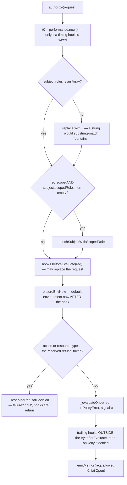
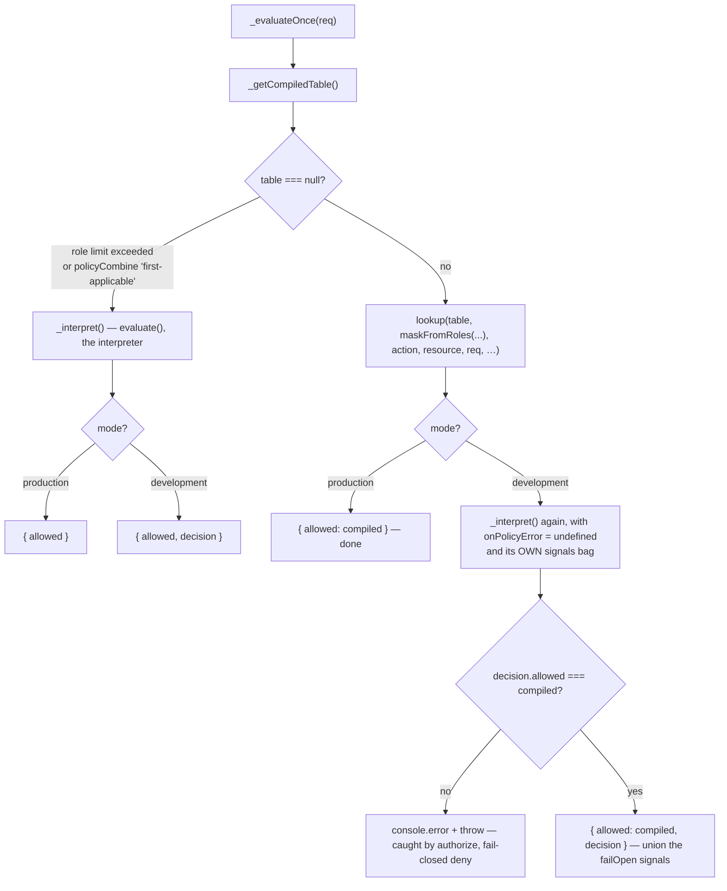
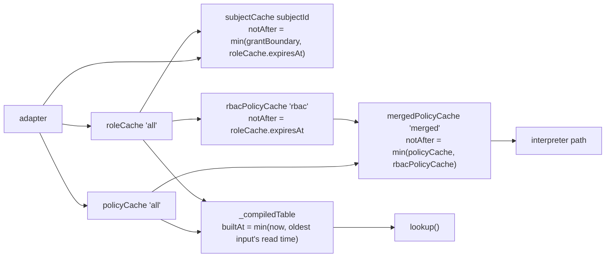

# Core: the engine

`src/core/engine/` is the runtime every authorization question goes through.
It owns the public `IamEngine` class, the five caches in front of the adapter,
the compiled lookup table and its rebuild lifecycle, the hook bus, and the
fail-closed contract. This document covers the engine's own surface — every
config option, every decision method, what each mode actually does differently,
and every place the engine denies rather than throws. The table's internal
layout (wildcard buckets, role bitmasks, `CompiledTable` field by field) lives
in [`compiled-engine-explained.md`](../compiled-engine-explained.md) and is
linked, not repeated.

---

## 1. File map

| File | Lines | Owns |
| --- | --- | --- |
| `engine.ts` | 1493 | The `IamEngine` class: config validation, mode branch, verdict path, hooks, the compiled-table lifecycle |
| `engine.types.ts` | 699 | `IamEngineTypes` — `IConfig`, `IHooks`, `IAdmin`, `IInvalidator`, `IMutationEvent`, `IHealth`. Type-only |
| `engine.libs.ts` | 785 | `enrichSubjectWithScopedRoles`, `scopeCovers`/`scopeAncestors`, `ensureEnvNow`, single-flight helpers, `createAdmin` |
| `engine.loaders.ts` | 305 | `loadPolicies`, `loadRoles`, `loadRbacPolicy`, `loadAllPolicies`, `resolveSubject` — cache-fronted adapter reads |
| `engine.invalidation.ts` | 210 | `invalidateAll/Policies/Roles/Subject`, `applyInvalidateEvent`, the cache + in-flight bags |
| `engine.bound.ts` | 151 | `withTransaction`'s facade: fresh caches, buffered invalidation, buffered mutation events |
| `engine.lifecycle.ts` | 86 | `preloadEngine`, `runHealthCheck`, `disposeInvalidator` |
| `engine.hooks.ts` | 76 | `safeHookCall`, `emitMetrics` — both swallow user throws |
| `engine.stats.ts` | 80 | `statsSnapshot`, `resetStats`, `aggregateCacheHitRate` |
| `compiled/compiled.compile.ts` | 326 | `compileTable()` — the bake |
| `compiled/compiled.lookup.ts` | 260 | `lookup()`, `abacFlatVote`, `rbacVote`, `evaluateDynamicCell` — request time |
| `compiled/compiled.types.ts` | 101 | `CompiledTable`, `CellKind`, `DynamicPolicyGroup`, `RbacRuleGroup` |
| `compiled/compiled.errors.ts` | 64 | `IamRoleLimitExceededError`, `IamPolicyCompileError` |

The public barrel (`src/core/engine/index.ts`) exports exactly five names:

```ts
export { IamEngine, iamEngine, iamFlushSharedCaches } from './engine'
export type { Bound } from './engine.bound'
export { scopeAncestors as iamScopeAncestors, scopeCovers as iamScopeCovers } from './engine.libs'
export type { IamEngineTypes } from './engine.types'
```

---

## 2. Construction

```ts
import { IamEngine } from '@gentleduck/iam'

const engine = new IamEngine({
  adapter,
  mode: 'production',
  defaultEffect: 'deny',
  cacheTTL: 60,
})
```

`iamEngine(config)` (`engine.ts:1483`) is the same thing for callers who prefer
a function. It forwards the config unchanged and propagates every construction
throw — it does not swallow them.

### 2.1 Every option

All fields live on `IamEngineTypes.IConfig` (`engine.types.ts:482`).

| Option | Default | What it changes at runtime |
| --- | --- | --- |
| `adapter` | *(required)* | The store every loader reads. Also the only thing `withTransaction` swaps. |
| `mode` | `'production'` | `'production'` returns bare booleans and runs only the compiled table. `'development'` returns `IDecision`, runs the interpreter alongside the table, and enables `explain()`. See §4. The constructor refuses any other value; see §2.2. |
| `defaultEffect` | `'deny'` | The vote cast when a source is applicable but no rule fired. `'allow'` requires `allowFailOpen`. |
| `allowFailOpen` | `false` | Opt-in gate for `defaultEffect: 'allow'`, in **both** modes. |
| `policyCombine` | `'and'` | Cross-policy fold. `'and'` → every applicable vote must allow; `'allow-overrides'` → any allow wins; `'first-applicable'` → interpreter only. |
| `cacheTTL` | `60` (seconds) | TTL for all five LRU caches *and* the compiled table. `0` means "do not cache": every LRU entry is expired the moment it is written, and the compiled table is rebuilt on every request. Non-finite or negative values throw from `IamLRUCache`'s constructor. |
| `maxCacheSize` | `1000` | Subject-cache capacity only. The other four caches are hard-coded single-entry (`engine.ts:279-282`). Non-finite or `< 1` throws from `IamLRUCache`'s constructor. |
| `maxPolicies` | `10_000` | Ceiling on `listPolicies()` results. Over-cap throws at cache fill, not per request. |
| `maxRoles` | `10_000` | Same for `listRoles()`. |
| `adapterTimeoutMs` | `5_000` | Per-adapter-call timeout, enforced with a fresh `AbortController` per call. Covers the decision path *and* every `engine.admin` call, read or write; a write cannot take the signal, so the timeout frees the caller while the write runs on. `0` disables. The transaction-bound admin is deliberately unbounded — see §5.4. |
| `hookTimeoutMs` | `5_000` | Bound on a promise a hook returns. `0` waits indefinitely. A `beforeEvaluate` that times out fails the evaluation through `onError` and denies; every other hook is logged and left running while the call returns. A hook that returns synchronously starts no timer. Applies on the transaction path too, where `pending.flush()` drains `onMutation`. |
| `maxConcurrentSubjectLoads` | `512` | Ceiling on concurrent *distinct, never-before-cached* subject loads. `0` restores unbounded. |
| `hooks` | `{}` | `beforeEvaluate`, `afterEvaluate`, `onDeny`, `onError`, `onPolicyError`, `onMetrics`, `onMutation`. See §8. |
| `invalidator` | *(none)* | Cross-instance pub/sub. Constructor-only; use `setInvalidator` to attach later. |
| `scopeMode` | `'flat'` | `'hierarchical'` makes a dotted scope a path: a grant at `org-1` reaches `org-1.team-2.repo-3`. Applies to **both** kinds of scope — the one an assignment carries and the one a role/permission declares. |
| `scopeCombine` | `'union'` | Under `'hierarchical'` only. `'union'` ORs every matching ancestor level; `'override'` applies only the most specific matching level. |

Two defaults are worth flagging because they changed and the change is visible
in behaviour, not just in types.

`mode` defaults to `'production'`. It used to default to `'development'`, so a
consumer who never set it ran a production authorization engine that allocated a
full `IDecision` on every call; rich objects are now opt-in
(`engine.types.ts:499-514`, CHANGELOG entry `8c131a4`).

`maxConcurrentSubjectLoads` defaults to `512`, not `0`. The comment on
`DEFAULT_MAX_CONCURRENT_SUBJECT_LOADS` (`engine.ts:31-49`) explains why: at `0`
the cap was "a safety limit that protected nobody: the cold-cache thundering
herd its own documentation describes was permitted by default, and only an
operator who had already read that paragraph was protected from it."

### 2.2 What the constructor refuses

Eleven checks run in the constructor body, plus two more inside `IamLRUCache`'s
own constructor when the caches are built. All of them are boot-time, so a bad
config is a failed start rather than a surprise on the first request.

| Condition | Throws |
| --- | --- |
| `mode` not in `VALID_MODES` | `Error: unknown mode …` |
| `policyCombine` not in `VALID_POLICY_COMBINES` | `Error: unknown policyCombine …` |
| `mode: 'production'` + `policyCombine: 'first-applicable'` | `Error: … requires mode 'development'` |
| `defaultEffect: 'allow'` without `allowFailOpen: true` | `Error: … is a fail-open footgun` |
| `maxPolicies` / `maxRoles` non-finite or `< 1` | `RangeError` |
| `adapterTimeoutMs` non-finite or `< 0` | `RangeError` |
| `hookTimeoutMs` non-finite or `< 0` | `RangeError` |
| `maxConcurrentSubjectLoads` non-finite, or neither `0` nor `>= 1` | `RangeError` |
| `cacheTTL` non-finite or negative | `RangeError` from `IamLRUCache` (`ttlMs must be a finite number >= 0`) |
| `maxCacheSize` non-finite or `< 1` | `RangeError` from `IamLRUCache` (`maxSize must be a finite number >= 1`) |
| `scopeMode` not in `VALID_SCOPE_MODES` | `Error: unknown scopeMode …` |
| `scopeCombine` not in `VALID_SCOPE_COMBINES` | `Error: unknown scopeCombine …` |

The `policyCombine` guard exists because both evaluators branch on `'and'` and
`'allow-overrides'` and fall through to `first-applicable` — the most permissive
of the three — for anything else. A typo, or a value read from a config file
rather than written in TypeScript, silently lost deny-overrides semantics. A
guide in this repo once recommended `policyCombine: 'or'`, which turned a deny
into an allow for anyone who followed it (`policy-combine-validation.test.ts`).

`scopeMode` and `scopeCombine` are guarded for exactly the same reason, and
`scopeCombine` is the sharper of the two. Both branch on one literal and fall
through on anything else: `scopeMode` falls through to `'flat'`, which is
narrower, but `scopeCombine` falls through to `'union'`, which is **wider**. A
subject holding `admin` at `org-1` and `viewer` at `org-1.team-a`, checked at
`org-1.team-a`, gets `['viewer']` under `'override'` and `['admin', 'viewer']`
under anything that is not the exact string `'override'`. One mistyped
character in a config file was a privilege escalation
(`scope-config-guards.test.ts`).

`mode` is guarded for the same reason, and its fall-through is the one an
operator is least likely to notice. Every site compares `this._mode ===
'production'`, so `'prodution'` selects development everywhere at once:
`check()` stops answering a bare boolean and answers an `IDecision` instead —
an object that is **truthy even when it denies**, so `if (await
engine.check(...))` admits every deny at the call site while TypeScript still
types the result `boolean`. `explain()` also becomes callable, handing policy
ids, rule ids and condition values to whatever calls it, and the
`mode: 'production'` + `policyCombine: 'first-applicable'` check below is
bypassed, because the typo is not the string it compares against
(`mode-config-guard.test.ts`).

The non-finite guards exist for the same class of reason: `NaN > x` is always
false, so a `NaN` limit silently disables the bound rather than failing.

With `defaultEffect: 'allow'` accepted, the constructor also emits an
unconditional `console.warn` naming the fail-open configuration, "so an
operator grep'ing logs for fail-open configurations always finds it."

### 2.3 `TMode` is a type argument, not a setting

```ts
// Runs in PRODUCTION. `check()` is typed to return IDecision and returns a boolean.
const e = new IamEngine<A, R, Ro, S, 'development'>({ adapter })
```

`IConfig.mode` is optional, so naming `TMode` in the type arguments does not set
it. Reading `.allowed` off the boolean yields `undefined` — falsy — so the
mismatch shows up as assertions that quietly pass rather than as a crash. Four
E2E suites were written that way. Making `mode` required whenever `TMode`
excludes `'production'` needs a conditional type on the constructor parameter
that TypeScript cannot then carry through `withTransaction`'s config spread, so
the behaviour is pinned by `mode-type-argument-does-not-set-mode.test.ts`
instead. **Always pass `mode` explicitly.**

The constructor cannot catch that mismatch — `mode` is absent, not wrong, and
absent is a documented default. It does catch the adjacent mistake: a `mode`
that is present and misspelled is refused at boot (§2.2).

---

## 3. The decision API

| Method | Signature | Returns | Invalid `subjectId` |
| --- | --- | --- | --- |
| `can` | `(subjectId, action, resource, environment?, scope?)` | `Promise<boolean>` — always, in both modes | `false` (silent, no hook) |
| `check` | `(subjectId, action, resource, environment?, scope?)` | `Promise<ModeResult<TMode>>` — `boolean` in production, `IDecision` in development | `false` / `IDecision{failure:'input'}` |
| `authorize` | `(request: IAccessRequest)` | `Promise<ModeResult<TMode>>` | n/a — takes a resolved `ISubject` |
| `permissions` | `(subjectId, checks[], environment?, opts?)` | `Promise<ModePermissionMap<TMode,…>>` | **throws** |
| `explain` | `(subjectId, action, resource, environment?, scope?)` | `Promise<Explain.IResult>` | **throws** |
| `getEffectiveRoles` | `(subjectId, scope?)` | `Promise<readonly TRole[]>` | `[]` |

`subjectId` is valid when it is a string of length 1–1024. The cap is not
cosmetic: it bounds URL length on the HTTP adapter, key length on Redis, and
JSON column size on SQL.

### 3.1 Which one to call

`can` when you want a boolean and nothing else. It is the only method whose
return type does not move with `mode`, which makes it the right choice in shared
code that must compile against either mode.

`check` when you are in development and want the reason, the rule and the
policy id. In production it is `can` with a wider return type.

`authorize` when you already hold a resolved `ISubject` — a request middleware
that resolved the subject once for several checks, or a caller injecting a
synthetic subject. It skips `resolveSubject` entirely; `can`/`check` are thin
wrappers that resolve and then call it.

`permissions` for a UI gate: one subject, many `(action, resource)` pairs. It
resolves the subject and warms the merged policy cache once, then evaluates each
check through the same `_evaluateOnce` the single path uses.

`explain` for a human reading a denial. Development only.

### 3.2 `authorize`, step by step

`engine.ts:751`. The order matters and several steps exist because of a specific
past failure.



`ensureEnvNow` runs *after* `beforeEvaluate` so a hook-pinned clock (tests,
replay) survives while an ordinary request still gets a real one. It returns the
request object unchanged when `environment.now` is already set — including
`now: 0` — and only allocates on the inject path (`engine.libs.ts:26`). This is
what makes `before`/`after` operators and `$environment.now` work without the
caller threading a clock through every call (`engine-temporal-now.test.ts`).

The trailing hook block runs **outside** the evaluation `try`. A throwing
`afterEvaluate` must not be caught by the catch that rewrites results into a
deny; each hook is individually wrapped by `_safeHookCall` so a bug in one does
not suppress the others.

### 3.3 The reserved refusal token

Commit `3de42982` moved a refusal that used to live in the HTTP helpers into the
engine. The framework adapters turn an HTTP request into an `(action, resource)`
pair, and some requests cannot be mapped — an unmapped method, or a path this
layer and the router downstream would read differently. Both cases were
expressed by handing the engine the sentinel *string* `'unknown'` and relying on
it to match no policy.

That was never true. `'*'` matches every string, so `.on('*').of('*')` — the
ordinary shape of an admin role — turned the refusal into an allow, on exactly
the requests built to be denied. The traversal guard that refuses to resolve
`/posts/../admin/secret` handed the engine `type: 'unknown'`, and any subject
with a wildcard grant was allowed.

```ts
// src/shared/reserved.ts
export const IAM_RESERVED_REFUSAL = 'unknown'
export function iamIsReservedRefusal(value: unknown): boolean {
  return value === IAM_RESERVED_REFUSAL
}
```

The check runs in three places, and the three agree by construction:
`authorize` (`engine.ts:795`), the separate `permissions` loop
(`engine.ts:1238`), and `explainEvaluation` (`explain.ts:55`). All three produce
`failure: 'input'` and the same reason string. `authorize` and `permissions`
refuse before consulting any policy; `explainEvaluation` collects the traces
first and then overrides the summary, so a reader can still see which wildcard
rule *would* have matched. It is placed **inside**
`authorize`'s try so `onDeny` / `afterEvaluate` / `onMetrics` see the denial like
any other. The cost of reserving the token is that a resource type or action
genuinely named `'unknown'` can no longer be granted.

### 3.4 `permissions`

```ts
const map = await engine.permissions('u1', [
  { action: 'read', resource: 'post' },
  { action: 'update', resource: 'post', resourceId: 'p1' },
  { action: 'delete', resource: 'post', scope: 'org-1' },
], undefined, { telemetry: false })
```

Keys come from `iamBuildPermissionKey(action, resource, resourceId, scope)`:
`[@scope:]action:resource[:resourceId]`, with `:`, `\` and a leading `@`
backslash-escaped inside each segment. The `@` marker is what makes a
three-segment key unambiguous — without it `('read','doc','42')` and
`('doc','42',undefined,'read')` both produced `read:doc:42` and one check
answered for the other. An empty-string scope is a distinct segment, not an
absent one (`engine-permissions-key-collision.test.ts`).

Behaviour worth knowing:

- **Batches over 1024 checks throw.** Unlike `can`/`check`, an invalid batch is a
  caller bug, not a fail-closed deny.
- **The policy load is awaited up front**, alongside `resolveSubject`, so a load
  failure fails the whole batch closed instead of surfacing on whichever check
  happened to run first. Nothing binds the result — `_evaluateOnce` reads it back
  from the cache this call warmed.
- **Scoped enrichment is memoised per scope** (`enrichedByScope`), so N checks
  sharing a scope rebuild the merged role list once.
- **`{ telemetry: false }`** skips the per-check `onMetrics` emission for hot UI
  gates (roughly 2× throughput). `afterEvaluate`/`onDeny` still fire.
- **A per-check throw** sets that key to `false`, fires `onError` with a request
  built for that check, and continues with the rest of the batch.
- **The verdict is only as precise as the check.** A check is evaluated against
  `{ type, id, attributes }`, and `attributes` defaults to `{}` — so a rule
  conditioned on `resource.attributes.*` sees an instance that has none. A deny
  written that way does not fire, and the key can read `true` where `can()` on
  the loaded row answers `false`. Pass the row's attributes on the check to get
  the same answer `can()` gives (`permission-map-resource-attributes.test.ts`).

### 3.5 `explain`

```ts
async explain(
  this: IamEngine<TAction, TResource, TRole, TScope, 'development'>,
  subjectId, action, resource, environment?, scope?
): Promise<Explain.IResult>
```

The `this` parameter is what makes `explain()` a type error on a
production-typed engine; the runtime check throws as well. `../explain` is
imported lazily so production bundles never pull the explain chunk in.

`explain` applies `beforeEvaluate` (it changes the evaluation) but fires none of
`afterEvaluate` / `onDeny` / `onError` — it is read-only. It also runs the
**interpreter only**, not the compiled table, and reports `originalRoles` plus
`scopedRolesApplied` alongside the decision.

Commit `8a2f5146` closed two drifts between `explain()` and `can()`, both from a
hand-copy of the decision logic: `traceGroup` collapsed an empty group and an
unrecognised key to the same `false`, so explain reported a denial for a rule
`can()` allowed; and `explainEvaluation` had no `try` at all where `evaluate`
absorbs a throwing rule as Indeterminate, so an unknown operator or a
`conditions: {all: null}` raised out of the caller — a diagnostic failing on
precisely the input it exists to explain. The fallback now delegates to
`evalConditionGroup` and records the failure as `conditionError` on the rule
trace, with the policy casting the same Indeterminate vote.

Five more drifts were closed once `verdict-differential.test.ts` started
comparing `explain().decision.allowed` against `check()` on the same catalogs —
until then nothing compared the third evaluator to a verdict at all. `explain`
reported an **allow** where `can()` denied for an unrecognised `rule.effect`
(its combiner matches `'deny'` and `'allow'` positively, so a mistyped one voted
for neither) and for a non-finite `rule.priority` (it never ranked the rule that
carried one); an unknown `algorithm` fell off the end of `applyCombiner`'s
switch and raised `Cannot destructure property 'effect'` out of `explain()`
itself. In the other direction it reported a **deny** where `can()` allowed,
because it evaluated the conditions of rules that do not target the request —
`ruleApplies` never does — and because it had no counterpart to
`rulesAbstainOnThrow`, the rule that lets a throwing permission abstain inside
the allow-only RBAC union.

The shape of the fix is the one the decision path already uses: `policyRefusal`
runs `evaluate`'s policy-level refusals in the same order, behind the same
rule-target test, and reports them as the Indeterminate vote `conditionError`
already produced. `tracePolicy` answers `defaultEffect` directly when no rule
matched, so `applyCombiner` is never reached with an algorithm it has no arm
for, and `policyTargetsMatch` is gone — `policyApplies` is the one
implementation now.

### 3.6 `getEffectiveRoles`

```ts
const roles = await engine.getEffectiveRoles('u1', 'org-1')
```

Assigned roles closed over `inherits`, plus scoped assignments matching `scope`
— the same merge `can`/`check` do internally, served from the same subject
cache. Note the asymmetry with `can`/`check`: an invalid `subjectId` returns
`[]`, but **an adapter failure rejects**. There is no try/catch around
`_resolveSubject` here (`engine.ts:985`, and `explain` at `engine.ts:1080` is
the same — those two are the read methods that reject rather than deny).
Callers wiring either into a UI need their own catch.

Unlike `can`/`check`/`explain`, `getEffectiveRoles` calls
`enrichSubjectWithScopedRoles` unconditionally; the function itself returns the
subject unchanged when `scope` is absent or nothing matches.

---

## 4. Development vs production: one verdict, two amounts of provenance

This is the part that most often surprises. **Both modes get their verdict from
the compiled table.** The modes differ in whether a second evaluator runs
alongside it.



Why it is arranged this way, from the docblock on `_evaluateOnce`
(`engine.ts:480-503`):

> Production evaluated through the compiled table and development through the
> interpreter, so any disagreement between the two was invisible until it
> reached production — and it reached production as an *allow* against a dev run
> that denied. […] Now the compiled table produces the verdict in both modes.
> Development additionally runs the interpreter, because the table cannot
> explain itself: `CONST_ALLOW`/`CONST_DENY` cells are a single `kind` byte and
> `allow` is a raw bitmask, so policy identity is erased at compile time — that
> erasure is the optimisation.

Three details of the development run that are easy to get wrong:

1. **The explanatory run is observationally silent.** It is passed
   `onPolicyError: undefined`, because the authoritative run above already
   reported. Without that, a handler wired to an alerting pipeline pages twice
   for one bad policy, in development only. This is safe precisely because
   `onPolicyError` is notification-only: `safeEval`'s control flow is identical
   with or without a handler attached.
2. **It gets its own `signals` bag**, so a `failOpen` seen only by the
   explanatory run cannot rewrite what the authoritative path reported. Once the
   two verdicts agree, the signals take the union.
3. **A disagreement throws.** It means duck-iam has a bug. `authorize()` catches
   it and answers a generic fail-closed `'Evaluation error'` deny, which is the
   right verdict and a useless diagnostic — so the message also goes to
   `console.error`, unbounded on purpose. `unified-verdict-path.test.ts` forces a
   divergence by mocking `lookup` and pins both directions of the message.

Production does **not** run the interpreter and therefore cannot detect a
disagreement. That asymmetry is deliberate: the second evaluator is the cost the
fast path exists to avoid, and development is where the divergence is meant to
be caught.

### What you actually give up in production

| | development | production |
| --- | --- | --- |
| `check()` return | `IDecision` | `boolean` |
| `decision.reason` | interpreter's real reason | `'Allowed/Denied (production mode; compiled table does not retain policy identity)'` |
| `decision.policy` / `decision.rule` | present | `undefined` |
| `decision.failure` | `'input'` / `'resolution'` / `'evaluation'` | no object to carry it — use `onError` |
| `explain()` | available | throws |
| `afterEvaluate` / `onDeny` | fire, with full decision | **fire**, with a synthesised verdict-only decision |
| `onMetrics` / `onPolicyError` | fire | fire |
| Table/interpreter cross-check | on | off |

`afterEvaluate` and `onDeny` used to be development-only, "which put a denial
log — a production concern if there is one — out of reach exactly where
operators need it." The verdict-only decision is built by `_verdictOnlyDecision`
(`engine.ts:896`) and **only when one of the two hooks is wired**, so an install
that leaves them unset still pays no allocation. `permissions()` fires the same
two hooks per check, in both modes, from the same synthesised decision.

---

## 5. Fail-closed inventory

The rule: an authorization question is answered `false`; a programming or
configuration mistake throws.

### 5.1 Denies (never surface as a rejection)

| Situation | Result | Hooks |
| --- | --- | --- |
| `can()` / `check()` with a malformed `subjectId` | `false` / `IDecision{failure:'input', reason:'invalid subjectId'}` | none |
| `can()` / `check()` subject resolution throws (adapter down, `listRoles` cap, load shed) | `false` / `IDecision{failure:'resolution'}` | `onError` |
| Anything thrown inside `authorize`'s try | `false` / `IDecision{failure:'evaluation', reason:'Evaluation error'}` | `onError`, `onMetrics`. **Not** `afterEvaluate`/`onDeny` |
| Action or resource type is the reserved refusal token | `false` / `IDecision{failure:'input'}` | `afterEvaluate`, `onDeny`, `onMetrics` |
| `permissions()` subject or policy load fails | every key `false` | `onError` once |
| `permissions()` one check throws | that key `false`, batch continues | `onError`, `onMetrics` |
| A policy throws during evaluation | Indeterminate: deny if the **policy** carries any deny rule, else the `defaultEffect` vote | `onPolicyError` |
| A policy's `targets.roles` names a role nothing defines | **not a deny** — the policy is NotApplicable for every request, which retires it | `onPolicyError` once per pair, else one `console.warn` |
| The compiled table cannot be built (malformed policy) | `false` for every request until fixed | `onPolicyError` for `IamPolicyCompileError`; one `console.error` otherwise |
| Development table/interpreter disagreement | `false` + `console.error` | `onError` |
| Role count exceeds 32 | **not a deny** — falls back to the interpreter, one `console.warn`, reported on `healthCheck()` | none |

The Indeterminate contract is the load-bearing one. From `evaluateDynamicCell`'s
catch (`compiled.lookup.ts:46-53`):

> An error is Indeterminate, not NotApplicable. The deny check is asked of the
> whole *policy*, not of `group.rules` — a group holds only the rules shaped for
> this action/resource cell, so a policy whose deny rule targets a different cell
> reads as allow-only here and the vote is dropped. […] asking anything narrower
> is what let production allow what development denied.

`engine-eval-error-fails-closed.test.ts` is the end-to-end guard: a deny rule
whose `matches` operator throws on an oversized user-agent header must still
deny, in both modes, *including on a fail-open engine* — which is the
discriminating case, since abstaining there would yield an allow.

The one deliberate exception is RBAC. `rbacVote` catches **per group**, not
around the scan, because scoped/conditioned role grants are independent grants
from separate roles that only look like one policy because `rolesToPolicy` folds
them into a single allow-only `__rbac__`. Wrapping the whole loop "let one
unreadable permission delete every unrelated grant in the cell, so production
denied what the interpreter allowed." Abstaining per grant is safe there
precisely because role permissions are allow-only — there is no deny to lose.

### 5.2 Throws

| Call | Throws when |
| --- | --- |
| `new IamEngine(...)` | Any of the config guards in §2.2 |
| `setInvalidator(x)` | `x` is neither `null` nor an object with `publish` **and** `subscribe` methods (`TypeError`) |
| `explain()` | Engine is in production mode, `subjectId` is malformed, or the adapter read fails (no catch on this path either) |
| `permissions()` | `subjectId` malformed, or `checks.length > 1024` |
| `getEffectiveRoles()` | The adapter read fails (no catch on this path) |
| `withTransaction(client)` | The adapter has no `withClient` |
| `engine.admin.*` | Input validation (see §9), validator rejection, adapter errors |
| `preload()` | The policy load fails, the compile fails for any reason other than the role limit, or `{ validator: true }` finds an invalid stored policy or role |

### 5.3 The fail-open signal

`lookup` and `evaluate` both thread a `signals: { failOpen?: boolean }` bag,
raised only when the verdict is **allow** and the vote carrying that allow came
from the `defaultEffect` fallback rather than a rule. Under `allow-overrides`
that is the allowing vote; under `and` it is any of them. It is never raised on
a deny.

The value reaches `onMetrics` as `IMetricsEvent.failOpen`. Chart it: it is how
you detect silent policy-set breakage — a broken adapter, a mass deletion,
ReDoS-dropped rules — that the boolean verdict alone hides. Production carries
its own copy of the vote logic through `abacFlatVote`/`rbacVote`/
`evaluateDynamicCell`, and `failopen-metric-parity.test.ts` pins that the two
modes report the same flag for the same policy set.

### 5.4 A wedged adapter does not wedge the caller

`adapterTimeoutMs` bounds every adapter call the engine makes, on both sides of
the API. The decision path fails closed: `can()` answers `false`. `engine.admin`
rejects instead, with the call named — `admin.listPolicies timed out after
5000ms` — because an admin operation has no safe default answer and an operator
needs to know the write did not land.

Two consequences follow from the adapter contract.

A **read** takes `IReadOptions.signal`, so the abort reaches an adapter that
honours it and the query is cancelled. A **write** takes `IActorOptions`, which
has no signal, so the timeout frees the caller while the write runs on: a
rejection means "not confirmed", not "not applied". Every admin write is
idempotent by id, so a retry converges.

Inside a transaction the admin is unbounded on purpose. `createAdmin` takes
`withTimeout` as an option and `engine.transaction` does not pass it: aborting a
statement mid-transaction leaves the transaction for the caller to roll back,
and the transaction's own lifetime already bounds it.
`core/engine/__tests__/admin-adapter-timeout.test.ts` runs all seventeen admin
operations against an adapter that never answers, and pins the exclusion so it
stays a decision.

---

## 6. The caches

Six caches, five of them `IamLRUCache` instances built in the constructor
(`engine.ts:279-283`), plus the compiled table which is a plain field.

| Cache | Key | Capacity | Expires at | Filled by |
| --- | --- | --- | --- | --- |
| `_policyCache` | `'all'` | 1 | `now + cacheTTL` | `loadPolicies` |
| `_roleCache` | `'all'` | 1 | `now + cacheTTL` | `loadRoles` |
| `_rbacPolicyCache` | `'rbac'` | 1 | `min(now + cacheTTL, roleCache.expiresAt('all'))` | `loadRbacPolicy` |
| `_mergedPolicyCache` | `'merged'` | 1 | `min(now + cacheTTL, policyCache.expiresAt, rbacPolicyCache.expiresAt)` | `loadAllPolicies` |
| `_subjectCache` | `subjectId` | `maxCacheSize` | `min(now + cacheTTL, grantBoundary, roleCache.expiresAt('all'))` | `resolveSubject` |
| `_compiledTable` | — | 1 | `_derivedBuiltAt + cacheTTL` | `_rebuildCompiledTable` |



### 6.1 A derived cache is never fresher than its oldest input

This is the invariant that four separate fixes converge on. `IamLRUCache.set`
takes an optional `notAfter`:

```ts
set(key: string, value: V, notAfter?: number): void {
  this._map.delete(key)
  const now = Date.now()
  let expiresAt = now + this._ttl
  if (notAfter !== undefined && Number.isFinite(notAfter) && notAfter < expiresAt) {
    if (notAfter <= now) return      // already past — store nothing at all
    expiresAt = notAfter
  }
  …
}
```

`notAfter` only ever *shortens* an entry. A non-finite value is ignored; a value
already in the past stores nothing. `expiresAt(key)` reads a live entry's expiry
without touching LRU order or the hit/miss counters — "this is bookkeeping about
an entry, not a read of it, and counting it would make the stats lie."

The compiled table has no `notAfter`, so it computes the same thing itself.
`_derivedBuiltAt` (`engine.ts:686`) stamps the table with **the moment its
oldest input was read**, not `Date.now()`:

```ts
const oldestExpiry = Math.min(
  deps.roleCache.expiresAt('all') ?? Number.POSITIVE_INFINITY,
  deps.policyCache.expiresAt('all') ?? Number.POSITIVE_INFINITY,
)
if (!Number.isFinite(oldestExpiry)) return now
return Math.min(now, oldestExpiry - this._cacheTTL)
```

The two clocks separate whenever something nulls the table *without* clearing
`roleCache` — which is exactly what `savePolicy`, `deletePolicy` and an inbound
`{kind: 'policies'}` event all do. Measured at `cacheTTL: 60`: a revoke written
at t=1s still answered allow at t=111s, converging at t=119s. An input with no
cache entry imposes no cap, because it was read live and so is as fresh as now.
`engine-compiled-table-ttl.test.ts` covers both directions in both modes,
including the counterweight — a table built from genuinely fresh inputs must
keep its whole TTL.

The fourth consumer is the subject entry, and it is the one that reads least
like a derived cache. `resolveSubject` stores `{id, roles, scopedRoles,
attributes}`, and `attributes` really are the subject's own — but `roles` is
`resolveEffectiveRoles(assigned, snapshot)` and `scopedRoles` closes over
`inherits` the same way, so both halves are as old as the role snapshot they
were resolved against. Only the grant boundary used to cap the entry, and the
boundary describes the *assignment* rows, not the role graph. Each entry is
written at its own moment, so one written with ten seconds left on the snapshot
took a fresh sixty: measured at the default `cacheTTL`, a subject resolved at
t=50s still held a role's inherited permission at t=61s, eleven seconds after
the engine had already re-read the role graph without that edge and was
answering deny for every subject resolved since. Capping the entry at
`min(grantBoundary, roleCache.expiresAt('all'))` costs nothing when the snapshot
is fresh, since the two caps are then the same instant.
`subject-cache-vs-role-snapshot.test.ts` covers it, including the counterweight
that the tighter grant boundary still wins.

### 6.2 `entries()` and `get()` agree at the expiry millisecond

`expiresAt` is an exclusive upper bound everywhere in this package: a grant is
inactive at the exact millisecond it expires. `IamLRUCache.get` uses `>=`, and
`entries()` was fixed to match:

```ts
*entries(): IterableIterator<[string, V]> {
  const now = Date.now()
  for (const [key, entry] of this._map) {
    if (now >= entry.expiresAt) continue   // was `>`
    yield [key, entry.value]
  }
}
```

Under `>` the iterator yielded an entry the reader could not then fetch — one
millisecond wide, and only visible to whoever trusted the iterator's
"non-expired" claim. The current caller (`invalidateRoles`'s narrowed sweep)
evicts rather than serves, so the disagreement cost nothing yet; it is the next
caller that would have paid.

### 6.3 Time-boxed grants: `getSubjectGrantBoundary`

An adapter may implement the optional `getSubjectGrantBoundary(subjectId, opts)`
returning "the next instant this subject's grants change", or `null`. The
drizzle adapter computes it as `min(startsAt, expiresAt)` over the future.

Without it, a 30-second break-glass grant under the default 60-second TTL kept
granting for 90 seconds — the store had dropped it, the cache had not. The
boundary rides along in the same `Promise.all` as the reads it describes
(`engine.loaders.ts`), because asking after the fact would add a round trip to
every cold subject.

It is **advisory**. Every way a store can get it wrong lands on "cache less",
never on "grant longer" and never on "the subject is now undecidable":

| Boundary returned | Effect |
| --- | --- |
| A finite instant before `now + cacheTTL` | Entry capped there |
| A finite instant after the TTL | Ignored — `cacheTTL` is still the ceiling |
| `null` | Full TTL. Means "nothing changes for a while" |
| `NaN`, `±Infinity` | Ignored, full TTL |
| A bound already past (including `0`, the epoch) | Nothing is cached; next call re-reads |
| The method **throws** | `cacheable = false`: the subject is resolved but not cached at all, plus one `console.warn` naming the subject and the method |

The throw case is the one to internalise. A boundary the store could not produce
is not a boundary of `null` — treating it as one buys the entry a full TTL,
which is exactly the stale allow the boundary exists to prevent. The window is
still enforced by the read itself; only the caching is lost.
`grant-expiry-vs-cache.test.ts` covers all six rows plus the mirror case that
costs availability rather than safety: a scheduled grant cached as *absent* must
not stay absent past its `startsAt`.

### 6.4 Invalidation

The `cache` facet (`engine.ts:173`) is the public surface. Every method takes
`{ broadcast?: boolean }`.

| Call | Drops | Nulls the table | Publishes |
| --- | --- | --- | --- |
| `cache.invalidate()` | every cache + every in-flight slot | yes, `gen++` | `{kind:'all'}` |
| `cache.invalidatePolicies()` | `policyCache`, `mergedPolicyCache`, their slots | yes, `gen++` | `{kind:'policies'}` |
| `cache.invalidateRoles(roleId?)` | `roleCache`, `rbacPolicyCache`, `mergedPolicyCache`, their slots, **all** subject in-flight slots, and either the whole `subjectCache` or just the subjects whose roles reach `roleId` | yes, `gen++` | `{kind:'roles', roleId}` |
| `cache.invalidateSubject(id)` | that subject's cache entry and in-flight slot | **no** | `{kind:'subject', subjectId}` |

`invalidateSubject` leaves the table alone on purpose: subject data is not
compiled into it.

Two ids are validated softly. A `subjectId` that is not a sane string is
*ignored* rather than rejected, and an unusable `roleId` degrades to `undefined`
(clear-all) rather than throwing — "this is a cache eviction, and the id may
have arrived from another process over the invalidator, where refusing it loudly
would be worse than doing nothing."

The `roleId` narrows the **local `subjectCache` sweep**: absent, the whole cache
is cleared; present, the sweep drops every subject whose `roles` or `scopedRoles`
name that role *or name a role whose `inherits` chain reaches it*, walked over
the cached role list read just before it is cleared. With no cached role list
there is nothing to walk, so the whole `subjectCache` goes. The published event
carries the `roleId` either way, so a replica makes the same choice this instance
did.

The inheritance half is not decoration. A cached subject's `roles` are the
inheritance **closure** of its assignments, and `resolveEffectiveRoles` drops an
inherited id with no definition. So saving a role that an assigned role inherits
— typically creating one that was dangling — adds it to closures that never
contained it, and a sweep matching on the role alone left those subjects on the
old answer for a full TTL: a grant that did not arrive, and, when the new role is
what a policy's `targets.roles` names, a deny that did not either
(`role-created-after-subject-cached.test.ts`).

**`invalidateRoles` clears every subject in-flight slot unconditionally**, even
in the narrowed branch. The narrowed `subjectCache` sweep can inspect a resolved
subject and skip it honestly; an in-flight load has no cache entry yet — that is
what "in flight" means — so the sweep could never reach one. A load that started
before a revoke resolved with the pre-revocation role set afterwards, passed
`runSingleFlightKeyed`'s identity check, and was written with a **full** TTL. The
revoked role stayed live for the whole window
(`invalidate-roles-inflight.test.ts`). The cost of the fix is one redundant
reload of subjects that were mid-flight at the moment of an invalidation.

### 6.5 `{ broadcast: false }`

Every invalidate method republishes to the invalidator unless
`opts.broadcast === false`. Two places pass it:

- **`applyInvalidateEvent`** (`engine.invalidation.ts`) — every branch passes it.
  "Republishing a received event would make each instance echo every other
  instance's evictions, and the traffic grows with the square of the fleet."
- **The transaction-bound admin** (`engine.bound.ts`) — each write drops the
  entry from the transaction-local caches immediately (so a read-after-write
  inside the transaction is correct) while the shared caches only learn about it
  on `pending.flush()`. The local engine has no invalidator anyway; saying so at
  the call site is what makes the intent legible.

Pass it yourself when you are applying an invalidation you already know every
peer has seen. Otherwise leave it off.

### 6.6 The invalidator, and `setInvalidator`

```ts
interface IInvalidator<TRole extends string = string> {
  publish(event: IInvalidateEvent<TRole>): void | Promise<void>
  subscribe(handler: (event: IInvalidateEvent<TRole>) => void): () => void
}
```

Delivery semantics are the implementation's own; at-least-once is enough,
because the invalidate methods are idempotent.

`IConfig.invalidator` is constructor-only, but engines are commonly built at
module import time — before any request-scoped or replica-specific Redis client
exists. `setInvalidator(invalidator | null)` (`engine.ts:368`) closes that gap:

```ts
const engine = new IamEngine({ adapter })   // at import time
// …later, once the client exists
engine.setInvalidator(
  createIamRedisInvalidator({ client: redis, secret: process.env.IAM_INVALIDATOR_SECRET }),
)
```

`createIamRedisInvalidator` takes **one config object**
(`IamRedisInvalidator.IConfig`, `invalidators/redis/index.ts:44`), never
positional arguments: `client` is required and is anything implementing
`publish(channel, message)` / `subscribe(channel, handler)`; `channel`
(defaults to `'duck-iam:invalidate'`), `tenantId`, `secret` and
`onPublishError` are optional. `tenantId` is the supported way to get a
per-tenant channel — it appends `:tenant:<id>` and shape-validates the slug
against `/^[A-Za-z0-9_-]{1,64}$/`. Without `secret` the invalidator falls back
to unsigned envelopes and warns once at construction; anyone with PUBLISH
rights on the channel can then wipe caches.

Three guarantees:

1. **Validated, not trusted.** `isInvalidatorLike` checks for callable `publish`
   and `subscribe` and throws `TypeError` otherwise. A malformed one "would
   otherwise fail later, at the first mutation, as a lost broadcast rather than
   a bad argument."
2. **At most one subscription, ever.** The previous unsubscribe runs first and
   unconditionally, so an exception from the new `subscribe` cannot leave the old
   subscription attached to an invalidator this engine no longer considers
   current.
3. **`null` detaches** and goes back to local-only invalidation.

The constructor routes `config.invalidator` through this same setter, so the
constructor path and the late-attach path validate and subscribe identically. A
`withTransaction` view deliberately has no invalidator of its own and is
unaffected; its buffered invalidations broadcast through the parent on
`pending.flush()`, picking up whatever is attached at flush time.

`dispose()` releases the subscription. Call it when discarding an engine.

### 6.7 Single-flight

Four single-slot flights (`policies`, `roles`, `rbac`, `merged`) plus a keyed map
for subjects. `runSingleFlight` / `runSingleFlightKeyed` (`engine.libs.ts:67`,
`:93`) share one pattern: identity-compare the slot against the pending promise
before writing the cache, so an `invalidate*()` that nulls the slot mid-await
prevents the late resolver from repopulating what was just cleared — and does
not clobber a *newer* in-flight promise for the same key.

### 6.8 `iamFlushSharedCaches()`

```ts
export function iamFlushSharedCaches(): void {
  clearRegexCache()
  clearPathCache()
}
```

Clears the **process-global** regex and dot-path caches — the fallbacks used by
direct `evaluate()` / operator calls and by `explain()`. Every `can()` path uses
the engine's own per-instance `_caches` (`engine.ts:160`), which this does not
touch. It is therefore **not** a multi-tenancy mitigation and needs no periodic
schedule. Multi-tenant deployments instantiate one engine per tenant; each owns
its own regex and path maps and cannot be evicted by hostile-tenant pattern
flooding.

---

## 7. Compile: when, what triggers a rebuild, what a stale table costs

### 7.1 When

`_getCompiledTable()` (`engine.ts:450`) is the single read path. It is reached
from `_evaluateOnce` (so: every `authorize`, `can`, `check`, and every
`permissions` check), from `preload()`, and from `healthCheck()`.

```ts
private async _getCompiledTable(): Promise<CompiledTable | null> {
  if (this._roleLimitExceeded) return null
  if (this._policyCombine === 'first-applicable') return null
  const table = this._compiledTable
  if (table !== null && !this._compiledTableExpired()) return table
  try {
    return await this._rebuildCompiledTable()
  } catch (err) {
    if (!(err instanceof IamRoleLimitExceededError)) throw err
    …fall back to the interpreter, warn once
  }
}
```

`null` means one of exactly two things, and both route the caller to the
interpreter:

- **`policyCombine: 'first-applicable'`.** `lookup()` folds its votes with `some`
  for `'allow-overrides'` and `every` for everything else, so first-applicable
  would arrive there as plain `'and'`. The constructor blocks that combine in
  production, but `_evaluateOnce` takes the table as authoritative in development
  too — so the one mode where the config is legal is the one where its semantics
  is not implemented, and every request the two paths disagree on would be
  answered `'Evaluation error'`. The interpreter implements real XACML
  first-applicable; the whole combine is handed to it.
- **More than 32 roles.** The `allow` mask is a `Uint32Array` and JS wraps shift
  amounts mod 32, so a 33rd role would silently alias role 0's bit.
  `compileTable` throws `IamRoleLimitExceededError`; the engine catches *that
  error specifically*, sets `_roleLimitExceeded`, warns **once** (guarded
  separately from the short-circuit, because concurrent cold callers all reach
  the catch), and drops to the interpreter. `healthCheck()` then reports it —
  see §10.

  The latch is not permanent. `_clearRoleLimitLatch()` (`engine.ts:1398`) resets
  `_roleLimitExceeded`, `_roleLimitDetail` and the one-shot warning flag, and it
  runs from exactly the paths that can change the role set:

  | Path | Clears the latch |
  | --- | --- |
  | `cache.invalidateRoles(roleId?)` — with or without an id | yes |
  | `cache.invalidate()` | yes |
  | Inbound `{kind:'roles'}` or `{kind:'all'}` invalidator event | yes |
  | Any `engine.admin` role write (`saveRole`, `deleteRole`, `import`) | yes — they route through `cache.invalidateRoles` |
  | `cache.invalidatePolicies()`, an inbound `{kind:'policies'}` event, any policy write | **no** |
  | `cache.invalidateSubject()` | **no** |

  Policies cannot change the role count, so clearing there would buy a
  guaranteed re-throw on every policy write. A replica clears on the inbound
  event for the same reason the writer clears locally: otherwise the instance
  that did the deleting recovers and its replicas stay stuck.

  Clearing only re-arms the attempt — nothing is rebuilt at that moment. The
  next call into `_getCompiledTable()` (any `can`/`check`/`permissions`,
  `preload()`, or `healthCheck()`) retries the compile. Still over 32 and it
  latches again with the `roleCount` seen *this* time, and because
  `_roleLimitReported` was reset too, the second excursion gets its own
  `console.warn` instead of being swallowed by the first one's "loud once".
  `role-limit-latch.test.ts` pins the whole cycle.

Every other compile failure still throws and still denies. A malformed policy is
a bug, and answering it with a slower correct path would hide it.

### 7.2 What triggers a rebuild

| Trigger | Mechanism |
| --- | --- |
| First request / `preload()` / `healthCheck()` | `_compiledTable === null` |
| `cacheTTL` elapsed since `_derivedBuiltAt` | `Date.now() - builtAt >= cacheTTL` |
| `cache.invalidate()` / `invalidatePolicies()` / `invalidateRoles()` | field nulled, `_compiledTableGen++` |
| An inbound `{kind:'all'\|'policies'\|'roles'}` invalidator event | `_applyInvalidateEvent` does the same |
| Any `engine.admin` policy or role write | those go through the `cache` facet |

`cache.invalidateSubject()` does **not** trigger one.

The rebuild is single-flighted **per generation** (`_rebuildCompiledTable`,
`engine.ts:702`). An in-flight build is reused only while `_compiledTableGen`
has not moved since it started; a caller arriving after an invalidation bumped
the generation starts or joins a fresh build instead, "matching what a caller
would get with no single-flighting at all." A build that finishes under a stale
generation still returns its table to its own awaiters but does not commit it to
the field — an invalidation that landed mid-build must win.

The build reads `loadRoles()` and `loadPolicies()` — deliberately **not**
`_loadAllPolicies()`. `compileTable` derives its own RBAC representation from
`roles` and would double-count a pre-merged `__rbac__` policy.
`compiled/compiled.compile` is pulled in with a dynamic `import()`, so the bake
lands in its own chunk.

### 7.3 What a stale table costs

Up to `cacheTTL` of answers computed from the model as it was when the table's
oldest input was read. With no invalidator wired — the default — that is the
*only* convergence window for a write made by another process against the same
store. Production used to opt out of it silently: the table was cleared only by
an explicit invalidation, so a revocation made anywhere else never took effect
until restart, while development converged in `cacheTTL` seconds against the
identical adapter. "The two modes are meant to differ in speed, not in
consistency."

The other direction of the same cost: **`cacheTTL: 0` rebuilds the table on
every request**. `_compiledTableExpired()` is `Date.now() - builtAt >= cacheTTL`,
which at `0` is true the instant a table is committed — the same reading
`IamLRUCache` gives `0`. Every request therefore re-reads `listRoles` and
`listPolicies` and re-runs `compileTable`. That is correct and very slow. Use it
in tests, not in production.

### 7.4 Compile failures

```ts
function assertCompilablePolicy(policy: AccessControl.IPolicy): void {
  const policyId = typeof policy.id === 'string' ? policy.id : '<unnamed>'
  if (!Array.isArray(policy.rules)) throw new IamPolicyCompileError(policyId, '`rules` is missing or not an array')
  …per rule: not an object, `actions` not an array, `resources` not an array
}
```

This runs before the compiler walks anything. The types claim all three are
arrays, "which is exactly the claim that does not survive a policy arriving from
an adapter, a database row, or a hand-written config." Without it, a malformed
policy threw from wherever the walk happened to touch it first, with a message
like `policy.rules is not iterable` and no hint as to which of the tenant's
policies was broken.

`_compileOrReport` (`engine.ts:632`) then routes the three cases apart:

| Error | Reported how | Verdict |
| --- | --- | --- |
| `IamRoleLimitExceededError` | rethrown untouched — its own one-time warning fires upstream | interpreter fallback, no deny |
| `IamPolicyCompileError` | forwarded to `hooks.onPolicyError(err, err.policyId)`, then rethrown | total deny until fixed |
| Anything else | one `console.error`: "the compiled table could not be built; every request will be denied until this is fixed", then rethrown | total deny until fixed |

A throwing `onPolicyError` hook cannot replace the compile error — the forward
is wrapped in a bare try/catch, since `_safeHookCall` is async and this path is
sync. `compile-failure-is-reported.test.ts` pins the whole matrix, including
that the role-limit path must *not* emit the total-deny `console.error`, "that
message says every request will be denied, which is now false for this cause;
emitting it would send an operator hunting an outage that is not happening."

### 7.5 What the table looks like

Not repeated here. [`compiled-engine-explained.md`](../compiled-engine-explained.md)
covers the wildcard buckets (§4), the role bitmask bake and the 32-role cap
(§5), `rbacDynamic` for scoped/conditioned grants, and every `CompiledTable`
field (§6). [`engine-rewrite.md`](../engine-rewrite.md) has the design history,
the benchmark log, and the two scope mechanisms.

The one invariant to carry over into any reading of the engine: **RBAC's three
sources — the `allow` mask, `rbacDynamic`, and `rbacResidual` — are OR'd into a
single vote by `rbacVote()`.** Treating them as three independent voters makes an
`'and'`-combined table double-count RBAC and spuriously veto every request the
other sources have no rule for.

---

## 8. Hooks

```ts
interface IHooks<TAction, TResource, TScope, TRole> {
  beforeEvaluate?(req): req | Promise<req>
  afterEvaluate?(req, decision): void | Promise<void>
  onDeny?(req, decision): void | Promise<void>
  onError?(error, req): void | Promise<void>
  onPolicyError?(error, policyId: string): void
  onMetrics?(event: IMetricsEvent): void
  onMutation?(event: IMutationEvent): void | Promise<void>
}
```

| Hook | Fires | Can it change the decision? |
| --- | --- | --- |
| `beforeEvaluate` | before evaluation, in `authorize`, each `permissions` check, and `explain` | **yes** — it returns the request that is evaluated |
| `afterEvaluate` | after every verdict, both modes, evaluated or not | no |
| `onDeny` | after `afterEvaluate`, only when denied, both modes | no |
| `onError` | on the fail-closed error paths | no |
| `onPolicyError` | when one policy throws, a policy fails to compile, or a policy targets a role nothing defines | no |
| `onMetrics` | once per verdict (per check in a batch, unless `telemetry: false`) | no |
| `onMutation` | after every `engine.admin` write lands and caches are invalidated | no |

Everything except `beforeEvaluate` is an observer. `safeHookCall`
(`engine.hooks.ts`) awaits the callback for at most `hookTimeoutMs` — a promise
still unsettled then is logged and left running, and a rejection arriving later
is logged rather than left unhandled — and swallows both sync throws and
rejections, logging to `console.error` — and the log write is itself wrapped,
because `console.error` can throw (closed stdout in a daemon, a broken pipe, a
user-replaced `Console`). "A hook is an observer, never a participant: the
decision is already made by the time one runs."

### 8.1 The denies that were never evaluated

Not every deny comes out of the evaluator. `can()` and `check()` refuse a
malformed `subjectId` before they resolve anything, and both deny when the
adapter will not answer; `permissions()` returns an all-`false` map when the
batch's subject or policy load fails, and a `false` per check that throws
mid-evaluation. These are the fail-closed denies, and they are the ones an
operator most needs to see.

They fire the observer hooks like any other verdict, with
`decision.failure` naming the path:

| Path | `decision.failure` | `onError` too |
| --- | --- | --- |
| `can` / `check` with a malformed `subjectId` | `'input'` | no — it is input, not a fault |
| `can` / `check` when the subject load throws | `'resolution'` | yes |
| `permissions` when the batch load throws | `'resolution'`, once per map entry | yes, once |
| `permissions` when one check throws | `'evaluation'` | yes |

One hook fire per map entry, because there is one verdict per map entry.
`permissions({ telemetry: false })` still reports the deny to `afterEvaluate`
and `onDeny`; only the metric is skipped, as on the evaluated path.

This matters for what a dashboard shows during an outage. If a fail-closed deny
emitted nothing, `iamCreateMetricsAggregator().snapshot()` would hold `total`
and `deny` flat while every request was being refused — an authorization
failure that reads as a traffic drop. Now the deny rate goes to 100%.

`onPolicyError` takes the policy **id**, a string — not the policy object the
evaluator's own handler receives. There are three `onPolicyError` shapes in this
package and they are not interchangeable; an inline arrow is contextually typed
and compiles against all of them, a named function is not.

The offending policy stays **applicable** and votes Indeterminate. It is not
treated as NotApplicable: "skipping a policy that could have denied is what
turns a throw into an allow under `combine: 'and'`."

The hook carries one advisory report as well, and it is the only one that is not
about a throw. `targets.roles` is matched by equality against the request's
effective roles and against nothing else — there is no catalogue lookup — so an
entry naming a role no stored row defines matches no subject and the whole
policy is skipped on every request. A typo does it; so does deleting the role
the policy was written for, since `deleteRole` sweeps the grants and the
`inherits` edges but cannot sweep this carrier: emptying `targets.roles` would
*widen* the policy to every subject rather than narrow it to none. For a deny
policy the result is a deny that silently never fires, which is the one outcome
this engine otherwise refuses to be quiet about, so the engine reports the pair
instead. Both evaluator paths carry the check — the compiled-table build and
`loadAllPolicies` — because either can be the only one that runs, and the report
is de-duplicated per `(policyId, roleId)` for the engine's lifetime, which is
what keeps development mode (where both paths run) from reporting twice. With no
`onPolicyError` installed it is one `console.warn`. It changes no verdict.

`onMutation` is the audit seam, and the only evidence a revocation happened —
the assignment row is hard-deleted. It fires after the adapter write resolves and
after invalidation, so an event is never emitted for a write that threw. Under
`withTransaction`, events buffer alongside the invalidations and drain on
`pending.flush()`; a rollback discards them. Batch writes emit one event per row,
so wiring it makes a large `assignRoles` proportionally more expensive — the
whole bus is skipped when the hook is unset. `IAttributesSetEvent` carries key
*names*, never values, because attribute bags routinely hold personal data and
an event a consumer will likely write to a durable log is the wrong place to copy
it to.

---

## 9. Subject resolution and scoped-role enrichment

Deep RBAC mechanics — `resolveEffectiveRoles`, `rolesToPolicy`, the inheritance
closure — belong to [`core-rbac.md`](./core-rbac.md). What follows is only what
the engine itself does.

### 9.1 `resolveSubject`

`engine.loaders.ts`. Cache → in-flight join → load-shed check → keyed
single-flight. The load issues four reads concurrently: `getSubjectRoles`,
`getSubjectAttributes`, `loadRoles` (for the inheritance graph, which cannot be
expanded from a subject's directly assigned ids alone), and the optional
`getSubjectGrantBoundary`. `getSubjectScopedRoles`, when the adapter has it, runs
after, because it needs `allRoles`.

Scoped assignments are closed over `inherits` too, so a check at the
inherited-into scope can see them. The retagging rule is precise and easy to get
backwards:

```ts
const scopedRoles = assignedScopedRoles?.flatMap((sr) =>
  resolveEffectiveRoles([sr.role], allRoles).map((role) =>
    role === sr.role ? { ...sr, role } : { ...sr, role, scope: rolesById.get(role)?.scope ?? sr.scope },
  ),
)
```

The **directly assigned** role keeps the scope it was actually assigned at — never
the role's own declared default. Retagging it would silently grant authority at a
scope the assignment never recorded. Only the roles reached *through*
inheritance get retagged with their own `IRole.scope`, falling back to the row's
scope when the inherited role declares none.
`engine-cross-scope-inheritance.test.ts` pins all four corners of this.

### 9.2 Load shedding

```ts
if (deps.maxConcurrentSubjectLoads > 0 && deps.inFlight.subjects.size >= deps.maxConcurrentSubjectLoads) {
  throw new Error(`[@gentleduck/iam:engine] subject load shed: … rejecting new load for "${subjectId}"`)
}
```

Only a **distinct, never-before-cached** subject counts: a cache hit does not,
and a request joining an already-in-flight load for the same subject does not.
The rejection surfaces through `can`/`check`/`authorize`'s existing fail-closed
handling — resolved `false` plus `onError`, never a throw at the call site. No
separate wiring is needed. Shedding is a denial of legitimate traffic, so `512`
is deliberately generous: "a node with 512 different cold subjects resolving
simultaneously is in a herd, not serving traffic normally."

### 9.3 `enrichSubjectWithScopedRoles`

`engine.libs.ts:274`. Applied by `authorize` only when the request carries a
`scope` **and** the subject has non-empty `scopedRoles`; by `permissions` per
check on the same terms (memoised per scope); by `explain` on the same terms;
and by `getEffectiveRoles` unconditionally. It returns the **original subject
object** when `scope` is absent, when `scopedRoles` is empty, and when nothing
matches — which is what lets `authorize` skip the request-object rebuild.

| `scopeMode` | `scopeCombine` | Which grants merge in |
| --- | --- | --- |
| `'flat'` (default) | ignored | exact `sr.scope === scope` only |
| `'hierarchical'` | `'union'` (default) | every level in `scopeAncestors(scope)` that has a grant |
| `'hierarchical'` | `'override'` | only the most specific level that has any grant |

```ts
scopeAncestors('org-1.team-2.repo-3')  // ['org-1.team-2.repo-3', 'org-1.team-2', 'org-1']
```

Merged roles are de-duplicated against the base assignment. A grant with **no**
`scope` (the field is optional on `IScopedRole`) never matches a request scope in
any mode, and under `'override'` it does not shadow a real ancestor grant either.

### 9.4 `scopeCovers`, and why it is exported

The other kind of scope — the one a *role or permission declares* — is matched
by `scopeCovers`, which `rbacVote` calls per `RbacRuleGroup`:

```ts
export function scopeCovers(declared: string, requestScope: string | undefined, scopeMode: 'flat' | 'hierarchical'): boolean {
  if (matchesScope(declared, requestScope)) return true
  if (requestScope === undefined) return false
  return scopeMode === 'hierarchical' && requestScope.startsWith(`${declared}.`)
}
```

The exact-match arm routes through `matchesScope` rather than reimplementing
`===`. That matters: `matchesScope` had documented `'*'` as global for as long as
it existed, and the `===` it replaced said no. The scope contract was documented
in `resolve.ts`, contract-tested, and *called by nothing* — three expressions,
one contract, truth tables already drifted apart.

Both functions are exported from the package root as `iamScopeCovers` and
`iamScopeAncestors`, `iam`-prefixed because the root is one flat namespace
assembled from `export *`. They are the engine's own functions, not copies:
`scope-covers-contract.test.ts` asserts `pkg.iamScopeCovers === scopeCovers` and
cross-checks the flat axis against `matchesScope` over a 5×7 matrix.

Beyond what `matchesScope` already grants — exact equality, and `'*'` as a
global that covers even an absent request scope — the hierarchical arm covers a
descendant (`org-1` → `org-1.team-a`) and nothing else: not a prefix-sharing
sibling (`org-1` → `org-10` is false, because the test is
`requestScope.startsWith('org-1.')`), never upward, and never on an absent
request scope. `''` is an ordinary scope value, never a wildcard.

---

## 10. Everything else on the class

### `admin`

`engine.admin` is lazily built on first access (`engine.ts:1280`) by
`createAdmin` (`engine.libs.ts:367`). It is the write surface: policies, roles,
assignments, attributes, `export`/`import`. Every write validates its input
first, calls the adapter, invalidates the matching cache, and only then emits its
`onMutation` event — in that order, so a write that threw emits nothing and a
consumer reacting to an event never reads a cache holding the old answer. The
mutations sink is left off entirely when `hooks.onMutation` is unset, so an
unobserved install allocates no events at all.

Points where the admin layer is load-bearing for the engine's own guarantees:

- **Batch writes pre-validate every row** before writing any. "A caller who fixes
  a malformed row and retries would otherwise double-apply every row that had
  already landed."
- **A batch that throws part-way still settles.** `settlePartialBatch`
  invalidates *every requested* subject (the set-based adapters cannot say how
  far they got, and dropping a cache entry that did not need it costs one reload
  where keeping one costs a wrong answer) and emits events only for rows known to
  have landed.
- **`'*'` is refused as an assignment scope** on the grant direction and accepted
  on the lookup direction — a revoke addresses a row that already exists, and an
  operator holding `'*'` rows written before the guard has to be able to delete
  them. `updateAssignmentScope` therefore checks `fromScope` as `'lookup'` and
  `toScope` as `'grant'`.
- **`import` validates the whole snapshot before touching the adapter.**
  Interleaving meant an invalid row halfway through left the store half-applied —
  and in `replace` mode the deletions had already landed, so deny policies could
  be gone with nothing written back.
- **The validator is lazily imported** (~12 KB gzipped) and memoised, so a
  read-only service never pays for it.

### `withTransaction(client)`

```ts
let pending
await db.transaction(async (tx) => {
  const perms = iam.withTransaction(tx)
  await perms.admin.assignRole(userId, 'admin', orgId)
  await tx.insert(members).values({ userId, orgId })
  pending = perms.pending
})
await pending.flush()   // invalidate + broadcast only after the commit
```

Throws when the adapter has no `withClient`, "rather than silently leaving the
writes outside the caller's transaction."

The returned `Bound.IamEngine` re-declares each read method explicitly rather
than spreading, so the bound surface stays reviewable against the unbound one.
Reads run on a private engine built from the same config with the adapter swapped
and **fresh caches** — that is the whole trick: an empty cache always misses, so
every bound read reaches the transaction-bound adapter and sees the transaction's
own uncommitted writes, and uncommitted data never enters the shared caches. The
invalidator is dropped from the bound config: a bound engine must never broadcast
mid-transaction, and must not subscribe either, or a facade built per transaction
leaks a subscription each time. A rollback needs no cleanup — drop the facade, or
call `pending.discard()` to say so explicitly.

### `preload(opts?)`

Warms `mergedPolicyCache` and builds the compiled table concurrently. Roughly
15× faster first call than cold. Both modes build the table, since both evaluate
through it.

An over-limit role count does **not** make `preload()` throw — `_getCompiledTable`
catches `IamRoleLimitExceededError` and returns `null`, because the interpreter
can serve. Any other compile failure does propagate.

#### `{ validator: true }` — the only check on rows the write path never saw

`engine.admin` validates every policy and role it writes; all six adapters call
the same gate. **The read path validates nothing.** A row that entered storage
another way — a migration, a seed script, a restore, a direct SQL insert, another
service writing the same table — is loaded and evaluated exactly as stored.

That is not a theoretical risk, because the two failure modes differ:

| Invalid row | Evaluation |
| --- | --- |
| A condition the evaluator refuses (`eq` against an array) | Indeterminate → the policy denies. Loud, fail-closed. |
| A rule that merely never matches (`actions: ["read\n"]`, an unreachable resource pattern) | The rule misses. A **deny** in that shape silently never fires. |

`preload({ validator: true })` loads the validate chunk and runs
`validatePolicy` / `validateRole` over every stored policy and role, then throws
once with the exact number of offending rows and up to ten of them named:

```
[@gentleduck/iam:engine] preload({ validator: true }): 12 stored row(s) are invalid:
policy "planted-0": Action must not contain control characters | … (+2 more)
```

Only `type: 'error'` issues count; a `BROAD_ALLOW` warning is not a boot failure.
Without the flag `preload()` reads no roles and runs no validator, so the cost
is opt-in — but so is ever finding out.

### `healthCheck()`

One timed-out `listPolicies()` round trip plus `_getCompiledTable()`, then a
stats snapshot. Cheap enough for a `/healthz` route.

```ts
interface IHealth {
  ok: boolean
  adapter: 'ok' | 'fail'
  cacheHitRate: number      // pooled across all five caches; 0, not NaN, with no traffic
  adapterLatencyMs: number
  lastError?: string
  compiledTable?: { available: false; reason: 'role-limit-exceeded'; roleCount: number; limit: number }
}
```

The probe never throws — "a health endpoint that throws tells a load balancer
nothing it can act on." An engine whose table cannot be built answers no check,
so the probe includes the table build and goes red for it. A role-limit fallback
is **not** a failure: `ok` stays `true` because the interpreter answers every
question correctly, and the loss is throughput. That is reported on
`compiledTable` rather than only warned once at startup, "where a long-lived
process would have scrolled it away hours ago." The probe awaits
`_getCompiledTable()` before reading the latch detail, so it reports the state
*after* that retry: once the role set is back under 32 the `compiledTable` key
is absent from the health object entirely, rather than reporting a stale
`roleCount`.

### `stats`

```ts
engine.stats.get()    // { policies, roles, rbacPolicy, mergedPolicies, subjects } × { hits, misses, size }
engine.stats.reset()  // zero the counters, keep the entries
```

Counters accumulate from construction. `reset()` deliberately does not clear
contents: "an operator sampling a rate wants the window reset, not a cold cache
and the latency spike that follows."

---

## 11. Things that will bite you

- **Naming `TMode` does not set `mode`.** Pass `mode` explicitly, always. §2.3.
- **`cacheTTL: 0` rebuilds the table on every request.** Fine in tests,
  catastrophic in production.
- **`getEffectiveRoles` and `explain` reject on adapter failure** while
  `can`/`check`/`permissions` fail closed. Wrap them.
- **`permissions()` and `explain()` throw on a malformed `subjectId`**;
  `can()`/`check()` return a deny. Two contracts, deliberately.
- **`can()` with an invalid `subjectId` fires no hook at all** — not even
  `onError`. A monitoring dashboard built on `onError` will not see it.
- **`afterEvaluate` / `onDeny` do not fire on the error path** in either mode.
  Only `onError` and `onMetrics` do. That is stated as a deliberate choice in
  `authorize`'s catch, not an oversight.
- **Production's `IDecision` has no `policy` or `rule`.** Do not build an audit
  log that depends on them and then switch modes.
- **`policyCombine: 'first-applicable'` silently costs you the compiled table**
  in development and is refused outright in production.
- **`defaultEffect: 'allow'` needs `allowFailOpen: true` in *both* modes.** Since
  commit `8a2f5146` the same opt-in also gates the public `iamEvaluatePolicy` /
  `iamEvaluatePolicyFast` exports, which used to absorb a throwing rule into a
  permit on their own regardless.
- **An adapter that implements `getSubjectGrantBoundary` and lets it throw
  disables subject caching for that subject** — correct, but it will show up as
  adapter load, not as a wrong answer. Watch for the `console.warn`.
- **`cache.invalidateSubject` does not rebuild the compiled table.** It does not
  need to; but if you were relying on a subject invalidation to pick up a
  *policy* change, it will not.
- **Over 32 roles is not an error.** It is a silent-until-you-look throughput
  cliff: one `console.warn` at the trip, then `healthCheck().compiledTable`
  until something changes the role set. Deleting roles back under 32 clears the
  latch and the next check rebuilds the table; a *policy* write does not clear
  it, so an engine that is still on the interpreter after you fixed the role
  count needs a role-touching invalidation — `cache.invalidateRoles()` will do.
  §7.1.
