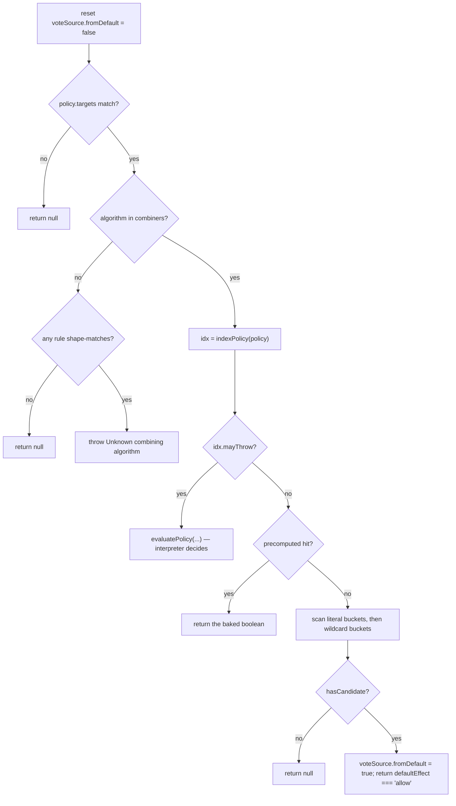
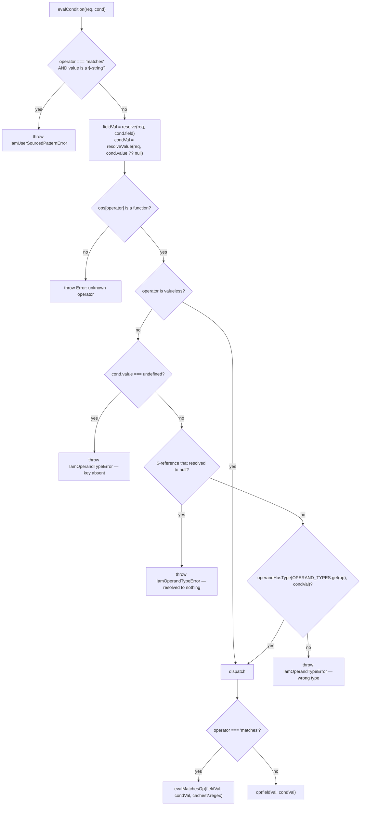

# Core: the evaluator and the condition language

`src/core/evaluate` decides whether one request is allowed by one policy set;
`src/core/conditions` decides whether one condition tree holds against one
request. Between them they are the whole ABAC decision path — the compiled table
and the RBAC bitmask are optimisations layered over these two modules, and both
call back into them for anything they could not bake in. This document covers
the two interpreters, rule and target matching, the complete operator table, the
operand-type guard, and the fail-closed contract that decides what happens when
a condition cannot be answered at all.

Companion docs, not duplicated here: [`core-engine.md`](./core-engine.md) for
engine lifecycle, caching, hooks and modes, and
[`../compiled-engine-explained.md`](../compiled-engine-explained.md) for how a
conditional rule becomes a `DYNAMIC` cell, how the wildcard buckets are laid
out, and how role bitmasks work.

---

## 1. Two interpreters, one contract

There are four evaluator entry points, in two pairs.

| Function | Returns | Scope | Used by |
|---|---|---|---|
| `evaluatePolicy` | `AccessControl.IDecision` | one policy | `evaluate`, and the fast path's own delegation |
| `evaluate` | `AccessControl.IDecision` | policy set | `IamEngine` in `mode: 'development'` |
| `evaluatePolicyFast` | `boolean \| null` | one policy | `lookup()` for residual policies and `rbacResidual` |
| `evaluateFast` | `boolean` | policy set | public API only — nothing in the package calls it |

`evaluatePolicy` (`src/core/evaluate/evaluate.ts:65`) walks `policy.rules`
linearly, collects every rule that applies, hands the matches to the policy's
combining algorithm, and returns a decision carrying the winning rule, a reason
string, a duration and a timestamp. It is the reference implementation. Nothing
about it is indexed or memoized.

`evaluatePolicyFast` (`evaluate.ts:344`) answers the same question against a
memoized per-policy rule index and returns a bare tri-state: `true` allow,
`false` deny, `null` NotApplicable. It allocates nothing, builds no reason
string, and calls `performance.now()` never.

Both exist because they answer different questions. The interpreter has to be
able to say *which rule* decided and *why*, because development mode's
`IDecision` and the explain API are built on that. The fast path only has to
produce a vote, and dropping the trace is what makes it cheap enough to run per
request in production. The invariant that matters is that they never disagree:

> For every `(policy, request, defaultEffect)`, `evaluatePolicyFast` returns
> `null` exactly when `evaluatePolicy(...).applicable === false`, and otherwise
> returns `evaluatePolicy(...).allowed`.

`oracle.test.ts` exercises the set-level consequence of that invariant across
6000 generated policy sets (3 `combine`s × 2 `defaultEffect`s × 1000 iterations),
asserting `evaluate(...).allowed === evaluateFast(...)`; it reaches
`evaluatePolicyFast` directly only through the reference implementation it uses
for `first-applicable`. The file's own docblock is explicit that roughly half
those iterations prove less than they look (see §7 — a throwable policy is
handed straight back to the interpreter, so the oracle compares the interpreter
with itself); the run asserts a floor of 300 iterations in which no policy
delegated. The delegation itself is pinned separately by
`fast-path-throwable-delegation.test.ts`.

### Public names carry a fail-open gate

The raw four are internal. `src/core/evaluate/evaluate.public.ts` wraps each one
with `assertFailOpenOptIn` (`evaluate.public.ts:30`) and exports it under an
`iam` prefix:

```ts
function assertFailOpenOptIn(defaultEffect: AccessControl.Effect, allowFailOpen: boolean): void {
  if (defaultEffect === 'allow' && !allowFailOpen) {
    throw new Error(
      "[@gentleduck/iam:evaluate] defaultEffect 'allow' is a fail-open footgun. Pass `allowFailOpen: true` to confirm intent.",
    )
  }
}
```

The exported names are `iamEvaluate`, `iamEvaluateFast`, `iamEvaluatePolicy`,
`iamEvaluatePolicyFast`. All four are gated, and
`fail-open-optin-parity.test.ts` pins them together. The first version of this
file gated only the two multi-policy entries while `evaluate/index.ts` still
re-exported the raw single-policy pair, so `iamEvaluatePolicy(policy, req,
'allow')` off the package root answered `allowed: true` with no opt-in. A
half-gated boundary is what made the "only route to the evaluator" claim false
the first time; do not add a fifth export without the gate.

Internal callers import from `./evaluate` directly, so the gate is off the
per-request hot path.

---

## 2. Applicability: three outcomes, not two

Every policy contributes one of three things to a decision, and conflating the
last two is the single most common way to get this subsystem wrong.

| Outcome | Interpreter | Fast path | Cross-policy meaning |
|---|---|---|---|
| **Applicable, decided** | `IDecision` with `rule` set | `true` / `false` | a real vote |
| **Applicable, defaulted** | `IDecision`, `rule` undefined, `applicable` not `false` | `true`/`false` from `defaultEffect`, `voteSource.fromDefault = true` | a real vote — the policy considered the request and its rules all said no |
| **NotApplicable** | `applicable: false` | `null` | skipped entirely |

`evaluatePolicy` produces NotApplicable in exactly two places:

1. `policyApplies(policy, request)` is false — a `targets` dimension did not
   match (`evaluate.ts:74`).
2. No rule of the policy shape-matches the request's action/resource at all
   (`evaluate.ts:91`): *"a policy about `update` has nothing to say about `read`
   and must not fold in as a defaultEffect vote just because its `targets` were
   silent."*

Note that a NotApplicable decision still carries `allowed: defaultEffect ===
'allow'`. That field is meaningless for a NotApplicable policy — the combiner
must read `applicable` first. `iamEvaluatePolicy` returning `{ allowed: true,
applicable: false }` for a fail-open default is precisely the shape the opt-in
gate above exists to make loud.

The fast path tracks the same distinction with a `hasCandidate` flag, seeded
from `literalBuckets.length > 0` (a literal bucket is an exact-key hit, so its
existence is itself a shape match) and set inside the wildcard loops when
`candidateShapeMatches` passes. `hasCandidate === false` returns `null`.

---

## 3. Rule matching

### Shape first, conditions second

```ts
// evaluate.libs.ts:20
export function ruleTargetsMatch(rule: AccessControl.IRule, req: IamRequest.IAccessRequest): boolean {
  const actionMatch = rule.actions.some((a) => matchesAction(a, req.action))
  if (!actionMatch) return false
  const resourceHasDot = req.resource.type.includes('.')
  return rule.resources.some((r) => {
    if (resourceHasDot || r.includes('.')) return matchesResourceHierarchical(r, req.resource.type)
    return matchesResource(r, req.resource.type)
  })
}
```

`ruleApplies` (`evaluate.libs.ts:37`) is `ruleTargetsMatch` AND
`evalConditionGroup`. Keeping the two separate is what lets the evaluator tell
*"this rule has nothing to do with the request"* from *"the rule considered it
and its condition said no"*, which §2 needs.

A rule's `actions` and `resources` are OR-lists: any alternative matching is
enough. A rule may mix literal and wildcard alternatives in one list
(`actions: ['read', 'admin:*']`) and both alternatives stay live —
`indexPolicy` buckets such a rule by its wildcard side, and
`candidateShapeMatches` (`evaluate.ts:23`) re-checks every alternative rather
than trusting the bucket.

### Wildcard semantics

The three matchers live in `src/core/resolve/resolve.ts` and are plain prefix
tests, not globs.

| Pattern | Function | Matches | Does **not** match |
|---|---|---|---|
| `'*'` | all three | anything | — |
| `'posts:*'` (action) | `matchesAction` (`resolve.ts:139`) | `posts:read`, `posts:a:b` | `comments:read`, `posts` |
| `'org:*'` (resource) | `matchesResource` (`resolve.ts:158`) | `org:project`, `org:project:doc` | `team:project`, `org` |
| `'dashboard.*'` (resource) | `matchesResource` / `matchesResourceHierarchical` (`resolve.ts:180`) | `dashboard.users`, `dashboard.users.settings` | `reports.summary`, bare `dashboard` |
| `'dashboard'` (bare literal) | either | `dashboard` only | `dashboard.users`, `dashboard:x` |

Three consequences worth internalising:

- **A bare literal never parent-matches.** `resources: ['dashboard']` does not
  cover `dashboard.users`. Recursive grants must be written `dashboard.*`
  explicitly. Symmetrically, `dashboard.*` does not cover bare `dashboard`.
- **The separator comes from the pattern.** `matchesResource` slices off only
  the trailing `*`, keeping the separator, so a `:`-pattern only matches
  `:`-style resources and a `.`-pattern only `.`-style.
- **Actions have no `.` form.** `matchesAction` recognises `':*'` only. An
  action pattern `foo.*` is treated as a literal string containing a dot and
  matches nothing but itself — but note `isExpansivePattern` in
  `indexPolicy` keys on `p.includes('*')`, so such a rule is still routed into
  a wildcard bucket, where it correctly matches nothing.

### Policy targets

`policy.targets` is a pre-filter over the whole policy, checked before any rule.

```ts
// evaluate.libs.ts:53 — the action/resource half, request-independent
export function policyTargetsActionResource(policy, action, resource): boolean {
  const targets = policy.targets
  if (!targets) return true
  if (targets.actions?.length && !targets.actions.some((a) => matchesAction(a, action))) return false
  if (targets.resources?.length && !targets.resources.some((r) => matchesResource(r, resource))) return false
  return true
}
```

`policyApplies` (`evaluate.libs.ts:72`) is that plus the roles dimension.
Details that bite:

- **An empty array is "unconstrained", not "matches nothing".** The guard is
  `targets.actions?.length &&`, so `targets: { actions: [] }` applies to
  everything.
- **Dimensions AND together**; alternatives within a dimension OR.
- **`targets.roles` reads `request.subject.roles` defensively**: a non-array
  (an adapter row that lost the column) is treated as the empty list, so the
  policy is NotApplicable rather than throwing.
- **Target resources are matched with `matchesResource`, never the hierarchical
  variant.** Both recognise `.*`, so `targets: { resources: ['dashboard.*'] }`
  works; a bare `dashboard` target still does not cover `dashboard.users`.
- The split between `policyTargetsActionResource` and `policyApplies` exists
  because `compileTable` can resolve the action/resource half at compile time
  (it depends only on the cell's own key) while the role half needs the request.

### Precedence between allow and deny

Nothing outside the combining algorithms picks a winner. There is no implicit
"deny wins" anywhere in this module.

**Within one policy** — `combiners` (`evaluate.libs.ts:129`), keyed by
`policy.algorithm`:

| Algorithm | Rule |
|---|---|
| `deny-overrides` | any matched deny wins; else the first matched allow; else `defaultEffect` |
| `allow-overrides` | any matched allow wins; else the first matched deny; else `defaultEffect` |
| `first-match` | highest `priority` among matched rules wins, ties to source order |
| `highest-priority` | identical ranking to `first-match`; only the reported `reason` differs |

`first-match` and `highest-priority` are one algorithm with two labels — they
share `topByPriority` (`evaluate.libs.ts:106`) rather than two copies that could
drift, and `algorithm-alias-precompute.test.ts` agrees them across 3000
generated rule sets in both engines. The names are kept because the `reason`
string is what an operator reads in an audit log.

Ties fall to source order via a strict `>` in `topByPriority`. Source order is
`policy.rules` order, which for a stored policy is the adapter's row order —
both engines agree on the answer for any given order, but the order itself is
the adapter's to guarantee.

`rulePriority` (`evaluate.libs.ts:264`) ranks a missing or `NaN` priority as
`0`, not as `-Infinity`:

```ts
export function rulePriority(rule: { readonly priority: number }): number {
  return Number.isFinite(rule.priority) ? rule.priority : 0
}
```

Without it a row that bypassed validation lost every `>` comparison and vanished
from ranking, making the verdict depend on source order alone.

**Across policies** — `combine`, one of `'and'`, `'allow-overrides'`,
`'first-applicable'` (`VALID_POLICY_COMBINES`, `evaluate.libs.ts:94`):

| `combine` | Rule |
|---|---|
| `'and'` (default) | every applicable policy must allow; the first deny short-circuits |
| `'allow-overrides'` | the first applicable policy that allows wins; else deny if any applicable policy denied; else `defaultEffect` |
| `'first-applicable'` | the first policy that is not NotApplicable wins, whatever it said |

`evaluate` branches on the first two and treats anything else as
`first-applicable`, which is the most permissive of the three — which is why an
unrecognised value has to be rejected at engine construction rather than
silently dropping deny-overrides semantics. TypeScript refuses one; a
config-driven or plain-JS caller does not.

`first-applicable` tests `applicable === false` and nothing else
(`evaluate.ts:307`). It used to gate on `decision.rule !== undefined` — "the
first policy that names a rule" — which dropped two real votes: an applicable
policy whose rules all evaluated false (no rule, but a real `defaultEffect`
vote) and the Indeterminate deny synthesized by `safeEval` (also rule-less). A
padded request header was therefore enough to disable the first deny policy in
the list.

`evaluateFast` implements `'and'` and `'allow-overrides'` only; anything else
falls through to the `'and'` branch. The engine constructor blocks
`first-applicable` for production for that reason.

---

## 4. The rule index and the fast path's decision order

`indexPolicy` (`evaluate.libs.ts:341`) builds a
`Evaluate.IPolicyRuleIndex` once per rules array and memoizes it in a `WeakMap`.
The bucket layout, the `O(A + R + B)` cost argument and a worked example are in
[`../compiled-engine-explained.md`](../compiled-engine-explained.md#4-deep-dive-wildcard-buckets)
and are not repeated here. What matters at this level:

- **The memo is keyed on `policy.rules`, not on the policy object**, with
  `length` and `algorithm` recorded alongside so an append or an algorithm
  change also invalidates. `readonly rules` is a compile-time annotation only;
  keying on the policy served a stale index for the object's whole lifetime, and
  the divergence was always prod-allows/dev-denies.
- **The literal bucket map is two levels deep** (`addToPairBucket`,
  `evaluate.libs.ts:237`), not one map keyed `` `${a}\0${r}` ``. Literal hits
  skip `candidateShapeMatches` entirely, so a non-injective key was enough to
  fire a rule for an unrelated request: action `read\0post` / resource `x`
  collided with action `read` / resource `post\0x`, in production only.
- **`precomputed`** is an `action → resource → boolean` map filled only when the
  policy has no wildcard rule at all, its algorithm is one of the four, and
  every rule in that exact bucket is unconditional. It is the O(1) answer.
- **`mayThrow`** is the delegation flag; see §7.

`evaluatePolicyFast` checks, in order:



The unknown-algorithm guard (`evaluate.ts:374`) mirrors the interpreter's
NotApplicable test before throwing, because the interpreter only reaches
`combiners[policy.algorithm]` for a policy that is applicable at all. Without
the guard the final ranked scan silently ran as `first-match`, so one
mistyped column granted in production and denied in development.

Both effect tests in every branch are positive (`=== 'deny'` **and**
`=== 'allow'`), never an `!== 'deny'` else-branch. `IRule.effect` is typed
`'allow' | 'deny'`, but a seeded or migrated row can carry any string, and an
else-branch read every one of them as an allow — a policy whose only rule was
`effect: 'DENY'` answered allow. An unrecognised effect now votes for neither
side, matching `denyOverrides`/`allowOverrides`, which `find` their effect by
name and fall through to `defaultEffect`.

---

## 5. Conditions: the group grammar

A rule's `conditions` is an `AccessControl.IConditionGroup`: exactly one of
`all` (AND), `any` (OR), `none` (NOR), each holding an array of leaf
`ICondition`s or nested groups.

```ts
// conditions.ts:95
export function evalConditionGroup(req, group, depth = 0, caches?): boolean {
  if (depth >= MAX_CONDITION_DEPTH) throw new IamConditionGroupError('depth', ...)
  if ('all' in group)  return assertItems(group.all,  'all' ).every((i) => evalItem(req, i, depth + 1, caches))
  if ('any' in group)  return assertItems(group.any,  'any' ).some ((i) => evalItem(req, i, depth + 1, caches))
  if ('none' in group) return !assertItems(group.none,'none').some ((i) => evalItem(req, i, depth + 1, caches))
  if (group !== null && typeof group === 'object' && Object.keys(group).length === 0) return true
  throw new IamConditionGroupError('unknown-keys', ...)
}
```

Behaviours that follow from that shape:

- **Key precedence is `all` > `any` > `none`, and extra keys are ignored.**
  `{ all: [], any: [<something false>] }` evaluates `all` and returns `true`.
  The validator reports a multi-key group; the evaluator does not.
- **`{}` is unconditionally true.** So is `{ all: [] }` (`.every` on empty) and
  `{ none: [] }`. `{ any: [] }` is unconditionally **false** — `.some` on empty.
- **`MAX_CONDITION_DEPTH` is 10** (`conditions.libs.ts:825`) and the comparison
  is `>=`, so a tree exactly 10 groups deep evaluates and 11 throws. Role
  permissions start at depth `IAM_RBAC_CONDITION_DEPTH = 1`, not 0, because
  `rolesToPolicy` wraps them one level down; anything evaluating a permission's
  conditions outside the generated policy must start there too.
- **An array as a group** is read structurally: `[]` has no recognised key and
  no keys at all, so it returns `true`; a non-empty array throws
  `IamConditionGroupError('unknown-keys')` naming its numeric indices.
- **`null`, `undefined` and primitives throw a plain `TypeError`**, not
  `IamConditionGroupError` — `'all' in undefined` raises before any branch is
  reached. That is still Indeterminate to every caller, which is the point, but
  do not match on the error class. The `IamConditionGroupError` message's
  `saw a non-object` arm is reached only by a group that is a *function*: `in`
  works on one, so the walk gets as far as the final `throw` and
  `Object.keys()` is empty there.

### `matchesUnconditionally`

```ts
// conditions.ts:148
export function matchesUnconditionally(group: AccessControl.IConditionGroup | undefined): boolean {
  if (group === null || typeof group !== 'object') return false
  if ('all' in group) return Array.isArray(group.all) && group.all.length === 0
  if ('any' in group) return false
  if ('none' in group) return Array.isArray(group.none) && group.none.length === 0
  return Object.keys(group).length === 0
}
```

This is the single answer to *"may a caller treat this rule as matching without
running the evaluator?"* — `indexPolicy` asks it (as `needsConditionEval`,
`evaluate.libs.ts:277`) and so does `compileTable`. The contract is
one-directional: `true` promises `evalConditionGroup` would also answer `true`;
`false` promises only "ask the evaluator". `{ any: [] }` is request-independently
false, which is not the same as unconditional — skipping the evaluator for it
would turn a rule that never fires into one that always does. Two fast paths
used to classify this themselves, both read `{ typo: 1 }` as "no conditions",
and every divergence ran prod-allows / dev-denies.

---

## 6. The request context conditions read from

A condition's `field` is a dot-path resolved by `resolve`
(`src/core/resolve/resolve.ts:79`) against the
`IamRequest.IAccessRequest`. Roots are fixed.

| Path | Reads |
|---|---|
| `action` | `request.action` (special-cased, not a dot-path) |
| `scope` | `request.scope ?? null` (special-cased) |
| `subject.*` | `id`, `roles`, `attributes.<key>` (`scopedRoles` is walked but narrows to `null` — see below) |
| `resource.*` | `type`, `id`, `attributes.<key>` |
| `environment.*` | `ip`, `userAgent`, `timestamp`, `now`, any custom key |

`ALLOWED_ROOTS` is `{subject, resource, environment}`; a path with any other
first segment resolves to `null` without walking anything.
`BLOCKED_SEGMENTS` (`__proto__`, `constructor`, `prototype`) is refused at parse
time and the result memoized as invalid.

Two properties of `resolve` that determine what "missing" means:

1. **Own properties only.** The walk is `Object.hasOwn(node, seg) ?
   Reflect.get(node, seg) : undefined`. A plain `Reflect.get` resolved every
   `Object.prototype` member — `toString`, `valueOf`, `hasOwnProperty` — to a
   function on any object, and an `exists`-gated allow fired against a subject
   with no attributes at all. `exists` asks whether the request *carries* the
   attribute, which is an own-property question.
2. **The result is narrowed, not asserted.** `isAttributeValue` accepts a
   scalar, an array of scalars, or a plain object whose values are all scalars.
   A `Date`, a nested object, a function from a live `getSubjectAttributes` —
   all resolve to `null`.

### undefined vs absent

There is no distinction. `resolve` returns `null` for all four of:

- an unknown or blocked path,
- a key that is not present,
- a key present with value `undefined`,
- a key present with value `null`.

**On the field (left-hand) side that is a match failure, not a refusal.** No
guard runs against the field; each operator's own `typeof` test decides. So the
neutral outcome of an absent field is `false` for most operators — which is
fail-closed on an allow rule and fail-**open** on a deny rule. §8 tabulates it
per operator; the operators that answer `true` on an absent field are
`neq`, `nin`, `not_contains` and `not_exists`.

**On the operand (right-hand) side it is a refusal**, but only for a
`$`-reference:

```ts
// conditions.libs.ts:945
if (isUserSourcedValue(cond.value) && condVal === null) {
  throw new IamOperandTypeError(cond.field, cond.operator,
    `operand reference ${JSON.stringify(cond.value)} resolved to nothing`)
}
```

This is the fix for the canonical multi-tenant guard. `subject.attributes.tenant
eq $resource.attributes.tenant` compared `null === null` and **allowed** a
request carrying neither attribute, through the fully validated authoring path —
the validator cannot type a `$`-reference, so it had nothing to say. A literal
`value: null` is an author explicitly testing for null and still works.

The engine injects `environment.now = Date.now()` (`ensureEnvNow`,
`engine.libs.ts:26`) after `beforeEvaluate`, so a hook-pinned clock survives. A
request built by hand and passed straight to `iamEvaluate` gets no such
injection — a temporal rule against `$environment.now` on such a request throws
`IamOperandTypeError` by the rule above.

### Caches

Both `resolve` and the `matches` operator take an optional per-Engine cache
(`{ regex?: Map<string, RegExp>; path?: Map<string, string[] | null> }`) threaded
through every evaluator entry point. Omitting it falls back to the module-global
`pathCache` / `regexCache`. Multi-tenant deployments should pass per-Engine maps
so one tenant cannot evict another's compiled patterns. `iamClearRegexCache()`
flushes the process-wide pool only.

---

## 7. Fail-closed semantics

The governing rule, stated once:

> `false` is fail-closed only for an **allow** rule. On a deny rule it retires
> the deny, and inside a `none` the negation turns it into a grant. So anything
> the evaluator cannot answer **throws**, and the caller decides the vote.

Every refusal in `src/core/conditions` is a tagged error class, all five
exported from the package root so a consumer can route them through
`onPolicyError` without string-matching `err.name`.

| Error | `tag` | Thrown when |
|---|---|---|
| `IamOperandTypeError` | `duck-iam/operand-type` | operand absent, wrongly typed, or a `$`-reference that resolved to nothing |
| `IamConditionGroupError` | `duck-iam/condition-group` | group nested past `MAX_CONDITION_DEPTH`, or carrying no recognised key |
| `IamRegexInputTooLargeError` | `duck-iam/regex-input-too-large` | `matches` field exceeds `MAX_REGEX_INPUT_LENGTH` (2048 UTF-16 code units) |
| `IamPatternRefusedError` | `duck-iam/pattern-refused` | `matches` pattern over `MAX_REGEX_LENGTH` (128), refused by the ReDoS detector, or uncompilable |
| `IamUserSourcedPatternError` | `duck-iam/user-sourced-pattern` | `matches` pattern is a `$`-reference |

### What a throw becomes

**At the rule level** (`evaluate.ts:137`) a throw normally propagates out of
`evaluatePolicy`. The one exception is `rulesAbstainOnThrow`:

```ts
const rulesAbstainOnThrow = policy.id === IAM_RBAC_POLICY_ID && !policyHasDenyRule(policy)
```

Both halves are load-bearing. `rolesToPolicy` folds every role permission into
one allow-only `__rbac__` policy, but those are independent grants from separate
roles that the compiled table evaluates first-match-wins — one rotten permission
must not poison the others, and before this gate a conditional permission that
threw denied a subject their unconditional grant from a different role while the
compiled table answered allow. An operator's own allow-only policy is the
opposite case: a single authored unit whose rules were meant to be read
together, which `evaluateDynamicCell` also treats as one, so widening this to
every allow-only policy makes the interpreter disagree with the table in the
other direction. `rbac-abstain-scope.test.ts` pins both halves — the same rules
under two different `id`s produce opposite outcomes.

**At the policy level** (`safeEval`, `evaluate.ts:224` and its exact mirror at
`evaluate.ts:577`) a throw is **Indeterminate, never NotApplicable**:

| Policy shape | Vote | Applicable? |
|---|---|---|
| carries any deny rule (`policyHasDenyRule`) | `deny` | yes |
| allow-only | `defaultEffect` | yes |
| `rules` is not an array | `defaultEffect` | yes — it cannot hide a deny |

Skipping is the thing that must not happen. Under `combine: 'and'` with
`defaultEffect: 'deny'`, the vote an allow-only policy would have cast is itself
a deny; dropping it is what turns a throw into an allow. Padding a User-Agent
past 2048 characters is enough to make a `matches` rule throw, and no validator
sees request attributes.

**The error hook cannot change the decision.** Every catch site calls
`safeErrorReport` (`evaluate.libs.ts:531`) rather than the hook directly,
because these sites are *inside* the catch that implements the Indeterminate
contract — a hook that throws (a metrics backend that is down) would propagate
out of it, the vote would never be cast, and the padded field would take the
whole decision with it. The "hook threw" warning is latched per hook in a
`WeakSet`, not in one module-level boolean: a single latch let one engine's
transiently broken hook permanently silence a different tenant's.

### `mayThrow`: why the fast path delegates

`conditionMayThrow` (`evaluate.libs.ts:302`) walks a rule's condition tree at
index time and flags the policy if anything under it could throw. When
`idx.mayThrow` is set, `evaluatePolicyFast` hands the whole policy to
`evaluatePolicy`:

```ts
// evaluate.ts:390
if (idx.mayThrow) {
  const decision = evaluatePolicy(policy, request, defaultEffect, caches, onRuleError)
  return decision.applicable === false ? null : decision.allowed
}
```

The reason is that a policy carrying a throwable condition is Indeterminate *as
a whole*, and every fast-path branch can reach a verdict without ever evaluating
the offending rule — `allow-overrides` returns on its first unconditional allow,
and the precomputed map answers before any condition runs. A 10 000-case
throw-injection fuzz found 71 such divergences, every one prod-allows /
dev-denies. Delegating makes the two modes agree by construction rather than by
two implementations being kept in step.

`conditionMayThrow` deliberately over-approximates. It flags:

| Shape | Why |
|---|---|
| depth `>= MAX_CONDITION_DEPTH` | matches `evalConditionGroup`'s own `>=` |
| `operator` not a string, or absent from `ops` | unknown operator throws |
| `operator === 'matches'` | can throw on input size or pattern refusal whatever the operand looks like |
| `value` absent on a non-valueless operator | `ICondition.value` is optional in the type, so this is a *type-valid* policy |
| `value` is a `$`-string | its resolved type is unknowable at index time |
| `value` fails `operandHasType` | decidable outright for a literal |
| non-array `all`/`any`/`none` body | `assertItems` throws |
| a node with keys but none recognised | `evalConditionGroup` refuses it |

Flagging only `matches` and unknown operators missed three shapes that throw on
a perfectly well-known operator, and each one let the fast path return an allow
from a literal bucket without reaching the wildcard deny that would have thrown.

The cost is one interpreter pass for any policy that uses `matches` or an
unrecognised operator; `mayThrow` is computed once per rules array and cached
with the index.

---

## 8. The operator table

Nineteen operators, `ops` at `conditions.libs.ts:751`. `f` is the resolved
field value, `v` the resolved operand.

Two column conventions below: **absent field** means `resolve` returned `null`
(unknown path, missing key, explicit null, or a value outside
`AttributeValue`); **wrong-typed field** means it resolved to something the
operator cannot compare. The operand column is what `OPERAND_TYPES` demands —
anything else throws `IamOperandTypeError` *before* the operator runs, so the
operator never sees it.

| Operator | Operand type required | Semantics | Absent field | Wrong-typed field |
|---|---|---|---|---|
| `eq` | scalar | `f === v`, strict | `false` (`true` if `v` is literal `null`) | `false` |
| `neq` | scalar | `f !== v`, strict | **`true`** (`false` if `v` is literal `null`) | `true` |
| `gt` | number | `typeof f === 'number' && f > v` | `false` | `false` |
| `gte` | number | `f >= v` | `false` | `false` |
| `lt` | number | `f < v` | `false` | `false` |
| `lte` | number | `f <= v` | `false` | `false` |
| `in` | array of scalars | array field: any element in `v`; scalar field: `v.includes(f)` | `false` (`true` if `v` contains `null`) | `false` (object field) |
| `nin` | array of scalars | negation of `in` | **`true`** (unless `v` contains `null`) | **`true`** (object field) |
| `contains` | scalar | `Array.isArray(f) && f.includes(v)` | `false` | `false` |
| `not_contains` | scalar | `f == null` → `true`; non-array `f` → `false`; else `!f.includes(v)` | **`true`** | `false` |
| `starts_with` | string | `typeof f === 'string' && f.startsWith(v)` | `false` | `false` |
| `ends_with` | string | `f.endsWith(v)` | `false` | `false` |
| `matches` | string (non-`$`) | compiled regex `.test(f)` | `false` | `false` |
| `exists` | — (valueless) | `f !== null && f !== undefined` | `false` | `true` |
| `not_exists` | — (valueless) | `f === null \|\| f === undefined` | **`true`** | `false` |
| `subset_of` | array of scalars | both arrays and `f.every((i) => v.includes(i))` | `false` | `false` |
| `superset_of` | array of scalars | both arrays and `v.every((i) => f.includes(i))` | `false` | `false` |
| `before` | number or ISO-8601 string | `toEpoch(f) < toEpoch(v)`, both finite | `false` | `false` |
| `after` | number or ISO-8601 string | `toEpoch(f) > toEpoch(v)`, both finite | `false` | `false` |

The four bolded `true`s are the whole risk surface for a missing attribute. An
`allow if subject.attributes.tier neq 'banned'` rule grants to a subject with no
`tier` at all. Prefer pairing a negated operator with an `exists` guard:
`{ all: [{ field, operator: 'exists' }, { field, operator: 'neq', value }] }`.

Notes per family:

- **`eq`/`neq` are bare `===`/`!==`.** The `scalar` entry in `OPERAND_TYPES`
  exists because a non-scalar operand meant reference equality against a value
  resolved out of the request — never the same object — so `eq` was permanently
  false and `neq` permanently true, and both validated clean before the entry
  was added.
- **`contains` is array membership, not substring search.** The old string
  fallthrough meant a `groups` claim arriving as the CSV string
  `'not-admins-really'` satisfied `contains 'admins'`, which is the normal shape
  of a JWT claim. A present non-array field now fails *both* `contains` and
  `not_contains`, so the same type confusion cannot bypass one in each
  direction. An absent field is a different case: an empty list contains
  nothing, so `not_contains` holds.
- **`in`/`nin` require every operand element to be a scalar**, not just the
  container (`operandHasType('array', v)`), because the membership check is
  `includes`. An array of objects matched nothing by reference and quietly
  retired the rule holding it.
- **`subset_of`/`superset_of` use `includes` too**, so element comparison is
  SameValueZero — object elements compare by reference and effectively never
  match.
- **`exists`/`not_exists` are `VALUELESS_OPERATORS`** and skip the operand guard
  entirely: any `value` on them, including a `$`-reference that resolves to
  nothing, is ignored rather than refused.
- **`before`/`after` coerce with `toEpoch`** (`conditions.libs.ts:744`): numbers
  pass through as epoch ms, strings go through `Date.parse`, anything else is
  `NaN`. Both operands are checked with `Number.isFinite`, so `Infinity` fails
  too — a `NaN`-only guard let those through. Pair with the engine-injected
  `$environment.now`.

### `evaluateOperator` is not the decision path

`evaluateOperator` (`conditions.ts:31`, exported as `iamEvaluateOperator`) calls
`ops[op]` directly. It carries **none** of `evalCondition`'s guards: no operand
typing, no `$`-pattern refusal for `matches`, and the process-wide regex cache
rather than a per-Engine one. Anything deciding or *reporting* access must call
`evalCondition` — the explain trace used to call `evaluateOperator` and
consequently showed a condition as satisfied that the engine had refused. It is
kept exported for a policy linter or a condition preview.

`ops` itself and `regexCache` are deliberately absent from the barrel
(`src/core/conditions/index.ts:1`). Neither is frozen at runtime, so withholding
them is the only thing keeping them internal — `ops.eq = () => false` would
retire every `eq` deny rule in both evaluation modes.

---

## 9. The operand-type guard, and commit `366e3b49`

`evalCondition` (`conditions.libs.ts:879`) runs four checks before it dispatches
to an operator.



The guard exists at read time, not only in the validator, because
`validatePolicy` guards `savePolicy` and `import` and **nothing guards a row
that was seeded through an adapter constructor, migrated, or written by direct
SQL**. `loadPolicies` does not validate. `OPERAND_TYPES`
(`conditions.libs.ts:166`) is imported by `validate.libs` so write-time and
read-time cannot drift apart — one table, two call sites.

Note that `condVal` is the **resolved** operand, which is what the validator
cannot see: a `$`-reference is skipped at authoring time because its type is
unknowable then, and it lands here as whatever the request actually carried.

### The `matches` ordering fix

Commit `366e3b49` ("run the matches operand-type guard before dispatch, not
after") moved two lines. Before it, the file read:

```ts
try {
  // Per-Engine regex cache when supplied, module-global fallback.
  if (cond.operator === 'matches') return evalMatchesOp(fieldVal, condVal, caches?.regex)
  const op = ops[cond.operator]
  ...
  if (!VALUELESS_OPERATORS.has(cond.operator)) { /* the guard */ }
```

The `matches` early return sat above the guard, which made the guard dead code
for the one operator whose operand the validator screens hardest. A `matches`
condition with an absent or non-string `value` fell into `evalMatchesOp`, failed
that function's own `typeof v !== 'string'` test, and answered a plain `false`.
A seeded `deny` rule therefore read as "condition not met" and never denied.

**Current behaviour.** Every row but the 128-character one is pinned by
`matches-operand-type.test.ts`; the pattern-length refusal is pinned in
`conditions.test.ts`.

| `matches` operand | Result |
|---|---|
| a literal string | compiles and answers `true`/`false` |
| `42`, `true`, `null`, `['^curl']` | `IamOperandTypeError`, naming `field` and `operator` |
| key absent entirely | `IamOperandTypeError` — "requires a `value` and the key is absent" |
| a `$`-reference | `IamUserSourcedPatternError` — refused before resolution, never compiled |
| over 128 characters | `IamPatternRefusedError('too-long')` |
| refused by `detectCatastrophicRegex`, or not a valid regex | `IamPatternRefusedError('uncompilable')` |

The commit message says the pattern-sourced and uncompilable refusals "stay a
plain `false`". That is no longer true — later work moved both to Indeterminate
for the same reason the operand guard exists, and the tests in that same file
now assert `toThrow(IamUserSourcedPatternError)` and
`toThrow(IamPatternRefusedError)`. Read the source, not the commit body, for
those two.

The end-to-end statement is the second describe block of that test: a seeded
deny rule with `value: 42` under `defaultEffect: 'allow'` now denies and calls
`onPolicyError`, where before the fix the request was allowed outright.

### The field side is never refused

`evalMatchesOp` (`conditions.libs.ts:977`) is explicit about the asymmetry:

```ts
// The FIELD not being a string is a miss, not a refusal: the operator can
// answer "this value is not that pattern" about a value of any type, and
// making an absent attribute Indeterminate would change every rule that
// tests one. The operand is screened by OPERAND_TYPES before reaching here.
if (typeof f !== 'string' || typeof v !== 'string') return false
```

Because that test comes first, `evalMatchesOp` called directly with a non-string
`v` returns `false` rather than throwing — the refusal for a non-string pattern
lives in `evalCondition`, not in the operator. The `v` half of that condition is
unreachable through `evalCondition` and exists for direct callers.

### Regex safety

`detectCatastrophicRegex` (`conditions.libs.ts:321`) is the single predicate
both `getCachedRegex` and the validator run, so a pattern accepted at import
time can never be refused at evaluation time or the reverse
(`regex-safety-agreement.test.ts`). It refuses, in order of specificity:

| Reason | Example |
|---|---|
| `pattern length exceeds MAX_REGEX_LENGTH` (128) | any 129-char pattern |
| `backref-quantifier` | `(\w+)\1+`, `\k<n>+` |
| `lookaround-with-quantified-group` | `(?=(a+)+)`, `(?<=(a*)*)` |
| `bounded-large-quantifier` (> 1000) | `a{1,2000}` |
| nested quantifier | `(a+)+`, `([a-z]+)+` |
| alternation inside a quantified group | `(a\|aa)+`, `(foo\|bar)+` |
| more than 4 unbounded quantifiers | `^a+b+c+d+e+$` |
| adjacent unbounded quantifiers over overlapping atoms | `^a+a+$`, `.*.*` |
| 3+ unbounded quantifiers competing for the same characters | `^.*\/.*\/.*\/.*\.json$` |

The last two are the polynomial cases and they are not covered by the input cap:
`2048^4` is astronomical, and a 513-character input already stalled
`^a+a+a+a+$` for eight seconds. Overlap is decided by *probing* — each atom is
compiled alone and tested against a probe set plus the pattern's own literals —
rather than by parsing character classes by hand, so `[a-z]+@[a-z]+\.[a-z]+`
stays accepted (neither `@` nor `.` is matchable by `[a-z]`, so each `+` is
confined to its own segment) while `.*` chains are refused.

The detector is deliberately conservative in the safe direction, but two rounds
of false positives were fixed because they refused the shapes deny guards are
written in: a blanket ban on any quantifier inside a lookaround (so
`^(?!.*admin).*$` was refused, pushing authors toward the weaker
`not_contains`), and a body scan that stripped escapes but not character
classes, so the literal `*` in `^([a-z0-9*-])+$` read as a quantifier.

`getCachedRegex` (`conditions.libs.ts:711`) is an LRU of 256, re-inserting on
hit so eviction drops the least *recently used* rather than the oldest inserted.
A refused pattern never reaches `new RegExp` and is never cached.

---

## 10. Signals: `failOpen` and `IVoteSource`

`IEvalSignals` (`evaluate.ts:635`) is an out-parameter both multi-policy entry
points accept.

```ts
export interface IEvalSignals {
  failOpen?: boolean
}
```

It is set to `true` only when the verdict is `allow` **and** the vote carrying
that allow came from `defaultEffect` rather than from a rule. Three shapes
qualify:

1. no policy was applicable at all — including the empty policy list (the rare
   one),
2. a policy *was* applicable and every one of its rules evaluated false (the
   common one), and
3. an allow-only policy threw and `safeEval` cast the `defaultEffect` vote for
   it (§7); that decision also carries no rule, so it counts here too.

The second used to go uncounted, which made the metric `SECURITY.md` tells
operators to alert on flat at zero for exactly the failures it was written to
catch: an attribute rename, an adapter returning empty conditions, or a
condition dropped for being oversized makes every deny rule stop matching, the
system opens up, and the boolean verdict hides it.

`failOpen` is never set on a deny verdict and never when an explicit allow rule
fired. Both engines raise it identically —
`failopen-signal.test.ts` runs a 28-case dev/prod parity matrix over combine ×
defaultEffect × policy set, because a metric that moves in development and not
in production is worse than no metric.

`IVoteSource` (`evaluate.ts:330`) is the per-policy half of the same mechanism:
`evaluatePolicyFast` cannot carry "this vote came from the fallback" in a
boolean return, so `evaluateFast` passes one object, reused across the loop, and
every entry point resets `fromDefault` on entry.

---

## 11. Worked examples

### A. Ownership plus a tenancy guard, `combine: 'and'`

```ts
const ownership: AccessControl.IPolicy = {
  id: 'ownership',
  name: 'Owners may read their own posts',
  algorithm: 'deny-overrides',
  rules: [
    {
      id: 'own-read',
      effect: 'allow',
      priority: 0,
      actions: ['read'],
      resources: ['post'],
      conditions: { all: [{ field: 'resource.attributes.ownerId', operator: 'eq', value: '$subject.id' }] },
    },
  ],
}

const tenancy: AccessControl.IPolicy = {
  id: 'tenancy',
  name: 'Never cross a tenant boundary',
  algorithm: 'deny-overrides',
  rules: [
    {
      id: 'same-tenant',
      effect: 'deny',
      priority: 10,
      actions: ['*'],
      resources: ['*'],
      conditions: {
        none: [{ field: 'subject.attributes.tenant', operator: 'eq', value: '$resource.attributes.tenant' }],
      },
    },
  ],
}
```

Request: `u1` (tenant `acme`) reads `post` owned by `u1` in tenant `acme`.

1. `evaluate([ownership, tenancy], req, 'deny', 'and')`.
2. **`ownership`.** No `targets`, so `policyApplies` is `true`. `own-read`
   shape-matches (`read`/`post` literal), so the policy is applicable.
   `evalConditionGroup` → `all` → `eq`: field `resource.attributes.ownerId`
   resolves to `'u1'`; operand `$subject.id` resolves to `'u1'`; both scalars,
   so the guard passes; `'u1' === 'u1'` → `true`. Matched.
   `deny-overrides` finds no deny, takes the first allow → `allow`, reason
   `Allowed by rule "own-read"`.
3. `'and'` sees `allowed: true`, records it, continues.
4. **`tenancy`.** `same-tenant` is `*`/`*`, so it shape-matches everything.
   `none` → the inner `eq` compares `'acme' === 'acme'` → `true`, so `none`
   returns `false`. Not matched. `deny-overrides` finds nothing → `defaultEffect`
   = `deny`, with **no rule**.
5. `'and'` sees `allowed: false` and short-circuits: final decision `deny`.

That is the trap. The tenancy policy is written as an all-purpose deny, but
under `combine: 'and'` a policy that fails to match still votes `defaultEffect`,
and `defaultEffect` is `deny`. A deny-only policy that is meant to be silent
when it does not fire has to be NotApplicable, not merely unmatched. Two ways to
get that:

- give it `targets` that exclude the request, or
- narrow its rule shape so `ruleTargetsMatch` fails (drop the `*`/`*`).

Change `combine` to `'allow-overrides'` and the same set allows: `ownership`
returns `true` first and the scan stops.

### B. Denylist and timeout, showing the absent-attribute trap

```ts
const membership: AccessControl.IPolicy = {
  id: 'membership',
  name: 'Members may post unless timed out',
  algorithm: 'deny-overrides',
  rules: [
    {
      id: 'not-banned',
      effect: 'allow',
      priority: 0,
      actions: ['sendMessages'],
      resources: ['message'],
      conditions: {
        all: [
          { field: 'subject.attributes.groups', operator: 'exists' },
          { field: 'subject.attributes.groups', operator: 'not_contains', value: 'banned' },
        ],
      },
    },
    {
      id: 'timed-out',
      effect: 'deny',
      priority: 10,
      actions: ['sendMessages'],
      resources: ['message'],
      conditions: {
        all: [{ field: 'subject.attributes.timedOutUntil', operator: 'after', value: '$environment.now' }],
      },
    },
  ],
}
```

Request A — `groups: ['members']`, no `timedOutUntil`, engine-injected
`environment.now`:

- `not-banned`: `exists` on an own property → `true`; `not_contains` on
  `['members']` → `!includes('banned')` → `true`. Matched (allow).
- `timed-out`: operand `$environment.now` resolves to a number, so the guard
  passes; field `subject.attributes.timedOutUntil` resolves to `null`;
  `toEpoch(null)` → `NaN`; `Number.isFinite(NaN)` → `false`. Not matched.
- `deny-overrides`: no deny, first allow wins → **allow**.

Request B — same subject, `timedOutUntil: <5 minutes from now>`:

- `timed-out` matches, `deny-overrides` returns it → **deny**, reason
  `Denied by rule "timed-out"`.

Request C — a subject whose `groups` attribute was never populated:

- `exists` → `false`, so `all` short-circuits and `not-banned` does not match.
  Without the `exists` guard, `not_contains` alone would have returned `true`
  for the absent field (§8) and granted. The `exists` leaf is the whole reason
  this rule is safe.
- `timed-out` does not match either. No rule matched, so `deny-overrides`
  returns `defaultEffect`. The policy is **applicable** (both rules
  shape-match), so it casts that vote — a deny under the default engine config,
  and an allow with `failOpen: true` raised under `defaultEffect: 'allow'`.

### C. An oversized attribute, traced through Indeterminate

```ts
const denyBots: AccessControl.IPolicy = {
  id: 'p-deny-bots',
  name: 'deny bots',
  algorithm: 'first-match',
  rules: [
    {
      id: 'r-deny',
      effect: 'deny',
      priority: 10,
      actions: ['*'],
      resources: ['*'],
      conditions: { all: [{ field: 'environment.userAgent', operator: 'matches', value: 'curl' }] },
    },
  ],
}
```

Request: `environment.userAgent` is 2052 characters — a header the caller
controls, which no catalog validator ever sees.

1. `indexPolicy(denyBots)`: `conditionMayThrow` sees `operator === 'matches'`
   and sets `mayThrow = true`. The rule has a wildcard action *and* resource, so
   it lands in `wildcardBoth`; `precomputed` stays empty.
2. `evaluatePolicyFast` reaches the `mayThrow` branch and delegates to
   `evaluatePolicy`.
3. `evaluatePolicy`: `policyApplies` → `true` (no targets);
   `ruleTargetsMatch` → `true` (`*`/`*`). `ruleApplies` → `evalConditionGroup` →
   `all` → `evalCondition`.
4. `evalCondition`: the pattern `'curl'` is a literal string, so no
   `IamUserSourcedPatternError`; the operand guard passes
   (`OPERAND_TYPES.get('matches') === 'string'`); dispatch to `evalMatchesOp`.
5. `evalMatchesOp`: both sides are strings; the pattern is under 128 characters;
   `f.length === 2052 > MAX_REGEX_INPUT_LENGTH` → throws
   `IamRegexInputTooLargeError('<unknown>', 2052)`. The regex is never
   compiled — the cache is untouched.
6. `evalCondition`'s catch re-throws it with the real field attached:
   `IamRegexInputTooLargeError('environment.userAgent', 2052)`.
7. `evaluatePolicy` does not absorb it — `rulesAbstainOnThrow` is false, since
   `p-deny-bots` is not `__rbac__` and carries a deny — so it propagates.
8. `safeEval` catches, calls `safeErrorReport(onPolicyError, err, policy)`, sees
   `policyHasDenyRule(policy) === true`, and returns
   `{ allowed: false, effect: 'deny', reason: 'Policy evaluation error - denied (indeterminate)' }`.
9. Final verdict: **deny**, under every `combine`, and under
   `defaultEffect: 'allow'` as well. The padded header cost the attacker the
   request instead of buying one.

Had the rule been an allow instead, step 8 would have taken the other arm and
cast `defaultEffect` — still applicable, still not skippable.

---

## 12. Invariants and things that will bite

- **A silent policy still votes.** "Applicable but no rule fired" is
  `defaultEffect`, not abstention. Only NotApplicable is skipped. Under
  `combine: 'and'` with `defaultEffect: 'deny'`, an over-broad `*`/`*` deny rule
  that does not fire denies everything.
- **`false` from a condition is not fail-closed.** It is fail-closed for an
  allow rule and fail-open for a deny rule and for anything inside a `none`.
  This is why every unanswerable condition throws. If you add an operator, give
  it a fixed verdict only when that verdict is correct for both effects.
- **Adding an operator means four edits**: `AccessControl.Operator`, `ops`,
  `OPERAND_TYPES` (or `VALUELESS_OPERATORS`), and the `conditionMayThrow`
  classification if it can throw. Miss `OPERAND_TYPES` and the operator answers
  a fixed verdict for wrongly-typed operands; miss `conditionMayThrow` and the
  fast path can decide a policy the interpreter refuses.
- **The index memo is keyed on the rules array**, with the array's `length` and
  the policy's `algorithm` recorded alongside. Swapping the array is honoured;
  so is any in-place edit that changes the length, or an algorithm change.
  Replacing or mutating a rule *object* in place, at the same length and the
  same algorithm, is **not** — the memo will serve a stale index. Build a new
  array.
- **Do not import `ops` or `regexCache`.** They are excluded from the barrel on
  purpose. `ops.eq = () => false` retires every `eq` deny rule in both modes,
  and a mutable shared `regexCache` lets a caller seat a permissive `RegExp`
  under a pattern a deny rule relies on. Use `iamClearRegexCache()` for the one
  legitimate need.
- **Use `evalCondition`, not `evaluateOperator`, anywhere a result is shown to a
  human.** The raw operator table skips the `$`-pattern refusal, so an explain
  trace built on it reports a condition as satisfied that the engine refused.
- **`environment.now` is engine-injected.** A hand-built request passed straight
  to `iamEvaluate` has none, and `after`/`before` against `$environment.now`
  then throws `IamOperandTypeError` (a `$`-reference that resolved to nothing) —
  Indeterminate, not `false`.
- **Negated operators are permissive on absent fields.** `neq`, `nin`,
  `not_contains`, `not_exists`. Guard them with `exists` in the same `all`.
- **`{ any: [] }` never matches** and `{ all: [] }` / `{ none: [] }` / `{}`
  always do. An adapter that writes an empty `any` for "no conditions" disables
  every rule it touches.
- **A policy's `algorithm` and `combine` are validated at write time only.**
  `loadPolicies` does not re-validate, which is the premise behind every guard
  in this module — the unknown-algorithm throw, the positive effect tests, the
  operand-type guard, and the `mayThrow` delegation all exist because a seeded
  or migrated row reaches the evaluator exactly as authored.
