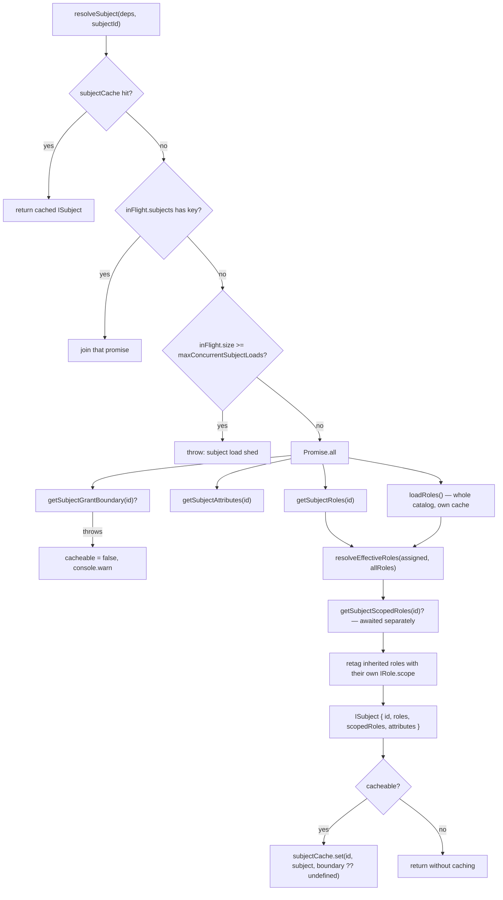

# RBAC, subject resolution, pending effects and batch writes

Four small modules that together decide *which roles a subject holds for this
request* and *how a write of that fact is applied*. `src/core/rbac` turns role
definitions into an ABAC policy and closes `inherits` chains;
`src/core/resolve` resolves condition field paths and answers the four
pattern-match questions (action, resource, hierarchical resource, scope);
`src/core/pending` buffers cache invalidations and mutation events for a
transaction-bound engine; `src/core/batch` shapes the per-row results of the
admin's set writes. About 800 lines of source, and most of the surprises in
this package live in the scope rules documented below.

Adapter internals are out of scope here — see [`adapters-sql.md`](./adapters-sql.md)
and [`adapters-runtime.md`](./adapters-runtime.md). How the compiled table
consumes any of this is [`core-engine.md`](./core-engine.md) and
[`compiled-engine-explained.md`](../compiled-engine-explained.md).

| Module | Public exports | Reached from |
| --- | --- | --- |
| `rbac/rbac.ts` | `rolesToPolicy`, `resolveEffectiveRoles`, `MAX_INHERITANCE_DEPTH`, `IAM_RBAC_POLICY_ID`, `IAM_RBAC_CONDITION_DEPTH` | `loadRbacPolicy`, `resolveSubject`, `compileTable` |
| `resolve/resolve.ts` | `resolve`, `matchesAction`, `matchesResource`, `matchesResourceHierarchical`, `matchesScope`, `clearPathCache`, `PATH_CACHE_MAX` | `evaluate`, `evaluatePolicyFast`, `scopeCovers` |
| `pending/pending.ts` | `createPending` (internal), `Pending` (type, public) | `buildBoundEngine` |
| `batch/batch.ts` | `batchResult`, `loopFallback`, `creditWrites`, `appliedRows` (internal), `Batch` (type, public) | `createAdmin`, drizzle adapter |

`createPending` and the `batch` helpers are **not** re-exported from the package
root — `src/core/index.ts` exports only their types. Consumers get `Pending`
through `engine.withTransaction(tx).pending` and `Batch.Result` as the return
value of `admin.assignRoles`. Don't import them from a deep path expecting a
stable API.

---

## 1. Roles and assignments

### The data model

Two independent records, and confusing them is the origin of most of §2.

A **role definition** is catalog data — one row per role, the same for every
subject (`src/core/types/access-control.ts:219`):

```typescript
interface IRole<TAction, TResource, TId, TScope> {
  readonly id: TId
  readonly name: string
  readonly description?: string
  readonly permissions: readonly IPermission<TAction, TResource, TScope>[]
  /** Parent role IDs to inherit permissions from (resolved recursively). */
  readonly inherits?: readonly string[]
  /** Default scope applied to all permissions in this role. */
  readonly scope?: TScope
  readonly metadata?: Readonly<IamPrimitives.Attributes>
}

interface IPermission<TAction, TResource, TScope> {
  readonly action: TAction | '*'
  readonly resource: TResource | '*'
  readonly scope?: TScope | '*'
  readonly conditions?: IConditionGroup
}
```

An **assignment** is subject data — one row per `(subjectId, roleId, scope?)`
triple, written through `admin.assignRole` / `admin.assignRoles`. The adapter
surfaces it in two halves, and the split is contractual
(`src/core/types/adapter.ts:183`):

- `getSubjectRoles(subjectId)` returns **only global (unscoped)** role ids.
  Scoped assignments must not be collapsed into this list.
- `getSubjectScopedRoles(subjectId)` (optional) returns
  `IScopedRole[]` — `{ role, scope?, attributes? }`.

An adapter that folds scoped grants into `getSubjectRoles` makes every scoped
grant global. The compliance suite pins the split; see
[`adapters-runtime.md`](./adapters-runtime.md).

### How a subject acquires roles

```
assignment rows ──> resolveSubject ──> ISubject { roles, scopedRoles, attributes }
                          │                              │
                          │                              └─> enrichSubjectWithScopedRoles(scope)
                          └─> resolveEffectiveRoles(assigned, allRoles)
```

`subject.roles` is the closure of the *global* assignments over `inherits`.
`subject.scopedRoles` is the closure of each *scoped* assignment, retagged (§3.4).
Only at request time does `enrichSubjectWithScopedRoles` merge the scoped half
into `roles` for the scope being asked about. Full sequence in §4.

### Inheritance

`resolveEffectiveRoles(assignedRoles, allRoles)` (`src/core/rbac/rbac.ts:200`)
walks `inherits` from each assigned id and returns the closed set. Three rules
that are not obvious:

**Shallowest-depth memo, not a visited set.** `bestDepth` records the shallowest
depth each role was reached at, and a re-reach at the same-or-greater depth
short-circuits (`rbac.ts:230`). A plain `visited` set pins a role to whatever
depth it was *first* reached at, so a role reached near the depth cut down a long
chain blocks a later, shallower path from expanding its ancestors — and then two
set-equal `inherits` arrays in different orders resolve to different permissions.
`inheritance-order-independence.test.ts` builds exactly that graph (a hub that
reaches a hinge both at depth 1 and at depth 31) and pins that both orders agree.
The same memo cuts cycles: `a inherits b inherits a` terminates with `['a','b']`.

**A dangling inherited id is dropped; a dangling *assigned* id is kept.**
`rbac.ts:228` is `if (role === undefined && depth > 0) return`. An `inherits`
entry no role defines never reaches `subject.roles`. That matters because a role
id in `subject.roles` is not only a permission carrier — a hand-written ABAC rule
`subject.roles contains 'ghost'` fires on it. The operator route in is ordinary:
`deleteRole` cascades the role's *assignments* on every adapter, so the direct
grant goes, but an `inherits: ['ghost']` on a surviving role used to keep feeding
the id back and the check kept answering allow. `validateRoles` already calls
this catalog state `DANGLING_INHERIT` with `type: 'error'`. Depth 0 — the
subject's own assignment — is exempt: that is a row an operator wrote, and
dropping it would narrow `getEffectiveRoles` wherever the catalog is not the
sole authority on which ids exist.

**Depth is bounded at `MAX_INHERITANCE_DEPTH = 32`** (`rbac.ts:16`). Not
configurable, deliberately: one hard limit keeps every adapter and validator in
agreement. A 1000-deep linear chain resolves to ~33 roles and does not blow the
stack.

`collectPermissions` (`rbac.ts:32`) is the permission-side twin, with the same
memo and the same bound, and it returns `{ owner, perm }` pairs — **the role that
declared each permission travels with it**. That attribution is load-bearing for
scope (§3.4).

**The bound is a traversal bound, and the two twins are rooted differently.**
`resolveEffectiveRoles` walks from the roles a *subject* holds, so at depth > 32
from an assigned role an id stops entering `subject.roles`. `rolesToPolicy` runs
`collectPermissions` from **every role in the catalog** (`rbac.ts:114`), so a
role sitting past the cut from `r0` is still within 32 of some shallower role the
subject also holds — and that shallower role's rule carries the permission. In a
34-role linear chain assigned at `r0`, `getEffectiveRoles` omits `r33` while
`can()` grants `r33`'s permission through the depth-32 path from `r1`. Both halves
are pinned in `e2e-scope-inheritance.e2e.test.ts` (`describe('inheritance
depth')`). Scope still confines it: a past-cap role that declares its own scope
grants only there, and never enters the resolved set at that scope.

What to do about it: keep role graphs well inside 32 levels, and do not read
`getEffectiveRoles` as the enumeration of what `can()` will allow on a graph that
deep. `can()` is the authority on a verdict.

### The two 32s

They are unrelated numbers that happen to share a value.

| Constant | Value | Where | What it bounds |
| --- | --- | --- | --- |
| `MAX_INHERITANCE_DEPTH` | 32 | `src/core/rbac/rbac.ts:16` | how deep an `inherits` chain is walked |
| `IAM_MAX_COMPILED_ROLES` | 32 | `src/core/engine/engine.libs.ts:17` | how many roles the compiled table's grant mask can address |

The second is the "32-role cap" of [`engine-rewrite.md`](../engine-rewrite.md)
(see "The 32-role cap is a JS semantics wall, not a tuning knob"): a role's bit
position is `1 << index`, JS bitwise operators coerce to 32-bit and wrap the
shift amount mod 32, so role 32 would alias role 0's bit.

**What happens at role 33.** Nothing denies and nothing throws to the caller.
`compileTable` throws `IamRoleLimitExceededError`
(`src/core/engine/compiled/compiled.compile.ts:119`), the engine catches *that
error specifically* (`src/core/engine/engine.ts:466`), `console.warn`s once, and
returns `null` from `_getCompiledTable` — so **both** production and development
drop to the interpreter for every subsequent request. Verdicts are unchanged;
throughput is not. `healthCheck()` reports it explicitly
(`src/core/engine/engine.ts:1464`):

```typescript
const health = await engine.healthCheck()
health.compiledTable // { available: false, reason: 'role-limit-exceeded', roleCount: 41, limit: 32 }
```

Every other compile failure still throws and still denies — a malformed policy is
a bug, and answering it with a slower correct path would hide it.

Two consequences worth knowing. First, `e2e-scope-prod-parity.e2e.test.ts` pads a
catalog past 32 roles mid-suite and asserts every scoped answer is identical on
both sides of the cliff, so crossing it is safe for correctness. Second, the
`_roleLimitExceeded` flag latches so the compile is not re-attempted (and
re-thrown) on every request, but it is **cleared whenever the role set changes**
by `_clearRoleLimitLatch()` (`engine.ts:1398`). Three paths call it: a local
`cache.invalidate()` (`engine.ts:1365`), a local `cache.invalidateRoles()`
(`engine.ts:1409`), and a received cross-instance invalidate event of kind
`'all'` or `'roles'` (`engine.ts:340`) — so a replica drops the latch too rather
than staying stuck while the deleting instance recovers. Deleting roles back
under 32 and invalidating roles restores the compiled table on the next request;
no engine restart is needed. `_roleLimitReported` is reset alongside it, so a
second excursion over the limit warns again. Policy-only invalidation does not
clear it: policies cannot change the role count.

### `rolesToPolicy`: roles as one synthetic ABAC policy

```typescript
function rolesToPolicy(
  roles: AccessControl.IRole[],
  scopeMode: 'flat' | 'hierarchical' = 'flat',
): AccessControl.IPolicy
```

`src/core/rbac/rbac.ts:102`. One rule per `(role, permission)` pair — including
inherited permissions, flattened — inside a single policy:

| Field | Value |
| --- | --- |
| `policy.id` | `'__rbac__'` (`IAM_RBAC_POLICY_ID`) |
| `policy.algorithm` | `'allow-overrides'` |
| `rule.id` | `` `__rbac__#${n}` `` — a monotonic counter |
| `rule.effect` | always `'allow'` |
| `rule.priority` | `10` |
| `rule.description` | `` `${role.name}: ${action} on ${resource}` ``, plus `` ` (via ${owner.name})` `` when inherited |
| `rule.conditions` | `{ all: [ …base ] }`, or `{ all: [{ all: […base] }, perm.conditions] }` |

`IAM_RBAC_POLICY_ID` is exported because it is not a label: the evaluator has to
tell this policy apart from an operator-authored one. It is a union of
independent allow-only grants evaluated first-match-wins, not a single authored
unit whose rules read together — which decides what happens when one of its rules
throws.

Rule ids are a pinned contract (`rbac.test.ts` → `describe('rule id stability')`):
adapter ETags and external caches key on `rule.id`. The earlier
`rbac.${role}.${action}.${resource}.${i}` format produced ambiguous ids whenever
any segment contained a `.`.

Three details in the condition construction that each fixed a silent bug:

1. **The author's group is passed through whole**, never enumerated. Reading
   `any`/`none` by hand and falling through to `[]` for anything else dropped an
   unrecognised group — a typo'd key, a hand-edited row — and a conditional grant
   silently became unconditional. The shared `evalConditionGroup` reads an unknown
   group as `false`, so it fails closed instead. `rbac-scope-attribution.test.ts`
   pins `{"nome":[]}` surviving into the rule.
2. **The base conditions get their own `all` wrapper** (`rbac.ts:157`), so the
   author's group always sits one level down whatever its key is. Splicing an
   `all` body in-line was depth-neutral while `any`/`none` had to be nested, so
   the identical tree crossed `MAX_CONDITION_DEPTH` in one shape and not the
   other — and the deeper shape then failed closed with no validation error,
   which for allow-only role permissions is a silent denial.
   `permission-condition-depth-parity.test.ts` checks every nesting level from 1
   to `MAX_CONDITION_DEPTH + 1` for `all` vs `any` parity, against both the
   evaluator and `validateRole`.
3. **`IAM_RBAC_CONDITION_DEPTH = 1`** (`rbac.ts:86`) is the depth at which a
   permission's own condition group starts, because of that wrapper. Anything
   evaluating or checking a permission's conditions *outside* the generated
   policy must start there, not at `0`. The compiled table starting at `0` handed
   authors ten usable nesting levels in production and nine in development: at
   exactly `MAX_CONDITION_DEPTH` the table allowed and the interpreter denied.

---

## 2. Scope, mechanism one: the declared scope

A role or a permission **declares** a scope. This is catalog data and it
restricts *where the permission applies*.

```typescript
const effectiveScope = perm.scope ?? owner.scope        // rbac.ts:125
```

Permission-level wins over role-level. The declaring role's scope is used, not
the inheriting role's (§3.4).

**Only `undefined` and `'*'` are global.** Every other string — `''` included — is
an ordinary scope value:

```typescript
if (effectiveScope !== undefined && effectiveScope !== '*') { /* emit a scope condition */ }
```

Testing truthiness here let `scope: ''` grant everywhere. The compiled table's
`effectiveScopeOf` (`src/core/engine/compiled/compiled.compile.ts:88`) says the
same thing, and `matchesScope` (`src/core/resolve/resolve.ts:204`) is the module
that owns the contract:

| pattern | scope | `matchesScope` |
| --- | --- | --- |
| `undefined` / `null` | anything | `true` |
| `'*'` | anything, including `undefined` | `true` |
| `'org-1'` | `'org-1'` | `true` |
| `'org-1'` | `'org-2'`, `undefined`, `''` | `false` |
| `''` | `''` | `true` |
| `''` | `'org-1'`, `undefined` | `false` |

`validateRole` rejects `scope: ''` at both the role and the permission level, and
the shipped Postgres schema has `ch_iam_roles_scope_not_blank` /
`ch_iam_assignments_scope_not_blank` CHECK constraints — but a permission-level
`scope: ""` inside a `jsonb` column has no constraint, so that shape reaches the
engine from the store. `e2e-scope-tenant-isolation.e2e.test.ts` (`describe('what
the store will and will not hold')`) pins that it grants nothing at `undefined`,
`''`, the assignment scope, another tenant or `'*'`, rather than reading as
global. A permission-level `scope: null` behaves the same way; a permission-level
`scope: '*'` is global, and only for the role that declares it.

Under `scopeMode: 'hierarchical'`, `rolesToPolicy` widens the emitted condition
so a declared scope covers its descendants (`rbac.ts:133`):

```typescript
scopeMode === 'hierarchical'
  ? { any: [
      { field: 'scope', operator: 'eq', value: effectiveScope },
      { field: 'scope', operator: 'starts_with', value: `${effectiveScope}.` },
    ] }
  : { field: 'scope', operator: 'eq', value: effectiveScope }
```

Without that arm one config flag meant two different things: an *assignment* at
`org-1` reached `org-1.team-a` and an identical role-declared `scope: 'org-1'`
did not, so a hierarchical deployment silently lost every role-declared grant
below the exact level — and the obvious workaround is to widen the role to `'*'`.
`role-declared-scope-hierarchy.test.ts` covers both modes in both engines.

---

## 3. Scope, mechanism two: the assignment scope

An **assignment** carries a scope. This is subject data and it restricts *where
the subject holds the role*.

The two mechanisms compose by intersection. A role declaring `org-a`, assigned at
`org-b`, grants in neither: at `org-b` the role is held but its permission is
declared for `org-a`; at `org-a` the permission applies but the role is not held
there.

| | declared scope (`IRole.scope` / `IPermission.scope`) | assignment scope (the `(subject, role, scope)` row) |
| --- | --- | --- |
| lives in | the role catalog | the assignments table |
| answers | "where does this permission apply?" | "where does this subject hold this role?" |
| `'*'` means | global — no scope condition emitted | **refused on write** (see below); a stored one is the literal tenant `"*"` |
| `''` means | an ordinary scope; `validateRole` rejects it | refused on write by `iamAssertAssignableScope` |
| `undefined` means | global | global |
| matched by | the `scope` condition in `__rbac__`, or `RbacRuleGroup.scope` in the table | `enrichSubjectWithScopedRoles`, literal comparison |
| `scopeMode` | widens the emitted condition to `scope.*` | widens the match to every ancestor of the request scope |

### 3.1 `'*'` is refused as an assignment scope (breaking, commit 555fa090)

```typescript
await engine.admin.assignRole('u1', 'admin', '*')
// Error: [@gentleduck/iam:engine] scope must not be "*"; a scoped assignment is
// matched literally, so this grant would be stored and answer only a request
// whose own scope is the string "*". Omit the scope for a global assignment.
```

**Write it as `assignRole('u1', 'admin')` instead.** Omitting the scope is how
the contract spells global.

The reason it is refused rather than reinterpreted: `'*'` genuinely means "every
scope" on the *declared* axis — `IPermission.scope` is typed `TScope | '*'`, and
`matchesScope` / `scopeCovers` / `effectiveScopeOf` all read it as global — so
writing `assignRole(u, r, '*')` beside a role declared `scope: '*'` is the
obvious move. On an assignment it means nothing of the kind.
`enrichSubjectWithScopedRoles` compares the stored scope literally, so before the
guard the row landed, `assignRole` resolved, `admin.assignRoles` reported
`ok: true, applied: 1`, and `getEffectiveRoles` returned `[]` for every real
scope *and* for the unscoped request. The one request it answered was one whose
own scope is the string `"*"` — a string-comparison coincidence, not a use for
the grant. That is the same silent success `iamAssertNoAssignOptions` refuses for
a dropped `expiresAt` and `iamAssertRoleExists` refuses for an unknown role id.

The guard is `iamAssertAssignableScope(adapter, scope, intent)`
(`src/shared/scope.ts:60`). It also refuses `''`, which five of the six adapters
accepted with five different outcomes.

**Lookups are exempt.** `intent: 'lookup'` allows `'*'`, because a revoke
addresses a row that already exists and an operator holding pre-guard `'*'` rows
has to be able to delete them:

```typescript
await engine.admin.revokeRole('u2', 'admin', '*')   // still works
```

The engine wraps it as `assertAssignableScope` (`engine.libs.ts:406`) and calls it
from `assertTriple` (`engine.libs.ts:409`), whose `intent` parameter defaults to
`'grant'`. Where each intent applies:

| Call | `scope` argument intent |
| --- | --- |
| `assignRole`, `assignRoles` rows | `grant` |
| `revokeRole`, `revokeRoles` rows | `lookup` |
| `updateAssignmentScope` / `moveRoleScopes` `fromScope` | `lookup` |
| `updateAssignmentScope` / `moveRoleScopes` `toScope` | `grant` |

A move reads one scope and writes the other, so `'*'` may be moved *off*, never
*to* (`engine.libs.ts:616`, and `engine.libs.ts:680` for the batch form).

The check runs in `createAdmin` as a **pre-pass over the whole batch** before any
row is written, not per row. The adapters guard their own `assignRole`, which for
a batch is inside the write loop — a batch carrying one `'*'` row would write
every row before it and then throw, which is exactly the half-applied batch the
pre-pass exists to prevent. The adapter-level guard stays as the backstop for a
caller who reaches the adapter directly (all six adapters have it).

### 3.2 `scopeMode` and `scopeCombine`

`enrichSubjectWithScopedRoles` (`src/core/engine/engine.libs.ts:274`) merges the
scoped assignments that match this request's scope into `subject.roles`:

```typescript
function enrichSubjectWithScopedRoles<TScope extends string = string>(
  subject: IamRequest.ISubject,
  scope: TScope | undefined,
  scopeMode: 'flat' | 'hierarchical' = 'flat',
  scopeCombine: 'union' | 'override' = 'union',
): IamRequest.ISubject
```

- **No request scope** (`scope == null`) or no `scopedRoles`: the subject is
  returned unchanged. A scoped grant never answers an unscoped request.
- **`flat`** (default): `sr.scope === scope`, exact string equality.
- **`hierarchical` + `union`** (default combine): every ancestor level matches.
  `scopeAncestors('org-1.team-2.repo-3')` is
  `['org-1.team-2.repo-3', 'org-1.team-2', 'org-1']`, specific first.
- **`hierarchical` + `override`**: walks ancestors specific-first and stops at the
  **first level that has any grant at all**, discarding every ancestor level above
  it.

`scopeCombine` is inert under `flat` — pinned in
`e2e-scope-modes-and-order.e2e.test.ts`. The prefix is a path segment, not a
string prefix: `org-10` is not under `org-1`, and `org-a` is not under `org`.
`enrichSubjectWithScopedRoles` gets that by matching against
`scopeAncestors(scope)`, which cuts at each `.`; `scopeCovers` and the
hierarchical `rolesToPolicy` condition get it by requiring `scope + '.'`.

`override` never grants anything `union` would not (also pinned), but it can deny
what `union` allows. The shape that surprises people is inheritance-driven:

> **Override shadowing.** `mgr` is assigned at `org-a` and inherits `team-tools`,
> which *declares* `org-a.team-1`. The retag (§3.4) files a scoped role at
> `org-a.team-1` that nobody assigned there, so `org-a.team-1` is now "a level
> that has a grant" — and under `override` it wins, discarding `mgr` itself.
> At `org-a.team-1` the subject holds `['team-tools']` and `can(write)` is
> `false`; at `org-a` it is `true`. Pinned in
> `e2e-scope-modes-and-order.e2e.test.ts`.
>
> **What to do about it.** `override` is only meaningful under
> `scopeMode: 'hierarchical'`, and it takes its input from the *retagged* scoped
> roles, not from the assignment rows. If your catalog has roles that declare
> scopes below the level you assign at, use `scopeCombine: 'union'` (the
> default), or keep declared scopes off the inherited roles and let the
> assignment scope carry the confinement.

The engine's own scope walk is public, so callers doing scope-aware rank or reach
calculations use the same relation rather than reimplementing it:

```typescript
import { iamScopeAncestors, iamScopeCovers } from '@gentleduck/iam'

iamScopeAncestors('org-1.team-2')             // ['org-1.team-2', 'org-1']
iamScopeCovers('org-1', 'org-1.team-2', 'hierarchical')  // true
iamScopeCovers('org-1', 'org-1.team-2', 'flat')          // false
```

`scopeCovers` (`engine.libs.ts:234`) routes its exact-match arm through
`matchesScope` rather than re-implementing `===`. The scope contract was
documented in `resolve.ts` and enforced by three unrelated expressions elsewhere,
which is how the truth tables came to disagree.

### 3.3 Tenant isolation, measured

`e2e-scope-tenant-isolation.e2e.test.ts` runs a subject holding `admin` at
`org-a` and nothing else against eighteen spellings of "somewhere that is not
org-a" on real Postgres — `'org-b'`, `undefined`, `''`, `'*'`, `'org-ab'`,
`'org'`, `'org-a.team-1'`, `'org-a.'`, `'.org-a'`, `'org-a..team-1'`, `'ORG-A'`,
`' org-a'`, `'org-a '`, `'org-а'` (Cyrillic а), `'org-a\x00'`, `'org－a'`
(full-width hyphen), `"org-a' OR '1'='1"`, `'org-a%2Eteam-1'`. All deny, and
`getEffectiveRoles` and the `permissions()` batch agree with `can()` on every one.

### 3.4 The retag: how the two mechanisms interact

This is the part that produces answers people do not expect, so it is worth
stating precisely. Inside `resolveSubject`
(`src/core/engine/engine.loaders.ts:210`):

```typescript
const scopedRoles = assignedScopedRoles?.flatMap((sr) =>
  resolveEffectiveRoles([sr.role], allRoles).map((role) =>
    role === sr.role ? { ...sr, role } : { ...sr, role, scope: rolesById.get(role)?.scope ?? sr.scope },
  ),
)
```

A scoped assignment is closed over `inherits` too, so a check at the
inherited-into scope can see it. The **direct** assignment keeps the row's scope —
that is the scope it was actually assigned at. Every **inherited** role is
retagged with *its own* `IRole.scope`, falling back to the row's scope when it
declares none. That matches how `rolesToPolicy` gates each role's rules, so the
interpreter and the compiled table agree.

The consequences, each pinned in `e2e-scope-inheritance.e2e.test.ts`:

- **Cross-tenant reach.** `lead` (no declared scope) inherits `b-admin`
  (declares `org-b`), assigned to `u1` at `org-a`. Then
  `getEffectiveRoles('u1', 'org-a') === ['lead']` and
  `getEffectiveRoles('u1', 'org-b') === ['b-admin']`. A grant made only in org-a
  produces an allow in org-b. Consistent with the catalog; also the shape an
  operator is most likely to get wrong.
- **Upward escalation.** A grant made only at `org-a.team-1`, of a role that
  inherits one declaring `org-a`, answers at `org-a`. This happens in **flat**
  mode too — it is not a hierarchy walk, it is the retag.
- **Subtree widening.** An inherited role declaring a root scope (`org`) widens
  one grant at `org-a` to `org` and everything under `org.*` in hierarchical
  mode — including other operators' tenants there. `org-a` itself stays denied:
  it is not under `org`, because the separator is `.`, not `-`.
- **Diamonds carry per-path scope.** An unscoped inner role reached through an
  `org-a` parent and an `org-b` parent grants in `org-a`, `org-b` *and* the
  assignment scope. This is why the flattening in `collectPermissions` cannot be
  removed (see "Behaviour worth knowing", item 1).
- **A declared scope confines only the permissions the role declares itself.**
  `a-lead` declares `scope: 'org-a'`, carries `write doc`, and inherits the
  unscoped `base`, which carries `read doc`. Assigned *at `org-a`*, both are
  confined to `org-a` — the assignment scope does the confining. Assigned
  *unscoped*, `write doc` is still confined to `org-a` by `a-lead.scope`, while
  `read doc` is evaluated with `base`'s absent scope and answers in every tenant
  and for the unscoped request. Pinned in `e2e-scope-inheritance.e2e.test.ts`
  (`describe('a role DECLARING org-a that inherits an unscoped role')`).

  **What to do about it.** `IRole.scope` is a default applied to *that role's
  own* permissions, not a ceiling on everything the role reaches. To confine an
  inherited permission, declare the scope on the role that declares the
  permission, put it on the permission itself, or scope the assignment rather
  than the role.

---

## 4. `resolveSubject` and scoped-role enrichment

`resolveSubject(deps, subjectId)` (`src/core/engine/engine.loaders.ts:148`) is
the full authorization picture for one subject. It is not a plain cached read.



### What is read

Four adapter reads, three of them in one `Promise.all`:

| Read | Optional | Notes |
| --- | --- | --- |
| `getSubjectRoles(subjectId)` | no | global assignments only |
| `getSubjectAttributes(subjectId)` | no | the subject's attribute bag |
| `loadRoles()` → `adapter.listRoles()` | no | the **whole** catalog, via its own cache + single-flight |
| `getSubjectGrantBoundary(subjectId)` | yes | advisory; see below |
| `getSubjectScopedRoles(subjectId)` | yes | awaited *after* the `Promise.all`, not inside it |

Every read goes through `deps.withTimeout`, so an adapter that hangs aborts
rather than pinning the single-flight slot.

Roles are loaded whole rather than per-subject because inheritance closure needs
the full graph: `resolveSubject` cannot expand `inherits` from a subject's
directly assigned ids alone.

### What is cached

- **The `ISubject`**, keyed by `subjectId`, in `deps.subjectCache`.
- **The role catalog**, under one key in `deps.roleCache`, shared by every
  subject.
- The generated `__rbac__` policy in `rbacPolicyCache`, deep-frozen before
  caching so a caller mutating a rule in place cannot silently rewrite the
  authorization model for everyone.

Two mechanisms guard the subject cache:

**Single-flight.** A burst of concurrent checks for the same subject issues one
set of adapter reads; the rest join the in-flight promise.

**Load shedding.** `maxConcurrentSubjectLoads` (default `512`; `0` means unbounded) caps the
number of *distinct* subject loads in flight. Past it, `resolveSubject` **throws**
`subject load shed: N concurrent subject loads already in flight (cap M)`. Cache
hits and joins onto an existing load never count against the cap. Without it, a
cold cache hit by many distinct subjects opens one adapter call each with no
back-pressure.

**The grant boundary.** When the adapter can say when this subject's grants next
change (a time-boxed assignment about to expire, or one about to start), the
entry is cached only until then rather than for the full TTL. The read is
advisory: if it *throws*, `cacheable = false` and the subject is resolved but not
cached at all. A `null` boundary means "nothing changes for a while" and buys a
full TTL — which is precisely the stale allow the boundary exists to prevent, so
"the store could not answer" must not be spelled the same way.

### What an unresolvable subject produces

Three distinct outcomes, and they are not the same:

| Situation | `resolveSubject` | `can` | `check` (development) | `getEffectiveRoles` |
| --- | --- | --- | --- | --- |
| Subject id that exists nowhere | an **empty subject**: `{ id, roles: [], scopedRoles, attributes: {} }`, where `scopedRoles` is `[]` or `undefined` depending on the adapter | `false` unless a policy allows without roles | an ordinary deny decision | `[]` |
| `subjectId` not a string, empty, or > 1024 chars | never called | `false` | `failure: 'input'`, `reason: 'invalid subjectId'` | `[]` |
| Adapter down, timeout, `maxRoles` exceeded, load shed | **throws** | caught → `false`, `onError` fired | `failure: 'resolution'`, `reason: 'Subject resolution error'` | **throws to the caller** |

An unresolvable subject is never a throw to the caller of `can`/`check` and never
an implicit allow: it is an empty subject, or a fail-closed deny.

`can` (`src/core/engine/engine.ts:943`) and `check` (`engine.ts:1001`) each wrap
`_resolveSubject` in their own try/catch, because those errors escape
`authorize()`'s catch. In development the decision carries `failure`, so a caller
can answer 503 for `'resolution'` and 403 for an ordinary deny; production
returns a bare boolean and the distinction is only available through `onError`.

`getEffectiveRoles` does **not** catch. It returns `[]` for an invalid
`subjectId`, but an adapter outage rejects. Wrap it if you call it on a request
path.

### Enrichment at request time

`enrichSubjectWithScopedRoles` runs per request, not per resolve — the cached
`ISubject` carries `roles` and `scopedRoles` separately, and the merge is a
function of *this* request's scope (§3.2). It runs in `authorize`
(`engine.ts:771`, only when `req.scope` is set and `scopedRoles` is non-empty),
in `getEffectiveRoles` (`engine.ts:986`), in `explain` (`engine.ts:1085`), and
once per distinct scope in the `permissions()` batch, memoized in
`enrichedByScope` (`engine.ts:1206`). `can` and `check` do not call it
themselves — they reach it through `authorize`. It returns the
original subject object unchanged when nothing matches, and the callers compare
by identity to avoid a needless request clone.

`authorize` also normalises a non-array `subject.roles` to `[]` before anything
else: a bare string would substring-match a `contains <role>` condition.

---

## 5. `src/core/resolve`: field paths and pattern matching

`resolve(request, path, caches?)` (`src/core/resolve/resolve.ts:79`) is the field
resolver every condition goes through.

```typescript
function resolve(
  request: IamRequest.IAccessRequest,
  path: string,
  caches?: { path?: Map<string, string[] | null> },
): IamPrimitives.AttributeValue
```

Two shorthands are handled before anything else: `'action'` and `'scope'` (the
latter returns `null`, never `undefined`, when absent). Otherwise the path is
split and validated once, then memoized:

- The root must be in `ALLOWED_ROOTS` — `subject`, `resource`, `environment`.
- No segment may be in `BLOCKED_SEGMENTS` — `__proto__`, `constructor`,
  `prototype`.
- Rejections are **negative-cached** (`null` stored under the path), so a blocked
  path is rejected once at parse time rather than walked per request.

`BLOCKED_SEGMENTS` is exported for exactly one consumer: `isResolvablePath` in
`src/core/validate/validate.libs.ts:94`, which must refuse what the resolver
refuses. It shared only `ALLOWED_ROOTS`, so `subject.__proto__.x` passed
validation with no issue and then resolved to `null` — the inert condition the
validator exists to catch. On a `deny` rule that is a rule that can never fire.

**Own properties only.** The walk is `Object.hasOwn(node, seg) ? Reflect.get(node, seg) : undefined`
(`resolve.ts:101`). `Reflect.get` alone resolves through the prototype chain, so
`toString`, `valueOf`, `hasOwnProperty`, `__defineGetter__` and every other
`Object.prototype` member resolved to a *function* on any object — and an
`exists`-gated allow fired against a subject with no attributes at all. `exists`
asks whether the request *carries* the attribute, which is an own-property
question. A subject attribute literally named `toString` still resolves; the fix
is about ownership, not about the name.

**The return type is established, not asserted.** `isAttributeValue`
(`resolve.ts:122`) narrows the resolved node: scalars, arrays of scalars, and
plain (or null-prototype) objects whose values are all scalars. A `Date`, a `Map`,
a class instance, a function, a doubly-nested object or a mixed array all resolve
to `null`. Adapters deserialize JSON and hand the result straight through, so
these genuinely arrive; asserting the type left each operator's own `typeof`
guard as the only thing between a non-conforming value and a wrong comparison,
and a `false` from a deny rule's condition is a silent grant. `null` is
NotApplicable, which the condition system already handles. The walk still
*descends* through a nested object even though the object itself is not a value —
`subject.attributes.nested.deep` resolves.

### The path cache

`pathCache` is process-wide, capped at `PATH_CACHE_MAX = 10_000` entries with
FIFO eviction (~2 MB worst case). Pass a per-Engine map to keep tenants from
evicting each other:

```typescript
resolve(request, 'subject.attributes.tier', { path: myEngineCache })
```

`pathCache` and `ALLOWED_ROOTS` are deliberately **not** re-exported from
`src/core/resolve/index.ts:1`. Handing out the mutable `Map` lets a consumer seat
a bogus segment list under a path a deny rule resolves; `ALLOWED_ROOTS` is typed
`ReadonlySet` but erases to a live `Set`, so `.delete('subject')` makes every
`subject.*` path unresolvable — and `pathCache` memoizes that, so it sticks.
`clearPathCache()` covers the one legitimate operator need (multi-tenant
operators flushing periodically) and empties only the process-wide map.

### Pattern matching

| Function | `'*'` | Exact | Recursive |
| --- | --- | --- | --- |
| `matchesAction(pattern, action)` | all | yes | `'posts:*'` matches `posts:read` |
| `matchesResource(pattern, type)` | all | yes | both `':*'` and `'.*'` suffixes |
| `matchesResourceHierarchical(pattern, type)` | all | yes | only `'.*'` — **exported, not used by the engine** |
| `matchesScope(pattern, scope)` | all (also `undefined`/`null`) | yes | none — see `scopeCovers` |

`matchesResource` is the one the engine calls, at every level: rule targets,
policy targets and `explain()`. `matchesResourceHierarchical` is the strict
dot-only variant, a subset of it, kept exported for callers who want dot
semantics with no `':*'` support.

A bare pattern is a literal: `matchesResource('org', 'org:project')` is `false`,
and `matchesResourceHierarchical('dashboard', 'dashboard.users')` is `false`.
Authors opt into recursion with `'org:*'` / `'dashboard.*'`. The separator comes
from the pattern, so `'a.b.*'` does not match `'a:b:c'` and vice versa. `'.*'`
does not match the bare parent: `matchesResourceHierarchical('dashboard.*', 'dashboard')`
is `false`.

---

## 6. `src/core/pending`: buffered effects for a transaction

"Pending" here has nothing to do with a pending *decision* or a pending
*assignment*. Nothing in this module affects an authorization verdict. It is the
buffer for the two side effects an admin write normally performs immediately —
**cache invalidation** (including the fleet-wide broadcast through
`config.invalidator`) and **mutation events** (`hooks.onMutation`) — held until
the caller's database transaction commits.

A write is "pending" exactly when it was made through
`engine.withTransaction(tx).admin`. The row itself is written immediately, inside
the caller's transaction, by the transaction-bound adapter. What is deferred is
telling anyone about it.

```typescript
let pending
await db.transaction(async (tx) => {
  const perms = engine.withTransaction(tx)
  await perms.admin.assignRole(userId, 'admin', orgId)
  await tx.insert(members).values({ userId, orgId })
  pending = perms.pending
})
await pending.flush()   // invalidate, broadcast and emit only after the commit
```

Why: a rollback must not evict every node's cache for a write that did not
happen, and must not emit `role.assigned` for a grant the database threw away.
`pending.discard()` is the explicit rollback path.

Reads on the bound view still see the transaction's own uncommitted writes,
because `buildBoundEngine` gives the local engine *fresh, empty* caches that
always miss through to the transaction-bound adapter
(`src/core/engine/engine.bound.ts:75`). Each admin write hits two sinks: the
local caches drop the entry immediately with `broadcast: false`, and the pending
buffer records it for the shared caches.

### The API

```typescript
function createPending<TRole extends string = string, TScope extends string = string>(
  target: Pending.ICacheSink<TRole>,
  onMutation?: (event: IamEngineTypes.IMutationEvent<TRole, TScope>) => void | Promise<void>,
): {
  cache: Pending.ICacheSink<TRole>
  mutations: Pending.IMutationSink<TRole, TScope>
  pending: Pending.Effects<TRole, TScope>
}
```

`ICacheSink` and `IMutationSink` are exactly the structural shapes `createAdmin`
expects for its second argument, which is what lets a buffering sink stand in for
a real engine with no change to `createAdmin`.

`Pending.Effects` is what a consumer holds (`src/core/pending/pending.types.ts:38`):

| Member | Contract |
| --- | --- |
| `size` | distinct buffered invalidations |
| `mutationSize` | buffered mutation events |
| `flush(): Promise<void>` | applies in record order; idempotent; see below |
| `discard(): void` | drops both buffers |
| `peek()` | a **copy** of the invalidation buffer |
| `peekMutations()` | a **copy** of the mutation buffer |

`peek` returns a fresh array each read. The declared `readonly` erases at
runtime, and the live array is about to be flushed — a caller could otherwise
inject or reorder entries in it.

### De-duplication is asymmetric

Invalidations de-duplicate by cache key, so a long transaction touching one
subject a thousand times flushes one invalidation. `sameEntry`
(`src/core/pending/pending.ts:5`) treats `{kind:'roles', roleId:'admin'}`,
`{kind:'roles', roleId:'editor'}` and a bare `{kind:'roles'}` as three distinct
entries.

Mutation events do **not** de-duplicate: each write is a distinct entry in the
consumer's history, and collapsing two grants into one would misreport what
happened.

### `flush()` semantics

1. The invalidation buffer is **taken before applying**, so an invalidation
   triggered *during* the drain lands in the next batch rather than appending to
   this one — otherwise a re-entrant target either loses the entry or loops
   forever.
2. Each entry is applied to `target` in record order. A throwing entry is
   collected, not abandoned: the loop continues. The target fans out to the fleet
   invalidator, so a throw is a network failure, and the entries belong to a
   transaction that has **already committed** — dropping one leaves every node's
   cache answering from pre-commit state, which is a stale allow after a revoke.
3. Mutation events drain **after** the invalidations, so a consumer reacting to
   an event already reads post-invalidation caches. They drain even when an
   invalidation failed: the transaction committed, so the history is true
   whatever the cache fan-out did.
4. A throwing `onMutation` is logged and **swallowed**, never re-buffered. The
   hook is an observer; a retry of `flush()` exists to re-apply invalidations,
   and dragging a buggy handler through every retry would block them.
5. If anything failed, the failed entries are put back at the **front** of the
   buffer (ahead of anything recorded during the drain, and de-duplicated against
   it) and an `AggregateError` is thrown:
   `N of M invalidations could not be applied and remain buffered - retry flush()`.
   Its `.errors` carries every failure, not only the first.

A retry re-applies exactly the failed entries; the ones that already succeeded
are not re-broadcast. A flush with nothing buffered is a no-op.

---

## 7. Batch writes

### The API

`engine.admin` exposes four list-taking methods
(`src/core/engine/engine.types.ts:122`):

```typescript
assignRoles(rows: readonly IAssignRow[]): Promise<Batch.Result<IAssignRow, Batch.Change>>
revokeRoles(rows: readonly IRevokeRow[]): Promise<Batch.Result<IRevokeRow, Batch.Change>>
moveRoleScopes(rows: readonly IMoveRow[]): Promise<Batch.Result<IMoveRow>>
invalidateSubjects(subjectIds: readonly string[]): void
```

`invalidateSubjects` is the odd one out: it is synchronous, returns `void`, and
produces no outcomes. It only collapses duplicate ids and drops cache entries.

Row shapes: `ITripleRow` is `{ subjectId, roleId, scope? }`; `IAssignRow` adds
`opts?: IAssignOptions` (`startsAt`, `expiresAt`, `attributes`, `actor`);
`IRevokeRow` adds `opts?: IRevokeOptions`; `IMoveRow` is
`{ subjectId, roleId, fromScope?, toScope?, actor? }`.

```typescript
const result = await engine.admin.assignRoles([
  { subjectId: 'u1', roleId: 'admin' },
  { subjectId: 'u2', roleId: 'editor', scope: 'org-1' },
])
result.applied            // 2 — always outcomes.length
result.outcomes[0].row    // the very object you passed in
result.outcomes[0].value  // { changed: true } | { changed: false } | {}
```

### Every outcome is `ok`

```typescript
type Outcome<TRow, T = void> = { row: TRow; ok: true; value: T }
```

`src/core/batch/batch.types.ts:38`. This is **not** a discriminated union. There
is no `ok: false` arm and no `FailureReason`. Both role writes are idempotent, so
a row the statement did not move is still applied — the postcondition ("the
subject does / does not hold this role here") holds either way — and reporting it
as a miss would contradict the single-row `assignRole`, which calls the same case
success. An earlier version *did* carry an `ok: false` arm; nothing in the
package could produce one, both producers hard-coded `ok: true`, and the `failed`
counter derived from it was structurally always zero. `if (!outcome.ok)` was dead
code against a documented contract.

The outcome carries the **row**, not an id. A role assignment is a
`(subject, role, scope)` triple of free-form strings, and every encoding of three
of those into one key is ambiguous or unreadable — an earlier version joined them
with a space, so `('a b', 'c')` and `('a', 'b c')` collided, and nothing rejects
a space in a subject id. Outcomes are in input order, so index matching stays
exact, and two structurally identical rows stay two addressable entries.

### `changed`, and how a write is credited

```typescript
type Change = { readonly changed?: boolean }
```

| `changed` | Meaning |
| --- | --- |
| `true` | this row accounts for a write the statement made |
| `false` | the row was already in the requested state, **or** an earlier row of the same batch already accounts for that write |
| absent | the driver could not say, and did not guess |

Absent on MySQL (no `RETURNING`) and on every adapter that loops the single-row
methods, which return `void`. Neither pays an extra read to find out.

`creditWrites(requested, written, accountsFor)` (`src/core/batch/batch.ts:49`)
implements the rule: requested rows are walked in order and each claims **one**
write not already claimed. So:

- Listing the same triple twice reports `true` then `false` — the database made
  one write.
- Revoking `{u1, admin}` alongside `{u1, admin, scope: 'org-1'}` credits the
  wildcard row, which already covers the narrower one. Neither is rejected; both
  are answered honestly.
- A wildcard revoke that removed three rows claims **one** write, not three —
  claiming all three would starve two later rows that each genuinely accounted
  for one.
- Three identical requests against two writes credit indices `[0, 1]`, never all
  three.

The answer does not depend on the order the driver returned its rows in.

### Atomicity

**A batch is not atomic on its own.** What it is:

| Guarantee | Holds? |
| --- | --- |
| every row validated before any is written | yes — a pre-pass |
| all rows land or none, standalone | **no**, except where the adapter has a set-based form |
| all rows land or none, inside your transaction | yes — a throw aborts your transaction |
| each affected subject invalidated once | yes, however many rows named it |

Every failure is **hard**: a constraint violation or driver error throws. iam has
no optimistic-lock miss to soften, so an error means the write genuinely failed
and the caller's transaction should abort rather than the batch reporting a
per-row failure and carrying on. `loopFallback`
(`src/core/batch/batch.ts:24`) awaits serially and rejects on the first throw —
row three is never attempted after row two fails.

The pre-pass (`assertTriple` per row, `engine.libs.ts:624` for `assignRoles`,
`:653` for `revokeRoles`, `:675` for `moveRoleScopes`) validates
`subjectId`, `roleId`, `scope` and the `'*'`/`''` scope rules *before* the write
loop. It is a pre-pass and not a per-row check because a caller who fixes a
malformed row and retries would otherwise double-apply every row that had already
landed.

### Partial-batch failure semantics

When the write loop throws part-way, `settlePartialBatch`
(`engine.libs.ts:464`) runs before the error propagates:

- **Every requested subject is invalidated**, not just the landed ones. On the
  set-based path the adapter cannot say how far it got, and dropping a cache
  entry that did not need it costs one reload where keeping one costs a wrong
  answer. Letting the throw skip invalidation left the engine answering from a
  cache the store had moved past — for a revoke, a grant that outlives its own
  deletion, until the TTL expires. Measured: a three-row `revokeRoles` failing on
  row two left row one revoked in the store while `can()` still answered `true`.
- **Only rows known to have landed are announced.** On the loop path that is the
  rows before the failure; on the set-based path it is *none*, because emitting a
  grant that may not exist is the same defect pointed the other way.
- The events emitted on this path carry no `changed` (they go through
  `appliedRows(landed, null)`).
- The original error is then rethrown.

### Per-adapter differences

| Adapter | `assignRoleMany` / `revokeRoleMany` | `changed` |
| --- | --- | --- |
| drizzle (pg/sqlite) | one multi-row `INSERT … ON CONFLICT DO NOTHING … RETURNING`; one `DELETE` with an `OR`ed `WHERE … RETURNING` | reported |
| drizzle (mysql) | same statements, insert-ignore | **absent** — no `RETURNING` |
| drizzle without `ops.or` | `revokeRoleMany` degrades to one `DELETE` per row | reported |
| prisma, memory, file, redis, http | not implemented — `createAdmin` loops the single-row methods | **absent** |

`assignRoleMany` returns *indices into `rows`* rather than a subset of `rows`, so
two rows asking for the same write stay distinguishable and an implementation is
not silently required to return the very objects it was handed. `null` means
"written, but I cannot say which rows moved" — an honest answer that costs no
extra round trip. See `src/core/types/adapter.ts:247` for the full contract and
[`adapters-sql.md`](./adapters-sql.md) for the SQL.

`moveRoleScopes` has no set-based form to fall back *from*: it delegates per row
to the single-row move, which uses `adapter.updateAssignmentScope` when present
and emulates it with revoke + assign otherwise. The emulation checks the grant
actually exists first (`holdsGrant`) — falling through on a `false` return
created the grant for a subject who held nothing. If the revoke lands and the
re-grant throws, the subject's cache is invalidated before the error propagates,
so the failed move does not also leave a stale allow.

### Events

One `role.assigned` / `role.revoked` per row, with no de-duplication — two grants
of the same role are two entries in the consumer's history even though they are
one cache job. `changed` on the event is read off the outcomes rather than
recomputed, so what a consumer sees on the event and on the returned
`Batch.Result` cannot disagree. Every emit is placed after the adapter write has
resolved *and* after the cache invalidation, and is awaited: a consumer writing
the event to its own history table wants that write to have happened before
`assignRoles` resolves.

---

## Behaviour worth knowing before you design a role graph

Each of these is current, pinned behaviour. The section exists because each one
answers differently from what a first reading of the API suggests, not because
any of them is unsettled.

1. **The depth cap bounds traversal, not the grant.** `getEffectiveRoles` and
   `can()` can disagree past `MAX_INHERITANCE_DEPTH` — see §1, "The bound is a
   traversal bound". `rolesToPolicy` cannot be reformulated to close the gap
   without changing scope semantics: the flattening carries **per-path scope**
   (an inner role reached through an `org-a` parent and an `org-b` parent grants
   in both), which a single rule keyed on the declaring role cannot express. The
   test file records the attempt in full. **Do:** keep chains well inside 32.
2. **`IRole.scope` confines only that role's own permissions**, not what it
   inherits — §3.4. **Do:** declare the scope where the permission is declared,
   or scope the assignment.
3. **`scopeCombine: 'override'` reads the retagged scoped roles**, so an
   inherited role that declares a child scope shadows the parent assignment at
   that child — §3.2, "Override shadowing". **Do:** stay on the default `union`
   unless every declared scope in the catalog sits at or above the level you
   assign at.
4. **`_roleLimitExceeded` latches until the role set changes.** Once the catalog
   crosses 32 roles the engine stops retrying the compile
   (`src/core/engine/engine.ts:451` is the read of the flag), so nothing pays
   for a re-throw per request. `_clearRoleLimitLatch()` (`engine.ts:1398`)
   resets it on `cache.invalidate()`, on `cache.invalidateRoles()`, and on a
   received `'all'` / `'roles'` invalidate event — not on a policy write.
   Verdicts stay correct on the interpreter throughout. **Do:** after deleting
   roles back under 32, invalidate roles (or all) so the next request rebuilds
   the table; `healthCheck().compiledTable` reports `available: false` with a
   `roleCount` only while the latch is set.
5. **A role-level `scope: '*'` is honoured as global at runtime, but the field
   is typed `TScope`.** `IPermission.scope` is `TScope | '*'`
   (`src/core/types/access-control.ts:204`); `IRole.scope` is `TScope`
   (`:232`). Both `rolesToPolicy` (`rbac.ts:126`) and `effectiveScopeOf`
   (`compiled.compile.ts:90`) read `'*'` at either level as global, and
   `rbac.test.ts:185` pins that a role-level `'*'` emits no scope condition. The
   consequence is only for the type checker: under a narrowed `TScope` union,
   `scope: '*'` type-checks on a permission and does not on a role. **Do:**
   declare the global marker on the permission, or leave `IRole.scope` off
   entirely — omitting it is the same thing at runtime.

Two notes on the test suite rather than on behaviour:

- `empty-scope-contract.test.ts:43` says "`matchesScope` documents the contract
  but no production path calls it". `scopeCovers` (`engine.libs.ts:245`) has
  since been routed through `matchesScope` deliberately, so that comment no
  longer describes the code around it.
- `pending.test.ts` covers the invalidation buffer exhaustively, including every
  failure mode, and covers no mutation-event behaviour: the buffer's contract —
  not de-duplicated, drains after invalidations, drains even when an
  invalidation failed, a throwing `onMutation` is swallowed and not re-buffered
  — has no test in this module.
