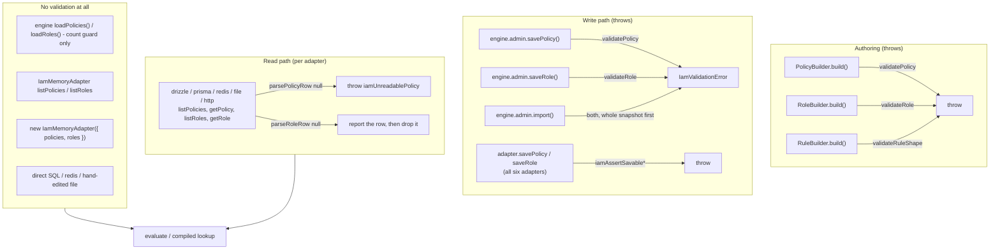

# Schema, types, validation and config

The four modules that describe what a policy *is* (`src/core/types`), what a
valid one looks like to an external tool (`src/core/schema`), what the runtime
will actually accept (`src/core/validate`), and how a consumer declares their
own action/resource vocabulary (`src/core/config`). Two of them are published
subpath entry points — `@gentleduck/iam/core/validate` and
`@gentleduck/iam/core/schema` — so everything here is API a user calls, not
engine internals. Read this to know which fields are optional and what omitting
one means, every refusal reason the validator can emit and how to fix it, and —
the part that bites — exactly which code paths run a validator and which do not.

Sibling docs: [`core-engine.md`](./core-engine.md) for how a config reaches the
engine and what `IamEngineTypes.IConfig` accepts,
[`core-builder.md`](./core-builder.md) for the authoring DSL that produces these
shapes, [`core-evaluate.md`](./core-evaluate.md) for what the operators do at
request time.

---

## 1. What each module publishes

| Import | Exports | Runtime cost |
|---|---|---|
| `@gentleduck/iam` (root) | every type namespace, `POLICY_JSON_SCHEMA`, `createIam`, `iamCreateEvalCaches` | types are erased; the schema is an `as const` object literal, ~8 KB once `JSON.stringify`d (it is not `Object.freeze`d) |
| `@gentleduck/iam/core/validate` | `validatePolicy`, `validateRole`, `validateRoles`, `parsePolicyRow`, `parseRoleRow`, `detectCatastrophicRegex`, `POLICY_LIMITS`, `MAX_FIELD_LENGTH`, `MAX_CONDITION_VALUE_LENGTH`, `MAX_UNBOUNDED_QUANTIFIERS`, `MAX_BOUNDED_QUANTIFIER`, `VALID_ALGORITHMS`, `VALID_EFFECTS`, `VALID_OPERATORS`, `type IamValidate` | ~12 KB gzipped |
| `@gentleduck/iam/core/schema` | `POLICY_JSON_SCHEMA` | data only |

The validator functions are **deliberately not re-exported from the root
barrel**. `src/core/index.ts:13` says so:

```ts
// validate is intentionally NOT re-exported. Import it via
// `@gentleduck/iam/core/validate` to opt in to the 12 KB validator chunk.
export type { IamValidate } from './validate'
```

The type namespace is re-exported (types cost nothing); the functions are not.
`import { validatePolicy } from '@gentleduck/iam'` will not resolve. The engine
itself reaches the module through a lazy `await import('../validate')`
memoised in `engine.libs.ts:38-48`, so an app that never calls an admin write
never loads it.

---

## 2. The type model

Everything in `src/core/types` is type-only except `iamCreateEvalCaches`
(`src/core/types/caches.ts:14`). Importing a namespace costs nothing in a
bundle. Every shape is generic over the caller's literal unions, which is what
turns a misspelled action into a compile error instead of a silent never-match.

### 2.1 Primitives

`src/core/types/primitives.ts` — the leaf types everything else is built from.

```ts
export namespace IamPrimitives {
  export type Scalar = string | number | boolean | null
  export type AttributeValue = Scalar | Scalar[] | Record<string, Scalar>
  export type Attributes = Record<string, AttributeValue>
}
```

Deliberately narrow: an attribute value has to be comparable by the condition
engine, serializable, and storable by every shipped adapter, so a value that
survives one backend cannot fail on another. `undefined` is not a member — a
missing attribute is an absent key, never a present-and-undefined one, which is
the same distinction `checkKnownKeys` makes (§4.6).

### 2.2 Conditions

`src/core/types/access-control.ts:65-98`.

```ts
export interface ICondition {
  readonly field: string                          // dot-path, e.g. 'subject.attributes.status'
  readonly operator: Operator
  readonly value?: IamPrimitives.AttributeValue   // omit ONLY for exists / not_exists
}

export interface IConditionAll  { readonly all:  ReadonlyArray<ICondition | IConditionGroup> }
export interface IConditionAny  { readonly any:  ReadonlyArray<ICondition | IConditionGroup> }
export interface IConditionNone { readonly none: ReadonlyArray<ICondition | IConditionGroup> }

export type IConditionGroup = IConditionAll | IConditionAny | IConditionNone
```

| Field | Optional | Omitting it means |
|---|---|---|
| `field` | no | — |
| `operator` | no | — |
| `value` | yes, in the type | For `exists` / `not_exists`, "unary operator, nothing to compare". For every other operator, `MISSING_VALUE` — the validator refuses it, because at evaluation `cond.value ?? null` reads as `null`, which compares equal to a missing attribute, so the guard passes for exactly the subjects it was written to exclude |

The three group arms are **named interfaces rather than anonymous object
literals**, and the reason is in the docblock at `access-control.ts:93`: a
schema generator that emits one schema per named type can reference this one and
stop, but given anonymous arms it inlines the tree into itself until the stack
goes — `nestia sdk` died with SIGSEGV and no message.

Exactly one key must be present. `{ all: [...], any: [...] }` is refused
(`INVALID_CONDITION`), because `evalConditionGroup` reads one key and ignores
the rest: the author's second restriction is simply gone. The test at
`src/core/validate/__tests__/validate-unknown-keys.test.ts:152` measures it —
`{ all: [], any: [<a condition that fails>] }` evaluates to `true`, while the
`any` alone evaluates to `false`.

Nesting is capped at `MAX_CONDITION_DEPTH` = 10 (`conditions.libs.ts:825`).
Deeper than that is `LIMIT_EXCEEDED`, and the comparison in the validator is
`depth >= MAX_CONDITION_DEPTH`, identical to the evaluator's. See §4.5.

### 2.3 Rules and policies

`src/core/types/access-control.ts:108-183`.

```ts
export interface IRule<TAction extends string = string, TResource extends string = string> {
  readonly id: string
  readonly effect: Effect                                 // 'allow' | 'deny'
  readonly description?: string
  readonly priority: number                               // must be finite
  readonly actions: readonly (TAction | '*')[]
  readonly resources: readonly (TResource | '*')[]
  readonly conditions: IConditionGroup                    // required; `{ all: [] }` is unconditional
  readonly metadata?: Readonly<IamPrimitives.Attributes>
}

export interface IPolicy<
  TAction extends string = string,
  TResource extends string = string,
  TRole extends string = string,
> {
  readonly id: string
  readonly name: string
  readonly description?: string
  readonly version?: number
  readonly algorithm: CombiningAlgorithm
  readonly rules: readonly IRule<TAction, TResource>[]
  readonly targets?: {
    readonly actions?: readonly (TAction | '*')[]
    readonly resources?: readonly (TResource | '*')[]
    readonly roles?: readonly TRole[]
  }
}
```

| Field | Optional | Omitting it means |
|---|---|---|
| `IRule.description` | yes | Nothing in audit logs or explain output names the rule's intent |
| `IRule.priority` | **no** | Not defaulted. A rule with no `priority` is refused (`INVALID_TYPE` at `rules[i].priority`). `NaN` and `±Infinity` are refused too — they break `highest-priority` ranking |
| `IRule.conditions` | **no** | Refused with `MISSING_FIELD`. Write `{ all: [] }` for an unconditional rule; the message says so |
| `IRule.metadata` | yes | No app bookkeeping attached |
| `IPolicy.description` | yes | — |
| `IPolicy.version` | yes | Adapters normalise an absent version to `1` on write (`shared/rows.ts:107`), so it comes back as `1` from every backend |
| `IPolicy.targets` | yes | The policy is applicable to every request. A target **narrows applicability**, which also widens what the policy refuses — see below |
| `targets.actions` / `.resources` / `.roles` | each yes | A dimension the target omits is one it does not constrain. It is *not* expanded to a literal `'*'`; that reading demanded every rule be a wildcard, and a target naming only `impersonate` was called unreachable because its rule allowed `.of('users')` |

**`targets` widens denial, not only inspection.** A matched target with no
matching rule folds `defaultEffect`, which is `deny`. That is why
`checkTargetIsReachable` (`src/core/validate/validate.ts:198`) exists and why it
reports an **error** rather than a warning: as an error it makes
`PolicyBuilder.build()` throw where the policy is written. The comment at
`validate.ts:253-255` gives the reason — as a warning the only visible symptom
was a denial, which reads as the permission system working.

The check only fires once the policy has at least one allow rule — a purely
restrictive policy denying everything it targets is the point of a restrictive
policy.

```ts
export type CombiningAlgorithm =
  | 'deny-overrides'    // any deny wins — the default choice
  | 'allow-overrides'   // any allow wins — best for RBAC / permissive rules
  | 'first-match'       // highest-priority match wins; ties by source order
  | 'highest-priority'  // identical to first-match

export type PolicyCombine =
  | 'and'               // every policy must allow; any deny is final. Default
  | 'allow-overrides'   // any policy that allows wins
  | 'first-applicable'  // first non-NotApplicable policy wins, including one voting its default
```

"Source order" is the order rules arrive in `policy.rules`, which for a stored
policy is the adapter's row order. Equal-priority rules of opposing effect make
the verdict depend on that order — give the rule you mean to win a higher
priority rather than trusting an adapter to return rows the same way twice.

### 2.4 Roles and permissions

`src/core/types/access-control.ts:194-234`.

```ts
export interface IPermission<TAction, TResource, TScope> {
  readonly action: TAction | '*'
  readonly resource: TResource | '*'
  readonly scope?: TScope | '*'
  readonly conditions?: IConditionGroup
}

export interface IRole<TAction, TResource, TId, TScope> {
  readonly id: TId
  readonly name: string
  readonly description?: string
  readonly permissions: readonly IPermission<TAction, TResource, TScope>[]
  readonly inherits?: readonly string[]
  readonly scope?: TScope
  readonly metadata?: Readonly<IamPrimitives.Attributes>
}
```

| Field | Optional | Omitting it means |
|---|---|---|
| `IPermission.scope` | yes | The permission is **global**, not scoped to nowhere. `''` is refused explicitly, because the redis encoding spells "no scope" as the empty string and `matchesScope` used to read an empty pattern as global — one contract, omit the field |
| `IPermission.conditions` | yes | Unconditional grant. When present, the group is validated at depth `IAM_RBAC_CONDITION_DEPTH` = 1, not 0 — see §4.5 |
| `IRole.inherits` | yes | No parents. Chains deeper than `MAX_INHERITANCE_DEPTH` = 32 are an **error**, because the runtime silently truncates past it and drops permissions invisibly |
| `IRole.scope` | yes | Unscoped role. `''` is refused for the same reason as the permission-level one; `validateRole` gained this check late — before it, `admin.saveRole({ scope: '' })` went through the *validated* write API and stored a role no request can satisfy |
| `IRole.metadata` | yes | — |
| `IRole.name` | **no in the type** | The runtime does not enforce it: `validateRole` checks `id`, `scope`, `permissions` and `inherits` and never reads `name`, so `{ id: 'role1', permissions: [...] }` returns `valid: true` and stores through `saveRole`. TypeScript is the only thing requiring it, so a role assembled from untyped JSON can reach a store without one. If your admin UI needs a display name, check `typeof role.name === 'string' && role.name !== ''` yourself before the write |

`rolesToPolicy()` turns every role into a single synthetic ABAC policy whose id
is `IAM_RBAC_POLICY_ID` = `'__rbac__'`, so RBAC and ABAC compose through one
engine. That policy is allow-only, which is why a throwing rule inside it
abstains rather than poisoning the policy — a skipped allow can only cost a
subject a grant, never suppress a denial. See [`core-rbac.md`](./core-rbac.md).

### 2.5 Subject, request, environment

`src/core/types/request.ts`.

```ts
export interface IScopedRole<TRole, TScope> {
  readonly role: TRole
  readonly scope?: TScope
  readonly attributes?: IamPrimitives.Attributes
}

export interface ISubject<TRole, TScope> {
  readonly id: string
  readonly roles: readonly TRole[]              // effective roles, after inheritance resolution
  readonly scopedRoles?: readonly IScopedRole<TRole, TScope>[]
  readonly attributes: Readonly<IamPrimitives.Attributes>
}

export interface IResource<TResource> {
  readonly type: TResource
  readonly id?: string
  readonly attributes: Readonly<IamPrimitives.Attributes>
}

export interface IEnvironment {
  readonly ip?: string
  readonly userAgent?: string
  readonly timestamp?: number
  readonly now?: number
  readonly [key: string]: IamPrimitives.AttributeValue | undefined
}

export interface IAccessRequest<TAction, TResource, TScope> {
  readonly subject: ISubject
  readonly action: TAction
  readonly resource: IResource<TResource>
  readonly scope?: TScope
  readonly environment?: IEnvironment
}
```

| Field | Optional | Omitting it means |
|---|---|---|
| `ISubject.scopedRoles` | yes | No scoped assignments; only the flat `roles` list applies. An adapter that omits `getSubjectScopedRoles` leaves this undefined |
| `IScopedRole.scope` | yes | A global grant of that role |
| `IScopedRole.attributes` | yes | Per-*assignment* attributes, distinct from `ISubject.attributes` which describe the subject globally. Undefined when the store carries none |
| `IResource.id` | yes | The check is about the resource *type*, not one instance |
| `IEnvironment.now` | yes | **Auto-injected by the engine as `Date.now()` when absent** (`ensureEnvNow`, `engine.libs.ts:26`), so `before` / `after` and `$environment.now` always resolve. An explicit `now` is never overwritten — pin it in tests or a `beforeEvaluate` hook |
| `IAccessRequest.scope` | yes | An unscoped request. Only globally-scoped grants and role-declared-`'*'` grants answer it |
| `IAccessRequest.environment` | yes | Only `now` is injected; every other environment path resolves to `null` |

`IEnvironment` carries a string index signature, which is what makes
`DotPath.FlexibleDotPaths` widen to accept any string for a context that
contains one (`dot-path.ts:65`).

### 2.6 Decision

`src/core/types/access-control.ts:240-271`.

```ts
export interface IDecision {
  readonly allowed: boolean
  readonly effect: Effect
  readonly rule?: IRule
  readonly policy?: string
  readonly reason: string
  readonly duration: number
  readonly timestamp: number
  readonly applicable?: boolean
  readonly failure?: 'input' | 'resolution' | 'evaluation'
}
```

| Field | Present when |
|---|---|
| `rule` / `policy` | A rule actually fired. Absent on a default-effect verdict and on a reserved-refusal denial |
| `applicable` | `false` when targets did not match — the policy is NotApplicable and contributes nothing to the cross-policy combine. Omitted or `true` otherwise |
| `failure` | Only when the deny came from the *engine failing*, never from a policy saying no. `'input'` = the request was rejected (a malformed `subjectId`, or the reserved refusal token); `'resolution'` = the subject could not be resolved, which is where an adapter outage lands; `'evaluation'` = evaluation threw |

`failure` exists so a caller can answer 403 for a legitimate deny and 503 for an
adapter outage. Production mode returns a bare boolean by design and has
nowhere to carry it — use the engine's `onError` hook there.

```ts
export type Mode = 'development' | 'production'
export type ModeResult<M extends Mode> = M extends 'production' ? boolean : IDecision
```

`'production'` is the default since 5.9.0 and returns plain booleans: no timing,
no allocation, no reason strings.

### 2.7 Assignment and adapter types

`src/core/types/adapter.ts`. These are the shapes the storage contract
exchanges; the full method contract is in
[`adapters-runtime.md`](./adapters-runtime.md).

```ts
export interface ITripleRow<TRole, TScope> {
  readonly subjectId: string
  readonly roleId: TRole
  readonly scope?: TScope
}
export interface IAssignRow<TRole, TScope> extends ITripleRow<TRole, TScope> { readonly opts?: IAssignOptions }
export interface IRevokeRow<TRole, TScope> extends ITripleRow<TRole, TScope> { readonly opts?: IRevokeOptions }

export interface IAssignOptions {
  readonly startsAt?: Date
  readonly expiresAt?: Date
  readonly attributes?: IamPrimitives.Attributes
  readonly actor?: string
}
export interface IActorOptions { readonly actor?: string }
export interface IRevokeOptions extends IActorOptions {}
```

The asymmetry in `IAssignOptions` is deliberate and load-bearing. An adapter
that cannot store `startsAt` / `expiresAt` / `attributes` **throws** rather than
dropping them — a time-boxed grant that silently became permanent is the exact
failure the contract exists to prevent. An adapter that cannot store `actor`
does **not** throw, because dropping `expiresAt` changes what the store answers
and dropping `actor` does not; the `role.assigned` mutation event carries the
actor regardless.

### 2.8 Client types

`src/core/types/client.ts`.

```ts
export type PermissionKey<TAction, TResource, TScope> =
  | `${TAction}:${TResource}`
  | `${TAction}:${TResource}:${string}`
  | `@${TScope}:${TAction}:${TResource}`
  | `@${TScope}:${TAction}:${TResource}:${string}`

export interface IPermissionCheck<TAction, TResource, TScope> {
  readonly action: TAction
  readonly resource: TResource
  readonly resourceId?: string
  readonly scope?: TScope
  readonly attributes?: IamPrimitives.Attributes
}
```

`attributes` is the named instance's own attributes, as `can()` would receive
them. It does not key the map: `resourceId` identifies the instance, and two
checks that differ only in `attributes` collide on one key.

The `@` marks the scope segment, so a three-segment key is never ambiguous
between a scoped check and an id-bearing one. The unmarked form `org:read:post`
is rejected by the type, and `types.test.ts:71` pins that as a compile-time
assertion. Inside a segment, `:` and a leading `@` are escaped — build keys with
`iamBuildPermissionKey` rather than by hand.

`engine.permissions()` returns `PartialPermissionMap`, not `PermissionMap`: the
full map requires every combination, which no caller ever has. Lookups already
default a missing key to `false`, so the two behave identically at runtime.

### 2.9 Dot-path types

`src/core/types/dot-path.ts` is the type machinery that gives `.attr()`,
`.resourceAttr()`, `.env()` and `.check()` their autocomplete. It is consumed
almost entirely by the builder — see [`core-builder.md`](./core-builder.md).
Three rules are worth knowing here because they decide what your editor offers:

- Arrays are **leaves**. `DotPaths<{ roles: string[] }>` is `'roles'`, not
  `'roles.0'`. `Date`, `Map`, `Set` and functions are leaves too.
- A type carrying a string index signature bails to `never` in `DotPaths`, and
  `FlexibleDotPaths` adds back a `(string & {})` arm so an open attribute bag
  accepts any string while a closed one stays narrow.
- `ResolvedResourceAttrPaths<Ctx, '*'>` merges every declared resource's
  attributes, so a wildcard rule can name any attribute defined on any resource.

---

## 3. The validators

### 3.1 Signatures

```ts
// @gentleduck/iam/core/validate
function validatePolicy(input: unknown, declared?: IamValidate.IDeclaredSurface): IamValidate.IResult
function validateRole(input: unknown): IamValidate.IResult
function validateRoles(
  roles: readonly AccessControl.IRole[],
  declared?: IamValidate.IDeclaredSurface,
): IamValidate.IResult

function parsePolicyRow<TAction, TResource, TRole>(raw: unknown): AccessControl.IPolicy<...> | null
function parseRoleRow<TAction, TResource, TRole, TScope>(raw: unknown): AccessControl.IRole<...> | null
```

| Function | Accepts | Returns | Throws |
|---|---|---|---|
| `validatePolicy` | `unknown` — a store row, an admin form payload, parsed JSON — plus an optional declared vocabulary | `IResult` | never; `validate-boundary-robustness.test.ts:16` pins that for malformed rule rows |
| `validateRole` | `unknown` | `IResult` | never — every path returns an `IResult`, including the `!isPlainObject` early return at `validate.ts:393` |
| `validateRoles` | `unknown` rows, plus an optional declared vocabulary | `IResult` | never — a row that is not an `IRole` is reported as an `INVALID_TYPE` issue (`validate.ts:43-67`), not thrown |
| `parsePolicyRow` | `unknown` | the row itself (same reference) when `valid`, else `null` | never |
| `parseRoleRow` | `unknown` | ditto | never |

`parsePolicyRow` returns the *identical object* on success — it is a validated
narrowing, not a copy or a normaliser. Warning-level issues do not stop it: a
`BROAD_ALLOW` policy still parses (`validate-rows.test.ts:44`).

Nothing here throws by design. The reason is stated at
`validate-boundary-robustness.test.ts:11`: these are the boundary functions for
untrusted JSON, and throwing means `admin.import` and every adapter row loader
propagate a raw `TypeError` with no issue naming the bad row. A `{ rules:
[null], targets: {…} }` policy used to do exactly that, from
`checkTargetIsReachable` reading `.effect` off a non-object.

### 3.2 The result shape

```ts
export interface IIssue {
  readonly type: 'error' | 'warning'
  readonly code: ValidationCode
  readonly message: string
  readonly roleId?: string   // set by role validation
  readonly path?: string     // dot-path into the offending field, set by policy validation
}

export interface IResult {
  readonly valid: boolean          // true when there are no error-level issues
  readonly issues: readonly IIssue[]
}
```

`valid` is computed as `issues.every(i => i.type !== 'error')`. **Warnings never
flip it.** The validators report rather than throw wherever a caller may want
every problem at once — an admin UI saving a policy should show all the issues,
not the first one.

Paths are array-indexed and stable: `rules[0].conditions.all[2].value`,
`permissions[1].resource`, `targets.actions`. Use them to drive field-level
error rendering.

### 3.3 Every refusal, and what to change

Errors block. Warnings do not.

| Code | Level | Emitted by | Means | Fix |
|---|---|---|---|---|
| `INVALID_TYPE` | error | policy, rule, role | The value is the wrong JS type: non-object policy/role, non-number `version`, non-object `targets`, non-array `targets.*`, non-finite `priority`, non-string action/resource, control chars (in a rule's `actions`/`resources`, a role `id`, or a permission's `action`/`resource` — §3.7 lists what is not covered), empty-string `scope`, non-array `inherits`, non-object `permissions[i]` | Fix the type. For `scope`, omit the field rather than passing `''` |
| `MISSING_FIELD` | error | policy, rule, role | A required field is absent or empty: policy `id` and `name`, policy `rules`; rule `id`, `actions`, `resources`, `conditions`; role `id`, `permissions`, `permissions[i].action`/`.resource`; condition `field`. Note the `name` here is the **policy** name — `validateRole` does not check a role's `name` (§3.7) | Supply it. For `conditions`, `{ all: [] }` is the unconditional spelling |
| `INVALID_ALGORITHM` | error | policy | `algorithm` is not one of the four | Use `deny-overrides`, `allow-overrides`, `first-match` or `highest-priority` |
| `INVALID_EFFECT` | error | rule | `effect` is not `allow` or `deny` | — |
| `INVALID_RULE` | error | rule | The rule is not a plain object (`null`, a string, an array) | — |
| `INVALID_CONDITION` | error | condition | Not an object; no `all`/`any`/`none` key; **more than one** of them; the group key's value is not an array | Split a multi-key group into nested single-key groups. The evaluator honours only one key, so the others are silently dropped |
| `INVALID_OPERATOR` | error | condition | `operator` is absent or outside the 19 | See §3.5 |
| `MISSING_VALUE` | error | condition | An operator other than `exists`/`not_exists` has no `value`, or has `value: undefined` | Supply an operand. `JSON.stringify` drops `undefined`, so both spellings arrive at a store identically and read as `null` at evaluation — equal to a missing attribute |
| `OPERAND_TYPE_MISMATCH` | error | condition | The operand's type does not match what the operator compares. See the matrix in §3.5 | Fix the operand type. `nin: 'gold'` should be `nin: ['gold']` |
| `LIMIT_EXCEEDED` | error | policy, rule, condition | One of the caps in §3.4 | Split the policy/rule, shorten the field or value, or flatten the condition tree |
| `UNKNOWN_FIELD` | error | policy, targets, rule, leaf condition, condition group | A key `POLICY_JSON_SCHEMA` forbids — it sets `additionalProperties: false` on each of those five. `checkKnownKeys` runs on those five and nowhere else, so a **role** or a **permission** carrying an extra key validates clean (§3.7) | Fix the spelling. A key explicitly set to `undefined` is **not** reported — `JSON.stringify` drops it |
| `ERR_REGEX_CATASTROPHIC` | error | condition | A `matches` pattern that `detectCatastrophicRegex` screens out | Rewrite the pattern; see §3.6 |
| `ERR_REGEX_INVALID` | error | condition | A `matches` pattern that will not compile | Fix the syntax. Uncompilable patterns do not raise at evaluation — `matches` returns `false`, retiring a deny-when-matches rule outright |
| `ERR_REGEX_USER_SOURCED` | error | condition | A `matches` pattern read from the request (`value` starting with `$`) | Use a literal pattern. `evalCondition` refuses a caller-supplied pattern outright (a ReDoS vector), so the condition would be false for every request that ever arrives |
| `UNREACHABLE_TARGET` | error | policy, roles | A `targets` pair no allow rule covers; or, via `createIam(...)`, a grant (`validateRoles`) or a rule / target entry (`validatePolicy`) naming an action, resource, scope or role the config never declared | Add a covering allow rule, narrow the target, or declare the vocabulary |
| `UNREACHABLE_TARGET` | **warning** | policy | The target's `(action, resource)` cartesian exceeds `cartesianPerRule`, so the check was skipped | Narrow the target to get it validated |
| `DUPLICATE_ROLE_ID` | error | roles | Two roles share an `id` | — |
| `DANGLING_INHERIT` | error | roles | A role inherits from an id no role is stored under | Add the parent, or drop the reference |
| `INHERITANCE_TOO_DEEP` | error | roles | A chain deeper than `MAX_INHERITANCE_DEPTH` (32) | Flatten it. The runtime caps there and drops the rest with no signal |
| `DUPLICATE_RULE_ID` | warning | policy | Two rules share an `id` | Diagnostics only — traces and explain output become ambiguous |
| `CIRCULAR_INHERIT` | warning | roles | An inheritance cycle | Runtime-safe (the walk cuts cycles with a shallowest-depth memo), so it is a warning |
| `EMPTY_ROLE` | warning | roles | No permissions and no inheritance | Usually a half-finished role |
| `BROAD_ALLOW` | warning | rule | `allow` on `['*']` × `['*']` with no conditions | Intentional for a super-admin; a warning so it does not block, but confirm it |
| `UNRESOLVABLE_FIELD` | warning | condition | `field` has no known root, or names a blocked segment | Use a `subject.` / `resource.` / `environment.` root or the `action` / `scope` shorthand, and no `__proto__` / `constructor` / `prototype` segment. Such a path resolves to `null` at evaluation, so the rule never matches — on a `deny` rule that is a rule that can never fire |
| `UNRESOLVABLE_VALUE` | warning | condition | A `$`-prefixed operand referencing a path that will not resolve | Same fix |

`UNRESOLVABLE_FIELD` is only a warning because the policy remains storable and
the resolver fails closed — `resolvable-path-parity.test.ts:73` pins that. It is
still the highest-value warning in the set: the whole job of `isResolvablePath`
is to flag a condition that can never fire, and until recently it shared
`ALLOWED_ROOTS` with the resolver but not `BLOCKED_SEGMENTS`, so a typo'd root
got a warning and `subject.__proto__.x` got silence.

### 3.4 Limits

Every constant below is exported from `@gentleduck/iam/core/validate` **except
`MAX_CONDITION_DEPTH` and `MAX_INHERITANCE_DEPTH`**, which that entry point uses
but does not re-export (`core/validate/index.ts:1-13`). Import those two from
the root barrel instead: `IAM_MAX_CONDITION_DEPTH` (renamed on the way out at
`core/conditions/index.ts:48`) and `MAX_INHERITANCE_DEPTH`
(`core/rbac/rbac.ts:16`).

| Constant | Value | Where enforced | Why |
|---|---|---|---|
| `POLICY_LIMITS.rulesPerPolicy` | 1 000 | `validatePolicy` | Bounds the engine's LRU cache growth |
| `POLICY_LIMITS.actionsPerRule` | 100 | `validateRuleShape` | `indexPolicy` builds an actions × resources cartesian per rule |
| `POLICY_LIMITS.resourcesPerRule` | 100 | `validateRuleShape` | ditto |
| `POLICY_LIMITS.cartesianPerRule` | 1 000 | `validateRuleShape`, `checkTargetIsReachable` | Bounds the cartesian even when each list passes its own cap, so a 99 × 99 rule cannot slip through |
| `MAX_FIELD_LENGTH` | 256 | `validateConditionItem` | The resolver splits on dots per evaluation; an enormous field costs `O(length)` with no upside |
| `MAX_CONDITION_VALUE_LENGTH` | 1 024 | `validateConditionItem`, per string and per string element of an array | A 10 MiB operand is refused without inflating the diagnostic — the message names the length, never the value |
| `MAX_CONDITION_DEPTH` | 10 | `validateConditionGroup` (imported from `core/conditions`) | Matches the evaluator's own bound exactly |
| `MAX_INHERITANCE_DEPTH` | 32 | `validateRoles` (imported from `core/rbac`) | The runtime truncates past it |
| `MAX_UNBOUNDED_QUANTIFIERS` | 4 | `detectCatastrophicRegex` | ReDoS screen |
| `MAX_BOUNDED_QUANTIFIER` | 1 000 | `detectCatastrophicRegex` | `{n,m}` upper bound |

An oversized array operand produces **one** `LIMIT_EXCEEDED` per condition, not
one per element — the loop `break`s after the first (`validate.libs.ts:303`), so
a hostile array cannot burn issue-array memory.

### 3.5 The operand-type matrix

The 19 operators, and the operand type each one is checked against. The table
lives in `conditions/conditions.libs.ts:166` (`OPERAND_TYPES`) and the validator
imports it — one table, so the check the author gets at write time and the check
the evaluator applies at read time cannot drift.

| Operator | Operand type | A wrongly-typed operand used to produce |
|---|---|---|
| `eq`, `neq` | `scalar` | Reference equality against a value resolved from the request — never the same object, so `eq` was permanently false and `neq` permanently true |
| `in`, `nin` | `array` (of scalars) | `nin` short-circuited to `true`: an "allow unless denylisted" rule admitted everyone |
| `contains`, `not_contains` | `scalar` | `not_contains` answered `true` for any array or object operand, whatever the field held |
| `subset_of`, `superset_of` | `array` (of scalars) | Same class |
| `gt`, `gte`, `lt`, `lte` | `number` | — |
| `starts_with`, `ends_with`, `matches` | `string` | — |
| `before`, `after` | `temporal` (number or ISO-8601 string) | — |
| `exists`, `not_exists` | none | Any operand, or none, is fine |

Two exemptions, both deliberate:

- An operand that is a string starting with `$` resolves from the request, so its
  type is unknowable at validate time and the type check is skipped.
- For `array`, the **elements** are checked too, not just the container. The
  membership operators compare elements with `includes` / `isScalar`, so an
  array of objects matched nothing by reference and quietly retired the rule
  holding it.

The one place a type-satisfying operand is still refused is `matches` with a
`$`-prefixed value — `ERR_REGEX_USER_SOURCED`, a semantic refusal rather than a
type one.

`operand-type-matrix.test.ts` runs all 19 operators against 10 operand samples
and asserts the validator's verdict equals an independently-written model, with
`EXPECTED_OPERAND` spelled out rather than imported — a test that reads the
table it checks cannot catch an edit to it.

### 3.6 The regex screen

`detectCatastrophicRegex(pattern: string): { safe: boolean; reason?: string }`
is exported, so you can screen a pattern before offering it in a form.

| Reason | Example |
|---|---|
| `pattern length … exceeds MAX_REGEX_LENGTH` | anything over 128 chars — `MAX_REGEX_LENGTH` is 128 (`conditions.libs.ts:9`) |
| `backref-quantifier` | `(\w+)\1+`, `(?<name>\w+)\k<name>+` |
| `lookaround-with-quantified-group` | `(?=(a+)+)`, `(?<=(a*)*)` |
| nested quantifier | `(a+)+$`, `(a*)*`, `(a+)*` |
| alternation inside a quantified group | `(foo\|bar)+` |
| more than `MAX_UNBOUNDED_QUANTIFIERS` | `a+b+c+d+e+f+` |
| `bounded-large-quantifier` | `a{1,1000000}` (`a{1,1000}` is accepted, at the threshold) |

Escapes and character-class bodies are stripped before the quantifier scan, so
the literal `*` in a glob-shaped `^([a-z0-9*-])+$` does not read as a
quantifier. `(\+)+` is accepted for the same reason.

The invariant that matters is one level up and is pinned by
`matches-pattern-agreement.test.ts`: **a `matches` pattern `validatePolicy`
accepts always compiles at evaluation time**, and the two failures are named
apart (`ERR_REGEX_CATASTROPHIC` vs `ERR_REGEX_INVALID`) so an operator can tell
a ReDoS from a typo.

### 3.7 What the validators do not check

Everything below is current behaviour, verified against the source. No validator
emits an issue for any of it, so the first five rows validate clean and store
clean; the sixth throws instead of reporting. Each row names what to do instead.

| Not checked | Where | What happens | What to do |
|---|---|---|---|
| `role.name` | `validateRole` (`validate.ts:390-545`) | A role with no `name` returns `valid: true`. `IRole` requires it, so only TypeScript enforces it | Check it yourself on any role built from untyped JSON |
| Control chars in a **policy** `id` or `name`, or a **rule** `id` | `validatePolicy` / `validateRuleShape` | Accepted. The check (`hasControlChar`) is applied to a rule's `actions` and `resources` (`validate.libs.ts:509`, `:544`), a role `id` (`validate.ts:407`) and a permission's `action` / `resource` (`validate.ts:467`), and nowhere else. `POLICY_JSON_SCHEMA` agrees on the policy side: its `NO_CONTROL_CHARS` pattern (`schema.ts:39`) is on rule `actions` / `resources` items only (`schema.ts:218`, `:224`), and the schema describes policies only — there is no published role schema | Screen ids in your admin form. A control char is invisible in a UI, so the id reads as a different id than it is |
| Unknown keys on a **role** or a **permission** | `validateRole` | Accepted. `checkKnownKeys` is called on the policy, its `targets`, each rule, each leaf condition and each condition group — never on a role or a permission object. `{ id, name, permissions: [], typo: 1 }` returns `valid: true` with no issues, where the same stray key on a policy is an `UNKNOWN_FIELD` error | Watch for misspelled `scope` / `conditions` on a permission — the engine ignores the key and the grant is not the one you wrote |
| The reserved refusal token `'unknown'` | every validator | A rule with `actions: ['unknown']`, or a permission `{ action: 'unknown', resource: 'unknown' }`, validates clean and stores clean. The engine refuses any request naming it before consulting a policy, so nothing ever asks the question that grant answers — see §6.1 | Do not use `'unknown'` as an action or resource name. If your vocabulary needs the word, rename it (`unspecified`, `other`) |
| The reserved policy id `'__rbac__'` | `validatePolicy` | Accepted — see §6.2 for what an authored policy under that id does | Pick a different id |

---

## 4. Where validation actually runs

This is the section to read twice. Validation is **not** applied uniformly.
There is a write path that validates and a read path that mostly validates, and
between them sit several documented APIs that validate nothing at all.

### 4.1 The paths



### 4.2 Entry point by entry point

| Entry point | Runs | On failure |
|---|---|---|
| `PolicyBuilder.build()` (`builder/policy.ts:233`) | `validatePolicy` | throws `[@gentleduck/iam:builder] PolicyBuilder.build("id") rejected by validator - CODE at "path": message; …` |
| `RoleBuilder.build()` (`builder/role.ts:380`) | `validateRole` | throws `[@gentleduck/iam:builder] RoleBuilder.build(): role rejected by validator - CODE at "path"; …`. Same prefix, but unlike the policy message it names neither the role id nor the issue text — read the id off the object you passed |
| `RuleBuilder.build()` (`builder/rule.ts:373`) | `validateRuleShape` only — the rule in isolation, so no policy-level or target check | throws |
| `engine.admin.savePolicy()` (`engine.libs.ts:539`) | `validatePolicy` | throws `IamValidationError` with `kind: 'policy'`, `issues: string[]`, `status` |
| `engine.admin.saveRole()` (`engine.libs.ts:559`) | `validateRole` | throws `IamValidationError` with `kind: 'role'` |
| `engine.admin.import()` (`engine.libs.ts:735`) | `validatePolicy` on **every** policy and `validateRole` on every role, **before touching the adapter** | throws before any write. Interleaving used to leave the store half-applied — in `replace` mode the deletions had already landed, so deny policies could be gone with nothing written back |
| `adapter.savePolicy()` / `adapter.saveRole()`, all six adapters | `iamAssertSavablePolicy` / `iamAssertSavableRole` (`shared/rows.ts`) | throws `[@gentleduck/iam:<adapter>] refusing to save invalid <kind> "<id>": <messages>` |
| `createIam(...).validateRoles(roles)` | `validateRoles` **plus** the declared-vocabulary pass | returns `IResult` |
| `createIam(...).validatePolicy(policy)` | `validatePolicy` **plus** the declared-vocabulary pass | returns `IResult` |
| drizzle / prisma / redis / file / http **read** of a policy | `parsePolicyRow`, then `validatePolicy` for the messages | reports the row, then **throws** `iamUnreadablePolicy` — one bad policy row denies every request until it is repaired. Reported through `onPolicyError` on drizzle / redis / file / http; prisma's constructor takes no options object, so it reports through `console.warn` (`prisma/index.ts:262`) |
| the same five, reading a role | `parseRoleRow`, then `validateRole` | reports the row the same way and **drops it** |
| `engine.can()` / `authorize()` / `permissions()` / `explain()` | **nothing** | — |
| `loadPolicies()` / `loadRoles()` (`engine.loaders.ts:64`, `:101`) | **nothing** — the only gate is a `maxPolicies` / `maxRoles` count guard on the returned array (`engine.loaders.ts:80`, `:117`) | throws naming the count and the limit when the adapter returns more rows than the cap; otherwise the rows go to the cache exactly as the adapter handed them over |
| `IamMemoryAdapter` reads | **nothing** — it hands back what it holds | — |
| `new IamMemoryAdapter({ policies, roles })` | **no validator.** Seeded policies do go through `iamNormalizePolicy` (`memory/index.ts:68`), which defaults `version` to `1` and drops keys outside `IPolicy`; roles are stored as given. Seeded *assignments* are checked against the stored roles (`iamAssertRoleExists`) | — |

The policy/role asymmetry on the read path is stated at `shared/rows.ts:114`
and is a deliberate trade. A malformed *role* row can only cost a subject a
grant, because `rolesToPolicy` emits `effect: 'allow'` and nothing else. A
malformed *policy* row may have been the rule saying NO, and under
`policyCombine: 'and'` even an allow-only policy votes deny when none of its
rules match — so there is no subset of policies an adapter can safely drop
without knowing the combine mode, which it does not. Hence: refuse, fail the
read, deny.

### 4.3 The read path that does not validate

**`loadPolicies` and `loadRoles` run no validator.** Each awaits the adapter,
compares the returned array's `length` against `maxPolicies` / `maxRoles`, and
caches the rows as they arrived — that count guard is the whole of it. Nothing
inspects a row's shape. `conditions.libs.ts:80` records the consequence:

> The validator refuses all of this at `savePolicy` and at `import`, and that
> was taken to make it unreachable. It does not: `loadPolicies` does not
> validate, so a row seeded through an adapter constructor, written by direct
> SQL, or stored before the rule existed is evaluated exactly as authored. That
> path was measured, not assumed — a seeded denylist allowed a banned subject
> through `engine.can`.

The consequences you can actually hit:

- `new IamMemoryAdapter({ policies: [...], roles: [...] })` stores what you hand
  it. Policies are normalised (`iamNormalizePolicy`) but not validated, and
  roles are stored verbatim, so both reach the engine as authored. Measured: a
  policy whose only rule carries `{ operator: 'nin', value: 'banned' }` —
  `OPERAND_TYPE_MISMATCH`, refused by `adapter.savePolicy` — is returned
  unchanged by `getPolicy` after a constructor seed. The memory adapter is what
  every test suite and every prototype runs on, so a fixture can reach a state
  `savePolicy` forbids and then certify behaviour the product cannot produce.
- A row written by a migration, a second service, direct SQL, or a hand-edited
  JSON file is read back by drizzle/prisma/redis/file/http through
  `parsePolicyRow` — but by the memory adapter with no check at all.
- A row stored *before* a validator rule existed keeps evaluating. The
  operand-type matrix and the condition-depth bound were both added after
  policies were already in stores.

What closes the gap is not more validation on the read path but **the evaluator
refusing to answer**. `evalCondition` applies the same `OPERAND_TYPES` table
itself and throws `IamOperandTypeError`; an uncompilable or `$`-sourced
`matches` pattern throws `IamPatternRefusedError`; a group past
`MAX_CONDITION_DEPTH` refuses instead of returning `false`. All three become
Indeterminate, and the engine fails closed on Indeterminate. The validator's job
is to make that path rare, not to be the only line.

**`explain()` runs no validator either**, and until commit `e15213c0` it did not
even apply the reserved-refusal gate — see §6.

---

## 5. Config: `createIam`

`src/core/config/config.ts:38`. One function; it takes your vocabulary and hands
back builders and a validator already parameterised by it.

```ts
import { createIam } from '@gentleduck/iam'

const access = createIam({
  actions: ['create', 'read', 'update', 'delete'] as const,
  resources: ['post', 'comment', 'user'] as const,
  roles: ['viewer', 'editor', 'admin'] as const,
  scopes: ['org-acme', 'org-globex'] as const,
  context: {} as unknown as AppContext,
})

access.defineRole('viewer').grant('read', 'post')   // OK
access.defineRole('viewer').grant('raed', 'post')   // compile error
```

### 5.1 Input options

`IamConfig.IAccessConfigInput`, `src/core/config/config.types.ts:33`.

| Option | Type | Required | Default | What it changes |
|---|---|---|---|---|
| `actions` | `readonly string[]`, `as const` | yes | — | The `TAction` union. Constrains `defineRole().grant()`, `defineRule().on()`, `engine.check`, `checks()`. Also the vocabulary `validateRoles` checks grants against, and `validatePolicy` checks rule patterns against |
| `resources` | `readonly string[]`, `as const` | yes | — | The `TResource` union, same surfaces |
| `roles` | `readonly string[]`, `as const` | no | `[]` | The `TRole` union. Constrains `defineRole(id)` and `targets.roles`. Empty means unconstrained |
| `scopes` | `readonly string[]`, `as const` | no | `[]` | The `TScope` union. Constrains scoped grants and checks; empty means every scope is accepted |
| `context` | `TContext extends object` | no | `DotPath.IDefaultContext` | Phantom field. Pass `{} as unknown as YourContext` to get typed dot-path autocomplete on `.attr()`, `.resourceAttr()`, `.env()`, `.check()`. **The runtime value is never used** — only the type flows through |

Drop the `as const` and every union widens to `string`, which silently disables
every compile-time guarantee the config exists to give.

### 5.2 What comes back

`IamConfig.IAccessConfig`, `config.types.ts:69`.

| Member | Type | Notes |
|---|---|---|
| `actions`, `resources` | `readonly T[]` | passed through |
| `roles`, `scopes` | `readonly T[]` | `[]` when not declared, independently of one another |
| `defineRole(id)` | `RoleBuilder` | `id` constrained to declared roles |
| `definePolicy(id)` | `PolicyBuilder` | `id` is a free string; rules are constrained |
| `defineRule(id)` | `RuleBuilder` | for composing rules across policies |
| `when()` | `When` | reusable condition groups |
| `createEngine(config)` | `IamEngine<…, TMode>` | `TMode` defaults to `'production'`. The engine config itself is documented in [`core-engine.md`](./core-engine.md) |
| `checks(array)` | the same array | a compile-time-typed pass-through for `engine.permissions()` |
| `validateRoles(roles)` | `IamValidate.IResult` | the bare validator **plus** the declared-vocabulary pass |
| `validatePolicy(input)` | `IamValidate.IResult` | identical to the bare export; there is no policy-level vocabulary pass |

### 5.3 `validateRoles` is two different functions

The one on the config passes your declared vocabulary in
(`config.ts:77-78`); the bare export takes none and skips that pass entirely.

```ts
validateRoles: (roles: readonly AccessControl.IRole[]) =>
  validateRoles(roles, { actions: input.actions, resources: input.resources, scopes: input.scopes }),
```

The extra pass emits `UNREACHABLE_TARGET` for a grant naming an action,
resource or scope the config never declared. That grant reads as access granted
and behaves as access denied — `engine.check` is constrained to the declared
unions, so nothing will ever ask the question the grant answers. Three things
are never reported (`validate.ts:152`):

- an axis the config left empty — it constrains nothing;
- a `'*'` grant — it is the wildcard, not a member;
- an absent `scope` — an unscoped permission is global, not scoped to nowhere.

Past those, each axis is cleared by the matcher the engine actually uses:
`matchesAction`, `matchesResource`, `matchesScope`. The parameter type is the
unconstrained `IRole`, so a stored grant can legitimately carry a prefix
pattern, and `isWildcardPermission` routes one to `rbacResidual` where those
same matchers decide. Matching the declared list with `includes` reported
`{ action: 'post:*', resource: 'org.*' }` as unreachable twice while `can()`
granted exactly what it says. The three axes differ and one matcher will not
do: `'admin.*'` stays reported on the action axis even with `admin.reset`
declared, because `matchesAction` has no dot form, and `'org-1.*'` stays
reported as a scope even with `org-1.team` declared, because scopes match
exactly.

`validateRoles` is not given `scopeMode`, so under `'hierarchical'` a role scope
`'org-1'` is still reported when the config declares only `'org-1.team-a'`,
though `scopeCovers` would reach it.

`validatePolicy` on the config gets the same pass over `rule.actions`,
`rule.resources`, `targets.actions`, `targets.resources` and `targets.roles`.
The direction that matters is the deny: a rule spelled `actions: ['delet']`
reads as a restriction and is one no request can reach, so the allow beside it
is what answers. Measured on a policy that allows `'*'` on `post` and means to
deny `delete`: `can('delete', 'post')` is `true` with the typo and `false`
without it.

Patterns are cleared on what they would actually match at runtime, through the
engine's own `matchesAction` / `matchesResource` — so `'post:*'` is fine when
some declared action starts with `post:`, and `'post.*'` is reported on the
**action** axis, where `matchesAction` reads a dot form as a literal, and
accepted on the resource axis, where `matchesResource` honours it. Roles are
matched by equality: `policyApplies` tests `targets.roles.includes`, never a
pattern.

Note the parameter type: `readonly AccessControl.IRole[]`, the **unconstrained**
`IRole`, not one narrowed to the declared unions. That is deliberate
(`config.types.ts:112`): a runtime validator exists for data whose type you do
not trust — roles read from an adapter, a config file, an admin form — and a
signature narrowed to the declared unions could only be handed values already
proven correct. Authoring-time safety comes from `defineRole`, which is typed;
this is the other half.

The type is widened and the body now matches it. Each row is shape-checked
before anything dereferences it (`validate.ts:43-56`): a row that is not a plain
object, has no non-empty string `id`, has no `permissions` array, or has an
`inherits` that is not an array of strings is reported as an `INVALID_TYPE`
issue reading `Role at index N <why>`, carrying `roleId` when the row had a
usable one. Malformed rows are then skipped and the cross-role passes run over
the survivors, so one bad row no longer costs you the answer about the rest.

The `inherits` check is the one worth noticing: a string `inherits` would have
iterated its characters rather than throwing, which fails quieter than a
`TypeError` would have.

---

## 6. Reserved names and refusals

Two names are reserved. Neither is enforced by the validator.

### 6.1 `'unknown'` — the reserved refusal token

`src/shared/reserved.ts:30`.

```ts
export const IAM_RESERVED_REFUSAL = 'unknown'
export function iamIsReservedRefusal(value: unknown): boolean {
  return value === IAM_RESERVED_REFUSAL
}
```

`IAM_UNKNOWN_ACTION` and `IAM_UNKNOWN_RESOURCE` in `server/generic` are both
aliases of it. The framework adapters mint it for an HTTP method they cannot map
and for a path the traversal guard refused to resolve
(`/posts/../admin/secret`).

Both constants were documented as sentinels that "must match no permission and
be denied". Neither was true. `'*'` matches every string, sentinels included, so
a wildcard rule — `.on('*').of('*')`, the ordinary shape of an admin role —
turned both refusals back into allows, on exactly the paths built to refuse.

A string cannot carry a denial, so the denial moved into the engine. Three
entry points now force the same verdict before any policy is consulted:

| Entry point | Where | Result |
|---|---|---|
| `authorize()` / `can()` | `engine.ts:795` | `_reservedRefusalDecision()` — `allowed: false`, `effect: 'deny'`, `failure: 'input'`, reason `Denied: the request names the reserved refusal token, which no policy can grant`. Placed inside the try, so `onDeny` / `afterEvaluate` / `onMetrics` see it like any other denial |
| `permissions()` | `engine.ts:1238` | the same decision. `permissions()` does not route through `authorize()`, so the refusal is repeated rather than inherited |
| `explain()` | `explain.ts:55` | forces `deny`, clears `finalPolicy` / `finalRule`, sets `failure: 'input'` — **but keeps the policy traces** |

`explain()` was the last to get it (commit `e15213c0`, 2026-09-06). Before that
it ran the combine over the traces and reported whatever the policies said, so a
subject holding the ordinary `.on('*').of('*')` grant was *explained* as ALLOWED
on a request the engine denies. The one entry point an operator opens to
understand a decision disagreed with the decision.

The traces are kept rather than dropped deliberately: seeing which wildcard rule
*would* have matched is the whole reason to open `explain()` on a refused
request. What must not happen is the summary disagreeing with the engine. Note
that all three call `iamIsReservedRefusal` rather than comparing the string —
the fourth drift between these paths came from a hand-copy.

The cost of reserving it, stated in the docblock: a resource type or action
genuinely named `'unknown'` can no longer be granted.

**The validator does not know about this.** A policy rule with `actions:
['unknown']`, or a role permission `{ action: 'unknown', resource: 'unknown' }`,
returns `valid: true` and stores through `savePolicy` / `saveRole`, and then no
request can reach it: the engine's refusal runs before any policy is consulted,
so the grant is written, visible in the store, and unanswerable. Measured — the
decision comes back `{ allowed: false, effect: 'deny', failure: 'input' }` with
the reserved-refusal reason, not a policy verdict.

Practically: keep `'unknown'` out of your `actions` and `resources` arrays. If
the word belongs in your vocabulary, spell it `unspecified` or `other`. If you
inherited a catalogue that uses it, grep for it before deploy — a
`UNREACHABLE_TARGET` from `createIam(...).validateRoles` or
`createIam(...).validatePolicy` will not find it, because the token is a
*declared* value there, not an undeclared one.

### 6.2 `'__rbac__'` — the synthetic policy id

`src/core/rbac/rbac.ts:69`. `rolesToPolicy` folds every role permission into one
policy under this id, and the evaluator branches on it:

```ts
// evaluate.ts:137
const rulesAbstainOnThrow = policy.id === IAM_RBAC_POLICY_ID && !policyHasDenyRule(policy)
```

A rule that throws inside `__rbac__` abstains instead of poisoning the whole
policy. That is safe only there, because `rolesToPolicy` emits `effect: 'allow'`
and nothing else — in an allow-only union a skipped rule can only cost a subject
a grant, never suppress a denial. An authored policy still fails closed at
whole-policy scope.

The id is exported precisely because it is not just a label. The validator does
not reserve it: `validatePolicy({ id: '__rbac__', … })` returns `valid: true`
with no issues, and `savePolicy` stores it. Nothing is overwritten —
`loadAllPolicies` (`engine.loaders.ts:272`) prepends the generated RBAC policy
to the list of explicit ones, so both are evaluated, and both report themselves
as `policy: '__rbac__'` in a decision and in `explain()` output.

The one behavioural difference is the branch above: an authored policy under
this id that carries no `deny` rule gets `rulesAbstainOnThrow`, so a rule of
yours that throws is skipped rather than failing the whole policy closed. In an
allow-only policy that can only cost a subject a grant, but it is not the
whole-policy fail-closed you get under any other id. Give your own policies
their own ids; the traces are unreadable otherwise.

### 6.3 Other refusals that are not about names

| Value | Refused where | Why |
|---|---|---|
| control characters in a rule's `actions` / `resources` | `validateRuleShape` | Invisible in every UI that would show one, so a name reads as a different name than it is. Rejected rather than normalised: silently rewriting a name would change which rules a policy matches |
| control characters in a role `id` or a permission's `action` / `resource` | `validateRole` | Same, plus a concrete failure: NUL is the redis assignment member separator, so `saveRole` stored a role that `assignRole` then threw on |
| `scope: ''` on a role or a permission | `validateRole` | `''` is a scope value, not a missing one. Omit the field for global |
| `scope: ''` or `scope: '*'` on an **assignment** | `iamAssertAssignableScope` (`shared/scope.ts:60`), write path only | `'*'` means "every scope" on a role's *declared* scope but is matched **literally** on an assignment, so the grant answers only a request whose own scope is the string `'*'`. Lookups (`revokeRole`) are exempt so pre-guard rows can still be deleted |
| `__proto__` / `constructor` / `prototype` at any path segment | `isResolvablePath`, warning | The resolver refuses them and answers `null`, so the condition is inert |

---

## 7. `POLICY_JSON_SCHEMA`

`src/core/schema/schema.ts:95`. A JSON Schema Draft 2020-12 document for
`AccessControl.IPolicy`, published so operators can gate policies in an admin UI
or in CI.

```ts
import { POLICY_JSON_SCHEMA } from '@gentleduck/iam/core/schema'
// $id: 'https://gentleduck.dev/duck-iam/policy.schema.json'
```

The contract is **one-directional and exact**: anything the schema rejects,
`validatePolicy` rejects too — a policy the runtime accepts always validates
here. `schema-validator-agreement.test.ts` pins it with a hand-written mini
evaluator over a 17-case corpus (`:181`) plus 4 000 randomised policies from a
fixed seed (`:508`).

The converse does not hold. Exactly four checks are not expressible in JSON
Schema, and the test asserts there are exactly four:

| Runtime-only check | Why the schema cannot express it |
|---|---|
| `ERR_REGEX_CATASTROPHIC` | Catastrophic backtracking is a property of the pattern, not of its type |
| `ERR_REGEX_INVALID` | Whether a string compiles as a regex needs a regex engine |
| `LIMIT_EXCEEDED` for the cartesian | The cap spans two sibling arrays |
| `UNREACHABLE_TARGET` | Reachability is a relation between `targets` and `rules` |

Everything else the runtime enforces *is* in the schema, and each cap is read
from the same constant: `maxItems` from `POLICY_LIMITS`, `maxLength` from
`MAX_FIELD_LENGTH` and `MAX_CONDITION_VALUE_LENGTH`, the operand `if`/`then`
branches from the same matrix, and the `NO_CONTROL_CHARS` pattern
(`schema.ts:39`) on rule actions and resources mirroring `hasControlChar` —
those two lists only, exactly as the validator does (§3.7).
`priority` is `type: 'number'` and nothing more — JSON has no `NaN` or
`Infinity` literal, so that is as close as the schema gets to the finiteness
check.

### 7.1 The condition-group chain

The one structurally interesting part. Nesting is expressed as a **finite
`$defs` chain** generated from `MAX_CONDITION_DEPTH`, not as one self-recursive
`$ref`:

```ts
function conditionList(level: number): IConditionListDef {
  const leaf = { $ref: '#/$defs/condition' }
  const deepest = level + 1 >= MAX_CONDITION_DEPTH
  return {
    items: deepest ? leaf : { oneOf: [leaf, { $ref: `#/$defs/${groupName(level + 1)}` }] },
    type: 'array',
  }
}
```

A self-recursive `$ref` is what let a 40-deep tree read as schema-valid while
the runtime truncated it. `$defs` therefore holds `conditionGroup` …
`conditionGroup9` and `conditionList` … `conditionList9` — level 0 keeps the
historical unsuffixed names, and the deepest list admits leaves and nothing
else. `schema-validator-agreement.test.ts:433` asserts the chain has exactly
`MAX_CONDITION_DEPTH` levels, so a drift in the constant cannot silently re-open
the gap.

### 7.2 Structural strictness

`additionalProperties: false` on the policy, the rule, the target and the
condition; a `oneOf` on the group so exactly one of `all` / `any` / `none` is
admitted. The runtime used to be the more permissive of the two — an operator's
schema gate said no and the store said yes, and the half of the policy the
engine ignores never came up again. `checkKnownKeys` (`validate.libs.ts:159`)
closed that, with one carve-out: a key explicitly set to `undefined` is ignored,
because `JSON.stringify` drops it, so it reaches neither a store nor an external
validator.

---

## 8. Practical recipes

Validate an untrusted policy and render field-level errors:

```ts
import { validatePolicy, type IamValidate } from '@gentleduck/iam/core/validate'

const result = validatePolicy(await request.json())
if (!result.valid) {
  const byField = new Map<string, IamValidate.IIssue[]>()
  for (const issue of result.issues) {
    if (issue.type !== 'error') continue
    const key = issue.path ?? ''
    byField.set(key, [...(byField.get(key) ?? []), issue])
  }
  return Response.json({ errors: Object.fromEntries(byField) }, { status: 400 })
}
```

Surface warnings without blocking:

```ts
const warnings = result.issues.filter((i) => i.type === 'warning')
// BROAD_ALLOW, UNRESOLVABLE_FIELD and UNRESOLVABLE_VALUE are the three worth
// showing an author: each one means a rule that will not do what it reads like.
```

Check a role catalogue against your declared vocabulary before deploy:

```ts
const report = access.validateRoles(rolesFromYourConfigFile)
for (const issue of report.issues) {
  console.log(`${issue.type} ${issue.code} ${issue.roleId ?? ''} ${issue.path ?? ''}: ${issue.message}`)
}
if (!report.valid) process.exit(1)
```

Screen a user-supplied regex before it ever reaches a policy:

```ts
import { detectCatastrophicRegex } from '@gentleduck/iam/core/validate'

const check = detectCatastrophicRegex(input)
if (!check.safe) return `Pattern rejected: ${check.reason}`
```

Guard your own store's read path the way the shipped adapters do:

```ts
import { parsePolicyRow } from '@gentleduck/iam/core/validate'

const policy = parsePolicyRow(row)
if (policy === null) {
  // Refuse, do not skip: the dropped policy may have been the one that denies.
  throw new Error(`policy "${row.id}" cannot be read`)
}
```

## 9. What not to do

- Do not assume `engine.can()` validates anything. It does not, and neither do
  `loadPolicies` / `loadRoles` — those apply a row-count cap and nothing else.
  The write path is the only place a policy is checked.
- Do not seed `new IamMemoryAdapter({ policies, roles })` with fixtures you have
  not run through `validatePolicy` / `validateRole`. The constructor accepts
  what `savePolicy` refuses, and a suite built on such a fixture certifies
  behaviour the product cannot produce.
- `validateRoles` accepts untyped data. It shape-checks each row first and
  reports a malformed one as an `INVALID_TYPE` issue rather than throwing, then
  runs the cross-role passes over the well-formed remainder.
- Do not name an action or resource `'unknown'`, and do not give a policy the id
  `'__rbac__'`. Both validate clean; both are reserved at runtime. See §3.7.
- Do not rely on the validator for `role.name`. It does not check it (§3.7), so
  a role assembled from untyped JSON can reach a store without one.
- Do not spell "global" as `''`. Omit the field. Both `''` and, on an
  assignment, `'*'` are refused.
- Do not rely on a warning to stop a deploy. `valid` ignores warnings by design.
  If `BROAD_ALLOW` or `UNRESOLVABLE_FIELD` should block your pipeline, filter for
  them yourself.
- Do not write a `matches` pattern sourced from request data. It is refused at
  both ends, and before it was, the rule holding it never fired.
- Do not give two rules the same `id`. It is only a warning, but traces and
  explain output become ambiguous.
