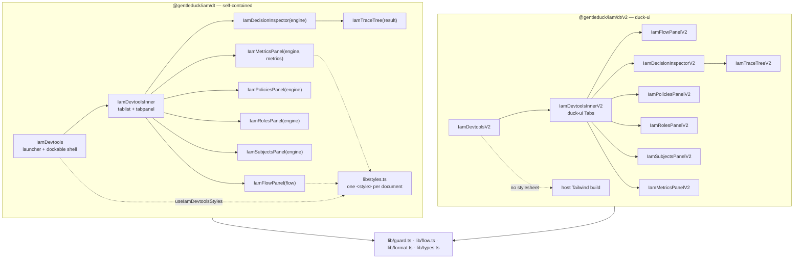

# Devtools

`@gentleduck/iam` ships two React devtools builds — `@gentleduck/iam/dt` (v1) and
`@gentleduck/iam/dt/v2` — that render the same six panels over the same engine
and have deliberately opposite dependency contracts. Both mount a floating
launcher and a dockable panel that reads the live policy corpus, role catalog,
decision traces and cache counters out of a running `IamEngine`, and both refuse
to render unless something explicitly says "development". This document covers
how to choose between them, how to mount each, what every panel shows, and what
happens if one of these ever reaches production.

For what the panels are *displaying* — how a decision is reached, what a policy
document contains, how roles compile — see [`core-engine.md`](./core-engine.md)
and [`core-builder.md`](./core-builder.md).

---

## 1. Two builds, opposite contracts

The split is the first thing to get right, because conflating the two produces a
panel that renders as unstyled boxes or a package that will not import at all.

| | `@gentleduck/iam/dt` (v1) | `@gentleduck/iam/dt/v2` |
| --- | --- | --- |
| Source | `src/dt/` | `src/dt/v2/` |
| Runtime deps | React only | React, `@gentleduck/registry-ui`, `@gentleduck/libs`, `lucide-react` |
| Styling | one `<style>` tag it injects itself | Tailwind v4 utilities on the host's theme |
| Class names | `iam-dt-*`, owned by `lib/styles.ts` | duck-ui components + Tailwind utilities |
| Colour source | `--iam-dt-*` tokens it declares | host tokens (`--card`, `--border`, `--primary`, …) |
| Host build requirements | none | Tailwind v4 configured to scan this package |
| Theme | own palette, `theme="auto" \| "dark" \| "light"` | inherits the host's, no `theme` prop |
| Looks like | itself, in every app | the app it is docked into |
| Root marker | `.iam-dt` class | `data-iam-dt-v2` attribute |
| `'use client'` | absent | on every component module |
| Entry chunk (5.9.0 build) | 163,674 B raw / 35,506 B gzipped | 99,265 B raw / 22,613 B gzipped, peers external |

Pick v1 when the host is not already a duck-ui app. It renders identically with
nothing installed and nothing configured, and a consumer who has neither peer
still gets a working panel. Pick v2 when the host *is* a duck-ui (or any
shadcn-token) app on Tailwind v4 and you want the devtool to inherit its theme,
radius, font and dark mode rather than sitting in the page as a foreign window.

`src/dt/v2/index.ts:1-52` is the module docblock stating this contract; the
changeset in `CHANGELOG.md` at line 358 restates it for the release notes.

### What v2 needs from the host

Tailwind v4 must scan the shipped v2 build, or every utility class in it names a
rule nobody generated and the panel renders as unstyled boxes on a transparent
ground. One line in the host stylesheet, relative to that stylesheet's location:

```css
@source "../node_modules/@gentleduck/iam/dist/dt/v2";
```

The host must also define the duck-ui token set — `--background`, `--card`,
`--border`, `--foreground`, `--muted-foreground`, `--primary`, `--ring`,
`--destructive`, `--accent` — which any duck-ui or shadcn theme already does.

The five verdict colours are the exception, pinned in `src/dt/v2/lib/tone.ts:22-62`
rather than taken from the host. duck-ui ships `destructive` and `warning` and
has no success token, and "the rule allowed this" is not a shade a theme gets to
reinterpret: an allow rendered in the host's primary hue is unreadable beside a
deny rendered in the same one. So `allow`/`deny`/`warn`/`info`/`neutral` come
from Tailwind's own palette (emerald / destructive / amber / sky / muted), each
with a `dark:` partner.

### How the split is enforced

Two test files hold both halves in place, and neither can pass vacuously.

`src/dt/__tests__/dt-selfcontained.test.tsx` sweeps every non-test module under
`src/dt`, **skipping `v2/`**, and fails on:

- any `import … from '@gentleduck/registry-ui…'` or `'@gentleduck/libs…'` (line 96);
- any `var(--…)` in the injected stylesheet that is not `--iam-dt-*` (line 148);
- a token block that is not root-scoped with `:not(.iam-dt *)` — exactly three
  are expected: the dark default, the `prefers-color-scheme` light block and the
  `[data-iam-dt-theme="light"]` block (line 155);
- any `iam-dt-*` class a component emits that has no rule in the sheet shipped
  beside it (line 166).

`src/dt/v2/__tests__/v2-contract.test.tsx` asserts the same boundary from the
other side, so the exclusion cannot silently become a hole where a v1 module
goes to dodge the peer rule:

| Assertion | Line | What it stops |
| --- | --- | --- |
| `src/dt/v2` holds ≥ 12 modules | 44 | deleting v2 and leaving the exclusion behind |
| ≥ 6 v2 modules import `@gentleduck/registry-ui/*` | 49 | v2 quietly ceasing to be a duck-ui build |
| v2 imports `@gentleduck/libs/cn` and `lucide-react` | 59 | v2 reimplementing what the peers provide |
| v1's sweep contains no `v2/` path, and still sees ≥ 18 v1 modules | 65 | the exclusion widening, or both sides going empty |
| every name in `REQUIRED_DUCK_UI` is imported | 149 | v2 replacing a duck-ui component with a lookalike |
| no v2 module contains `<table`, `<progress` or `role="progressbar"` | 160 | hand-rolling a component duck-ui ships |
| no v2 module emits an `iam-dt-*` class | 179 | borrowing a v1 class that has no rule in a v2 build |
| no v2 module calls `useIamDevtoolsStyles()` / `ensureStylesInjected()` | 188 | v2 injecting v1's stylesheet |
| no v2 module reads a `--iam-dt-*` token | 195 | v2 reading a token only v1 declares |
| `package.json` exports both `./dt` and `./dt/v2` | 211 | collapsing the two subpaths |
| all three v2 peers are declared **optional** | 218 | making v1 unusable for the consumers it exists for |

`REQUIRED_DUCK_UI` (line 123) is the named component set v2 must keep using:
`alert`, `avatar`, `badge`, `button`, `button-group`, `card`, `empty`, `field`,
`input`, `input-group`, `item`, `kbd`, `label`, `progress`, `scroll-area`,
`separator`, `skeleton`, `switch`, `table`, `tabs`, `textarea`, `tooltip`.

The class and token scans read *string literals with comments stripped*
(`codeOf` / `literalsOf`, lines 84-99), not raw text. Both files that document
the split — `v2/index.ts` and `v2/lib/tone.ts` — name v1's classes and tokens in
prose, correctly and on purpose, and a raw-text sweep would have to be either
satisfied by an accident of punctuation or silenced by exempting the two files
that explain the rule.

---

## 2. The production guard

`isDevtoolsAllowed(engine)` in `src/dt/lib/guard.ts:21` is the single gate. It is
**default-block**: it returns `true` only when an explicit positive development
signal is present, and either production signal blocks unconditionally.

```ts
export function isDevtoolsAllowed(engine: IamIDevtoolsEngine): boolean {
  const nodeEnv = readNodeEnv()
  if (nodeEnv === 'production') return false
  const mode = readEngineMode(engine)
  if (mode === 'production') return false
  if (nodeEnv === 'development') return true
  if (mode === 'development') return true
  return false
}
```

| `NODE_ENV` | engine mode | Result |
| --- | --- | --- |
| `production` | anything | **block** |
| anything | `production` | **block** |
| `development` | `development`, unknown | allow |
| unset / `test` / other | `development` | allow |
| unset / `test` / other | unknown | **block** |

Both directions of the asymmetry matter. Blocking wins because the panel is not
read-only — `IamIDevtoolsEngine` requires `assignRole`, `revokeRole` and
`setAttributes`, and the Subjects panel calls all three with no authorization of
its own — so a staging box left on `NODE_ENV=development` in front of a
production-mode engine must not mount it. Absence of a signal blocks because a
raw-browser bundle that does not shim `process`, in front of an engine that does
not surface `mode`, would otherwise fail open (CWE-200 / CWE-489).

`readNodeEnv` (`guard.ts:49`) treats "no `process`" and "a `process` whose `env`
is unreadable" as the same absence. `readEngineMode` (`guard.ts:67`) reads
`engine.mode ?? engine.config.mode ?? engine._mode` — `_mode` is a
TypeScript-`private` field on the real engine, which is a plain own property at
runtime. The `??` chain is positional rather than "first valid wins": an engine
reporting `mode: 'staging'` must not have that ignored in favour of a `_mode`
further down, because an unreadable mode is itself a reason to block.

There is **no prop escape hatch, by design**. To use the devtools in a deployed
environment, run a development build behind an admin-only route.

Since 5.9.0 the engine's `mode` defaults to `'production'`, so an engine built
without one blocks the devtools (`devtools-engine-contract.test.tsx:85`).
Devtools must now be opted into with an explicit `mode: 'development'`.

### Where the guard runs

Every shell and every panel that touches the engine calls it itself, always
placed *below every hook* so the hook order is unconditional on both branches:

| Component | Guard site |
| --- | --- |
| `IamDevtools` | `src/dt/iam-devtools-panel.tsx:112` (thin wrapper) |
| `IamDevtoolsInner` | `src/dt/iam-devtools.tsx:48` (thin wrapper) |
| `IamDecisionInspector` | `src/dt/panels/decision.tsx:64` |
| `IamPoliciesPanel` | `src/dt/panels/policies.tsx:44` |
| `IamRolesPanel` | `src/dt/panels/roles.tsx:43` |
| `IamSubjectsPanel` | `src/dt/panels/subjects.tsx:48` |
| `IamMetricsPanel` | `src/dt/panels/metrics.tsx:55` |
| every v2 equivalent | same position, same call |

Duplicating it is deliberate. `src/dt/index.ts` names each panel as its own
export, so `import { IamSubjectsPanel } from '@gentleduck/iam/dt'` and rendering
it is a supported thing to do, and it used to put an unauthenticated
role-assignment UI on screen with no check anywhere in its path. The readers are
no better: `IamPoliciesPanel` hands back the entire policy corpus,
`IamRolesPanel` the whole role catalog, and `IamDecisionInspector` is an oracle
that will answer `explain()` for any subject, action and resource typed into it.
The guard is idempotent and cheap, so running it twice under the shell costs
nothing; running it zero times cost the whole protection.

`IamFlowPanel` and `IamTraceTree` (and their v2 twins) are the two exceptions.
They take a recorder and an already-computed result, never an engine, so there is
nothing for a guard to protect. This is enforced by source sweep rather than by
name: `panels-render.test.tsx:191` and `v2-render.test.tsx` read every panel
module, and any that matches `\bengine\.` and does not contain
`isDevtoolsAllowed(engine)` fails the build.

---

## 3. Mounting

### v1

```tsx
import { IamDevtools, iamCreateFlowRecorder } from '@gentleduck/iam/dt'
import { IamEngine } from '@gentleduck/iam'
import { iamCreateMetricsAggregator } from '@gentleduck/iam/observability/metrics'

const flow = iamCreateFlowRecorder({ bufferSize: 500 })
const metrics = iamCreateMetricsAggregator()

const engine = new IamEngine({
  adapter,
  mode: 'development',           // required: the default is 'production', which blocks
  hooks: {
    onMetrics: metrics.record,
    afterEvaluate: (request, decision) =>
      flow.record({
        subjectId: request.subject.id,
        action: request.action,
        resource: request.resource.type,
        resourceId: request.resource.id,
        scope: request.scope,
        allowed: decision.allowed,
        durationMs: decision.duration,
        reason: decision.reason,
        decidingPolicy: decision.policy,
        decidingRule: decision.rule?.id,
        environment: request.environment,
      }),
  },
})

// anywhere in the tree
<IamDevtools engine={engine} flow={flow} metrics={metrics} position="bottom" />
```

The devtools get their engine by prop. There is no context, no global, no
registry — the reference you pass is the engine they read, and the same object is
what `isDevtoolsAllowed` interrogates for its mode.

`afterEvaluate` takes exactly two arguments, `(request, decision)`
(`src/core/engine/engine.types.ts:408`). Latency comes from `decision.duration`;
policy and rule provenance (`decision.policy`, `decision.rule`) are populated in
development mode only, because production evaluates through the compiled table
where policy identity is erased at compile time — see
[`core-engine.md`](./core-engine.md).

`IIamDevtoolsProps` (`src/dt/iam-devtools-panel.tsx:26`) extends
`IIamDevtoolsInnerProps` (`src/dt/iam-devtools.tsx:24`):

| Prop | Type | Default | Notes |
| --- | --- | --- | --- |
| `engine` | `IamIDevtoolsEngine` | — | the only requirement |
| `metrics` | `IamIDevtoolsMetrics` | — | absent: the Telemetry evaluation grid says so |
| `flow` | `IamIFlowRecorder` | — | absent: the Flow tab says so |
| `initialPanel` | `IamPanelKey` | `'flow'` | |
| `defaultRequest` | `Partial<IamIDecisionInput>` | — | pre-fills the Decision Inspector form |
| `pollMs` | `number` | `1000` | Telemetry re-read interval |
| `embedded` | `boolean` | `false` | drops the panel chrome |
| `theme` | `'auto' \| 'dark' \| 'light'` | `'auto'` | `'auto'` follows `prefers-color-scheme` |
| `initialIsOpen` | `boolean` | `false` | overridden by a persisted value |
| `buttonPosition` | `'bottom-right' \| 'bottom-left' \| 'top-right' \| 'top-left' \| 'relative'` | `'bottom-right'` | `'relative'` renders no floating launcher |
| `position` | `'top' \| 'bottom' \| 'left' \| 'right'` | `'bottom'` | dock edge |
| `hideButton` | `boolean` | `false` | for driving open state yourself |
| `storagePrefix` | `string` | `'__GENTLEDUCK_IAM_DEVTOOLS_V1'` | set it when two instances share a page |
| `inset` | `number` | `0` | floating gutter in px; `> 0` rounds the corners |

### v2

```tsx
import { IamDevtoolsV2, iamCreateFlowRecorder } from '@gentleduck/iam/dt/v2'

<IamDevtoolsV2 engine={engine} flow={flow} metrics={metrics} position="bottom" />
```

`IIamDevtoolsV2Props` (`src/dt/v2/iam-devtools-v2.tsx:25`) is the same shape
minus `theme` (v2 has no palette to pin) and minus `inset`, with
`storagePrefix` defaulting to `'__GENTLEDUCK_IAM_DEVTOOLS_V2'`. Everything else —
`engine`, `metrics`, `flow`, `initialPanel`, `defaultRequest`, `pollMs`,
`embedded`, `initialIsOpen`, `buttonPosition`, `hideButton`, `position` —
carries the same meaning.

### Composition



Everything under `lib/` is shared. v2 imports the production guard, the flow
recorder, the trace formatters and the engine types from `../lib`; only the
presentation is new.

### Every export

`src/dt/index.ts`:

```ts
export { IamDevtools }              // launcher + dockable panel
export { IamDevtoolsInner }         // tab strip + panels, no chrome
export { iamCreateFlowRecorder }
export { ensureStylesInjected as iamEnsureDevtoolsStyles }
export { IamDecisionInspector, IamFlowPanel, IamMetricsPanel,
         IamPoliciesPanel, IamRolesPanel, IamSubjectsPanel, IamTraceTree }
// types: IIamDevtoolsProps, IIamDevtoolsInnerProps, ButtonPosition, PanelPosition,
//        IamIFlowEntry, IamIFlowRecorder, IamIFlowRecorderOptions, IamDevtoolsTheme,
//        IamIDecisionInput, IamIDevtoolsEngine, IamIDevtoolsMetrics, IamPanelKey
```

`src/dt/v2/index.ts` mirrors it with `V2` suffixes — `IamDevtoolsV2`,
`IamDevtoolsInnerV2`, `IamDecisionInspectorV2`, `IamFlowPanelV2`,
`IamMetricsPanelV2`, `IamPoliciesPanelV2`, `IamRolesPanelV2`,
`IamSubjectsPanelV2`, `IamTraceTreeV2` — plus `iamCreateFlowRecorder` re-exported
from `../lib/flow` and the `IamV2Tone` type. It exports **no** styling helper,
because there is no stylesheet to inject, and none of the `IamV2*` chrome
components in `v2/components/chrome.tsx`; those are internal vocabulary.

Note that `package.json` publishes two subpaths, `./dt` and `./dt/v2`. "Every
panel is exported individually" throughout the source docblocks means *named
exports from those two barrels*, not one subpath per panel.

---

## 4. The panels

Six tabs, keyed by `IamPanelKey = 'flow' | 'decision' | 'policies' | 'roles' |
'subjects' | 'metrics'` (`src/dt/lib/types.ts:84`). The open tab is ordinary
component state in each shell — nothing writes it to `localStorage`, so a
remount reopens `initialPanel` (default `'flow'`), not whatever you last had
open. The docblock beside the type calls it "the persisted key"; the shells do
not persist it.

### Flow — the live decision log

`src/dt/panels/flow.tsx:56` · `src/dt/v2/panels/flow.tsx:121`

Every authorization check the recorder captured, newest first. This is the panel
you leave open while clicking around the app: it answers "what did the engine
just decide, and why", without you having to reproduce the request by hand.

The left half is the log. Each row shows a coloured verdict dot, the request as
`action on resource#id`, the subject, a relative age that re-renders once a
second (`120ms ago`, `4s ago`, `2m ago`, `1h ago`) and the measured duration.
Above it: a free-text filter matching subject id, action, resource type or
resource id, and two verdict toggles carrying live allow/deny counts, so you can
hide the noise of a hundred allows to find the one deny.

Selecting a row fills the detail pane:

| Section | Contents |
| --- | --- |
| header | verdict chip, action, resource, wall-clock time (`14:03:11.482`), duration to 2 dp |
| Subject | the subject id with an avatar initial, plus a `scope` chip when the request carried one |
| Reason | the engine's own `reason` string, preserved with `white-space: pre-wrap` in v1 |
| Deciding | `policy` and `rule` key/value pairs — populated only in development mode |
| Environment | collapsed JSON tree, rendered only when the bag is non-empty |
| Raw entry | the whole `IamIFlowEntry` as JSON |
| footer | **copy entry** — the entry as pretty JSON on the clipboard |

The panel never asks the engine anything. It reads only the recorder you wired,
so opening it cannot perturb what it is measuring — and that is why it takes no
engine and carries no guard.

Two differences in v2. The log is a real duck-ui `Table` with named columns
(`verdict`, `request`, `subject`, `when`, `took`) rather than a column of list
rows, so the panel is laid out `side="end"` — the table gets the flexible half,
the detail pane the fixed 22rem one. The row's click target is a real `<button>`
in the first cell stretched over the row with `after:absolute after:inset-0`,
carrying `allow: read on post for u1` as its accessible name; a `<tr>` with a
click handler is mouse-only, and a `<tr>` with `role="button"` lies about what it
is. The verdict filters are real `Switch`es with `role="switch"` instead of
`aria-pressed` pills. Clipboard failure (permission-gated, absent over plain
http) is swallowed in both builds — the button just does not report "copied".

### Decision — the ad-hoc inspector

`src/dt/panels/decision.tsx:44` · `src/dt/v2/panels/decision.tsx:73`

A form that runs one authorization check and renders the full reasoning. Use it
to answer "would this subject be allowed to do this", and more usefully "why
not" — it is the fastest way to find the rule that is denying something.

It calls `engine.explain()`, not `can()`. The point is the trace, not the
boolean, which is also why it is only useful against a development-mode engine:
production erases policy identity at compile time.

Seven fields, all strings: `subject id`, `action`, `scope`, `resource type`,
`resource id`, `resource.attributes (JSON)` and `environment (JSON)`. Every
field is a string, including the two JSON boxes, because a half-typed object has
to be a legal state of the form (`IamIDecisionInput`, `src/dt/lib/types.ts:73`).
Parsing happens at submit and a syntax error is shown, not thrown.

The submit path is worth reading in full, because two of its steps exist to fix
bugs that produced *confidently wrong answers*:

1. `safeParseJson` on both boxes; a parse failure surfaces as
   `attributes JSON: …` / `environment JSON: …`.
2. `iamNarrowAttributes` on the parsed attributes. Valid JSON is not an
   attribute bag — `[1,2]` and `"hello"` both parse — and the value is about to
   be handed to the engine as one. `null` back means
   `expected an object of scalar values`.
3. `narrowRecord` on the environment, the weaker check: an object that is
   neither `null` nor an array.
4. `engine.explain(subjectId, action, resource, environment, scope || undefined)`
   — **`scope` positionally, as the fifth argument**. It used to be folded into
   the environment bag as `environment.scope`, which nothing reads: the panel
   rendered a confident trace whose own `request.scope` said `undefined` and
   whose `scopedRolesApplied` was empty, so an operator debugging a scoped grant
   was shown DENY for a request the engine allows — and the obvious repair is to
   widen the policy. `devtools-engine-contract.test.tsx:121-157` pins all three
   cases: scope carried, scope smuggled, scope wrong.

The result pane shows the verdict chip and the request echoed back, then
**Reason** (`result.summary`), **Trace** (the tree below) and a collapsed **Raw
result**.

v2 adds ⌘/Ctrl+Enter to evaluate from anywhere in the form — not plain Enter,
because two of the seven controls are textareas holding JSON where a newline is
a legitimate keystroke. (The comment on that handler says "six".)

### The trace tree

`src/dt/panels/trace-tree.tsx:91` · `src/dt/v2/panels/trace.tsx:86`

Rendered by the Decision Inspector in both builds — it is the only caller —
and exported on its own so you can render an `Explain.IResult` you obtained
some other way. (The docblock above `IamTraceTree` also names the Flow panel's
detail pane; the Flow panel does not import it.) Three nesting levels,
rendering an `Explain.IResult`:

- **Result** — `ALLOWED`/`DENIED` and the summary. `no policies evaluated` when
  `result.policies` is empty.
- **Policy** — name (or id), a `target` chip saying whether the policy's target
  matched, its `allow`/`deny` result, its combining `algorithm`, an arrow to the
  `decidingRuleId` when there is one, and the policy's `reason`.
- **Rule** — effect, rule id, and four chips that are the whole diagnosis:
  `act` / `res` / `cond` (v2: `action` / `resource` / `conditions`) showing which
  of the three match tests passed, `p{priority}`, and a `matched` (v2: `decided`)
  chip on the rule that won. Rules default open when they matched, closed
  otherwise.
- **Condition group** — an `ALL`/`ANY`/`NOT` node with its own pass/fail and a
  `LOGIC (n)` summary counting *direct* children only. Open to depth 2 by
  default.
- **Condition leaf** — `PASS`/`FAIL`, the field, the operator, and
  `expected` beside `actual`, with `actual` coloured by the result. This row is
  where a debugging session usually ends.

Values are rendered by `formatAttrValue` (`src/dt/lib/format.ts:14`), which
**never throws**. `JSON.stringify` throws on a self-referential value and on a
`BigInt`, both reachable from a caller-controlled request attribute bag, and this
runs inside a React render — so the throw took out the panel, or the whole host
app where there was no error boundary. Unserializable values render as
`(unserializable)`; `undefined` renders as `(undefined)`, distinct from `null`;
strings are quoted so an empty or whitespace value stays visible.

### Policies — the ABAC corpus

`src/dt/panels/policies.tsx:17` · `src/dt/v2/panels/policies.tsx:55`

Browses what `engine.admin.listPolicies()` currently returns. Read-only, and
re-fetched on every refresh — so what it shows is the live model, not a copy the
panel keeps. Use it to confirm that the policy you think you deployed is the one
the adapter holds.

The list shows each policy's id, its rule count and its combining algorithm.
Filtering matches id or name. The detail pane shows the id, name, algorithm,
`v{version}` when present, and the rule count; then **Description**, then
**Rules**, then a collapsed **Raw** JSON tree of the whole document.

Each rule collapses to one line — id, `allow`/`deny`, `p{priority}`, the joined
`actions` and the joined `resources` — and expands to its description and its
`conditions` as a JSON tree.

An adapter error is caught and shown as an inline alert rather than thrown; the
list simply stays empty. v2 additionally shows skeleton rows while the first
`listPolicies()` is in flight, and distinguishes "The adapter holds no policies"
from "Nothing matches the filter".

### Roles — the RBAC catalog

`src/dt/panels/roles.tsx:16` · `src/dt/v2/panels/roles.tsx:53`

The counterpart to Policies for the RBAC half of the model, over
`engine.admin.listRoles()`. Read-only; assigning and revoking lives in Subjects.

The list shows each role's id, its permission count and, when it has any, the
roles it inherits. The detail pane shows id, name and a `scope:` chip for a
scoped role, then **Description**, **Inherits** (one chip per parent role) and
**Permissions**, plus a collapsed **Raw**.

Each permission row is `action on resource`, with a chip for its `scope` and a
`cond` / `conditions` chip when it carries conditions; expanding shows the
conditions as a JSON tree. Use this panel to answer "what does this role
actually grant, once inheritance is taken into account" — and cross-reference
[`core-engine.md`](./core-engine.md) for how a role with conditions or a scope
compiles into `rbacDynamic` rather than being baked into the allow bitmask.

### Subjects — the one that writes

`src/dt/panels/subjects.tsx:34` · `src/dt/v2/panels/subjects.tsx:40`

Inspects one subject and, unlike every other panel, edits it. Enter a subject id
and **load**; the panel calls `engine.admin.getAttributes(subjectId)` and shows
the bag as a JSON tree with an attribute count, plus a copy of it in an editable
textarea.

Three writes, all straight through `engine.admin`:

| Control | Call | Guard on the input |
| --- | --- | --- |
| **save** attributes | `setAttributes(subjectId, attributes)` | `safeParseJson` then `iamNarrowAttributes`; a non-object or a non-scalar value is refused before the adapter sees it |
| **assign** | `assignRole(subjectId, roleId, scope \|\| undefined)` | `role id required` |
| **revoke** | `revokeRole(subjectId, roleId, scope \|\| undefined)` | `role id required` |

Errors render with `role="alert"`; successes render with `role="status"`, which
is polite enough not to interrupt a screen-reader user mid-sentence. In v2 the
empty state carries a standing notice — *"This panel writes"* — before any
subject is loaded.

This is the panel that motivates the whole guard. `setAttributes` writes whatever
it is handed and that value came out of a textarea; `assignRole` grants a role to
a subject with no authorization in front of it. Narrowing before the adapter is
not politeness: `iamNarrowAttributes` also refuses a `__proto__` key outright,
because a bag that reads back with a prototype-inherited `tier` grants a
condition nobody wrote.

### Metrics / Telemetry — cache and decision counters

`src/dt/panels/metrics.tsx:27` · `src/dt/v2/panels/metrics.tsx:51`

The tab is labelled *Metrics*; the pane titles itself *Telemetry*. It re-reads
`engine.stats.get()` — and `metrics.snapshot()` when an aggregator was passed —
every `pollMs` (default 1000).

It polls rather than subscribes on purpose: the engine publishes no metrics
event, and a hook that fired per decision would put devtools rendering on the hot
path of every authorization check.

**Evaluations** needs the optional `metrics` aggregator. With one it shows the
allow rate as a percentage — captioned `N allow / M deny` in v1, `N allowed ·
M denied of T` in v2 — then `evals` (v2: `evaluations`) for the lifetime total,
`window` (v2: `samples`) for the rolling sample count, `deny` (v2: `denied`),
and `max` / `p50` / `p95` / `p99` latency in ms, read from
`IamMetrics.ISnapshot` (`src/observability/metrics/index.ts:32`). v2 adds a
`refresh` tile echoing `pollMs`. Without
an aggregator it says so, rather than rendering zeroes that look like real
measurements. Neither build surfaces `snapshot.failOpen`, the count of allows
attributable solely to `defaultEffect: 'allow'`; if you are watching for silent
policy-set breakage, read it from the aggregator yourself.

**Caches** needs nothing extra: it reads the engine's own counters. One card per
cache, each showing the cache name, its hit rate, its entry count and the raw
`hits / misses`. The rate is banded — green above 80%, blue above 50%, amber
below — so a cold cache is visible without reading the number. A real engine
reports five caches (`devtools-engine-contract.test.tsx:210`).

**reset** calls `engine.stats.reset()` and `metrics?.reset()`. This is a write:
it clears the running engine's real counters, which is why this panel carries the
guard too and why "the only panel that writes" is not an accurate description of
Subjects any more.

`engine.stats` is an object with `get()` / `reset()`, not the flat `stats()` /
`resetStats()` methods it replaced in 3.0.0. Declaring the removed shape on
`IamIDevtoolsEngine` meant this panel called `engine.stats()` on a property that
is an object, which threw from a `useState` initializer and took the whole
devtools overlay down the moment an operator opened Telemetry — and every
devtools test at the time handed in a hand-rolled mock implementing the dead
shape, so nothing noticed (`src/dt/lib/types.ts:31-43`).

v2 renders the allow rate and each cache rate on a real duck-ui `Progress` bar
carrying `role="progressbar"`, its aria value triple and an accessible name
(`aria-label="allow rate"`), rather than a number in a box.

---

## 5. The flow recorder

`iamCreateFlowRecorder(options?)` (`src/dt/lib/flow.ts:78`) builds the in-memory
decision log the Flow panel renders. It is exported from both `./dt` and
`./dt/v2` — the same function, not two copies.

```ts
export interface IamIFlowRecorder {
  record(entry: Omit<IamIFlowEntry, 'id' | 'ts'> & { ts?: number }): IamIFlowEntry
  list(): readonly IamIFlowEntry[]
  get(id: number): IamIFlowEntry | undefined
  clear(): void
  subscribe(listener: () => void): () => void
}
```

An `IamIFlowEntry` is flattened out of the engine's own request/result types, so
the panel does not have to reach through nested objects and a consumer can record
from their own instrumentation instead: `id`, `ts`, `subjectId`, `action`,
`resource`, `resourceId?`, `scope?`, `allowed`, `durationMs?`, `reason?`,
`decidingPolicy?`, `decidingRule?`, `environment?`.

Behaviour, as pinned by `src/dt/__tests__/flow.test.ts`:

| Property | Behaviour |
| --- | --- |
| ids | sequential from 1, monotonic even after eviction |
| `ts` | `Date.now()` unless the caller supplies one |
| order | newest first; `record` unshifts |
| capacity | `bufferSize`, default 250; the oldest entries are dropped |
| `list()` | a **copy** — the declared `readonly` erases, and returning the live array let a caller push into the recorder's own buffer |
| `subscribe` | returns its own unsubscribe; fires on every `record` and on `clear` |
| a throwing listener | logged to `console.error`, the remaining listeners still run, `record` still returns the entry |
| bad `bufferSize` | `RangeError` at construction |

`bufferSize` must be a positive integer. `0`, `-1`, `1.5`, `NaN` and `Infinity`
all throw `RangeError: [@gentleduck/iam:dt:flow] bufferSize must be a positive
integer (got <value>)`.
Unchecked, `NaN`/`Infinity` make the `buffer.length > bufferSize` trim
permanently false so the "ring buffer" grows without bound, and a negative throws
`Invalid array length` from inside `record()` — which the engine's
`safeHookCall` swallows, leaving a recorder bound to `afterEvaluate` that
silently records nothing. Failing at construction is the loud version of that.

Nothing is persisted and nothing leaves the process.

---

## 6. v1's styling contract

`src/dt/lib/styles.ts` is the entire visual layer of v1, as one CSS string of
about 570 lines (`styles.ts:35-604`) injected as a single `<style id="__iam_dt_styles__">`.

`ensureStylesInjected()` (`styles.ts:615`, exported publicly as
`iamEnsureDevtoolsStyles`) is guarded on both `document` — so an SSR render is a
no-op instead of a crash — and the existing tag id, so mounting several panels
does not stack duplicates. `useIamDevtoolsStyles()` (`styles.ts:650`) is the hook
form, and **every panel calls it**, not just the two shells: each panel is a
separate export, and one mounted on its own used to render with no stylesheet in
the document at all.

A `<style>` tag rather than an imported CSS file because the devtools ship inside
a library, and a bare `import './x.css'` would force every consumer's bundler to
have a CSS pipeline for a component most builds drop entirely.

### Tokens

Every colour in the sheet is an `--iam-dt-*` custom property. (Nine verdict and
tab dots are the exception: the six tab dots in `iam-devtools.tsx:36-41` and the
list-row dots in `flow.tsx:137`, `policies.tsx:69` and `roles.tsx:68` are inline
hex on a `style` attribute, so no token overrides them.) Three token blocks, all
scoped with `.iam-dt:not(.iam-dt *)` — "no `.iam-dt` above me", which is exactly the
condition for being a root:

1. `styles.ts:42` — the dark default.
2. `styles.ts:72` — `@media (prefers-color-scheme: light)`, skipped when
   `[data-iam-dt-theme="dark"]` is present.
3. `styles.ts:100` — `[data-iam-dt-theme="light"]`, which wins outright.

The root scoping matters because every panel carries `.iam-dt` (each is
individually exported, so each must be able to be its own root) — a second token
block nested under `IamDevtools` would re-derive the theme from
`prefers-color-scheme` and quietly overrule the explicit `theme` the root was
given.

The palette is GitHub Primer's, chosen for having accessible foreground /
background pairs already worked out in both directions, not for looking like
GitHub. The previous hardcoded `#60a5fa` / `#fbbf24` / `#84cc16` were tuned
against a dark ground and dropped to roughly 2:1 against a white one.

`iamDevtoolsThemeAttr(theme)` (`styles.ts:638`) returns `undefined` for
`'auto'`, not `'auto'`. The attribute has to be *absent*, not set to a value the
CSS ignores, because the light palette keys off `prefers-color-scheme` only when
no explicit value is present — `dt-selfcontained.test.tsx:260` pins this.

### Restyling it from the host

A host can override any token with a selector that beats the token blocks'
`.iam-dt:not(.iam-dt *)` — two class-level components, since `:not()` takes the
specificity of its argument. `:root .iam-dt` only ties with that, and the sheet
is appended to `document.head` after most host stylesheets, so go one higher:

```css
:root:root .iam-dt { --iam-dt-accent: #ff6b00; --iam-dt-allow: #22c55e; }
```

That is the whole surface. Everything is namespaced under `.iam-dt`, which also
carries a scoped reset (`styles.ts:127-156`) broad enough that a host's
`button {}` or `* { font-family }` cannot reach inside — and, symmetrically,
nothing in the sheet touches the host page. There is no class-level API: the
`iam-dt-*` names are internal, and the cross-check test exists to keep the
components and the sheet in lockstep, not to make the classes public.

Other things the sheet handles: `prefers-reduced-motion: reduce` flattens every
animation and transition, because a devtools overlay is exactly the kind of thing
that pulses in the corner of someone's eye all day; the split view collapses from
`300px 1fr` to stacked rows below 720px, so a panel docked to a narrow left or
right edge stays usable; the launcher sits at `z-index: 99998` and the panel at
`99999`.

### Assets and helpers

`src/dt/lib/logo.ts:4` is the gentleduck logo inlined as an 18 KB base64 data
URL, so the devtool ships self-contained with no asset fetches. `components/icons.tsx`
hand-inlines nine SVG icons for the same reason — an icon package would land in
the dependency tree of every consumer of `@gentleduck/iam`, for artwork most
builds drop entirely. `src/dt/lib/cn.ts:15` is a four-line class join that
deliberately does not merge conflicting Tailwind utilities, because nothing in v1
emits Tailwind utilities and two `iam-dt-*` classes never collide.

---

## 7. v2's styling contract

The inverse. `src/dt/v2/components/chrome.tsx` is the layout vocabulary — 21
components composing duck-ui and Tailwind, owning no stylesheet at all.

`IamV2Root` (`chrome.tsx:54`) is the outermost element of anything mountable on
its own. It carries `data-iam-dt-v2` — the only handle a host has for finding,
styling or hiding the devtool from its own CSS without knowing a class name of
ours — and it is also where `TooltipProvider` goes, because every panel is
exported on its own and a tooltip cannot rely on a provider some outer shell
happened to mount. `v2-render.test.tsx` asserts every standalone export's
outermost element carries the attribute.

The rule for the file, stated in its docblock: if duck-ui ships the component,
use it and pass a density class rather than rebuilding it a few pixels tighter.
A `Card` at `py-2` is still a card the host's theme can restyle; a `div` with a
border is a thing only the devtool knows about.

Four things are deliberately *not* duck-ui, each for a reason the component
cannot cover:

| Hand-rolled | Why |
| --- | --- |
| `lib/tone.ts` verdict colours | a theme does not get to reinterpret "allowed" |
| arrow-key tab navigation | `TabsTrigger` does roving `tabIndex` and no key handling |
| `IamV2Section` disclosure | `Collapsible` drives open state through a DOM attribute read back on click — wrong for a section whose default is a prop, and it renders closed on the server either way |
| the shell's resize edge | a real window-splitter `separator` with pointer drag, arrow/Home/End and the `aria-value*` triple, which `Separator` (an `<hr>`) cannot be |

Two accessibility fixes are worth knowing about because they contradict the
component defaults. duck-ui's `Alert` hard-codes `role="alert"`; `IamV2Alert`
(`chrome.tsx:452`) passes `role` after the spread so only a failure keeps the
assertive role and a successful attribute save does not interrupt a screen reader.
`IamV2Meter` (`chrome.tsx:366`) leaves the announcement to `Progress`'s own
`role="progressbar"` and value triple, so the caption beside it is plain text
rather than a second live region.

`src/dt/v2/components/json-view.tsx` is v2's own JSON reader rather than a shared
one: v1's paints itself with `iam-dt-json*` classes out of the injected
stylesheet, and the whole point of v2 is that no stylesheet is injected. It is
also throw-proof for the same reason v1's formatter is.

---

## 8. Optional peers, and what degrades without them

`package.json` declares five peers, **all optional**:

| Peer | Range | Needed by |
| --- | --- | --- |
| `react` | `^19.2.6` | both builds |
| `@gentleduck/registry-ui` | `>=0.5.0` | v2 only |
| `@gentleduck/libs` | `>=0.2.0` | v2 only |
| `lucide-react` | `>=0.400.0` | v2 only |
| `drizzle-orm` | `>=0.30.0` | the drizzle adapters, unrelated to devtools |

The three v2 peers are optional because `./dt` must keep installing without them.
A required peer would make v1 unusable for the consumers it exists for, and npm
would warn on every install — `v2-contract.test.tsx:218` asserts all three are
declared *and* marked optional.

Commit `f016f9c6`, *"make the devtools survive being installed without their
optional peers"*, is what made that true of v1. Six v1 modules imported
`@gentleduck/registry-ui` and `@gentleduck/libs` unconditionally, so
`import '@gentleduck/iam/dt'` threw `ERR_MODULE_NOT_FOUND` for any consumer who
installed the package and not those two — the whole devtools surface unreachable,
in one case over a string join. The modules that *did* resolve still rendered
wrong: the Tailwind utility classes on them only name real CSS if the consumer's
Tailwind is configured to scan this package's `dist`, and the `iam-dt-*` rules
read `var(--card)` and `var(--border)` with no fallback — so a host without
duck-ui's token set got a panel drawn in transparent on transparent.

None of it was visible from inside this monorepo, where both peers are installed
and Tailwind does scan the source, which is why it survived. The fix moved v1's
whole visual layer into `lib/styles.ts`, replaced the shared `cn` with the local
one, and added the sweeps described in §1 that fail from *here* when the coupling
comes back.

So, concretely:

| Missing | v1 | v2 |
| --- | --- | --- |
| `@gentleduck/registry-ui` | unaffected | `./dt/v2` throws at module load |
| `@gentleduck/libs` | unaffected | `./dt/v2` throws at module load |
| `lucide-react` | unaffected | `./dt/v2` throws at module load |
| the `@source` line in Tailwind | unaffected | v2 imports and renders, but with no CSS — unstyled boxes |
| duck-ui's token set in the host theme | unaffected | v2 renders with unresolved `var()` colours |
| `react` | neither build works | neither build works |

There is no graceful degradation *within* a build. v2 does not fall back to v1;
the two are separate entry points and a consumer picks one at import time.

---

## 9. Production safety, tree-shaking and bundle cost

**These are dev-only, and enforce it themselves.** There is no build-time
stripping and no `process.env.NODE_ENV` dead-code elimination baked into the
package — the protection is the runtime guard in §2, and it is a hard block with
no prop to override it.

**If you ship them to production anyway**, the components render `null`. Every
shell and every engine-touching panel checks `isDevtoolsAllowed` before doing
anything, so nothing calls `admin.listPolicies()`, nothing calls `explain()`, no
`assignRole` button reaches the DOM, and no launcher appears. Under
`NODE_ENV=production` — which is what any production bundler sets — that block is
unconditional regardless of the engine's mode. The residual cost is the bundle,
not a leak.

`renderToString` returning the empty string is asserted for every engine-facing
component in all three blocking states — production engine, `NODE_ENV=production`,
no signal at all — with a fourth case asserting it *does* render under
`NODE_ENV=development` so the other three cannot pass vacuously. Both builds
(`panels-render.test.tsx:157`, `v2-render.test.tsx:149`).

**Tree-shaking.** `package.json` sets `"sideEffects": false`, and the root
`src/index.ts` does **not** re-export the devtools — `./dt` and `./dt/v2` are
separate `tsdown` entries (`tsdown.config.ts`) behind separate subpath exports.
An app that never imports either subpath ships neither. Separate subpaths are
also what let a v1 consumer avoid pulling duck-ui into their bundle, which is
half the reason both exist.

What is *not* tree-shaken: within an entry, importing one panel pulls the barrel.
`import { IamPoliciesPanel } from '@gentleduck/iam/dt'` still resolves
`dist/dt/index.js`, and while a modern bundler can drop the unreferenced panels,
`lib/styles.ts` and `lib/logo.ts` are reachable from any panel you keep.

**Cost.** The README's "Module sizes (gzipped)" table (line 336) lists the
core engine, `core/validate`, `core/builder`, `core/explain`, adapters, server
middleware and clients — and has **no row for either devtools entry**. Measured
from the 5.9.0 build:

| Entry | Raw | Gzipped |
| --- | --- | --- |
| `dist/dt/index.js` | 163,674 B | 35,506 B |
| `dist/dt/v2/index.js` | 99,265 B | 22,613 B |

v1's figure is self-contained: React is external, everything else — the
stylesheet, the icons and the 18 KB base64 logo — is in that chunk. v2's figure
excludes `@gentleduck/registry-ui`, `@gentleduck/libs` and `lucide-react`, which
are externalised (`tsdown.config.ts`) and paid for separately by the host; in a
duck-ui app the host already carries them, which is part of v2's appeal.

Neither number should ever reach a production bundle. If it does, that is a
sign the import was not conditional — the guard stops the panel from *rendering*,
not the module from being bundled.

---

## 10. Gotchas

- **The engine's `mode` defaults to `'production'` since 5.9.0.** Devtools must
  be opted into with an explicit `mode: 'development'`. An engine constructed
  without one blocks them even under `NODE_ENV=development`.
- **`NODE_ENV=test` is not a development signal.** Under a test runner, an
  engine of unknown mode blocks. Only an explicit `development` on either side
  allows.
- **Persisted state beats your props — except `position`.** `initialIsOpen` and
  the panel size are seeded from `localStorage` and the stored value wins. The
  dock edge is seeded the same way, but an effect re-applies the `position` prop
  right after mount (`iam-devtools-panel.tsx:158`, `iam-devtools-v2.tsx:162`), so
  a passed `position` wins and the stored edge only applies when you pass none.
  Every read is validated (`loadState`, `iam-devtools-panel.tsx:68`) because
  `localStorage` is editable, shared across every page of the origin and survives
  a version upgrade — a stale entry once put a string into `size` (`NaN` into a
  CSS length, panel collapsed) or an unknown name into `position` (no matching
  dock class, panel off-screen).
- **Two devtools on one page fight over the same keys.** Set `storagePrefix` on
  at least one of them. v1 and v2 default to different prefixes, so mounting one
  of each is safe.
- **The Flow tab is empty until you wire a recorder**, and Telemetry's evaluation
  grid is empty until you pass a `metrics` aggregator. Both say so in the panel
  rather than rendering zeroes.
- **`decidingPolicy` / `decidingRule` are development-only.** The production
  compiled table erases policy identity, so those columns stay blank however the
  hook is wired.
- **The Decision Inspector's `scope` is the fifth positional argument.** Putting
  a scope in the environment box does nothing and produces a confident,
  wrong DENY.
- **The Subjects panel writes to the live adapter.** `save`, `assign` and
  `revoke` are not staged, not undoable and not confirmed.
- **The Telemetry reset button writes too.** It clears the running engine's real
  cache counters, not a devtools-local copy.
- **Keyboard:** Escape closes the panel and returns focus to the launcher;
  arrow keys move between tabs; the resize edge takes arrows (16px), Page
  Up/Down (160px), Home (minimum) and End (maximum). In v1 an arrow key on the
  tab strip switches the panel immediately. In v2 it moves focus only: duck-ui's
  `TabsTrigger` changes the open tab on click, so you confirm with Enter or
  Space.
- **A panel mounted on its own is its own root.** In v1 it carries `.iam-dt` and
  injects the stylesheet itself; in v2 it carries `data-iam-dt-v2` and mounts its
  own `TooltipProvider`. Both are asserted by test.
- **v2 component modules are `'use client'`; v1 modules are not.** The `v2/index.ts`
  barrel and `v2/lib/tone.ts` carry no directive — neither renders anything. In a
  Next.js App Router project, v1 must be imported from a file that already
  carries the directive.

---

## See also

- [`core-engine.md`](./core-engine.md) — the engine the panels read, `explain()`,
  the mode split, cache counters.
- [`core-builder.md`](./core-builder.md) — how the policies and roles the
  Policies and Roles panels display are authored.
- [`../compiled-engine-explained.md`](../compiled-engine-explained.md) — why
  production traces carry no policy identity.
- [`operations.md`](./operations.md) — `iamCreateMetricsAggregator`, the
  aggregator the Telemetry panel snapshots.
