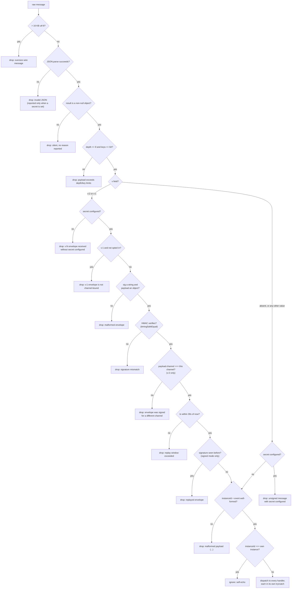

# Operations: metrics, cross-instance invalidation, shared utilities

Everything you need to run `@gentleduck/iam` on more than one replica: the
metrics aggregator behind `@gentleduck/iam/observability/metrics`, the Redis
invalidator behind `@gentleduck/iam/invalidators/redis` that keeps N replicas'
caches agreed, the cross-cutting helpers in `src/shared`, and the test harness
in `src/test`. Cache mechanics themselves live in
[`core-engine.md`](./core-engine.md); the Redis *adapter* — a different thing
from the Redis *invalidator* — lives in
[`adapters-runtime.md`](./adapters-runtime.md).

**The two Redis modules are not the same thing.** `@gentleduck/iam/adapters/redis`
is a *store*: it holds policies, roles and assignments, and it answers reads.
`@gentleduck/iam/invalidators/redis` is a *bus*: it stores nothing, holds one
pub/sub channel, and tells other replicas to drop what they cached. You can run
the invalidator with a Postgres store and no Redis adapter at all — the e2e
suite does exactly that. Nothing routes between them.

| Path | Export subpath | What it is |
| --- | --- | --- |
| `src/observability/metrics/index.ts` | `@gentleduck/iam/observability/metrics` | Rolling latency/verdict aggregator |
| `src/invalidators/redis/index.ts` | `@gentleduck/iam/invalidators/redis` | Signed pub/sub cache-invalidation bus |
| `src/shared/*.ts` | mostly none — see [§9](#9-srcshared--cross-cutting-utilities) | Cross-cutting guards and helpers |
| `src/test/*.ts` | none | The package's own e2e harness |

---

## 1. Metrics: the event

The engine emits one `IMetricsEvent` per evaluation, through
`hooks.onMetrics`. `src/core/engine/engine.types.ts:223`:

| Field | Type | Meaning |
| --- | --- | --- |
| `subjectId` | `string` | Subject the check ran against |
| `action` | `TAction` | Action checked |
| `resource` | `TResource` | Resource **type** (never the instance id) |
| `allowed` | `boolean` | Final verdict handed to the caller |
| `durationMs` | `number` | `performance.now()` delta across the evaluation |
| `mode` | `'production' \| 'development'` | Engine mode, so dev traffic is separable |
| `failOpen` | `boolean` | The allow came from `defaultEffect: 'allow'`, not from a rule |

`failOpen` is the one field that is not obvious and the one worth a dashboard.
It is `true` only when the verdict was allow *and* the vote carrying it was the
engine's `defaultEffect` fallback — either no policy was applicable, or one was
and every rule of it evaluated false. An explicit allow rule sets it `false`;
so does every deny. The comment on `engine.hooks.ts:37-40` states the reason:
"an allow the policies produced and an allow the engine produced because its
adapter was unreachable must never be read off the same counter." A `failOpen`
rate that climbs without a deploy means the policy set stopped arriving —
broken adapter, mass deletion, rules dropped by the ReDoS guard — and the
boolean verdict alone hides all three.

Emission is cheap by construction. The engine samples its clock only when a
hook that needs it is wired (`engine.ts:757`), and a throwing `onMetrics` is
caught and logged rather than allowed to rewrite the decision
(`engine.hooks.ts:69`).

### Where events are *not* emitted

Two gaps to know before you alert on rates:

- `engine.permissions(subjectId, checks, env, { telemetry: false })` skips
  `onMetrics` entirely for the batch (`engine.ts:1154`). It is documented as
  roughly 2× throughput for hot UI gates. A fleet that sets it will under-count.
- When `permissions()` fails to load the subject or the policy set, it returns
  an all-deny map through `onError` and emits **no** metrics events at all
  (`engine.ts:1159`). The single-check path (`authorize`) does emit on its error
  path, with `allowed: false, failOpen: false`. So a broker/adapter outage
  depresses the batch event rate rather than showing up as denies.

## 2. Metrics: the aggregator

```ts
export function iamCreateMetricsAggregator(
  config: IamMetrics.IConfig = {},
): IamMetrics.IAggregator
```

`IConfig` has one field, `sampleSize?: number`, default `1000`. It must be a
positive integer; `0`, `-1`, `1.5`, `NaN` and `Infinity` all throw a
`RangeError` naming `sampleSize` (`metrics/index.ts:86-87`). The validation is not
decoration — `sampleSize: 0` turns the ring buffer's `head % cap` into `NaN` and
silently swallows every sample.

The returned `IAggregator` has three methods:

| Method | Contract |
| --- | --- |
| `record(event)` | Bind straight to `hooks.onMetrics`. Never throws. |
| `snapshot()` | Immutable `ISnapshot` over the rolling window. Poll at any interval. |
| `reset()` | Zeroes counters and empties the window. Keeps the buffer allocation. |

`record` closes over local variables and never reads `this`, so
`hooks: { onMetrics: metrics.record }` is safe unbound — which is how the
docblock and README both spell it.

`snapshot()` returns:

| Field | Meaning | Healthy | Investigate |
| --- | --- | --- | --- |
| `total` | Events recorded since the last `reset()` | Tracks request rate | Flatlines while traffic continues → hook detached, or `telemetry: false` |
| `allow` / `deny` | Verdict split | Stable ratio for your app | A step change with no deploy |
| `failOpen` | Subset of `allow` from the `defaultEffect` fallback | `0` for any fleet running `defaultEffect: 'deny'` | Anything non-zero and rising |
| `p50` / `p95` / `p99` | Latency over the window, ms | Sub-millisecond p99 on warm caches in production mode | p99 in the tens of ms → cache misses, adapter latency, or the interpreter fallback |
| `max` | Window max, **not** all-time max | Near p99 | A `max` far above p99 is one bad request, not a trend |
| `samples` | Window size, capped at `sampleSize` | Equal to `min(total, sampleSize)` | **Lower than that — see below** |

`samples < min(total, sampleSize)` is a real signal, not rounding.
The decision is always counted; only the latency sample can be refused. A
`durationMs` that is `NaN`, `±Infinity` or negative is dropped
(`metrics/index.ts:112`) because one such value in a `Float64Array` makes the
percentile sort's comparator inconsistent and returns `NaN` for every quantile
until the ring rolls over — a `/metrics` route then serialises that as `null`
and the latency dashboard flatlines. Zero is kept: it is a legitimate duration
for a cache hit, and `metrics-hostile-durations.test.ts:52` pins the boundary so
the guard cannot be widened to `> 0`. Such values reach the aggregator from a
clock that went backwards, or from a caller forwarding a hand-built event.

Percentiles are nearest-rank (`metrics/index.ts:150`) over a sorted copy of
the live region (`:125`), computed per `snapshot()` at `O(n log n)`. At the
default cap of 1000 that is a few microseconds and avoids a streaming-quantile
dependency. The window is a ring: `max` reports the *window* max, so a 100 ms
outlier disappears once `sampleSize` newer samples have arrived
(`metrics.test.ts:94`).

## 3. Wiring metrics into a collector

The aggregator is deliberately label-free: it counts verdicts and holds
durations, and it never partitions by action, resource or subject. Whatever
partitioning you want, you do in your own hook, and that is where the
cardinality risk lives.

```ts
import { Counter, Gauge, Registry } from 'prom-client'
import { IamEngine } from '@gentleduck/iam'
import { iamCreateMetricsAggregator } from '@gentleduck/iam/observability/metrics'

const metrics = iamCreateMetricsAggregator({ sampleSize: 2000 })
const registry = new Registry()

// Counters are driven per event; the aggregator only owns the percentiles.
const decisions = new Counter({
  name: 'iam_decisions_total',
  help: 'Authorization decisions by verdict',
  labelNames: ['verdict', 'mode'] as const,
  registers: [registry],
})
const failOpens = new Counter({
  name: 'iam_fail_open_total',
  help: 'Allows produced by the defaultEffect fallback rather than a rule',
  registers: [registry],
})

// Gauges pull from the rolling window at scrape time.
const latency = new Gauge({
  name: 'iam_decision_duration_ms',
  help: 'Decision latency over the rolling window',
  labelNames: ['quantile'] as const,
  registers: [registry],
  collect() {
    const s = metrics.snapshot()
    this.set({ quantile: '0.5' }, s.p50)
    this.set({ quantile: '0.95' }, s.p95)
    this.set({ quantile: '0.99' }, s.p99)
    this.set({ quantile: 'max' }, s.max)
  },
})
const windowSize = new Gauge({
  name: 'iam_latency_samples',
  help: 'Usable latency samples in the rolling window',
  registers: [registry],
  collect() {
    this.set(metrics.snapshot().samples)
  },
})

const engine = new IamEngine({
  adapter,
  hooks: {
    onMetrics(event) {
      metrics.record(event)
      decisions.inc({ mode: event.mode, verdict: event.allowed ? 'allow' : 'deny' })
      if (event.failOpen) failOpens.inc()
    },
  },
})

app.get('/metrics', async (_req, res) => {
  res.type(registry.contentType).send(await registry.metrics())
})
```

Three rules for that hook:

**Never label a metric with `subjectId`.** It is unbounded — one series per
user, forever — and it is a customer identifier heading for a metrics store with
long retention. This is the same reasoning that keeps tenant ids out of the
invalidator's logs ([§7](#7-tenant-ids-are-kept-out-of-logs)).

**`action` and `resource` are bounded but not free.** They come from the
caller's declared unions, so cardinality is the size of `|actions| × |resources|`
— fine at tens, expensive at thousands, and a per-instance `resource` id would
be unbounded (the event deliberately carries `resource.type`, never
`resource.id`). Label with them only if you have counted them.

**Do not call `reset()` from a scrape handler.** Two collectors, or one
collector plus a manual probe, then race for the same counters. `reset()` exists
for tests and for a deliberate operator action, not for scrape-and-clear.

For OpenTelemetry the shape is the same: an `ObservableGauge` whose callback
reads `metrics.snapshot()`, plus `Counter.add(1, attrs)` inside the hook.

---

## 4. The Redis invalidator

```ts
import { createIamRedisInvalidator } from '@gentleduck/iam/invalidators/redis'

export function createIamRedisInvalidator<TRole extends string = string>(
  config: IamRedisInvalidator.IConfig,
): IamEngineTypes.IInvalidator<TRole>
```

Every engine's admin write clears its own caches and calls
`invalidator.publish(event)` (`engine.invalidation.ts:70,94,117,178`). Every
engine subscribed to the same channel receives the event and applies the
matching local eviction with `broadcast: false` — a received event is never
re-published, or fleet traffic would grow with the square of the fleet
(`engine.invalidation.ts:185`).

### Configuration

| Option | Type | Default | Notes |
| --- | --- | --- | --- |
| `client` | `IPubSubLike` | required | `publish`, `subscribe`, optional `unsubscribe`. ioredis and node-redis v4+ both satisfy it. |
| `channel` | `string` | `'duck-iam:invalidate'` | Base channel. One channel = one broadcast group. |
| `tenantId` | `string` | — | Appends `:tenant:<id>`. Validated against `/^[A-Za-z0-9_-]{1,64}$/`. |
| `secret` | `string \| null` | `null` | HMAC-SHA256 signing key. **Set this in production.** |
| `onPublishError` | `(err, channel) => void` | — | Publish threw *or rejected*. |
| `onSubscribeError` | `(err, channel) => void` | — | `subscribe()` threw or rejected. |
| `onMessageDropped` | `(reason, channel, suppressed) => void` | — | An inbound message was refused. |
| `acceptLegacyUnboundEnvelopes` | `boolean` | `false` | Accept pre-v2 envelopes during a rolling upgrade. Turn off after. |

`client` needs **two** connections, not one: Redis will not let a subscribed
connection issue other commands. The `IPubSubLike` interface is deliberately
narrow so neither client library becomes a dependency of this package.

### Channel layout

There are no Redis *keys*. The invalidator owns exactly one pub/sub channel and
writes nothing to the keyspace.

```
duck-iam:invalidate                        # default, single-tenant
duck-iam:invalidate:tenant:acme            # tenantId: 'acme'
my-app:iam                                 # channel: 'my-app:iam'
my-app:iam:tenant:acme                     # both
```

The tenant regex exists to stop a pub/sub wildcard or a separator from reaching
the channel name through an attacker-controlled tenant identifier. An id with a
space, a `*`, or the empty string throws at construction
(`redis-invalidator.test.ts:212`).

Channel routing decides who Redis *delivers* to. It says nothing about what a
node *accepts* from someone who publishes to its channel directly — which is why
the channel is inside the signature. See [§5](#5-the-wire-format).

### Delivery guarantees, exactly

Redis pub/sub is fire-and-forget, and this module adds no store-and-forward. So:

- **At-least-once while connected.** The engine's invalidate methods are
  idempotent, so re-applying the same event is harmless. Out-of-order delivery
  converges too: every event is a *drop*, never a grant, so any order of
  revoke/grant/revoke ends at the store's answer
  (`e2e-invalidation-cross-instance.e2e.test.ts:305`).
- **Zero-times for a replica that was down, disconnected, or not yet
  subscribed.** There is no replay, no backlog, no sequence number. A replica
  that misses a message never learns about it.
- **The local mutation never waits for the broadcast.** The engine calls
  `void invalidator.publish(...)`, and a publish failure is reported, not
  thrown: the writing node already applied the invalidation locally.

**How long a missed invalidation can serve a stale decision: one `cacheTTL`.**
That is the only backstop, and it covers all of it — the subject cache, the role
cache, the policy cache and the compiled table
(`e2e-invalidation-failure-modes.e2e.test.ts:282` measures each). `cacheTTL`
defaults to 60 seconds. A time-boxed grant can expire earlier, because
`IamLRUCache.set` caps the entry at the grant's own `notAfter`
(`shared/cache.ts:106`) — but nothing shortens the window for an ordinary
revoke. Both directions are possible, because a grant publishes
`{kind:'subject'}` exactly as a revoke does: the deaf replica serves a stale
**allow** for a revoked role, and a stale **deny** for a freshly granted one,
each until its TTL retires the entry. Stale allow is the one worth alerting on.
Nothing throws and no request errors.

**The invalidator never resubscribes.** Once `subscribe()` resolves, the
`subscribed` latch stays set and no SUBSCRIBE is re-issued. A `CLIENT KILL`, a
failover, or a Redis restart therefore leaves the node deaf *unless the client
library resubscribes on reconnect* — ioredis and node-redis v4 do; a hand-rolled
client may not. Both halves are pinned:
`e2e-invalidation-failure-modes.e2e.test.ts:250` proves duck-iam re-issues
nothing, and `:364` proves a self-resubscribing client converges again. Nothing
in duck-iam notices either way, and **`engine.healthCheck()` reports `ok: true`
while permanently deaf** (`:359`). Do not treat healthCheck as invalidation
liveness; monitor `PUBSUB NUMSUB <channel>` instead.

A *rejected* first subscribe is different from a killed connection: it is
reported through `onSubscribeError` and **retried on the next `subscribe()`
call**, because `subscribed` is only latched after the promise resolves
(`invalidators/redis/index.ts:530`; the two flags are declared at `:505-506`). That two-latch shape replaced a version
that set the flag before the call could fail, which left a node deaf for its
whole lifetime with the rejection unhandled.

## 5. The wire format

Three formats exist. Which ones a node accepts depends entirely on whether it
has a `secret`.

**v2, signed (current).** Published whenever `secret` is set:

```jsonc
{
  "v": 2,
  "sig": "<hex HMAC-SHA256>",
  "payload": {
    "channel":    "duck-iam:invalidate:tenant:acme",
    "instanceId": "<uuid, per invalidator instance>",
    "event":      { "kind": "roles", "roleId": "editor" },
    "ts":         1757000000000
  }
}
```

**v1, signed but channel-unbound (legacy).** Same shape without
`payload.channel`. Refused by default; accepted only under
`acceptLegacyUnboundEnvelopes`.

**Unsigned (legacy).** `{ "instanceId": "...", "event": {...} }`. Published and
accepted only when `secret` is `null`.

`event` is the engine's `IInvalidateEvent` union — `{kind:'all'}`,
`{kind:'policies'}`, `{kind:'roles', roleId?}`, `{kind:'subject', subjectId}`.
The vocabulary is drop-only. There is no verb that grants anything, so no forged
message can produce an allow the store does not have
(`e2e-invalidation-failure-modes.e2e.test.ts:614`). The worst a forger achieves
is a cache wipe.

### Why the channel is inside the signature

v1's pre-image was `{event, instanceId, ts}`. A signature over that says only
"someone holding the secret wrote this" — and on a shared fleet secret that is
every tenant. An envelope validly signed for tenant A therefore verified on
tenant B's channel, byte for byte, and was honoured. Measured before the fix;
`envelope-channel-binding.test.ts` pins both the refusal and the control that
proves the node still accepts its own. v2 signs the channel and the verifier
compares it with the channel the message arrived on.

`acceptLegacyUnboundEnvelopes` re-opens exactly that hole, knowingly, and warns
once per channel at construction while it is on. The warning is gated on a
`secret` being set as well (`invalidators/redis/index.ts:422`) — with no secret
there is no signature to unbind, and the flag changes nothing. It exists for the middle of a
rolling upgrade, where a v1 node's invalidations would otherwise be dropped —
and a dropped invalidation is a cache honouring a revoked grant until its TTL,
which is the one direction worth buying a window for. Turn it off when the fleet
is upgraded.

### The signing pre-image

```ts
function signingPreimage(value: unknown): string {
  return canonicalJSON(JSON.parse(JSON.stringify(value)))
}
```

The receiver only ever sees the value *after* a JSON round-trip, so the
publisher signs that value and not the in-memory one. `canonicalJSON` walking
the live object emitted the literal token `undefined` for a property
`JSON.stringify` drops outright, so the two sides hashed different byte strings
and the signature could never match. `cache.invalidateRoles()` with no argument
publishes exactly that shape — `{kind:'roles', roleId: undefined}` — so a
blanket role revoke stopped propagating the moment signing was enabled
(`redis-invalidator-signed-preimage.test.ts:52`). Round-tripping first also
covers `Date`, `toJSON`, functions, symbols and array holes without enumerating
them, and is byte-identical for any value that survives JSON unchanged.

`canonicalJSON` sorts object keys lexicographically and preserves array order,
so publisher and verifier agree regardless of host JSON key ordering.

### The receive path



Notes on individual gates:

- The size cap is measured in **bytes**, not `String.length` — a surrogate-heavy
  payload sneaks past a `.length` check (`redis-invalidator.test.ts:317`).
- The depth/key walk is iterative, so the guard itself cannot stack-overflow on
  a 100 000-deep payload (`:381`). Everything before the HMAC is pre-auth and
  has to be cheap and stack-safe.
- Signature compare is `timingSafeEqual` over decoded hex, with a length check
  first so a mismatched length cannot short-circuit into a timing oracle. A
  static test asserts the `node:crypto` import so nobody refactors it back to
  `===` (`:253`).
- The replay window is ±30 s and **symmetric**. A node whose clock is more than
  30 seconds off its peers drops every inbound envelope with
  `'replay window exceeded'`. Keep NTP healthy; this is the failure that looks
  like a network problem and is not one.
- Replay *within* the window, onto the channel the envelope was signed for, is
  refused: each node remembers the signatures it has applied and drops a second
  copy with `'replayed envelope (this signature was already applied)'`. The set
  is per node, not per fleet, holds at most 5 000 signatures, and exists only in
  signed mode - an unsigned channel has nothing authentic to dedupe. One
  consequence: a node that publishes the same event twice inside one millisecond
  produces one envelope twice, and peers apply it once, which is the same wipe
  (`envelope-replay.test.ts`,
  `e2e-invalidation-failure-modes.e2e.test.ts:479`).
- A `v:1` envelope is refused in unsigned mode rather than accepted as
  best-effort: honouring it would let an attacker forge `instanceId`, and a
  forged match against the receiver's own id would *suppress* legitimate
  invalidations (`redis-invalidator.test.ts:218`).
- Self-echo filtering is by the per-instance UUID in the payload. Without it,
  every local invalidate would come back through the subscriber and re-clear the
  caches the node just rebuilt.
- Handler dispatch is per-handler in a `try/catch`. Two engines sharing one
  invalidator is a documented pattern, and an unguarded loop meant engine A's
  broken handler left engine B on a stale allow
  (`redis-invalidator-handler-isolation.test.ts`). A throw is logged as
  `invalidation handler threw - continuing` and the loop proceeds.

## 6. Reporting: dropped invalidations, failures, and latches

### `onMessageDropped` — the wire a dropped invalidation needs

```ts
onMessageDropped?: (reason: string, channel: string, suppressed: number) => void
```

Before this existed (commit `b2b62735`), a drop had exactly one channel out: a
`console.warn` coalesced to one line per minute. That is adequate for the case
it was written for — somebody with PUBLISH rights sending junk — and inadequate
for the one that takes a deployment down: **a `secret` rolled out to some nodes
and not others.** Each side then refuses the other's envelopes —
`'v:1 envelope received without secret configured'` on the nodes without it,
`'unsigned message with secret configured'` on the nodes with it — in both
directions, for the whole rollout. Caches never converge. The failure is stale
*allow*: a revoked role keeps working on every node until its own TTL retires
it. Nothing threw, no request errored, and one log line a minute said so. The
e2e suite reproduces the split fleet against a real Redis
(`e2e-invalidation-failure-modes.e2e.test.ts:427`).

The full set of `reason` strings:

| Reason | What it means |
| --- | --- |
| `oversize wire message` | > 16 KB of UTF-8 before parsing |
| `invalid JSON` | Unparseable (reported only when a secret is configured) |
| `payload exceeds depth/key limits` | Nesting > 8 or > 64 total keys |
| `v:1 envelope received without secret configured` | **Peer signs, this node does not.** Half-rolled-out secret. |
| `v:2 envelope received without secret configured` | Same, current wire version |
| `unsigned message with secret configured` | **This node signs, peer does not.** The other half. |
| `v:1 envelope is not channel-bound` | Pre-v2 peer, and this node did not opt in |
| `malformed envelope` | `sig` not a string, or `payload` not an object |
| `signature mismatch` | HMAC failed — wrong secret, or tampering |
| `malformed inner payload (channel)` | v:2 envelope with no string `channel` |
| `envelope was signed for a different channel` | Cross-tenant relay refused |
| `missing or invalid ts` | No finite timestamp to check the replay window against |
| `replay window exceeded` | Older or newer than ±30 s — usually clock skew |
| `replayed envelope (this signature was already applied)` | A verbatim second copy of an envelope this node already applied |
| `malformed inner payload (instanceId)` / `(event)` | Signed but shape-invalid |
| `malformed legacy payload (instanceId)` / `(event)` | Unsigned and shape-invalid |
| `publish failed (<message>)` | See below — this one is an *outbound* failure |

Three properties of the hook are deliberate:

- **`reason` is one of this module's own fixed strings, never anything from the
  message.** A drop reason reaches a log or an alert, and it must not be
  attacker-composed. The one exception is the outbound `publish failed (<msg>)`
  row, which interpolates the client's own error message — so if you label a
  counter with `reason`, normalise that row to a constant first or it is
  unbounded cardinality.
- **It fires on the same coalescing schedule as the warning it replaces** — at
  most once per 60 s per channel per kind. Inbound traffic is attacker-driven,
  and a hook invoked per message would be an amplifier pointed at the operator's
  own alerting. `suppressed` carries the count coalesced since the last report,
  so a hook wired to a counter sees the true rate rather than one event per
  window. Wire it as `counter.inc(1 + suppressed)`.
- **A throwing hook is swallowed**, like the other two. A pub/sub callback that
  throws takes the client's listener down with it.

The hook *replaces* the console warning rather than doubling it
(`redis-invalidator-drop-reporting.test.ts:135`). And note the last row of the
table: if you wire `onMessageDropped` but not `onPublishError`, publish failures
arrive at `onMessageDropped` too, with a `publish failed (...)` reason, because
`reportPublishFailure` falls through to the same reporter.

**Inbound drops and publish failures no longer share a coalescing budget.** The
latch state is module-level and was keyed on the channel alone, so one junk
message a minute claimed the window and coalesced away the publish-failure
warning for a broker outage happening at the same time — the report an operator
needs most, suppressed by traffic anyone with PUBLISH rights can generate. The
key now carries the kind (`'inbound\0<channel>'` vs `'publish\0<channel>'`), and
a NUL cannot occur in a channel name so the namespaces cannot collide
(`redis-invalidator-drop-reporting.test.ts:190`).

**What an operator should do about a drop.** Read the reason, not the count:

| Reason class | Action |
| --- | --- |
| The two `without secret configured` / `unsigned message` reasons | Your fleet is split mid-rollout. Finish the rollout **now** — every node is serving up to one `cacheTTL` of stale allow. |
| `v:1 envelope is not channel-bound` | Old nodes remain. Either finish the upgrade or set `acceptLegacyUnboundEnvelopes: true` on the new nodes for the duration, and remove it after. |
| `replay window exceeded` | Check clock skew across replicas before suspecting the network. |
| `replayed envelope` in volume | Somebody is repeating captured envelopes on your channel. Tighten the Redis ACL; the drops themselves are harmless. |
| `signature mismatch` in volume | Either a secret rotation half-applied, or somebody is publishing to your channel. |
| `oversize` / `depth/key` / `malformed` / `invalid JSON` | Someone else has PUBLISH rights on the channel. Tighten the Redis ACL. |
| `envelope was signed for a different channel` | A relay between tenants. Investigate who can PUBLISH across them. |

### `onPublishError` and `onSubscribeError`

```ts
onPublishError?:   (err: Error, channel: string) => void
onSubscribeError?: (err: Error, channel: string) => void
```

Both receive the effective (tenant-namespaced) channel, and a non-`Error` thrown
value is wrapped before it reaches the hook. Both are fail-soft: a throwing hook
is swallowed. When no hook is wired, each warns instead — the failure is never
silent (`redis-invalidator-publish-failure.test.ts:71`).

`onPublishError` catches both a synchronous throw **and a rejected promise**.
Only the first used to be caught, and a real client does not fail that way:
ioredis publishes asynchronously and rejects against a dead broker
(`MaxRetriesPerRequestError`), so the one failure the hook exists for was the
one it never reported — and the rejection went unhandled, which under Node's
default `--unhandled-rejections=throw` takes the process down over a lost cache
message.

`onSubscribeError` matters more than `onPublishError`, and the config docblock
says so: a failed publish drops one event, a failed subscribe drops every future
one. Alert on it.

An unsubscribe rejection has no hook — tearing down a subscription that is
already gone is not an incident — so it warns and stops there.

### Warning latches are per channel, not per process (commit `2437fe09`)

Two constructor-time warnings are latched so an app that rebuilds its
invalidator on every reconnect does not print the same line forever:

- `` `secret` not set on channel … `` — unsigned mode.
- `` `acceptLegacyUnboundEnvelopes` is on for channel … `` — the opt-in above.

Both latch on the **full channel name**, in `_UNSIGNED_WARNED` and
`_UNBOUND_WARNED`. They used to be one process-wide boolean, which is wrong for
the deployment `tenantId` exists for: one process builds one invalidator per
tenant, so the second and every later unsigned invalidator constructed in
silence — and the single warning that did fire named no channel, leaving an
operator who fixed "the" unsigned invalidator no way to learn the other forty
were still unsigned. Two tenants on one base channel now report separately, and
one tenant reports once (`redis-invalidator.test.ts:137,171`).

**What this changes for an operator reading logs:** a warning that fires once per
instance is a *configuration* statement, not an event stream. Its absence after
the first line means nothing was fixed. Grep for it at startup; do not alert on
its rate.

### The evaluation error hook, and its per-hook latch

The same commit fixed the matching problem in the evaluator. `hooks.onPolicyError`
is called when evaluating a single policy throws — a malformed rule, a bad
condition tree, an adapter returning garbage. It receives `(error: Error,
policyId: string)`; it is the only signal an operator gets that a stored row is
broken. The offending policy stays **applicable** and votes Indeterminate: it
denies if it carries any deny rule, otherwise it casts `defaultEffect`. Skipping
it is what would turn a throw into an allow under `combine: 'and'`.

Every call site routes through `safeErrorReport`
(`src/core/evaluate/evaluate.libs.ts:531`), which exists because the hook is
invoked from *inside* the catch that implements that Indeterminate contract:
called raw, a hook that throws propagates out of that catch, the vote is never
cast, and the evaluation unwinds — the padded field that defeated the deny rule
takes the whole decision with it. Reporting an error must not be able to change
the decision being reported.

When a hook throws, the failure is logged **once per hook**, keyed in a
`WeakSet` on the hook function itself:

```
[@gentleduck/iam:evaluate] an error-reporting hook threw - swallowed to preserve
the decision. This is reported once per hook; the hook is still broken.
```

The `WeakSet` replaced a single module-level boolean, under which one engine's
transiently broken `onPolicyError` permanently silenced a *different* engine's —
a different tenant's — hook failure for the life of the process. It is a
`WeakSet` because the key is the operator's own function and this must not be
the reference that keeps their engine alive. The report path is
attacker-reachable (a padded field makes `matches` throw, per policy per
request), which is why it is latched at all rather than repeated.

Again: **once per hook function, not once per occurrence.** A single line in the
log means the reporter it names may have been failing for the entire run.

## 7. Tenant ids are kept out of logs

Every place this module prints a channel, it prints it through `redactChannel`:

```ts
function redactChannel(channelName: string): string {
  const marker = ':tenant:'
  const at = channelName.lastIndexOf(marker)
  if (at === -1) return channelName
  const tenantId = channelName.slice(at + marker.length)
  const digest = createHash('sha256').update(tenantId).digest('hex').slice(0, 8)
  return `${channelName.slice(0, at)}${marker}${digest}`
}
```

A tenant-scoped channel is `<base>:tenant:<tenantId>`, so logging it verbatim
turned stderr into a directory of which tenants exist and which are being
probed. **Tenant ids are customer identifiers**, and stderr is the stream that
gets shipped to a shared aggregator, read by on-call staff across tenants, and
retained longest — so the disclosure is everyone's, not just the affected
tenant's. Worse, the drop warning is written on a path an *outsider* drives:
anyone with PUBLISH rights emits unverifiable messages at will, so the warning
doubles as a tenant-enumeration probe. The subscribe-failure and
unsubscribe-failure warnings need no PUBLISH rights at all — a broker hiccup is
enough — and they were the two sites the first redaction pass missed.

The base channel is the operator's own constant and stays readable, so the log
is still actionable. Only the tenant segment is replaced, by a truncated
SHA-256 — a digest rather than a `[redacted]` marker because operators still
need to tell two tenants' warnings apart. It is unsalted, deliberately: a
per-process salt would redact just as well and be useless, because the same
tenant would read differently on every host and nobody could correlate an
incident across replicas. `redis-invalidator-channel-redaction.test.ts:69` pins
the no-salt property for exactly that reason.

This is not a confidentiality boundary. A small tenant-id space enumerates
offline against the digest. It stops the incidental disclosure to whoever can
read the aggregator, which is the exposure that actually happens.

The `onMessageDropped` / `onPublishError` / `onSubscribeError` hooks receive the
**raw** channel, tenant id included. They are your code, in your process; you
decide what reaches your alerting. If you forward it to a shared sink, redact it
yourself.

## 8. `setInvalidator()` — attaching after construction

```ts
setInvalidator(invalidator: IamEngineTypes.IInvalidator<TRole> | null): void
```

`src/core/engine/engine.ts:368`. Added in duck-iam **5.8.1**.

`IConfig.invalidator` is constructor-only, and engines are commonly built at
module import time — before any request-scoped or replica-specific Redis client
exists. Without a late-attach path the only option was to hand-roll the pub/sub
that `createIamRedisInvalidator` already implements, and hand-rolled copies
drift from the event union they have to match.

```ts
import type { Redis } from 'ioredis'
import { IamEngine } from '@gentleduck/iam'
import { createIamRedisInvalidator, type IamRedisInvalidator } from '@gentleduck/iam/invalidators/redis'

// Module scope: no Redis client yet.
export const engine = new IamEngine({ adapter, mode: 'production' })

// Startup, once this replica's own connections exist. Two clients: Redis will
// not accept other commands on a subscribed connection.
export function wireInvalidation(pub: Redis, sub: Redis) {
  const client: IamRedisInvalidator.IPubSubLike = {
    publish: (channel, message) => pub.publish(channel, message),
    subscribe: async (channel, handler) => {
      sub.on('message', (received, message) => {
        if (received === channel) handler(message)
      })
      await sub.subscribe(channel)
    },
    unsubscribe: (channel) => sub.unsubscribe(channel),
  }

  engine.setInvalidator(
    createIamRedisInvalidator({
      client,
      secret: process.env.IAM_INVALIDATE_SECRET,
      onSubscribeError: (err, channel) => alerts.page('iam-invalidation-deaf', { channel, err }),
      onPublishError: (err, channel) => alerts.warn('iam-invalidation-publish', { channel, err }),
      onMessageDropped: (reason, _channel, suppressed) => drops.inc({ reason }, 1 + suppressed),
    }),
  )
}
```

`subscribe` may return a promise, and the invalidator awaits it: the `subscribed`
latch is only set once it resolves, so `await sub.subscribe(channel)` is what
makes a NOAUTH or a bad ACL reach `onSubscribeError` instead of vanishing.

Contract:

- **Validated, not trusted.** Anything that is neither `null` nor an object with
  `publish` and `subscribe` **functions** throws a `TypeError`
  (`engine.ts:370`). An invalidator arriving after construction comes from
  wherever the caller's client was built; a missing `subscribe` would otherwise
  surface much later as invalidations that silently never arrive.
- **Replacing unsubscribes the previous one first**, unconditionally and before
  the new `subscribe` runs, so an exception from the new one cannot leave the
  old subscription attached to an invalidator the engine no longer considers
  current. An engine holds at most one subscription however many times this is
  called.
- **`null` detaches** and returns the engine to local-only invalidation.
- **`IConfig.invalidator` routes through this same method**
  (`engine.ts:287`), so the constructor path and the late-attach path validate
  and subscribe identically. Use the constructor field when the client already
  exists at construction; that is its whole remaining purpose.
- **A `withTransaction` view is unaffected.** A transaction-bound view
  deliberately has no invalidator of its own; its buffered invalidations
  broadcast through the parent engine on `pending.flush()`, so they pick up
  whatever is attached at flush time. A rolled-back grant therefore never evicts
  another node's cache for a write that did not happen.

Call `engine.dispose()` on shutdown to release the subscription.

---

## 9. `src/shared` — cross-cutting utilities

Most of this directory is internal: adapter-boundary guards that every adapter
calls so that six backends give one answer. Only two modules reach a public
entry point.

### Public

From `@gentleduck/iam` (root):

| Export | Source | What it is |
| --- | --- | --- |
| `IamLRUCache`, `iamLRUCache` | `shared/cache.ts` | The TTL+LRU cache the engine uses for policies, roles and subjects |
| `iamBuildPermissionKey` | `shared/keys.ts` | Builds `[@scope:]action:resource[:resourceId]` |
| `iamParsePermissionKey` | `shared/keys.ts` | Inverse; `null` for anything outside the builder's image |
| `iamSplitPermissionKey` | `shared/keys.ts` | Escape-aware segment split |

From `@gentleduck/iam/client/vanilla`: `iamAllowedActions`, `iamHasAnyOn`
(re-exported from `shared/permission-map.ts`).

**`IamLRUCache`** is worth knowing even if you never construct one, because two
of its properties explain engine behaviour. `set(key, value, notAfter?)` caps an
entry at the earlier of the cache TTL and `notAfter`, and stores nothing at all
when `notAfter` is already past — this is what makes a 30-second break-glass
grant stop granting at 30 seconds instead of 90. And `expiresAt(key)` lets a
*derived* cache inherit its source's expiry; without it the compiled table could
be rebuilt from a nearly-expired role cache and then declared fresh, so an
out-of-band revocation took up to two full `cacheTTL`s to converge. `get` and
`entries()` both treat `expiresAt` as an exclusive bound (`>=`), so the iterator
never yields an entry `get` would refuse. `stats` gives `{hits, misses, size}`;
`expiresAt()` deliberately moves neither the counters nor LRU order.

**Permission keys** are escaped, not naively joined. Inside a segment, `:` and
`\` are backslash-escaped, and a leading `@` is escaped because `@` is the scope
marker — that marker is what disambiguates a three-segment key. Without it
`('read','doc','42')` and `('doc','42',undefined,'read')` both produced
`read:doc:42`, so two different checks in one `checkMany` shared a map entry and
one could answer for the other. `iamParsePermissionKey` returns `null` unless
the key re-encodes to itself, because "well-formed" has to mean "in the image of
the builder": a hand-built key that merely *splits* left the client disagreeing
with itself, with `can()` missing on a canonical key while `allowedActions()`
hit on the raw one (`keys-canonical-image.test.ts`).

### Internal

These are used across adapters and server integrations, and are **not reachable
from any export subpath** — including `IamValidationError`, whose own docblock
recommends `iamIsValidationError` for the duplicated-package case.

| Module | Provides | Purpose |
| --- | --- | --- |
| `errors.ts` | `IamValidationError`, `iamIsValidationError` | The one error meaning "the caller sent something invalid". Carries `kind`, `issues`, and both `status` and `statusCode` = 400 — `statusCode` because Nest's base filter duck-types that name and answered 500 otherwise. |
| `reserved.ts` | `IAM_RESERVED_REFUSAL`, `iamIsReservedRefusal` | The token adapters emit for an unmappable method or path. Refused by `authorize`/`permissions` *before* any policy is consulted, because `'*'` matches every string and a wildcard admin rule turned the refusal back into an allow. Re-exported as `IAM_UNKNOWN_ACTION` / `IAM_UNKNOWN_RESOURCE` from `server/generic`. |
| `assign-options.ts` | `iamAssertNoAssignOptions`, `iamAssertValidAssignWindow` | Five of six adapters cannot store `startsAt`/`expiresAt`/`attributes` and used to drop them while reporting `ok: true, applied: 1`. Also refuses `startsAt >= expiresAt` and `Invalid Date`. |
| `assignment-target.ts` | `iamAssertRoleExists`, `iamUnknownRoleError`, `iamIsForeignKeyViolation` | Granting a role that does not exist throws on every adapter, worded identically. The FK detector walks the `cause` chain, because drizzle buries the constraint error under `Failed query: …`. |
| `scope.ts` | `iamAssertAssignableScope` | `''` and `'*'` are refused as *assignment* scopes. `'*'` is the trap: a scoped assignment is matched literally, so the row lands and answers only a request whose own scope is the string `'*'`. Lookups (`revokeRole`) are exempt so pre-guard rows can be deleted. |
| `attributes.ts` | `iamAssertAttributesParam`, `iamIsAttributeValue`, `iamNarrowAttributes` | Attribute-bag narrowing. Refuses `__proto__` on both write and read, and refuses a whole corrupt bag rather than stripping keys — an attribute that reads as *absent* retires every deny rule that tests it. |
| `rows.ts` | `iamAssertSavablePolicy`, `iamAssertSavableRole`, `iamNormalizePolicy`, `iamUnreadablePolicy` | Write-path validation and shape normalisation so all six adapters round-trip one shape. An unreadable *policy* row fails the read rather than being skipped: a dropped policy may be the one that denies. |
| `permission-map.ts` | `iamPermissionGranted` (+ the two public ones) | A value is a grant only when it is literally `true`; a truthiness test reads the string `"false"` as a grant. |
| `tenant-literals.ts` | `iamAsRoleLiteral`, `iamAsScopeLiteral`, `iamAsActionLiteral`, `iamAsResourceLiteral`, `iamResourceAtCallerType` | The one admitted narrowing in the package: a store returns plain strings, the consumer declared a union, and no runtime check can close that gap. Centralised so the boundary is greppable rather than eighteen bare casts. |

## 10. `src/test` — the package's own e2e harness

**These are not shipped consumer utilities.** There is no `./test` entry in
`package.json`'s `exports`, so `@gentleduck/iam/test/...` does not resolve. The
directory is the harness that lets *this package's* e2e suites run against a
real Postgres and a real Redis. `files` includes `src`, so the code is present
in the tarball, but nothing about it is a supported API and none of it belongs
in application code.

For testing *your* policies and engine, the shipped surface is the memory
adapter (`@gentleduck/iam/adapters/memory`) plus `mode: 'development'` for
`explain()` traces — both covered in
[`adapters-runtime.md`](./adapters-runtime.md) and
[`core-engine.md`](./core-engine.md). The adapter compliance suite under
`src/adapters/__compliance__` is the thing to read if you are writing a custom
adapter; it is also internal.

What the harness contains, for anyone working on the package:

| File | Exports | Purpose |
| --- | --- | --- |
| `e2e-containers.ts` | `setup`, `OWNED_LABEL` | Vitest `globalSetup`. Brings up one kept `postgres:18.4-alpine3.24` on an ephemeral port, resets its schema and publishes `DUCKIAM_E2E_DATABASE_URL`. |
| `e2e-env.ts` | `databaseUrl`, `isolatedDatabaseUrl`, `applyPgSchema`, `assertE2eReachable`, `dockerIsUp` | Per-suite database provisioning and the anti-silent-skip guard. |
| `adapter-capabilities.ts` | `withoutInPlaceUpdate`, `withoutSetBasedWrites` | Hide optional adapter methods so their fallback paths are actually exercised — `updateAssignmentScope` for the first, `assignRoleMany` and `revokeRoleMany` for the second. |
| `pg-e2e-schema.sql` | — | Mirrors `adapters/drizzle/pg/pg.schema.ts`. Update both together. |

Three pieces of reasoning in here generalise beyond this package:

**`delete adapter.method` does not remove a class method.** The adapters
implement optional capabilities as class methods, so they live on the prototype:
`delete` on the instance removes nothing, still returns `true`, and the property
resolves through the prototype exactly as before. A test written that way runs
the in-place path while claiming to cover the fallback — measured, by making the
fallback throw unconditionally and watching all 86 engine tests stay green.
`withoutInPlaceUpdate` instead defines an **own property shadowing the
prototype's with `undefined`**, which is what makes the lookup falsy, which is
what the engine branches on.

**A skipped suite is not a passing suite.** Every e2e file gates itself on
`URL ? describe : describe.skip` so a checkout without docker still runs the
package suite. The cost is that a skip and a broken provisioner look identical:
a container that failed to boot once took 51 compliance cases out of a run
silently, noticed only because a generated inventory's numbers moved.
`assertE2eReachable(suiteName, backend)` registers its own `describe` — so it
runs even when the suite it guards is skipped — and fails when docker is up but
the backend is missing. In CI it does not consult the docker probe at all: the
workflow provisions the backend, so "no backend" there is unconditionally a
failure.

**A probe tuned close to what it measures is a silent failure.** The
`docker info` timeout is 30 s, not 5 s: `docker info` costs ~2.5 s idle on
macOS, and an eighteen-suite e2e sweep is exactly the load that pushes it past
five seconds — at which point a slow probe read as "no docker" and every suite
skipped itself, reporting green having tested nothing. Set
`DUCKIAM_E2E_REQUIRE_DOCKER=1` to turn "docker unavailable" from a skip into a
hard failure for any run whose *purpose* is the e2e tier.

Stray-container sweeps are age-bounded at 60 minutes and run **before** the
early return that defers to a caller-supplied `DUCKIAM_E2E_DATABASE_URL` —
otherwise anyone with that variable in `.env.test` (the normal local setup) never
swept at all, and orphaned containers accumulated. Four such orphans, two to
four hours old, once throttled the daemon enough to turn a 30-second suite into
a 205-second one. `global-setup-stray-sweep.test.ts` pins the ordering, because
nothing else did and every other assertion about `setup()` still passed with the
sweep in the wrong place.

---

## 11. Operations checklist

### Wire before first deploy

- `hooks.onMetrics` → an aggregator, and counters for verdict and `failOpen`.
- `hooks.onPolicyError` → your error tracker. It is the only signal that a
  stored policy row is broken.
- `hooks.onError` → your error tracker. This is the fail-closed deny path.
- `invalidator.onSubscribeError` → **page**. A deaf node serves stale allow for
  its entire lifetime.
- `invalidator.onPublishError` → alert. A long outage desyncs the fleet.
- `invalidator.onMessageDropped` → a counter, incremented by `1 + suppressed`,
  labelled by `reason`. Every inbound reason is a fixed string; collapse the
  outbound `publish failed (<msg>)` reason to a constant before it becomes a
  label.
- `secret` set from the same source on every replica. Without it, anyone with
  PUBLISH rights on the channel wipes every node's caches
  (`e2e-invalidation-failure-modes.e2e.test.ts:599`).
- `engine.dispose()` in your shutdown path.

### Monitor

| Signal | Source | Healthy |
| --- | --- | --- |
| Decision rate, allow/deny split | `snapshot().total/allow/deny` | Tracks traffic |
| `failOpen` rate | `snapshot().failOpen` | `0` under `defaultEffect: 'deny'` |
| p50 / p95 / p99 / max | `snapshot()` | Warm production p99 well under a millisecond |
| Usable sample ratio | `samples` vs `min(total, sampleSize)` | Equal |
| Dropped invalidations by reason | `onMessageDropped` | `0` |
| Publish / subscribe failures | the two hooks | `0` |
| Subscriber count per channel | `PUBSUB NUMSUB <channel>` | Equals replica count |
| Adapter health | `engine.healthCheck()` | `ok: true`, and `compiledTable` absent — present means the role count outran the 32-bit mask and the engine dropped to the interpreter |
| Clock skew across replicas | NTP | Well under the 30 s replay window |

### Alert

- Any `onSubscribeError`. Page.
- `PUBSUB NUMSUB` below replica count for more than one `cacheTTL`. This is the
  only external signal of a node gone deaf, because `healthCheck()` does not
  know about the subscription.
- `onMessageDropped` with a secret-mismatch reason. The fleet is split and every
  node is serving stale allow.
- `failOpen` rate above zero, or any sustained rise.
- `onPolicyError` at all — one unreadable policy row denies every request until
  it is repaired, by design.
- p99 crossing your SLO, correlated with `healthCheck().cacheHitRate`.

### Failure modes worth rehearsing

1. **Kill the pub/sub connections** (`CLIENT KILL TYPE pubsub`) and confirm your
   client library re-issues SUBSCRIBE. duck-iam will not. Verify with
   `PUBSUB NUMSUB` and by revoking a grant and watching a second replica.
2. **Roll the secret to half the fleet** in staging and watch
   `onMessageDropped`. Both reasons should appear, one per direction. Confirm
   convergence resumes when the rollout finishes.
3. **Skew a replica's clock by 60 s** and confirm the drop reason is
   `replay window exceeded` and not something that looks like a network fault.
4. **Stop Redis entirely.** Reads keep working; writes keep working locally;
   `onPublishError` fires; the fleet diverges for up to one `cacheTTL` per
   missed event. Confirm nothing throws into a request path.
5. **Time the TTL backstop at your configured `cacheTTL`.** Cut delivery, revoke
   a grant, and measure when the second replica denies. It should land within a
   small multiple of the TTL and cover the subject cache, the role cache and the
   compiled table.
6. **Break a policy row** in the store and confirm `onPolicyError` names it
   before anything throws.
7. **Restart one replica during traffic** and confirm it subscribes before it
   starts serving — a node that has not subscribed yet misses everything
   published in the gap, with no replay.
