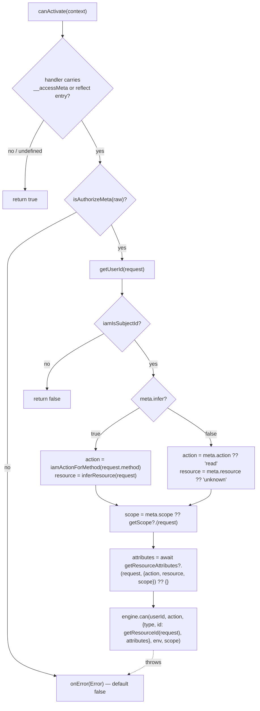
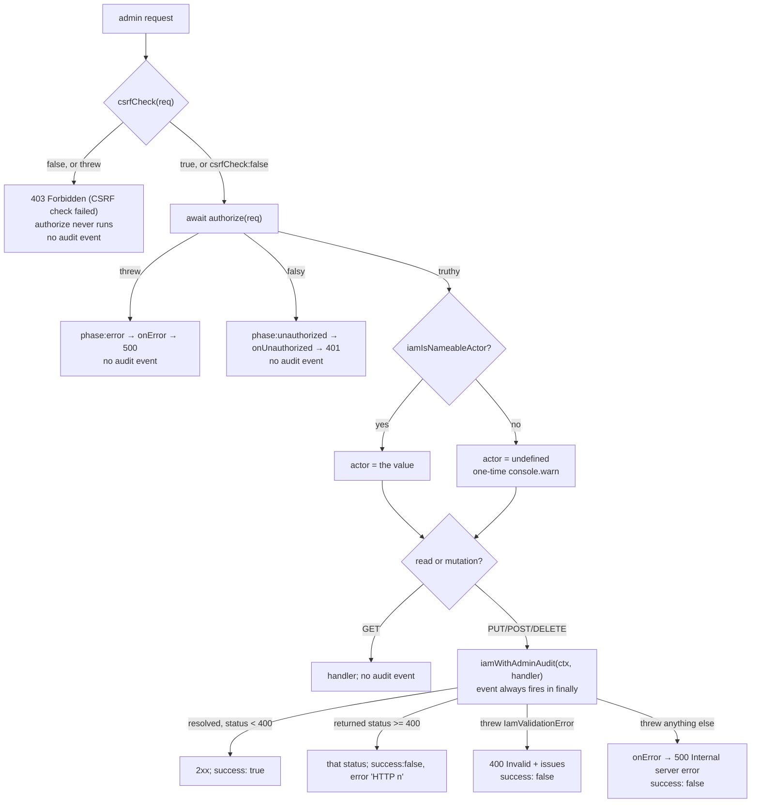

# Server integrations

`src/server/` turns an HTTP request into the `(subjectId, action, resource, environment, scope)` tuple that `engine.can()` answers, and exposes a small admin API that writes policies, roles and assignments over HTTP. Five entry points ship: `@gentleduck/iam/server/generic` holds the shared derivation and admin machinery, and `/express`, `/hono`, `/nest` and `/next` are thin bindings on top of it. This document covers what each one derives, how to mount it, the exact admin request/response contract including every status code, and the places where a wrong wiring fails silently instead of loudly.

Condition semantics for anything the environment feeds are in [`core-evaluate.md`](./core-evaluate.md); `engine.can` / `engine.permissions` / `engine.admin` are in [`core-engine.md`](./core-engine.md); metrics, invalidation and the observability hooks are in [`operations.md`](./operations.md).

---

## 1. Module map

| Entry point | Exports |
| --- | --- |
| `@gentleduck/iam/server/generic` | request derivation (`iamActionForMethod`, `iamDefaultResource`, `iamNormalizePathname`, `iamPathIsAmbiguous`, `iamIsSubjectId`), environment (`iamExtractEnvironment`), the admin gate (`iamRunAdminAuthz`, `iamDefaultCsrfCheck`, `iamWithAdminAudit`, `iamFireAdminMutation`), the edge validators (`iamRequireStringField`, `iamOptionalStringField`, `iamRequirePathParam`, `iamReadJsonBody`), and two subject helpers (`generateIamPermissionMap`, `createIamSubjectCan`) |
| `.../server/express` | `iamAccessMiddleware`, `iamGuard`, `iamAdminRouter`, namespace `IamExpress` |
| `.../server/hono` | `iamAccessMiddleware`, `iamGuard`, `iamBindAdminRouter`, namespace `IamHono` |
| `.../server/nest` | `iamNestAccessGuard`, `IamAuthorize`, `IAM_ACCESS_METADATA_KEY`, `createIamAdminOperations`, `createIamEngineProvider`, `IAM_ACCESS_ENGINE_TOKEN`, `NestRequest`, namespace `IamNest` |
| `.../server/next` | `withIamAccess`, `checkIamAccess`, `getIamPermissions`, `createIamNextMiddleware`, `createIamAdminHandlers`, namespace `IamNext` |

None of the four adapters imports its framework at runtime. Express takes the `Router` constructor as an argument, hono takes an already-constructed router, nest returns a plain `canActivate` body and a record of handlers, and next uses WHATWG `Request`/`Response` only. Every framework is a peer, never a dependency.

---

## 2. `server/generic` — the shared core

Everything the four adapters disagree about was, at some point, a bug. The generic module exists so there is exactly one answer per question. Read this section first; the adapter sections are short because of it.

### 2.1 Method → action

```ts
// src/server/generic/index.ts:962
export const IAM_METHOD_ACTION_MAP: Readonly<Record<string, string>> = {
  GET: 'read', HEAD: 'read', OPTIONS: 'read',
  POST: 'create', PUT: 'update', PATCH: 'update', DELETE: 'delete',
}
```

`iamActionForMethod` (`src/server/generic/index.ts:832`) uppercases first, then looks the method up. Two things about that line are load-bearing:

- **Case-insensitivity is a security property, not a nicety.** A hand-rolled client sending `delete` would miss the map and, before the uppercase, fall through to the default. The default is no longer `read`, but the uppercase stays because of the second point.
- **The uppercase also blocks prototype walking.** `IAM_METHOD_ACTION_MAP` is an object literal, so `__proto__`, `constructor`, `toString`, `valueOf` and `hasOwnProperty` are all reachable through it — and every inherited key is lowercase, so `.toUpperCase()` is what makes the lookup miss. `src/server/generic/__tests__/http-boundary-refusal.test.ts` pins this so a "simplification" cannot turn the lookup into a function where an action string belongs.

An unmapped method yields `IAM_UNKNOWN_ACTION`, which is **not** a string that happens to match nothing:

```ts
// src/server/generic/index.ts:826 and src/shared/reserved.ts
export const IAM_UNKNOWN_ACTION: typeof IAM_RESERVED_REFUSAL = IAM_RESERVED_REFUSAL // === 'unknown'
```

`'*'` matches every string, sentinels included, so a wildcard admin rule (`.on('*').of('*')` — the ordinary shape of an admin role) used to turn both sentinels back into allows on exactly the code path built to refuse. The denial therefore moved into the engine: `'unknown'` is a **reserved token** that `authorize` and `permissions` refuse before consulting any policy, in both engine modes, and `onDeny` fires with a reason containing `reserved refusal token`. The cost is that a resource type or action genuinely named `'unknown'` can no longer be granted.

### 2.2 Path → resource

```ts
// src/server/generic/index.ts:945
export function iamDefaultResource(pathname: string | undefined): {
  type: string; id: string | undefined; attributes: Record<string, never>
}
```

Three steps, in order:

1. `iamPathIsAmbiguous(raw)` (`:906`) — if the raw path contains a segment that *is* a dot-segment, contains a literal backslash, decodes into a dot-segment, or decodes into another separator/escape/NUL, return `IAM_UNKNOWN_RESOURCE` immediately. A malformed percent-escape also counts as ambiguous.
2. `iamNormalizePathname(raw)` (`:844`) — decode once, collapse slash runs, resolve dot segments, preserve a trailing slash.
3. If any surviving segment still contains `%` (double-encoding residue), return `IAM_UNKNOWN_RESOURCE`. Otherwise `{ type: parts[0] ?? 'root', id: parts[1] }`.

The reason step 1 refuses rather than resolves is the whole design. A traversal has *no* safe resolution at this layer, because the routers disagree with each other. Against real servers (`src/server/__tests__/e2e-http-servers.e2e.test.ts`), express served `/admin` for `/admin/../public` while a resolving helper had authorized `public`, and nest read `admin` from a raw path that hono and next served as `/public`. Authorized as one resource, served as another. Refusing is the only answer that does not depend on guessing which framework's normalizer runs downstream.

The literal backslash case is subtle enough to be worth restating: the WHATWG URL parser rewrites `\` to `/` in a special-scheme URL *before* resolving dot segments, so `new URL('http://x/posts\\..\\admin').pathname` is `/admin`. `%5C` was already refused; the plain character — the easier one to send — was not, until it was added to the same check.

| Input | `type` | `id` |
| --- | --- | --- |
| `/posts/42` | `posts` | `42` |
| `/posts` | `posts` | `undefined` |
| `/` or `undefined` | `root` | `undefined` |
| `/posts/../admin/secret` | `unknown` | `undefined` |
| `/posts/%2e%2e/admin` | `unknown` | `undefined` |
| `/posts/%252e%252e/admin` | `unknown` | `undefined` |
| `/posts\..\admin` | `unknown` | `undefined` |
| `//admin` | `admin` | `undefined` |
| `/%61dmin` | `admin` | `undefined` |
| `/posts/hello%20world` | `posts` | `hello world` |

`id` is the **second** path segment, not the last. A route like `/orgs/o1/members/m2` derives `{ type: 'orgs', id: 'o1' }`.

### 2.3 Subject id

```ts
// src/server/generic/index.ts:879
export function iamIsSubjectId(value: unknown): value is string {
  return typeof value === 'string' && value.trim().length > 0
}
```

Every integration calls this on whatever `getUserId` returned, before touching the engine. `getUserId` is *typed* `string | null`, but it is consumer code reading a request body or a JWT claim, so the type is a promise rather than a guarantee. `engine.can` guards `length === 0`, not `trim()`, so `'   '` is a perfectly good cache key to it and any assignment stored under that key grants its permissions. This is the only layer that refuses a blank or non-string id, and `src/server/__tests__/cross-adapter.test.ts` drives all seven entry points through the same table (`'   '`, `''`, `'\t\n'`, `42`, `true`, `{}`, `[]`, `null`, `undefined`) so one weakened guard cannot hide behind the others.

### 2.4 `iamExtractEnvironment` — and the fields that are `undefined`

```ts
// src/server/generic/index.ts:758
export function iamExtractEnvironment(
  req: { ip?: string; headers?: Record<string, string | string[] | undefined> | Headers; method?: string; url?: string },
  opts?: { trustProxy?: boolean },
): IamRequest.IEnvironment
```

It returns exactly three keys.

| Field | Default | Notes |
| --- | --- | --- |
| `timestamp` | `Date.now()` | Always populated. |
| `userAgent` | the `user-agent` header | Dropped (left `undefined`) when empty or longer than 2048 chars — `MAX_USER_AGENT_LENGTH`, `src/server/generic/index.ts:802`. |
| `ip` | **`undefined`** | Only populated when `opts.trustProxy === true`. |
| `now` | not set here | Injected by the engine as `Date.now()` when absent (`ensureEnvNow`, `src/core/engine/engine.libs.ts:26`). |
| anything else | never set | `IEnvironment` has a string index signature; a custom key only exists if the host's `getEnvironment` puts it there. |

**`environment.ip` is `undefined` unless you ask for it.** There is no guess that is right on every deployment and the wrong one is exploitable: `X-Forwarded-For` and `X-Real-IP` are request headers like any other, so with nothing in front of the app a client sets them itself. Measured against real servers, hono, next and the generic helper each echoed a plain `X-Forwarded-For: 10.0.0.1` into `environment.ip` — and a header alone satisfied an IP-conditioned admin grant — while express and nest reported the socket peer for the same request. One policy, three answers, three of five spoofable. `req.ip` is ignored by default for the same reason: an integration may fill it from a platform header rather than a socket.

Opt in one of two ways:

```ts
// Behind exactly one trusted proxy that appends the peer address:
getEnvironment: (req) => ({ ...iamExtractEnvironment(req), ip: trustedClientIp(req) })

// Or, if the framework already knows about your proxies:
getEnvironment: (req) => iamExtractEnvironment(req, { trustProxy: true })
```

Under `trustProxy`, the chain is `req.ip` → leftmost `x-forwarded-for` hop → `x-real-ip`, each normalized by `normalizeForwardedFor` (`src/server/generic/index.ts:808`): reject the whole header above 4096 chars, take the text before the first comma, trim, reject if blank or above 256 chars. `[2001:db8::1]` and `2001:db8::1` both survive verbatim. `req.ip` goes through the same normalization, so a comma-joined `req.ip` yields its leftmost hop and a 100 KB one is dropped.

**The correctness trap.** A condition on a field the host never populated reads as a **non-match**, not an error. Write a deny rule keyed on `environment.ip` on a default wiring and it never fires — the request is allowed, silently, forever. The same applies to any custom key (`environment.hour`, `environment.region`, a feature flag): the extractor sets three fields and nothing else, so `getEnvironment` is the only place those values can enter. See [`core-evaluate.md`](./core-evaluate.md) for how a missing operand is resolved.

The user-agent cap has the same shape but the opposite polarity: `userAgent` is attacker-controlled and flows into `matches` conditions, which throw above the regex input cap. Dropping an oversized value keeps a caller from perturbing evaluation with one header, at the cost of a `matches` on `environment.userAgent` reading as a non-match for that request.

### 2.5 Subject helpers

```ts
// src/server/generic/index.ts:683
generateIamPermissionMap(engine, subjectId, checks, environment?)  // → engine.permissions(...)
// src/server/generic/index.ts:717
createIamSubjectCan(engine, subjectId, environment?)
// → (action, resourceType, resourceId?, scope?) => Promise<boolean>
```

Both are one-line delegations to the engine, kept for terseness inside handlers. `generateIamPermissionMap` infers `TMode` from the engine, so a development-mode engine returns a typed `IamClient.PermissionMap` and a production one returns `Record<string, boolean>` — whatever `engine.permissions` itself returns in that mode. Forward the map to the React provider described in [`client.md`](./client.md).

### 2.6 A guard and the row it has not loaded

A guard runs before the handler has loaded anything, so unless the call site supplies them the resource is built from the route alone: `{ type, id, attributes: {} }`. A rule conditioned on `resource.attributes.*` is then evaluated against an instance that has none and cannot fire — a deny reading `resource.attributes.archived` does not stop `DELETE /posts/42`, while the same `can()` inside the handler, with the row in hand, refuses it.

Every surface can be told. *How* differs, and the difference is the part worth reading:

| Surface | How the attributes get in |
| --- | --- |
| `iamAccessMiddleware` (express, hono) | `getResource` returns the whole `{ type, id, attributes }` — **synchronous**, so attributes an earlier middleware already attached work, loading the row here does not |
| `iamGuard` (express, hono) | `opts.getResourceAttributes(req, { action, resource, resourceId, scope })`, may be async |
| `iamNestAccessGuard` | `opts.getResourceAttributes(request, { action, resource, resourceId, scope })`, may be async |
| `withIamAccess` | `opts.getResourceAttributes(req, { action, resource, resourceId, scope })`, may be async |
| `createIamNextMiddleware` | `opts.getResourceAttributes(req, { action, resource, resourceId, scope })`, may be async |
| `checkIamAccess` | 8th positional argument |
| `createIamSubjectCan` | 5th argument of the returned checker |
| `engine.permissions()` | `attributes` on each check (see [`core-engine.md`](./core-engine.md) §3.4) |

Values must be `AttributeValue`: `null` means absent, `undefined` is rejected.

It stays opt-in because supplying attributes costs the load the guard exists to skip. Without the callback the guard remains the coarse gate on type, id and scope, and the attribute-dependent rule belongs in `engine.can(...)` after the fetch. `src/server/__tests__/guard-resource-attributes.test.ts` puts all eight surfaces through one archived-post policy and pins both halves: the default lets the read through, the supplied attributes refuse it, and a control shows the deny is the engine's rather than any integration's.

`ctx.resourceId` is the id the guard resolved, so the loader can fetch exactly the row the check is about — see §2.7 for where that id comes from.

### 2.7 Which row the guard thinks it is

The id is the other half of the same request, and it is easier to get wrong because it looks like it already works. Four guards read a path param, and the param they read is `id`:

| Surface | Where the id comes from | Override |
| --- | --- | --- |
| `iamGuard` (express) | `req.params.id` | `opts.getResourceId(req)` |
| `iamGuard` (hono) | `c.req.param('id')` | `opts.getResourceId(c)` |
| `iamNestAccessGuard` | `request.params.id` | `opts.getResourceId(request)` |
| `withIamAccess` | `ctx.params.id` | `opts.getResourceId(req, params)` |
| `createIamNextMiddleware` | nothing — middleware runs before routing and has no params | `opts.getResourceId(req, { action, resource, scope })`, **no default** |
| `iamAccessMiddleware` (express, hono) | `getResource` returns it | — |
| `checkIamAccess` / `createIamSubjectCan` | positional argument | — |

Two consequences follow from that table.

On a nested route the default names the wrong row. `/orgs/:id/posts/:postId` guarded with `iamGuard(engine, 'read', 'post')` sends the **org's** id as `resource.id`, so a rule like "deny reading post `42`" is answered about an org that happens to be numbered differently, and an ownership rule comparing `resource.id` to something the subject owns compares the wrong two things. Name the param: `{ getResourceId: (req) => req.params.postId }`.

In Next.js middleware there is no id at all unless you extract one. `createIamNextMiddleware` matches a path prefix and knows the rule's `resource`, not which instance the path names, so a rule reading `resource.id` silently cannot fire — the same fail-open shape as an attribute rule with no `getResourceAttributes`. It has no default because only the rule's own path shape says which segment is the id.

`src/server/__tests__/guard-resource-id.test.ts` drives all five surfaces against one policy denying post `42`: the default refuses it on `/posts/:id`, lets it through when the route calls the param `:postId`, and refuses it again once `getResourceId` names that param.

### 2.8 Which scope the guard runs under

The scope is the fourth dimension of the request, alongside action, resource type and row. Unlike the other three it has **no default anywhere** — a guard given nothing runs the check with `scope: undefined`.

| Surface | Fixed scope | Per-request scope |
| --- | --- | --- |
| `iamGuard` (express) | `opts.scope` | `opts.getScope(req)` |
| `iamGuard` (hono) | `opts.scope` | `opts.getScope(c)` |
| `iamNestAccessGuard` | `@IamAuthorize({ scope })` | `opts.getScope(request)` |
| `withIamAccess` | `opts.scope` | `opts.getScope(req, params)` |
| `createIamNextMiddleware` | the matched rule's `scope` | `opts.getScope(req, { action, resource })` |
| `iamAccessMiddleware` (express, hono) | — | `opts.getScope(req | c)` |
| `checkIamAccess` / `createIamSubjectCan` | positional argument | — |

The fixed scope wins wherever both are given, so an existing `{ scope: 'admin' }` keeps its meaning and `getScope` is the fallback for routes that do not name one.

Running unscoped is not neutral. A scoped assignment — `assignRole('u1', 'editor', { scope: 'org-1' })` — only enriches the subject when the request carries a matching scope, so the grant does not apply and the check fails closed. A rule conditioned on `scope` is the other direction: the field resolves to `null`, the condition does not match, and a **deny** in that shape silently never fires. On the canonical multi-tenant route, `/orgs/:orgId/posts/:id`, the tenant is right there in the path and the guard has to be told to read it:

```ts
app.delete('/orgs/:orgId/posts/:postId', iamGuard(engine, 'delete', 'post', {
  getResourceId: (req) => req.params.postId,
  getScope: (req) => req.params.orgId,
}), handler)
```

`ctx.scope` on `getResourceAttributes` is the resolved scope, so an attribute loader can fetch the row from the right tenant.

`src/server/__tests__/guard-scope.test.ts` drives all five surfaces against one policy denying scope `org-1`: unscoped the deny misses, `getScope` reading `:orgId` fires it, a fixed `scope` still works, and a fixed scope beats `getScope`.

---

## 3. Express

```ts
import { Router } from 'express'
import express from 'express'
import { IamEngine } from '@gentleduck/iam/core'
import { IamMemoryAdapter } from '@gentleduck/iam/adapters/memory'
import { iamAccessMiddleware, iamGuard, iamAdminRouter } from '@gentleduck/iam/server/express'
import { iamExtractEnvironment } from '@gentleduck/iam/server/generic'

const engine = new IamEngine({ adapter: new IamMemoryAdapter({ roles, policies, assignments }) })

const app = express()
app.use(express.json())
app.use(session())                       // whatever populates req.user

// A) Blanket check on every request: action from the method, resource from the path.
app.use(iamAccessMiddleware(engine, {
  getUserId: (req) => req.user?.id ?? null,
  // env.ip is undefined unless you say which hop is the client:
  getEnvironment: (req) => ({ ...iamExtractEnvironment(req), ip: trustedClientIp(req) }),
}))

// B) Or per route, with the resource named explicitly.
app.delete('/posts/:id', iamGuard(engine, 'delete', 'post'), deletePost)
app.post('/admin/users', iamGuard(engine, 'manage', 'user', { scope: 'admin' }), createUser)

// C) The admin API. `authorize` is mandatory; construction throws without it.
app.use('/api/access-admin', iamAdminRouter(engine, {
  authorize: (req) => req.user?.role === 'admin' ? req.user : false,
  onAdminMutation: (e) => auditLog.write(e),
})(Router))
```

`iamAccessMiddleware` (`src/server/express/index.ts:160`) defaults: `getUserId` reads `req.user?.id`, `getResource` is `iamDefaultResource(req.path)`, `getAction` is `iamActionForMethod(req.method)`, `getEnvironment` is `iamExtractEnvironment`, `onDenied` is 403 `{error:'Forbidden'}`, `onError` is 500 `{error:'Internal server error'}`. No user → 401 `{error:'Unauthorized'}` before the engine is consulted. Allowed → `next()`.

`iamGuard` (`:218`) is the same shape with `action` and `resourceType` fixed and the resource id read from `req.params?.id`. Its options are a `Pick` of the middleware's: `getUserId`, `getEnvironment`, `onDenied`, `onError`, plus `scope`.

Two express-specific decisions:

- **`getUserId` is called inside the `try`.** It is the extractor most likely to do I/O — JWT verification, a session lookup, an IdP call — and an Express 4 middleware that returns a rejected promise writes nothing to the socket. The client hung until it timed out. All five integrations now call it inside their own try; only express could actually stop responding.
- **`next()` sits outside the try**, as `await next()` does in hono (§4) and
  `handler(req, ctx)` does in next (§6). Express 4 invokes the next middleware
  synchronously, so a route that threw synchronously came back out of `next()`,
  was caught here, and was answered by this middleware's `onError` — a fixed 500
  that pre-empts the app's own error middleware and reports a route failure as
  an authorization failure. Both `iamAccessMiddleware` and `iamGuard` now let a
  route error past; an evaluation error still reaches `onError`.
  `proceed-runs-outside-the-guard.test.ts` runs the same assertion against all
  three adapters.
- **`onError` is not handed `next`.** It used to be, and the obvious handler to write with it — `(err, req, res, next) => next()` — resumes the request with no decision made, i.e. fails open on the exact path where the decision could not be computed. `iamGuard`'s default was also `next(err)`, which with no app error handler and `NODE_ENV !== 'production'` makes finalhandler write `err.stack` into the response body. Both now answer a fixed 500. `src/server/__tests__/cross-adapter.test.ts` asserts `onError.mock.calls[0].length === 3`.

---

## 4. Hono

```ts
import { Hono } from 'hono'
import { iamAccessMiddleware, iamGuard, iamBindAdminRouter } from '@gentleduck/iam/server/hono'

const app = new Hono()

// Upstream auth middleware must call c.set('userId', ...). Nothing else is read.
app.use('*', async (c, next) => {
  const session = await readSession(c)
  if (session) c.set('userId', session.userId)
  await next()
})

app.use('*', iamAccessMiddleware(engine))

app.delete('/posts/:id', iamGuard(engine, 'delete', 'post'), deletePost)

const admin = new Hono()
iamBindAdminRouter(admin, engine, {
  authorize: (c) => c.get('adminUser') ?? false,
  onAdminMutation: (e) => auditLog.write(e),
})
app.route('/admin', admin)
```

`getUserId` defaults to `c.get('userId')` and **nothing else** (`src/server/hono/index.ts:206`). There is deliberately no `x-user-id` header fallback: a header is caller-controlled, and a test pins that a request carrying `x-user-id: spoofed-admin` with no upstream `c.set` gets a 401.

Hono is the only adapter with a built-in IP opt-in, `trustCloudflareHeaders`. Off, `environment.ip` is `undefined`. On, `defaultEnv` (`src/server/hono/index.ts:160`) passes `cf-connecting-ip` as `req.ip` and sets `trustProxy: true`, so the chain becomes `cf-connecting-ip` → `x-forwarded-for` → `x-real-ip`. `cf-connecting-ip` is trustworthy only when Cloudflare is the sole ingress; a hono app exposed directly lets any client set it. An app behind its own proxy should use `getEnvironment` instead.

**`await next()` sits outside the try, deliberately.** Hono awaited the downstream handler inside its own try, so a business-logic error thrown by the route came back out of `await next()`, was caught here, and was reported through the middleware's `onError` — documented as "handles thrown errors during evaluation". That pre-empted the app's own `app.onError` and turned every route failure into an authorization-shaped 500. Both `iamAccessMiddleware` and `iamGuard` now let a route error past. An evaluation error still reaches `onError`.

This was first written up as hono being "the only one of the five", which was wrong, and wrong in a way worth recording: the sweep behind that claim looked for an *awaited* downstream call inside the try. `withIamAccess` spelled its call `return handler(req, ctx)`, with no `await`, so it did not match — and an unawaited `return` inside a try still routes a *synchronous* throw to the catch, while letting a rejection past. Same route error, two different outcomes, decided by whether the route handler was declared `async`. See §6.1.

---

## 5. Nest

The richest surface, and the one with the most ways to be wired wrong.

### 5.1 Mounting

```ts
import { Injectable, CanActivate, Controller, Get, Put, Post, Delete, Param, Body, Req, UseGuards, Module } from '@nestjs/common'
import {
  IamAuthorize, iamNestAccessGuard, createIamAdminOperations,
  createIamEngineProvider, IAM_ACCESS_ENGINE_TOKEN,
} from '@gentleduck/iam/server/nest'

@Module({ providers: [createIamEngineProvider(() => buildEngine())], exports: [IAM_ACCESS_ENGINE_TOKEN] })
class IamModule {}

@Injectable()
class IamGuard implements CanActivate {
  // The engine is captured once; `canActivate` is the returned closure.
  canActivate = iamNestAccessGuard(engine, {
    getUserId: (req) => req.user?.id ?? req.session?.identityId ?? null,
    getScope: (req) => req.headers['x-tenant'] as string | undefined,
  })
}

@UseGuards(IamGuard)
@Controller('posts')
class PostsController {
  @Get(':id')
  @IamAuthorize({ action: 'read', resource: 'post' })
  find(@Param('id') id: string) { /* ... */ }

  @Delete(':id')
  @IamAuthorize({ infer: true })   // action from DELETE, resource from the route
  remove(@Param('id') id: string) { /* ... */ }

  @Get('health')
  health() { return { ok: true } }  // NO decorator — see §5.3
}
```

The admin API is a record of handlers rather than a router, because Nest owns routing:

```ts
@Controller('admin')
class IamAdminController {
  private h = createIamAdminOperations(engine, {
    authorize: (req) => (req.user?.role === 'admin' ? req.user : false),
    onAdminMutation: (e) => auditLog.write(e),
  })

  @Get('policies') listPolicies(@Req() req) { return this.h.listPolicies(req) }
  @Get('roles')    listRoles(@Req() req)    { return this.h.listRoles(req) }
  @Put('policies') savePolicy(@Req() req, @Body() body) { return this.h.savePolicy(req, body) }
  @Put('roles')    saveRole(@Req() req, @Body() body)   { return this.h.saveRole(req, body) }

  @Post('subjects/:id/roles')
  assignRole(@Req() req, @Param('id') id: string, @Body() body) { return this.h.assignRole(req, id, body) }

  @Delete('subjects/:id/roles/:roleId')
  revokeRole(@Req() req, @Param('id') id: string, @Param('roleId') roleId: string) {
    return this.h.revokeRole(req, id, roleId)
  }
}
```

`createIamAdminOperations` throws at construction when `authorize` is not a function, so the controller cannot be instantiated unguarded.

### 5.2 `IamAuthorize` and the metadata

```ts
// src/server/nest/index.ts:65
export const IAM_ACCESS_METADATA_KEY = 'duck-iam:authorize'

// src/server/nest/index.ts:246
export function IamAuthorize(meta: IamNest.IAuthorizeMeta = { infer: true }): MethodDecorator
```

The decorator writes the metadata **twice**: through `Reflect.defineMetadata(IAM_ACCESS_METADATA_KEY, meta, descriptor.value)` when `reflect-metadata` is loaded, and as an own `__accessMeta` property on the handler function so the guard works without that package.

`IamNest.IAuthorizeMeta` has four optional fields:

| Field | Type | Effect |
| --- | --- | --- |
| `action` | `string?` | The action asked about, when `infer` is not set. Falls back to `'read'`. |
| `resource` | `string?` | The resource type asked about, when `infer` is not set. Falls back to `'unknown'`. |
| `scope` | `string?` | Wins over the guard's `getScope`. |
| `infer` | `boolean?` | When `true`, action comes from the HTTP method and resource from the route. |

Reading order in `getHandlerMeta` (`src/server/nest/index.ts:274`): if `'__accessMeta' in handler` — which **walks the prototype chain** — take that; otherwise consult `Reflect.getMetadata`. An inherited `__accessMeta` therefore decides the request, and shadows the reflect entry entirely.

### 5.3 What happens with no metadata — and with unreadable metadata

These are two different answers, and conflating them was a live bypass.

```ts
const { meta, present } = getHandlerMeta(handler)
if (!present) return true            // No @IamAuthorize decorator: allow.
if (meta === undefined) return onError(new Error('...not readable...; denying.'), request)
```

- **No decorator → the guard returns `true`.** An undecorated controller method is not this package's business. `@Get('health') health()` above is unguarded, and that is by design: the guard is opt-in per handler even when applied globally with `@UseGuards`. This is the case people get wrong. Applying `iamNestAccessGuard` app-wide does **not** protect anything; it protects exactly the handlers carrying `@IamAuthorize`. A handler that loses its decorator in a refactor becomes public with no error, no log, and no failing test unless one is written for that route specifically.
- **`undefined` counts as absent.** That is what an unset reflect key answers, and it is indistinguishable from no decorator.
- **Present but unreadable → deny, through `onError`.** `null`, `false`, `0`, `''`, a string, a number, an array, `{action: 1}`, `{resource: {}}`, `{scope: 7}`, `{infer: 'true'}` and `{infer: 1}` are all refused, and the engine is never consulted. Previously the guard's `if (!meta) return true` could not tell "no decorator" from "decorator carrying `null`", so a broken decorator opened the route instead of closing it; and a `scope` arriving as a number went straight into `engine.can` as the tenant to answer for. The refusal is routed through `onError` so an operator sees which handler is broken rather than hunting a silent 403 — the message contains `@gentleduck/iam:nest`. `src/server/nest/__tests__/nest-authorize-meta-validation.test.ts` is the whole table.

`isAuthorizeMeta` (`:221`) is deliberately permissive about *extra* keys — a caller adding their own annotation is not refused — and strict about the four the guard reads.

**`@IamAuthorize({})` always denies.** Every field is optional, so `{}` is readable; with `infer` unset, `resource` falls back to the literal `'unknown'`, which is the engine's reserved refusal token. Same for `@IamAuthorize({ action: 'read' })` with no `resource`. If you mean "check with the defaults", write `@IamAuthorize()` — the default argument is `{ infer: true }`.

### 5.4 Decision flow



Guard defaults (`src/server/nest/index.ts:315`): `getUserId` is `req.user?.id ?? req.user?.sub ?? null`; `getEnvironment` is `iamExtractEnvironment(req)` (so `ip` is `undefined` even though express-backed Nest has `req.ip`); `getResourceId` is `req.params?.id`; `onError` returns `false`.

A missing subject id returns `false` — the guard has no way to distinguish 401 from 403, so Nest's own filter decides. `getResourceAttributes` receives the resolved `{ action, resource, scope }` because the right attributes depend on which resource and scope the check runs against; values must be `AttributeValue`, so use `null` for "absent", never `undefined`.

### 5.5 `inferResource`

`inferResource` (`src/server/nest/index.ts:406`) has to agree with `iamDefaultResource`, or a policy written against express silently does not apply under Nest. The order matters:

1. If `request.path` is ambiguous (`iamPathIsAmbiguous`), return `IAM_UNKNOWN_RESOURCE` — **before** looking at the route template. A matched template does not make an ambiguous target safe; it only records which route express picked for it. Express matched `/public/*` for `/public/../admin`, so an earlier version returned a confident `public` while hono and next served `/admin`.
2. If `request.route?.path` is not a string — which is the normal case under `@nestjs/platform-fastify`, which exposes `routeOptions.url` / `routerPath` and sets no `route` — delegate to `iamDefaultResource(request.path).type` outright.
3. Otherwise take the **first** non-`:param` segment of the template. `undefined` (all params) → `'root'`. A segment containing `%` or `*` → `IAM_UNKNOWN_RESOURCE`.

| Template | Resource |
| --- | --- |
| `/posts/:id` | `posts` |
| `posts` | `posts` |
| `/orgs/:orgId/members/:id` | `orgs` |
| `/secrets/*` | `secrets` |
| `/files/*path` | `files` |
| `/*`, `*`, `/*path` | `unknown` |
| `/%61dmin` | `unknown` |
| `/:id`, `/` | `root` |

Taking the *last* segment (the historical behaviour) authorized `/posts/42` against `42` on any platform with no `request.route`. Returning `'*'` verbatim was worse: `'*'` is the engine's wildcard *pattern* sentinel, so a `@Get('*')` route matched every `resources: ['*']` allow and no targeted deny.

---

## 6. Next.js

Four separate surfaces, because the App Router has four places a check belongs.

### 6.1 Route Handlers — `withIamAccess`

```ts
// app/api/posts/[id]/route.ts
import { withIamAccess } from '@gentleduck/iam/server/next'
import { auth } from '@/auth'

export const DELETE = withIamAccess(
  engine,
  'delete',
  'post',
  async (req, ctx) => {
    const { id } = await ctx.params
    return Response.json({ deleted: id })
  },
  { getUserId: async () => (await auth()).userId },
)
```

`opts.getUserId` is **required** and the constructor throws without it: identity is never derived from request headers, because a header is caller-controlled. The resource id comes from `ctx.params.id` (awaited when it is a promise). 401 for no user, 403 for a denial, `onError` (default 500) for a throw.

**`handler(req, ctx)` sits outside the try**, as `await next()` does in hono (§4): `withIamAccess` invokes the route itself, with no framework layer in between, so anything the route throws would otherwise be reported as an evaluation failure. Both spellings are covered — `cross-adapter.test.ts` runs the same assertion against an `async` route and a plain one, because the bug this fixed was visible only in the plain one.

### 6.2 Server Components — `checkIamAccess` and `getIamPermissions`

```ts
const canEdit = await checkIamAccess(engine, session.userId, 'update', 'post', post.id)
const perms   = await getIamPermissions(engine, session.userId, [{ action: 'update', resource: 'post' }])
```

Both take the environment: `checkIamAccess(engine, subjectId, action, resource, resourceId?, scope?, environment?, attributes?)` and `getIamPermissions(engine, subjectId, checks, environment?)`. A Server Component has no `Request` to derive one from, so build it from `headers()` yourself. Omit it and only `environment.now`, injected by the engine, is available, so a rule keyed on `environment.userAgent`, `environment.ip` or a custom key reads as a non-match — a deny on the environment is inert here while the same policy fires in middleware. `attributes` is the same story for the row; see §2.6.

### 6.3 Edge Middleware — `createIamNextMiddleware`

```ts
// middleware.ts
import { NextResponse } from 'next/server'
import { createIamNextMiddleware } from '@gentleduck/iam/server/next'

const mw = createIamNextMiddleware(engine, {
  rules: [
    { pattern: '/admin', resource: 'admin' },              // action inferred from the method
    { pattern: /^\/orgs\/[^/]+\/billing/, action: 'read', resource: 'billing', scope: 'org' },
  ],
  getUserId: async (req) => (await getServerSession(req))?.user?.id ?? null,
})

export const middleware = async (req: Request) => (await mw(req)) ?? NextResponse.next()
```

It returns `Response | null` — `null` means "no opinion, carry on". Order inside (`src/server/next/index.ts:333`):

1. `iamPathIsAmbiguous(url.pathname)` → `onDenied`. Refused *before* canonicalisation: `/admin/..%2fpublic` keeps its `%2f` through `new URL()`, so a canonicalising middleware resolved the `..`, matched the `/public` rule and allowed, while Next's own router decoded the escape into a path segment and served `/admin`.
2. `path = iamNormalizePathname(url.pathname)` — `//admin` and `/%61dmin` both survive `new URL()` and skip a `/admin` prefix rule while still routing to `/admin`.
3. `path.includes('%')` → `onDenied`. `iamNormalizePathname` decodes exactly once; the residue check that makes that safe lives in `iamDefaultResource`, and this call site has to reproduce it. Without it, `/posts/%252e%252e/admin` was checked as `posts` while routing to `/admin` — or matched no rule at all, and no rule means `return null`, passing the request through with **no authorization call**.
4. `rules.find(...)`. A string `pattern` is a **prefix** (`path.startsWith`), not a substring, and `find` takes the first match. Under substring matching, `/admin/public-report` would match a `/public` rule listed first and be authorized as `public`. Pinned by `src/server/next/__tests__/next-middleware-rule-matching.test.ts`.
5. No rule → `return null`, unauthorized. A rule list is opt-in; a path that merely contains a pattern mid-string (`/notes/admin-draft`) matches nothing and passes through.
6. Otherwise `engine.can(userId, rule.action ?? iamActionForMethod(req.method), { type: rule.resource, attributes }, getEnvironment(req), rule.scope)`, where `attributes` is what `opts.getResourceAttributes` returned, or `{}`.

The resource carries **no id** here — only `type`. And `getEnvironment` defaults to `iamExtractEnvironment({ headers, method, url })`; this was the one integration that passed no environment at all, so a rule keyed on `environment.userAgent` was inert exactly where a Next app puts its edge checks.

All three literal responses are hookable: `onUnauthorized` (401), `onDenied` (403, used for both denials *and* the two path refusals), `onError` (500).

One platform limit worth knowing: `new Request(url)` resolves dot segments while constructing the URL, so a traversal written on the wire never reaches Next middleware or hono as a traversal — they are handed `/public` and authorize `public`, which is self-consistent and safe, while express, Nest and the generic helper still see the raw target and refuse it. Recorded as a deliberate divergence in `src/server/__tests__/e2e-http-servers.e2e.test.ts`.

### 6.4 Admin Route Handlers — `createIamAdminHandlers`

```ts
// app/api/admin/policies/route.ts
const h = createIamAdminHandlers(engine, { authorize: (req) => isAdminToken(req) })
export const GET = h.listPolicies
export const PUT = h.savePolicy

// app/api/admin/subjects/[id]/roles/route.ts
export const POST = h.assignRole

// app/api/admin/subjects/[id]/roles/[roleId]/route.ts
export const DELETE = h.revokeRole
```

Each handler is `(req: Request, ctx: { params: Promise<P> | P }) => Promise<Response>`, so it drops straight into a route file.

---

## 7. The admin request contract

All four adapters expose the same six operations over the same shapes, and `src/server/__tests__/admin-cross-adapter.test.ts` and `admin-request-validation-parity.test.ts` drive identical requests through all four and require one answer.

### 7.1 Endpoints

| Operation | Express / Hono route | Next handler | Nest operation | Body | Success response |
| --- | --- | --- | --- | --- | --- |
| list policies | `GET /policies` | `h.listPolicies` | `ops.listPolicies(req)` | — | `IPolicy[]` |
| list roles | `GET /roles` | `h.listRoles` | `ops.listRoles(req)` | — | `IRole[]` |
| replace a policy | `PUT /policies` | `h.savePolicy` | `ops.savePolicy(req, body)` | `IPolicy` document | `{ ok: true }` |
| replace a role | `PUT /roles` | `h.saveRole` | `ops.saveRole(req, body)` | `IRole` document | `{ ok: true }` |
| grant a role | `POST /subjects/:id/roles` | `h.assignRole` | `ops.assignRole(req, subjectId, body)` | `{ roleId: string, scope?: string }` | `{ ok: true }` |
| revoke a role | `DELETE /subjects/:id/roles/:roleId` | `h.revokeRole` | `ops.revokeRole(req, subjectId, roleId)` | — | `{ ok: true }` |

Nest returns the value rather than a `Response`; its controller serializes it.

`engine.admin` has more than this — `getPolicy`, `deletePolicy`, `getRole`, `deleteRole`, `updateAssignmentScope`, `setAttributes`, and the batch methods (`assignRoles`, `revokeRoles`, `moveRoleScopes`) — and **none of them is exposed over HTTP**. A deployment that needs them wires its own handler against the engine.

**`DELETE /subjects/:id/roles/:roleId` revokes the role in every scope.** All four adapters call `engine.admin.revokeRole(subjectId, roleId)` with no third argument, and the adapter contract for an omitted scope is "remove EVERY assignment for this role across all scopes" (`src/adapters/memory/index.ts:272`, matching redis/drizzle/prisma). There is no way to revoke one scoped grant through the admin router; use `engine.admin.revokeRole(subjectId, roleId, scope)` directly.

### 7.2 Field validation

Every string that arrives from a body or a path parameter goes through one of three shared validators, and the rules are identical across the four adapters.

| Check | Rule | Code in `issues` |
| --- | --- | --- |
| body is a JSON object | not an array, not `null`, not a primitive | `NOT_AN_OBJECT` |
| required field | a string, non-empty | `INVALID_FIELD` |
| required field | not whitespace-only | `BLANK_FIELD` |
| any field | ≤ `IAM_MAX_ADMIN_FIELD_LENGTH` (1024) | `FIELD_TOO_LONG` |
| optional field (`scope`) | absent is fine; explicit `null` is refused | `INVALID_FIELD` |
| path parameter | present, non-empty, not blank, ≤ 1024 | `MISSING_PARAM` / `BLANK_PARAM` / `PARAM_TOO_LONG` |
| request body bytes | parse as JSON | `MALFORMED_JSON` |

Three of those encode a real incident:

- **Blank is refused, not trimmed.** All four adapters took `length === 0` as the emptiness test, so `{"roleId": "   "}` wrote a real grant to a role nobody can name — not `""`, so nothing downstream refused it, and it renders as nothing at all in an admin UI. Trimming instead would be worse: the caller would get back a grant on an id they did not send.
- **1024 is the engine's own cap** (`assertNonEmptyStringParam`). Hono used to cap `roleId` and `scope` at 128 inline while express, next and nest applied no cap and let the engine's 1024 decide, so the same 200-char request was a 400 on one adapter and a 500 on two. Nothing the engine would accept is now refused at the edge.
- **`scope: null` is a 400; an absent `scope` is "unscoped".** Reading `null` as absent made express the one adapter that turned a client's `null` into a global role assignment — hono answered 400, next and nest passed it to the engine, which refuses it by name. A client written against hono that spells "unset" as `null` would widen every grant it makes the day the deployment moves. The refusal message carries the fix verbatim: *omit the field entirely to mean "unset"*, and that hint reaches the client in `issues` because the message alone goes to `onError`, which a client never sees.

`iamReadJsonBody` (`src/server/generic/index.ts:1047`) is called by hono and next only — they are the two adapters that parse the body themselves, *inside* the audited handler, so a truncated upload or a form post carrying `Content-Type: application/json` raised a `SyntaxError` out of the handler, landed in the generic catch, and answered 500. Express and nest never saw it because their hosts parse the body first. The parser's own message is deliberately not repeated — it quotes the offending bytes, which is caller-controlled content on its way into an operator's log.

### 7.3 The gate, in order



**CSRF is on by default and applies to reads.** `iamDefaultCsrfCheck` (`src/server/generic/index.ts:265`) reads `Sec-Fetch-Site` and refuses `cross-site` / `cross-origin`; every other value, and the header's absence, passes. The header is set by the user agent and cannot be forged by page script, which is what makes it worth reading; its absence means a non-browser caller (curl, server-to-server, an old browser), and bearer tokens or mTLS decide that case. The lookup is case-insensitive across three shapes — a fetch `Headers` (via `.get`), an express/nest `Record` (own keys only, compared lowercased, first string of an array value), and a hono context (`c.req.header`). Matching only the lowercase spelling let a cross-site request through whenever the runtime preserved the wire casing.

`csrfCheck: false` disables the phase; a function replaces it (e.g. an `Origin` allowlist). A predicate that **throws** is `forbidden`, not a 500: a predicate that cannot answer has not said yes, and `authorize` is never called. Reads run the same phase as mutations — nest was the only adapter CSRF-checking reads, and the four now agree rather than three changing to match the looser one.

On first admin-router construction with no `csrfCheck` supplied, one `console.info` fires per process announcing the 2.1.0 default. Passing any `csrfCheck` — including `false` — suppresses it.

**The actor.** `authorize` may return an `IamAdminActor` (a non-blank string, or an object identifying someone), `true`, or a falsy value. All three shapes authorize as they always did; what changed is that only a *nameable* value is recorded as `event.actor`. `true`, `42`, `[]`, `'   '` and a symbol all authorize and record `actor: undefined`, plus a one-time `console.warn` telling the operator to return the actor itself. An audit trail that names `true` as the person who changed a policy cannot attribute the mutation to anybody, and attribution is the whole reason the event exists. `false`, `0`, `''`, `null`, `undefined` and `NaN` refuse.

### 7.4 Status codes

This is the table the whole section exists for. Express, hono and next write these responses. **Nest throws instead**, with `status` and `statusCode` both set on the error — `statusCode` because Nest's base filter routes a non-`HttpException` to `handleUnknownError`, whose only non-500 branch duck-types `err.statusCode && err.message`; `status` is kept for express-style consumers.

| Situation | Status | Body (express / hono / next) | Nest | Audit event |
| --- | --- | --- | --- | --- |
| CSRF predicate returns `false` | **403** | `{error:'Forbidden (CSRF check failed)'}` | throws, `statusCode: 403` (`onForbidden`) | none |
| CSRF predicate throws | **403** | same | same | none |
| `authorize` returns falsy | **401** | `{error:'Unauthorized'}` (`onUnauthorized`) | throws, `statusCode: 401` (`onUnauthorized`) | none |
| `authorize` throws | **500** | `{error:'Internal server error'}` (`onError`) | throws, `statusCode: 500`, original as `cause` | none |
| body is not valid JSON | **400** | `{error:'Invalid request', issues:['MALFORMED_JSON']}` — hono and next only | n/a (host parses) | fires, `success:false` |
| body/param fails an edge validator | **400** | `{error:'Invalid request', issues:[...]}` | throws, `statusCode: 400`, `issues` attached | fires, `success:false` |
| policy/role document fails the engine validator | **400** | `{error:'Invalid policy'}` / `{error:'Invalid role'}` + `issues` | throws, `statusCode: 400`, `issues` attached | fires, `success:false` |
| engine or adapter fault | **500** | `{error:'Internal server error'}` (`onError`) | throws, `statusCode: 500`, original as `cause` | fires, `success:false` |
| success | **200** | the list, or `{ok:true}` | returns the value | fires on mutations only, `success:true` |

`error: 'Invalid ' + err.kind` — `kind` is `'policy'`, `'role'` or `'request'`, from `IamValidationError` (`src/shared/errors.ts`). `issues` is the validator's own formatted strings; they describe the caller's own document and are safe to return, unlike an internal error message.

**There is no 404 anywhere in `src/server/`.** A 404 on an admin path comes from the host's routing table, never from this package. `GET /policies` on an empty store is `200 []`; a `revokeRole` for an assignment that does not exist is `200 {ok:true}` (the adapters treat revoke as idempotent).

Two things the table encodes that took a while to get right:

- **A malformed document is the caller's mistake.** `savePolicy`/`saveRole` validate before they write and used to signal rejection with a bare `Error`, which every generic catch routes to `onError` → 500. The write was refused correctly either way, so this was never a way past validation — but 500 tells a client to retry a request that can never succeed, and hides a client bug behind an apparent outage. `iamIsValidationError` matches on `name` rather than identity, because a package duplicated in a dependency tree produces two distinct classes and `instanceof` answers `false` for the copy that did not throw.
- **Nest no longer re-throws the original.** It used to, so every failure except 401/403 arrived at the host with no status at all, and an engine error's message rode out intact — `includeErrorMessage: false` governs only the *audit* string, so a driver error reading `DB password=hunter2` reached the host's filter with the flag off. `onError` now defaults to a fixed `'Internal server error'` with the original attached as `cause`, which is what express, hono and next have always answered. Returning the original from a custom `onError` is then a deliberate choice.

### 7.5 The audit hook

```ts
// src/server/generic/index.ts:22
namespace IamAdminAudit {
  type Action = 'create' | 'update' | 'delete' | 'replace'
  type Target = 'policy' | 'role' | 'assignment' | 'role-assignment' | 'attributes'
  interface IEvent {
    actor?: unknown; action: Action; target: Target; targetId?: string
    ts: number; method: string; path: string; success: boolean; error?: string
  }
  type Hook = (event: IEvent) => void | Promise<void>
}
```

| Endpoint | `action` | `target` | `targetId` |
| --- | --- | --- | --- |
| `PUT /policies` | `replace` | `policy` | the document's `id`, via `iamAuditIdOf` |
| `PUT /roles` | `replace` | `role` | the document's `id`, via `iamAuditIdOf` |
| `POST /subjects/:id/roles` | `create` | `role-assignment` | the `:id` path param |
| `DELETE /subjects/:id/roles/:roleId` | `delete` | `role-assignment` | the `:id` path param |
| any `GET` | — | — | no event at all |

`targetId` is declared `string | undefined`, and on the two `PUT` routes it is
read from a body the caller controls. All four adapters therefore route that
read through `iamAuditIdOf` (`src/server/generic/index.ts:300`), which returns
the `id` only when the body is a non-null object and `id` is a non-empty string,
and `undefined` otherwise. This matters because the event fires from a `finally`
and lands whether or not the document validated: a body that never became a
policy still chooses what reaches the operator's sink, so `42`, `null` and an
object all record `targetId: undefined` rather than themselves. Pinned by
`src/server/generic/__tests__/admin-audit-target-id.test.ts`.

The hook is called **inline** and the promise it returns is **not awaited**. Work behind real I/O — a timer, a socket write — does not delay the response; synchronous work does, and so does anything after an `await` on an already-settled value, because that resumes in the same microtask before the response is returned. Measured: a 150 ms busy loop delays the response by 150 ms whether it runs before or after `await Promise.resolve()`, while the same loop behind `setTimeout(0)` delays it by 0 ms. A throw is caught, one-line-logged via `console.error`, and never alters the response. It fires from `iamWithAdminAudit`'s `finally`, so it lands whether the handler resolved or threw. Pinned by `src/server/generic/__tests__/admin-shared.test.ts`.

Hardening options, shared by all four adapters via `IamAdminAudit.IOptions`:

| Option | Default | Effect |
| --- | --- | --- |
| `redactPath` | none | Rewrites `event.path` **before** the hook sees it. A throwing redactor is treated as a hook error and the hook is not called. |
| `onAuditHookError` | `console.error` | Receives `(err, event)` for a sync throw or an async rejection from the hook. If the sink itself throws, one last-resort `console.error`, then stop. |
| `includeErrorMessage` | `false` | Write `err.message` into `event.error` instead of the class name. |
| `csrfCheck` | `iamDefaultCsrfCheck` | See §7.3. |

`event.error` defaults to the **class name** (`'TypeError'`, `'PolicyValidationError'`) because downstream DB-driver errors carry credentials, query fragments and SQL inside their message; `iamErrorToAuditString` (`:548`) handles non-`Error` throws too: by default a thrown string, number or object is recorded as its bare `typeof` (`'string'`, `'number'`, `'object'`), and under `includeErrorMessage: true` it is tagged `<non-Error string> …` and capped at 256 chars so a thrown secret is not exfiltrated whole. `includeErrorMessage` governs the audit string only — it never changes what the caller receives.

Two path facts:

- `event.path` carries the request URL with route parameters already expanded (`/admin/policies/policy-123/tenant-acme`), so tenant ids, subject ids and role ids flow into audit sinks unredacted unless `redactPath` is supplied. Express uses `req.path ?? req.url`, hono `c.req.path`, next `new URL(req.url).pathname`.
- **Nest is different**: it uses `req.route?.path ?? req.path ?? ''`, so under express-backed Nest the event carries the *route template* (`/admin/subjects/:id/roles`) rather than the expanded path. Redaction is effectively free there and `redactPath` will be operating on a template.

A refused handler is never recorded as a success. `refusalStatus` (`:326`) duck-types a numeric `status >= 400` on the handler's return value — hono's context, next's `Response` and a test double are three classes across three realms, so `instanceof Response` would not do — and records `success: false` with `error: 'HTTP <n>'`. Before that, hono's inline `c.json({error}, 400)` refusals were written into the trail as successful mutations, which is worse than omitting them: it invents grants that were never made.

### 7.6 Who the write is recorded as

There are two records of one admin write and they are not the same record. The router's own hook (§7.5) receives `actor` as whatever `authorize` returned. The engine's `onMutation` and the adapter's `created_by` / `updated_by` receive `IActorOptions.actor`, which is a **string**.

The routers bridge the two:

| `authorize` returns | Router audit event | `engine.admin` / `created_by` |
| --- | --- | --- |
| `'alice'` | `'alice'` | `'alice'` |
| `{ sub: 'alice' }` | the object | nothing, unless `getMutationActor` picks a field |
| `{ sub: 'alice' }` + `getMutationActor: (a) => a.sub` | the object | `'alice'` |
| `true` | `undefined` | nothing |

`getMutationActor` exists because the engine's actor is a string and picking a field out of a claims object would be a guess. A value it returns that names no one — a blank string, a non-string — is discarded rather than written (`iamAdminActorOptions`, `src/server/generic/index.ts`). All four routers are pinned together by `src/server/__tests__/admin-actor-parity.test.ts`, and every engine-side write, `admin.import` included, by `src/core/engine/__tests__/admin-actor-provenance.test.ts`.

Rate limiting is out of scope. Compose it at the mount point: `express-rate-limit` before the router, a hono middleware before the sub-app, `@nestjs/throttler` on the controller, or a `middleware.ts` check on `/api/admin/`.

---

## 8. Logging and reporting

`src/server/` writes to the console in exactly three places, all in `server/generic`, and none of them prints a request path, a tenant id, or a caller-supplied string:

| Site | Level | Frequency |
| --- | --- | --- |
| `iamNoticeCsrfDefaultIfNeeded` (`:165`) | `console.info` | Once per process, only when no `csrfCheck` was passed. Announces the 2.1.0 default-CSRF behaviour change. |
| `noticeUnnameableActor` (`:503`) | `console.warn` | Once per process, when `authorize` first returns a truthy value that names nobody. Prints the *shape* (`a boolean`, `an array`, `a blank string`), never the value. |
| `reportAuditHookError` (`:630`) | `console.error` | Per hook failure, and only when no `onAuditHookError` is configured. Prints the tag plus `err.message`. |

Both notices are per-process latches (`_CSRF_DEFAULT_NOTICED`, `_ACTOR_NOTICED`) shared by all four adapters, since they all import the same module — mounting an express router and a hono router in one process still yields one notice each.

The redaction work in commit `b2b62735` ("make a dropped invalidation reportable, and stop logging tenant ids") is in `src/invalidators/redis`, not here; see [`operations.md`](./operations.md). The equivalent exposure in this area is `event.path`, and it is handled by handing the value to the operator's own hook rather than by logging it — with `redactPath` as the knob. If your audit sink lives outside your trust boundary, supply one.

---

## 9. Cross-adapter invariants

`src/server/__tests__/cross-adapter.test.ts` drives one hostile-request table through every integration against a recording engine and compares the derived tuples; `e2e-http-servers.e2e.test.ts` does it again over real listeners driven from a raw socket, because `fetch()` canonicalises a request-target before it leaves the process. What they hold:

| Invariant | Where it is enforced |
| --- | --- |
| Express, hono and Nest derive the identical `(action, resourceType)` for the same method and path. | `iamActionForMethod` + `iamDefaultResource` / `inferResource` |
| Next middleware refuses exactly what the others call `unknown`. | the ambiguity + residue checks in `createIamNextMiddleware` |
| All five pass a defined `environment` object to `engine.can`. | every adapter's `getEnvironment` default |
| None of the five populates `environment.ip` without an opt-in. | `iamExtractEnvironment` |
| A throwing `getUserId` reaches the adapter's own `onError`, never the framework boundary. | the `try` placement in all five |
| A throwing *route* reaches the framework, never the adapter's `onError`. | hono's `next()` and next's `handler()` outside the try; express's downstream is the framework's own `next`, which Express wraps in its own try |
| No blank or non-string subject id reaches the engine. | `iamIsSubjectId` at all seven entry points |
| The handler that runs is the one the check was made about. | the path refusals; asserted per-integration over real HTTP |
| An engine throw denies rather than falling through, and does not leak the message. | fixed 500 bodies + `onError` defaults |

---

## 10. What not to do

- **Do not mount `iamNestAccessGuard` and assume it guards.** It allows every handler that carries no `@IamAuthorize`. Protection is per-handler and opt-in; a decorator lost in a refactor is a public route with no signal.
- **Do not write `@IamAuthorize({ action: 'x' })` without a `resource`.** The resource falls back to `'unknown'`, the reserved refusal token, and the route is dead-denied. Use `@IamAuthorize()` for the inferring default.
- **Do not write a condition on `environment.ip` (or any custom environment key) without wiring `getEnvironment`.** It reads as a non-match, not an error. That is an allow on a rule you wrote to deny.
- **Do not enable `trustProxy` / `trustCloudflareHeaders` unless something in front of the app overwrites those headers on every request.** Otherwise a client sets its own `environment.ip` and satisfies an IP-conditioned grant with one header.
- **Do not return `true` from an admin `authorize` if you want an audit trail.** It authorizes and records nobody. Return the actor.
- **Do not treat `DELETE /subjects/:id/roles/:roleId` as scoped.** It revokes the role in every scope.
- **Do not read identity from a header.** `withIamAccess` throws at construction without `getUserId`; hono's default reads only `c.set('userId')`; express reads `req.user.id`. All three are deliberate.
- **Do not call `next()` from an express `onError`.** It is no longer offered, and the reason is that resuming a request whose decision could not be computed is a fail-open.
- **Do not expect a 404 from the admin router.** Every refusal it produces is 400, 401, 403 or 500.
